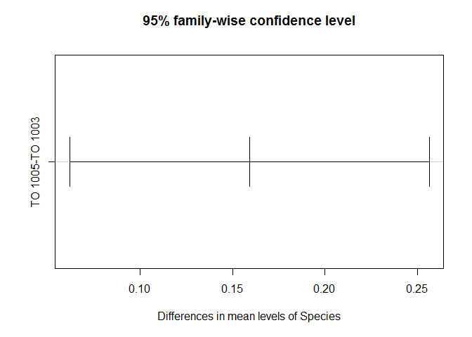
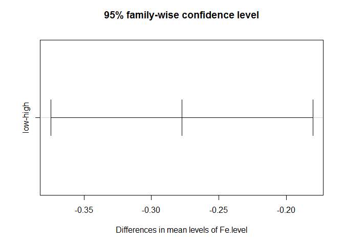
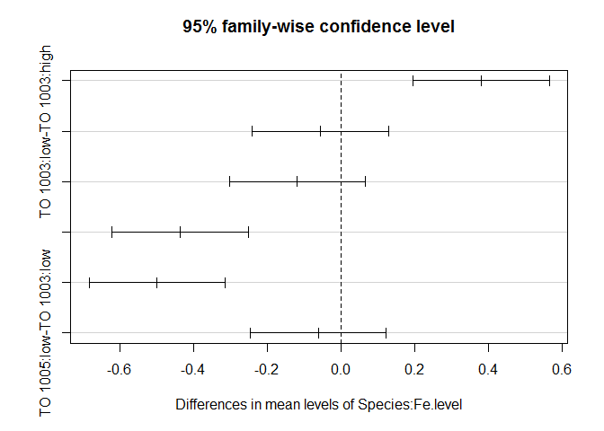
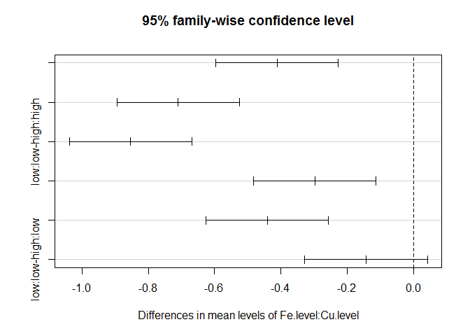
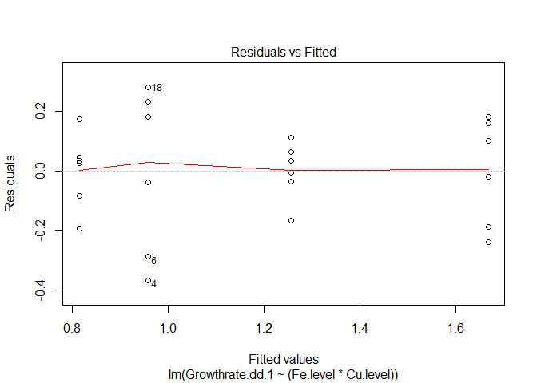
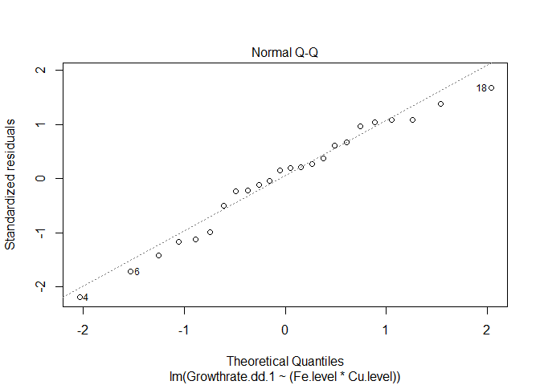
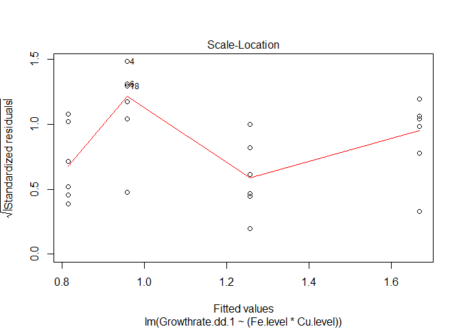
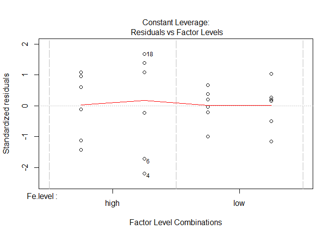
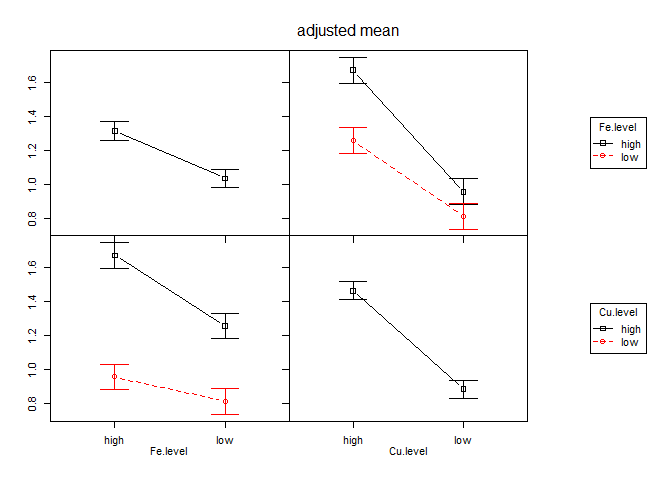

# Meeting with Rick White
Anna A. Hippmann  
May 22nd, 2015  


##Libraries used

```r
library(lsmeans)
```

```
## Loading required package: estimability
## 
## Attaching package: 'lsmeans'
## 
## The following object is masked from 'package:base':
## 
##     rbind
```

```r
library(phia)
```

```
## Loading required package: car
```

```r
library(visreg)
```

```
## Warning: package 'visreg' was built under R version 3.2.3
```

```r
library(dplyr)
```

```
## 
## Attaching package: 'dplyr'
## 
## The following objects are masked from 'package:stats':
## 
##     filter, lag
## 
## The following objects are masked from 'package:base':
## 
##     intersect, setdiff, setequal, union
```

```r
library(ggplot2)
library(knitr)
```

### Overview

<a id="BackUP"></a>

* What I did with [Rick White](#RickWhite)
  + `z_all <- lm()` with all main effects and interaction - [z_all](#z_all)
  + `z <- lm()` without Species:Cu.level interaction - [z](#z)
  + `anova(z)` anova indicating where to look for significant effects and interacitons - [`anova(z)`](#anova_z)
  + `lsmeans()` to check for pairwise comparisons
    +lsmeans has changed quite a bit in newer version -> I am thinking about different post-hoc test
    
* using `phia` ("post hoc interaction association") package to check for [interaction](#phia_interaction)
* using `phia` to do [pairwise comparison](#phia_pariwise)


* Overview of [My Method](#MyMethod) to Analyze my Physiological Data
  + [Growthrate dd-1](#Growthrate.dd)
  + [Growthrate Percent](#Growthrate.percent)
  + [Fv/Fm](#FvFm)
  + [Sigma](#Sigma)
  + [PQ Size](#PQ)

* __NOT USED__
* run `lm()` only on [TO 1003](#lm_TO03)
* [Tukey HSD](#Tukey_01)

## Run Down of what we did in SCARL meeting in May 2015


I met with Rick White of SCARL at UBC to discuss my approach to analyze my physiological data statistically. The main question was, whether I would need to use a mixed effects model or a fixed effects model. Then how to actually go about analyzing it practically (i.e.which program/ package to use etc)

As per my experimental set up, I have **3 fixed effects**:

1) Species _(as I choose these 2 strains on purpose to test for differences between them)_
2) Fe-level
3) Cu-level

For this I will need to use 

1) the **function `lm()` = linear model**. 
2) then use `anova()` on the `lm object`
3) then use `lsmeans()` on the `lm object` _(to do all the different pairwise comparisons to my heart's desire)_

Let's start by loading in my data and having a look at it:


```r
#I used the original "ALL_PhysiologicalData_2015_04.txt" and added columns "Treatment" and "Merged" to it, then saved the ensuing file under "ALL_PhysiologicalData_2015_04_withMerged_Variable.txt", so I can use it for all my plots

mydata <- read.delim("ALL_PhysiologicalData_2015_04_withMerged_Variable.txt", sep="\t", header=T)

mean.df <- read.delim("Physiological_Data_Mean_Values.txt", sep="\t", header=T)

str(mydata)
```

```
## 'data.frame':	24 obs. of  30 variables:
##  $ Species                             : Factor w/ 2 levels "TO 1003","TO 1005": 1 1 1 1 1 1 1 1 1 1 ...
##  $ Fe.level                            : Factor w/ 2 levels "high","low": 1 1 1 1 1 1 2 2 2 2 ...
##  $ Cu.level                            : Factor w/ 2 levels "high","low": 1 1 1 2 2 2 1 1 1 2 ...
##  $ Growthrate.dd.1                     : num  1.43 1.48 1.65 0.59 0.92 0.67 1.32 1.29 1.22 0.73 ...
##  $ Growthrate.Percent..u.umax.         : num  94.3 97.6 108.2 38.9 60.4 ...
##  $ Growthrate.specific.d.1             : num  0.99 1.03 1.14 0.41 0.64 0.47 0.92 0.89 0.85 0.5 ...
##  $ Growthrate.Specific.Percent..u.umax.: num  94.1 97.4 108.5 38.9 60.4 ...
##  $ X14C.per.Cell.Vol.alpha             : num  0.05 0.04 0.14 0 0.02 0.03 0.08 0.06 0.07 0.01 ...
##  $ X14C.per.Cell.Vol.ek                : num  242 216 297 177 170 ...
##  $ X14C.per.Chla.alpha                 : num  0.01852 0.01336 0.01351 0.00216 0.00733 ...
##  $ X14C.per.Chla.ek                    : num  297 216 242 177 170 ...
##  $ cell.size..um                       : num  5.13 5.27 5.27 4.64 4.76 4.77 5.38 5.32 5.37 4.65 ...
##  $ cell.volume.fl.cell                 : num  70.8 76.7 76.5 52.3 56.5 ...
##  $ Chla.per.cell.pg.cell               : num  0.29 0.31 0.3 0.26 0.33 0.44 0.382 0.359 0.372 0.142 ...
##  $ Chla.per.cell.vol.fg.fL             : num  4.52 4.35 4.14 6.49 7.92 ...
##  $ FeDFB.zmol.um.2.h.                  : num  3 2.2 7.4 1.4 0.6 1.1 0.8 1.5 1.3 9.9 ...
##  $ FeDFB.zmol.cell.1.h.                : num  250.3 194.4 648.9 94.8 41.1 ...
##  $ GrossPchla.mol.O2.mol.Chla..h.      : num  370.2 413.4 661.8 153.2 83.5 ...
##  $ GrossPcell..mol.O2.cell..h.         : num  1.21e-07 1.45e-07 2.40e-07 4.44e-08 3.06e-08 3.29e-08 NA 1.02e-07 6.90e-08 3.76e-08 ...
##  $ Gross.P.CellVol..mol.O2.L.          : num  1.2 1.64 2.72 0.85 0.52 0.59 NA 1.31 1.19 0.77 ...
##  $ FvFm.old                            : num  0.59 0.6 NA 0.27 0.29 0.31 0.31 0.34 0.41 0.25 ...
##  $ Sig.old                             : int  590 578 NA 786 763 743 638 616 564 850 ...
##  $ p.old                               : num  0.56 0.53 NA 0.4 0.41 0.41 0.5 0.4 0.4 0.33 ...
##  $ PQ_Siz.old                          : num  4.9 3.8 NA 6.7 5.5 5.8 3.8 0 4.9 7.2 ...
##  $ AOXactivity                         : num  47 49.7 49.7 53.1 41.6 ...
##  $ Fe.tot.nmol                         : num  1370 1370 1370 1370 1370 1370 12.5 12.5 12.5 12.5 ...
##  $ Cu.tot.nmol                         : num  10.2 10.2 10.2 0.6 0.6 0.6 10.2 10.2 10.2 1.96 ...
##  $ Cell.Density                        : int  165000 110000 312000 79900 111000 96700 149000 116000 161000 80000 ...
##  $ Treatment                           : Factor w/ 4 levels "control","low Cu",..: 1 1 1 2 2 2 3 3 3 4 ...
##  $ Merged                              : Factor w/ 8 levels "TO 1003 control",..: 1 1 1 2 2 2 3 3 3 4 ...
```


```r
p <- ggplot (mydata , aes(Treatment, Growthrate.dd.1 ))
p + geom_point(aes(group=Merged, colour=Species), size = 3)+
  labs(title="", x ="")+
  geom_point(data=mean.df , aes(Treatment, Growthrate.dd.1, size=2, colour=Species), shape = 45, size = 9)+
  guides(alpha = "none", size = "none", shape = "none")
```

 

To really understand what we are seeing, especially with the copper data, we need to remember the different metal concentrations that are used for the different strains and treatments:


```r
kable((read.delim("MetalConcentrationsInMedia.txt")), format = "markdown")
```


|Treatment | both.Strains...total.Fe..nmol.| TO03...total.Cu| TO05.total.Cu|
|:---------|------------------------------:|---------------:|-------------:|
|control   |                         1370.0|           10.20|         14.32|
|low Fe    |                           12.5|           10.20|         14.32|
|lowCu     |                         1370.0|            0.20|          6.08|
|low Fe Cu |                           12.5|            1.96|          6.08|

__Fe concentrations__:

If we look closely at the table above, we will see that for __both strains__, we subjected them to the __same high Fe__ concentration (__1370nmol__) and the __same low Fe__ concentration (__12.5nmol__) in the media.

__Cu concentrations - high__:

However, as per preliminary tests (_data not shown_), these two strains have different Cu requirements to sustain their respective optimal growth rates and to limit their growth rates by Cu. 
Hence, high Cu concentrations differ in the following way: __TO 1003__ requires 10.2 nmol total Cu in its growth medium under our chosen high Fe regime, whereas __TO1005__ requires more, namely __14.32 nmol total Cu__ in the control medium.

__Cu concentrations - low__:

Looking at limiting Cu concentrations, a similar scenario is seen. Where __TO 1003__ is very hard to limit with Cu, when sufficient Fe is present in the media (only background Cu is present in our study ~ __0.2 nmol Cu__), __TO 1005__ shows significant limitation at Cu levels of __6.08 nmol__. When subjected to iron / copper co-limitation, __TO 1005__ growthrate is even more limited, hinting at an interactive effect of iron and copper concentrations (which we will see further down statistically proven).
Under low Fe conditions, __TO 1003__ can not survive with only background copper concentration. Hence, we added more Cu (__1.96 nmol Cu__) under Fe-limiting conditions compared to low Cu concentrations under Fe-replete conditions (0.2 nmol). This again, shows an interdependence of Fe and Cu albeit, we don;t necessarily see it when we look at the graph, as it only states "low Cu" and "lowFeCu"without going into detail of the copper concentrations. in TO 1003, the growthrates for low Cu and low FeCu are similar so one could be misled into the interpretation that there is no real co-limitation. However, with the background information given here, it is clear that __there is also Fe-Cu-colimitation occuring in TO 1003__ (as has been shown in previous studies).


### 1) Recreating what I did with Rick White

<a id="RickWhite"></a>

[Back Up](#BackUP)

I first want to look at the growth rate and determine what influences growth rate. I will use `lm() to get a model which will take into account the different factors to predict the resulting growth rate.

__When testing for the different effects:__

* "__+__" means "_test for main effects_"
* "__:__" means "_test for interacting effects_"
* "__\*__" means "_test for both main and interacting effects_"

<a id="z_all"></a>

#### z_all - linear model chacking for all interactions and main effects

[Back Up](#BackUP)


```r
z_all <- lm(data=mydata, Growthrate.dd.1~(Species*Fe.level*Cu.level)) #this will model the Growth rate dependend on the 
#three main effects (Species, Fe.level, Cu.level) and will include all possible interactions
summary(z_all)
```

```
## 
## Call:
## lm(formula = Growthrate.dd.1 ~ (Species * Fe.level * Cu.level), 
##     data = mydata)
## 
## Residuals:
##       Min        1Q    Median        3Q       Max 
## -0.153333 -0.056667  0.006667  0.054167  0.193333 
## 
## Coefficients:
##                                        Estimate Std. Error t value
## (Intercept)                             1.52000    0.06589  23.068
## SpeciesTO 1005                          0.29667    0.09318   3.184
## Fe.levellow                            -0.24333    0.09318  -2.611
## Cu.levellow                            -0.79333    0.09318  -8.514
## SpeciesTO 1005:Fe.levellow             -0.33667    0.13178  -2.555
## SpeciesTO 1005:Cu.levellow              0.16667    0.13178   1.265
## Fe.levellow:Cu.levellow                 0.37333    0.13178   2.833
## SpeciesTO 1005:Fe.levellow:Cu.levellow -0.21000    0.18637  -1.127
##                                        Pr(>|t|)    
## (Intercept)                            1.05e-13 ***
## SpeciesTO 1005                          0.00577 ** 
## Fe.levellow                             0.01890 *  
## Cu.levellow                            2.45e-07 ***
## SpeciesTO 1005:Fe.levellow              0.02120 *  
## SpeciesTO 1005:Cu.levellow              0.22409    
## Fe.levellow:Cu.levellow                 0.01200 *  
## SpeciesTO 1005:Fe.levellow:Cu.levellow  0.27644    
## ---
## Signif. codes:  0 '***' 0.001 '**' 0.01 '*' 0.05 '.' 0.1 ' ' 1
## 
## Residual standard error: 0.1141 on 16 degrees of freedom
## Multiple R-squared:  0.9356,	Adjusted R-squared:  0.9074 
## F-statistic: 33.19 on 7 and 16 DF,  p-value: 2.274e-08
```

To look at the actual differences, we need to look at the `anova` table:


```r
anova(z_all) #this will use the linear model and give us a table of the analysis of the variance in our dataset
```

```
## Analysis of Variance Table
## 
## Response: Growthrate.dd.1
##                           Df  Sum Sq Mean Sq  F value    Pr(>F)    
## Species                    1 0.15200 0.15200  11.6702  0.003537 ** 
## Fe.level                   1 0.46204 0.46204  35.4731 2.013e-05 ***
## Cu.level                   1 1.98950 1.98950 152.7450 1.341e-09 ***
## Species:Fe.level           1 0.29260 0.29260  22.4648  0.000222 ***
## Species:Cu.level           1 0.00570 0.00570   0.4379  0.517537    
## Fe.level:Cu.level          1 0.10800 0.10800   8.2921  0.010892 *  
## Species:Fe.level:Cu.level  1 0.01654 0.01654   1.2697  0.276444    
## Residuals                 16 0.20840 0.01302                       
## ---
## Signif. codes:  0 '***' 0.001 '**' 0.01 '*' 0.05 '.' 0.1 ' ' 1
```


Looking at the ANOVA table for the linear model that test for all main effects and interactions, we see that

* __Species__ does have a significant effect on growth rate (F (1,16) = 11.67, p.val < 0.01)
* __Fe. level__ has an effect on growthrate (F (1,16) = 35.47, p.val < 0.0001)
* __Cu level__ has an effect on growthrate (F (1,16) = 152.75, p.val < 0.00001)
* there is an __interaction__ between __Species and Fe LEVEL__ (F(1,16) = 22.47, p.val = 0.0002)
    + i.e. depending on the Species the growthrate is different under similar Fe conditions
* there is NOT INTERACTION between Species and CU LEVEL
    + i.e. this is somewhat what I had aimed for as this means that both Species have a similar growthrate reduction under the same Cu.level -> this way I can see how their proteomic and physiological response is similar or different!
* there is an __interaction__ between __Fe LEVEL and Cu LEVEL__ (F(1,16) = 8.29, p.val = 0.01) 

__NOTE:__ the anova table only tells me that there are differences e.g. between the Species. IT DOES NOT TELL ME depending on what variables etc... for that we need to do pairwise comparisons.


<a id="z"></a>

### z - linear model not checking for interaction between Cu and species 

[Back Up](#BackUP)

__FIRST THOUGH__: as we saw in the `anova` table that there is __no interaction between Cu.level and Species__, we can __take the interaction term OUT__ when we make the linear model. Let's see how this will change the model


```r
z <- lm(data=mydata, Growthrate.dd.1~(Species+Fe.level+Cu.level)^2-Species:Cu.level) #this will model the Growth rate dependend on
#three main effects (Species, Fe.level, Cu.level) and will include 
#possible interactions between Species:Fe.level, Fe.level:Cu.level 
#but NOT Species:Cu.level as we took that one out!

summary(z)
```

```
## 
## Call:
## lm(formula = Growthrate.dd.1 ~ (Species + Fe.level + Cu.level)^2 - 
##     Species:Cu.level, data = mydata)
## 
## Residuals:
##       Min        1Q    Median        3Q       Max 
## -0.178333 -0.072708  0.002083  0.060833  0.171667 
## 
## Coefficients:
##                            Estimate Std. Error t value Pr(>|t|)    
## (Intercept)                 1.47833    0.05660  26.120 9.20e-16 ***
## SpeciesTO 1005              0.38000    0.06535   5.814 1.65e-05 ***
## Fe.levellow                -0.19083    0.08004  -2.384  0.02833 *  
## Cu.levellow                -0.71000    0.06535 -10.864 2.46e-09 ***
## SpeciesTO 1005:Fe.levellow -0.44167    0.09242  -4.779  0.00015 ***
## Fe.levellow:Cu.levellow     0.26833    0.09242   2.903  0.00948 ** 
## ---
## Signif. codes:  0 '***' 0.001 '**' 0.01 '*' 0.05 '.' 0.1 ' ' 1
## 
## Residual standard error: 0.1132 on 18 degrees of freedom
## Multiple R-squared:  0.9287,	Adjusted R-squared:  0.9089 
## F-statistic: 46.89 on 5 and 18 DF,  p-value: 1.064e-09
```

```r
plot(z) ##these plots are diagnostic and will give indications if the assumptions are met
```

    

<a id="anova_z"></a>

#### Anova table of z model

[Back Up](#BackUP)

Again, we need to look at the ANOVA table:

```r
anova(z) #this will use the linear model and give us a table of the analysis of the variance in our dataset
```

```
## Analysis of Variance Table
## 
## Response: Growthrate.dd.1
##                   Df  Sum Sq Mean Sq F value    Pr(>F)    
## Species            1 0.15200 0.15200  11.863 0.0028934 ** 
## Fe.level           1 0.46204 0.46204  36.059 1.116e-05 ***
## Cu.level           1 1.98950 1.98950 155.267 2.745e-10 ***
## Species:Fe.level   1 0.29260 0.29260  22.836 0.0001502 ***
## Fe.level:Cu.level  1 0.10800 0.10800   8.429 0.0094782 ** 
## Residuals         18 0.23064 0.01281                      
## ---
## Signif. codes:  0 '***' 0.001 '**' 0.01 '*' 0.05 '.' 0.1 ' ' 1
```


Looking at the ANOVA table for the linear model that _does not_ test for interaction between Cu.level and Species, basically, we see the same significant factors and interactions as before, just with stronger significance (probably due to the higher degrees of freedom: 18 vs 16)


* __Species__ does have a significant effect on growth rate
* __Fe. level__ has an effect on growthrate
* __Cu level__ has an effect on growthrate now: (F (1,18) = 155.27, p.val <0.00001),  [*before:(F (1,16) = 152.75, p.val <0.00001)*]
* there is still an __interaction__ between __Species and Fe LEVEL__ now: (F(1,18) = 22.84, p.val = 0.000015), [*before: (F(1,16) = 22.47, p.val = 0.0002)*]
    + i.e. depending on the Species the growthrate is different under similar Fe conditions
* there is an __interaction__ between __Fe LEVEL and Cu LEVEL__ now: (F(1,18) = 8.43, p.val < 0.01), [*before: (F(1,16) = 8.29, p.val = 0.01)*] 

### What if we use the `phia` package to look into interactions or main effects?

<a id="phia_interaction"></a>

[Back Up](#BackUP)

This is basically from the tutorial / examples given in the `R` vignette by _Helios De Rosario Martinez_ ["Analysing interactions of fitted models"](https://cran.r-project.org/web/packages/phia/vignettes/phia.pdf)

[...] In factorial experiments like this one, the dependency between factor levels and the response variable is usually represented in a contingency table, where the rows and columns are related to the different levels of both treatments, and __each cell contains the adjusted mean of the response for the corresponding interaction of factors__. When there is an interaction effect, the cell means are taken as the most straightforward way of representing this effect. 

These values and their standard errors can be obtained from the model coeffients with the function `interactionMeans` in the package `phia`, using the fitted model as first (and in this case only) argument:


```r
(mydata.means <- interactionMeans(z))
```

```
##   Species Fe.level Cu.level adjusted mean std. error
## 1 TO 1003     high     high     1.4783333  0.0565982
## 2 TO 1005     high     high     1.8583333  0.0565982
## 3 TO 1003      low     high     1.2875000  0.0565982
## 4 TO 1005      low     high     1.2258333  0.0565982
## 5 TO 1003     high      low     0.7683333  0.0565982
## 6 TO 1005     high      low     1.1483333  0.0565982
## 7 TO 1003      low      low     0.8458333  0.0565982
## 8 TO 1005      low      low     0.7841667  0.0565982
```

```r
plot(mydata.means)
```

 

This plot shows us main effects (such as Cu.level) and first order interactions (such as Species and Fe.level). As per the "marginality principle" (see J. A. Nelder, \A reformulation of linear models," Journal of the Royal Statistical Society. Series A (General), vol. 140, no. 1, pp. 48{77, 1977.), those factors that are involved in interactions, should not be interpreted as single effects.

As we see in the upper right and lower left corner, Species and Cu really do not seem to have an interaction effect. They change in the same way (lines are parallel). However, when we look at upper middle and middle left cell, we see that growthrate changes in a different way depending on Species and Fe level. And to a much lesser extend for Fe.level and Cu.level as seen in middle right and lower middle cell.

#### Pairwise Comparisons

<a id="phia_pairwise"></a>

[Back Up](#BackUP)

In order to put actual numbers for the significant differences, I will proceed with pairwise comparisons by having a fixed factor and testing how it changes dependend on another factor


```r
testInteractions(z, fixed="Species", across="Fe.level")
```

```
## F Test: 
## P-value adjustment method: holm
##             Value Df Sum of Sq       F    Pr(>F)    
## TO 1003   0.05667  1   0.00963  0.7518    0.3973    
## TO 1005   0.49833  1   0.74501 58.1428 9.642e-07 ***
## Residuals         18   0.23064                      
## ---
## Signif. codes:  0 '***' 0.001 '**' 0.01 '*' 0.05 '.' 0.1 ' ' 1
```

This means that the two different Fe.levels I used (high and low) does not significantly change the growth rate in TO 1003 (F(1,18) = 0.75, p.val = 0.397) but it does change the growthrate significantly in TO 1005 (F(1,18) = 58.14, p-val < 0.00001))


```r
testInteractions(z, fixed="Fe.level", across="Species")
```

```
## F Test: 
## P-value adjustment method: holm
##              Value Df Sum of Sq       F    Pr(>F)    
## high      -0.38000  1   0.43320 33.8083 3.303e-05 ***
##  low       0.06167  1   0.01141  0.8903    0.3579    
## Residuals          18   0.23064                      
## ---
## Signif. codes:  0 '***' 0.001 '**' 0.01 '*' 0.05 '.' 0.1 ' ' 1
```

This means that the two Species have significantly different growthrates under high Fe conditions (F(1,18), p.val < 0.0001) but are not sig different under low Fe conditions


```r
testInteractions(z, fixed="Fe.level", across="Cu.level")
```

```
## F Test: 
## P-value adjustment method: holm
##             Value Df Sum of Sq       F    Pr(>F)    
## high      0.71000  1   1.51230 118.025 4.918e-09 ***
##  low      0.44167  1   0.58521  45.672 2.478e-06 ***
## Residuals         18   0.23064                      
## ---
## Signif. codes:  0 '***' 0.001 '**' 0.01 '*' 0.05 '.' 0.1 ' ' 1
```

This means that there is significant growthrate changes from high Cu to low Cu in both Species (F(1,18) = 118.03, p.val < 0.00001) and that the same is true under low Fe conditions, that the additional lowering of Cu.level changes growth ratessignificantly (F(1,18) = 45.67, p.val < 0.00001)


```r
testInteractions(z, fixed="Cu.level", across="Fe.level")
```

```
## F Test: 
## P-value adjustment method: holm
##             Value Df Sum of Sq       F    Pr(>F)    
## high      0.41167  1   0.50841 39.6778 1.229e-05 ***
##  low      0.14333  1   0.06163  4.8101   0.04167 *  
## Residuals         18   0.23064                      
## ---
## Signif. codes:  0 '***' 0.001 '**' 0.01 '*' 0.05 '.' 0.1 ' ' 1
```

<a id="MyMethod"></a>

### Overview of My Method to Analyze my Physiological Data

OK, after this first inital approach (and some more down below under ["Not used"](#NotUsed)), I will settle for the following:

0) have a look at the graph of the actual data! :)
1) do a `linear model`, checking for all main and interacting effects
  + `lm(response ~ Species * Fe.level * Cu.level)`
2) do an `anova` on this `lm` object to see the F statistics and p-values
  + dependig on seen or not seen interactions, modify the `lm()` accordingly
3) then do pairwise comparisons using `phia` package to look into what is contributing how into the significant interactions seen in the `anova`

,a id="Growthrate.percent"></a>

#### Growthrate - percent of mu max

[Back Up](#BackUP)

First a look at the graph: 


```r
p <- ggplot (mydata , aes(Treatment, Growthrate.Percent..u.umax.))
p + geom_point(aes(group=Merged, colour=Species), size = 3)+
  labs(title="", x ="")+
  geom_point(data=mean.df , aes(Treatment, Growthrate.Percent, size=2, colour=Species), shape = 45, size = 9)+
  guides(alpha = "none", size = "none", shape = "none")
```

 

Now we start with a linear model testing for all main effects and interactions possible:


```r
lm_all_Growthrate.percent <- lm(data = mydata, Growthrate.Percent..u.umax. ~ (Species * Fe.level * Cu.level))
summary(lm_all_Growthrate.percent) # we need to look at the actual anova to knwo where we need to look further
```

```
## 
## Call:
## lm(formula = Growthrate.Percent..u.umax. ~ (Species * Fe.level * 
##     Cu.level), data = mydata)
## 
## Residuals:
##     Min      1Q  Median      3Q     Max 
## -8.9700 -3.5858  0.2983  3.1525 12.5100 
## 
## Coefficients:
##                                        Estimate Std. Error t value
## (Intercept)                            100.0467     4.0108  24.944
## SpeciesTO 1005                          -0.2233     5.6721  -0.039
## Fe.levellow                            -16.0033     5.6721  -2.821
## Cu.levellow                            -52.1867     5.6721  -9.201
## SpeciesTO 1005:Fe.levellow             -15.8633     8.0216  -1.978
## SpeciesTO 1005:Cu.levellow              17.8233     8.0216   2.222
## Fe.levellow:Cu.levellow                 24.3133     8.0216   3.031
## SpeciesTO 1005:Fe.levellow:Cu.levellow -15.4467    11.3442  -1.362
##                                        Pr(>|t|)    
## (Intercept)                            3.10e-14 ***
## SpeciesTO 1005                          0.96908    
## Fe.levellow                             0.01229 *  
## Cu.levellow                            8.64e-08 ***
## SpeciesTO 1005:Fe.levellow              0.06546 .  
## SpeciesTO 1005:Cu.levellow              0.04106 *  
## Fe.levellow:Cu.levellow                 0.00795 ** 
## SpeciesTO 1005:Fe.levellow:Cu.levellow  0.19218    
## ---
## Signif. codes:  0 '***' 0.001 '**' 0.01 '*' 0.05 '.' 0.1 ' ' 1
## 
## Residual standard error: 6.947 on 16 degrees of freedom
## Multiple R-squared:  0.9306,	Adjusted R-squared:  0.9003 
## F-statistic: 30.66 on 7 and 16 DF,  p-value: 4.067e-08
```

```r
anova(lm_all_Growthrate.percent) # this shows, we can take out the interaction between Species: Cu.level
```

```
## Analysis of Variance Table
## 
## Response: Growthrate.Percent..u.umax.
##                           Df Sum Sq Mean Sq  F value    Pr(>F)    
## Species                    1   57.8    57.8   1.1987 0.2897981    
## Fe.level                   1 1467.7  1467.7  30.4120 4.708e-05 ***
## Cu.level                   1 7341.6  7341.6 152.1289 1.381e-09 ***
## Species:Fe.level           1  834.5   834.5  17.2920 0.0007403 ***
## Species:Cu.level           1  153.0   153.0   3.1707 0.0939636 .  
## Fe.level:Cu.level          1  412.8   412.8   8.5547 0.0099160 ** 
## Species:Fe.level:Cu.level  1   89.5    89.5   1.8541 0.1921797    
## Residuals                 16  772.1    48.3                       
## ---
## Signif. codes:  0 '***' 0.001 '**' 0.01 '*' 0.05 '.' 0.1 ' ' 1
```


```r
lm_Growthrate.percent <- lm(data = mydata, Growthrate.Percent..u.umax. ~ (Species + Fe.level + Cu.level)^2 - Species:Cu.level)
summary(lm_Growthrate.percent) # we need to look at the actual anova to knwo where we need to look further
```

```
## 
## Call:
## lm(formula = Growthrate.Percent..u.umax. ~ (Species + Fe.level + 
##     Cu.level)^2 - Species:Cu.level, data = mydata)
## 
## Residuals:
##     Min      1Q  Median      3Q     Max 
## -13.426  -4.484   0.775   4.620  12.649 
## 
## Coefficients:
##                            Estimate Std. Error t value Pr(>|t|)    
## (Intercept)                  95.591      3.754  25.464 1.44e-15 ***
## SpeciesTO 1005                8.688      4.335   2.004  0.06031 .  
## Fe.levellow                 -12.142      5.309  -2.287  0.03452 *  
## Cu.levellow                 -43.275      4.335  -9.983 9.16e-09 ***
## SpeciesTO 1005:Fe.levellow  -23.587      6.130  -3.848  0.00118 ** 
## Fe.levellow:Cu.levellow      16.590      6.130   2.706  0.01446 *  
## ---
## Signif. codes:  0 '***' 0.001 '**' 0.01 '*' 0.05 '.' 0.1 ' ' 1
## 
## Residual standard error: 7.508 on 18 degrees of freedom
## Multiple R-squared:  0.9088,	Adjusted R-squared:  0.8835 
## F-statistic: 35.89 on 5 and 18 DF,  p-value: 9.441e-09
```

```r
plot.new()
plot(lm_Growthrate.percent)
```

    

```r
anova(lm_Growthrate.percent) # this shows, we can take out the interaction between Species: Cu.level
```

```
## Analysis of Variance Table
## 
## Response: Growthrate.Percent..u.umax.
##                   Df Sum Sq Mean Sq  F value    Pr(>F)    
## Species            1   57.8    57.8   1.0262  0.324474    
## Fe.level           1 1467.7  1467.7  26.0368 7.439e-05 ***
## Cu.level           1 7341.6  7341.6 130.2427 1.128e-09 ***
## Species:Fe.level   1  834.5   834.5  14.8043  0.001179 ** 
## Fe.level:Cu.level  1  412.8   412.8   7.3240  0.014457 *  
## Residuals         18 1014.6    56.4                       
## ---
## Signif. codes:  0 '***' 0.001 '**' 0.01 '*' 0.05 '.' 0.1 ' ' 1
```

### Anova Table - Growthrate.Percent

Looking at the ANOVA table for the linear model that _does not_ test for interaction between Cu.level and Species, for the data __Growthrate Percent of umax__, we see the following significant factors:


* __Species__ is __not__ a main effect on its own
* __Fe. level__ has an effect on growthrate
* __Cu level__ has an effect on growthrate now 
* there is still an __interaction__ between __Species and Fe level now: (F(1,18) = 14.80, p.val = 0.001)
    + i.e. depending on the Species the growthrate is different under similar Fe conditions
* there is an __interaction__ between __Fe level and Cu level: (F(1,18) = 7.32, p.val = 0.02)


### Using the `phia` package to look into significant effects in growthrate percent of mu max?

Again, any main effects that are included in interacting effects will be looked at through pairwise comparisons of the interacting factors


```r
(Growthrate.percent.means <- interactionMeans(lm_Growthrate.percent))
```

```
##   Species Fe.level Cu.level adjusted mean std. error
## 1 TO 1003     high     high      95.59083   3.753952
## 2 TO 1005     high     high     104.27917   3.753952
## 3 TO 1003      low     high      83.44917   3.753952
## 4 TO 1005      low     high      68.55083   3.753952
## 5 TO 1003     high      low      52.31583   3.753952
## 6 TO 1005     high      low      61.00417   3.753952
## 7 TO 1003      low      low      56.76417   3.753952
## 8 TO 1005      low      low      41.86583   3.753952
```

```r
plot(Growthrate.percent.means)
```

 

This plot shows us main effects (such as Cu.level) and first order interactions (such as Species and Fe.level). As per the "marginality principle" (see J. A. Nelder, \A reformulation of linear models," Journal of the Royal Statistical Society. Series A (General), vol. 140, no. 1, pp. 48{77, 1977.), those factors that are involved in interactions, should not be interpreted as single effects.

As we see in the upper right and lower left corner, Species and Cu really do not seem to have an interaction effect. They change in the same way (lines are parallel). However, when we look at upper middle and middle left cell, we see that growthrate changes in a different way depending on Species and Fe level. And to a much lesser extend for Fe.level and Cu.level as seen in middle right and lower middle cell.

#### Pairwise Comparisons

<a id="phia_pairwise"></a>

[Back Up](#BackUP)

In order to put actual numbers for the significant differences, I will proceed with pairwise comparisons by having a fixed factor and testing how it changes dependend on another factor


```r
testInteractions(lm_Growthrate.percent, fixed="Species", across="Fe.level")
```

```
## F Test: 
## P-value adjustment method: holm
##             Value Df Sum of Sq       F    Pr(>F)    
## TO 1003    3.8467  1     44.39  0.7875    0.3866    
## TO 1005   27.4333  1   2257.76 40.0535 1.158e-05 ***
## Residuals         18   1014.64                      
## ---
## Signif. codes:  0 '***' 0.001 '**' 0.01 '*' 0.05 '.' 0.1 ' ' 1
```

This means that the two different Fe.levels I used (high and low) does not significantly change the growth rate in TO 1003 (F(1,18) = 0.79, p.val = 0.39) but it does change the growthrate significantly in TO 1005 (F(1,18) = 40.05, p-val < 0.0001))


```r
testInteractions(lm_Growthrate.percent, fixed="Fe.level", across="Species")
```

```
## F Test: 
## P-value adjustment method: holm
##             Value Df Sum of Sq       F   Pr(>F)   
## high      -8.6883  1    226.46  4.0175 0.060312 . 
##  low      14.8983  1    665.88 11.8130 0.005881 **
## Residuals         18   1014.64                    
## ---
## Signif. codes:  0 '***' 0.001 '**' 0.01 '*' 0.05 '.' 0.1 ' ' 1
```

This means that the two Species have no significantly different growthrates under high Fe conditions (F(1,18) = 4.02, p.val = 0.06) which makes sense as they have both umax as 100 percent and are both similarly reduced by teh given Cu.levels that they have been subjected to. Under low iron their respective growthrates are significantly different (F =  11.81, p.val = 0.006)


```r
testInteractions(lm_Growthrate.percent, fixed="Fe.level", across="Cu.level")
```

```
## F Test: 
## P-value adjustment method: holm
##            Value Df Sum of Sq      F    Pr(>F)    
## high      43.275  1    5618.2 99.668 1.832e-08 ***
##  low      26.685  1    2136.3 37.898 8.198e-06 ***
## Residuals        18    1014.6                     
## ---
## Signif. codes:  0 '***' 0.001 '**' 0.01 '*' 0.05 '.' 0.1 ' ' 1
```

This means that there is significant growthrate changes from high Cu to low Cu in both Species (F(1,18) = 99.67, p.val < 0.00001) and that the same is true under low Fe conditions, that the additional lowering of Cu.level changes growth rates significantly (F(1,18) = 37.90, p.val < 0.00001)


```r
testInteractions(lm_Growthrate.percent, fixed="Cu.level", across="Fe.level")
```

```
## F Test: 
## P-value adjustment method: holm
##            Value Df Sum of Sq       F   Pr(>F)    
## high      23.935  1   1718.65 30.4895 6.09e-05 ***
##  low       7.345  1    161.85  2.8712   0.1074    
## Residuals        18   1014.64                     
## ---
## Signif. codes:  0 '***' 0.001 '**' 0.01 '*' 0.05 '.' 0.1 ' ' 1
```

This means that there is significant growth reduction under high Cu when Fe is limiting (F(1,18) = 30.49, p.val < 0.0001). However, under low Cu, the additional Fe limitation does not have a significant additional effect on growthrate. As discussed earlier, this makes sense when looking at the actual Cu concentrations used and is not in discrepancy to former studies that did find evidence of co limitation in both strains. 


,a id="NotUsed"></a>

# Not Used

[Back Up](#BackUP)

### Tukey - HSD Method (as per * [Tutorial on posthoc-tests](http://rtutorialseries.blogspot.ca/2011/03/r-tutorial-series-anova-pairwise.html))

<a id="Tukey01"></a

[Back Up](#BackUP)

The Tukey Honest Significant Difference (HSD) method controls for the Type I error rate across multiple comparisons and is generally considered an acceptable technique. This method can be executed using the `TukeyHSD(x)` function, where `x` is a linear model object created using the `aov(formula, data)` function. Note that in this application, the aov(formula, data) function is identical to the lm(formula, data) that we are already familiar with from linear regression.


```r
TukeyHSD(aov(z)) #aov() has a different notation than anova() but gives same results as anova()
```

```
##   Tukey multiple comparisons of means
##     95% family-wise confidence level
## 
## Fit: aov(formula = z)
## 
## $Species
##                      diff        lwr      upr     p adj
## TO 1005-TO 1003 0.1591667 0.06207836 0.256255 0.0028934
## 
## $Fe.level
##             diff        lwr        upr    p adj
## low-high -0.2775 -0.3745883 -0.1804117 1.12e-05
## 
## $Cu.level
##                diff        lwr       upr p adj
## low-high -0.5758333 -0.6729216 -0.478745     0
## 
## $`Species:Fe.level`
##                                  diff        lwr         upr     p adj
## TO 1005:high-TO 1003:high  0.38000000  0.1952907  0.56470929 0.0000897
## TO 1003:low-TO 1003:high  -0.05666667 -0.2413760  0.12804262 0.8215675
## TO 1005:low-TO 1003:high  -0.11833333 -0.3030426  0.06637595 0.3006960
## TO 1003:low-TO 1005:high  -0.43666667 -0.6213760 -0.25195738 0.0000159
## TO 1005:low-TO 1005:high  -0.49833333 -0.6830426 -0.31362405 0.0000027
## TO 1005:low-TO 1003:low   -0.06166667 -0.2463760  0.12304262 0.7821240
## 
## $`Fe.level:Cu.level`
##                          diff        lwr         upr     p adj
## low:high-high:high -0.4116667 -0.5963760 -0.22695738 0.0000337
## high:low-high:high -0.7100000 -0.8947093 -0.52529071 0.0000000
## low:low-high:high  -0.8533333 -1.0380426 -0.66862405 0.0000000
## high:low-low:high  -0.2983333 -0.4830426 -0.11362405 0.0012533
## low:low-low:high   -0.4416667 -0.6263760 -0.25695738 0.0000137
## low:low-high:low   -0.1433333 -0.3280426  0.04137595 0.1628934
```

```r
plot.new()
plot(TukeyHSD(aov(z)))
```

     
### What if I look at Fe levels just for TO 1003 and then just with the data for TO 1005?

<a id="lm_TO03"></a>

[Back Up](#BackUP)

For this, I will first subset my original data into TO 1003 and TO 1005, respectively. THen I will make and linear model using `lm()` followed by `anova()` on that lm object

#### Let's start with TO 1003


```r
TO03_mydata <- mydata %>% 
  filter(Species == "TO 1003")

lm_TO03 <- lm(data=mydata, Growthrate.dd.1~(Fe.level*Cu.level))
plot(lm_TO03) ##these plots are diagnostic and will give indications if the assumptions are met
```

    

```r
anova(lm_TO03)
```

```
## Analysis of Variance Table
## 
## Response: Growthrate.dd.1
##                   Df  Sum Sq Mean Sq F value    Pr(>F)    
## Fe.level           1 0.46204 0.46204 13.6849  0.001419 ** 
## Cu.level           1 1.98950 1.98950 58.9264 2.193e-07 ***
## Fe.level:Cu.level  1 0.10800 0.10800  3.1989  0.088846 .  
## Residuals         20 0.67525 0.03376                      
## ---
## Signif. codes:  0 '***' 0.001 '**' 0.01 '*' 0.05 '.' 0.1 ' ' 1
```

The anova table suggests that for __TO 1003__ there is a significant effect is seen for:

* Fe. level (F(1,20) = 13.68, p.val = 0.0014)
* Cu. level (F(1,20) = 58.93, p.val < 0.00001)

and that there is __NO__ interacting effect for Fe:Cu.level for TO 1003


```r
#Using `phia`
(lm_TO03.means <- interactionMeans(lm_TO03))
```

```
##   Fe.level Cu.level adjusted mean std. error
## 1     high     high     1.6683333 0.07501389
## 2      low     high     1.2566667 0.07501389
## 3     high      low     0.9583333 0.07501389
## 4      low      low     0.8150000 0.07501389
```

```r
plot(lm_TO03.means)
```

 

Even though the `anova()` did not suggest an interaction... looking at the plots, it almost seems like there could be interactions


```r
#testInteractions(lm_TO03.means, fixed="Cu.level", across="Fe.level")
```
OK, I guess this doesn;t work. Maybe it checks if there is an interaction measured?!

But twhat does the pairwise comparison say?


~~~~~
__AND NOW ...__ we need to use `lsmeans()` to do pairwise comparisons an pinpoint which exact comparisons are the significant ones....


```r
lsmeans(z_all, pairwise, ~ Fe.level | Cu.level : Species)
```


Doesn;t work, I get an error message "The model is not linear mixed effects model


```r
z <- lm(data=mydata, Growthrate.dd.1~(Species+Fe.level+Cu.level)^2-Species:Cu.level) #this will model the Growth rate dependend on
#three main effects (Species, Fe.level, Cu.level) and will include 
#possible interactions between Species:Fe.level, Fe.level:Cu.level 
#but NOT Species:Cu.level as we took that one out!

summary(z)
```

```
## 
## Call:
## lm(formula = Growthrate.dd.1 ~ (Species + Fe.level + Cu.level)^2 - 
##     Species:Cu.level, data = mydata)
## 
## Residuals:
##       Min        1Q    Median        3Q       Max 
## -0.178333 -0.072708  0.002083  0.060833  0.171667 
## 
## Coefficients:
##                            Estimate Std. Error t value Pr(>|t|)    
## (Intercept)                 1.47833    0.05660  26.120 9.20e-16 ***
## SpeciesTO 1005              0.38000    0.06535   5.814 1.65e-05 ***
## Fe.levellow                -0.19083    0.08004  -2.384  0.02833 *  
## Cu.levellow                -0.71000    0.06535 -10.864 2.46e-09 ***
## SpeciesTO 1005:Fe.levellow -0.44167    0.09242  -4.779  0.00015 ***
## Fe.levellow:Cu.levellow     0.26833    0.09242   2.903  0.00948 ** 
## ---
## Signif. codes:  0 '***' 0.001 '**' 0.01 '*' 0.05 '.' 0.1 ' ' 1
## 
## Residual standard error: 0.1132 on 18 degrees of freedom
## Multiple R-squared:  0.9287,	Adjusted R-squared:  0.9089 
## F-statistic: 46.89 on 5 and 18 DF,  p-value: 1.064e-09
```


The following is from [Dolph Schluter's help pages](https://www.zoology.ubc.ca/~schluter/R/fit-model/)

###Fit multiple factors

When two or more categorical factors are fitted, the possibility of an interaction might also be evaluated. Remember that the order in which you enter the variables in the formula affects the ANOVA results, if the design is unbalanced. By default, R fits the variables sequentially ("type I sum of squares"), while at the same time respecting hierarchy. Each variable or interaction is tested by adding it to a model that includes only previous terms in the sequence, but not variables entered later. Hierarchy means that the main effects are fitted before the interactions, which are fitted last. No interaction term is tested without its main effects included in the model.

In the case of two factors, A and B, the linear model is as follows.

```r
z <- lm(y ~ A + B, data = mydata) # no interaction term is present, or
z <- lm(y ~ A * B, data = mydata) # interaction term is included
summary(z)                        # coefficients table
confint(z, level = 0.95)          # confidence intervals for parameters
anova(z)                          # A is tested before B; interaction tested last
```

It is possible to carry out marginal fitting of terms instead ("type III sum of squares"). In this case, order of appearance of terms in the model doesn't matter, and neither does hierarchy. Each model term is tested as if it were entered last into the model. To accomplish this we need to refit the model and override R's default contrasts. Then we use the `drop1` command in place of `anova` to get the ANOVA table.


```r
z <- lm(y ~ A * B, contrasts = c("contr.sum", "contr.poly"), 
    data = mydata)
drop1(z, .~., test = "F")
```

Or, we can use the `Anova` command (NOTE the capital "A" in beginning of `Anova()`) in the `car` package to give us the ANOVA table based on marginal fitting of terms ("type III sum of squares"). We again need to refit the model using different contrasts from R's default.


```r
z <- lm(y ~ A * B, contrasts = c("contr.sum", "contr.poly"), 
    data = mydata)
library(car)
Anova(z, type = 3)
```

Use the visreg package to visualize model fit. Try several options to see which method is most effective. If only one factor is plotted, R plots the fit to the data for each group or level, while conditioning on the value of the other variable (adjusted to the most common category for other factor). **This makes sense only when an interaction term is not fitted**. If both factors are plotted, the fit is shown for every combination of groups (levels). In the latter case, you can choose to overlay the fits or plot in separate panels.


```r
library(visreg)
visreg(z, xvar = "B", whitespace = 0.4, 
    points.par = list(cex = 1.1, col = "red"))
visreg(z, xvar = "A", by = "B", whitespace = 0.4, 
    points.par = list(cex = 1.1, col = "red"))
visreg(z, xvar = "A", by = "B", whitespace = 0.5, overlay = TRUE, 
    band = FALSE, points.par = list(cex = 1.1))
```

```r
summary(cars)
```

```
##      speed           dist       
##  Min.   : 4.0   Min.   :  2.00  
##  1st Qu.:12.0   1st Qu.: 26.00  
##  Median :15.0   Median : 36.00  
##  Mean   :15.4   Mean   : 42.98  
##  3rd Qu.:19.0   3rd Qu.: 56.00  
##  Max.   :25.0   Max.   :120.00
```


### Resources

* [Tutorial on linear regression](http://rtutorialseries.blogspot.ca/2009/11/r-tutorial-series-simple-linear.html)
* [Tutorial on multiple linear regression](http://rtutorialseries.blogspot.ca/2009/12/r-tutorial-series-multiple-linear.html)
* [Tutorial on posthoc-tests](http://rtutorialseries.blogspot.ca/2011/03/r-tutorial-series-anova-pairwise.html)

