# Stats_Physiology
Anna A. Hippmann  
May 22nd, 2015  


##Libraries used

```r
suppressPackageStartupMessages(library(lsmeans))
suppressPackageStartupMessages(library(phia))
suppressPackageStartupMessages(library(visreg))
```

```
## Warning: package 'visreg' was built under R version 3.2.3
```

```r
suppressPackageStartupMessages(library(dplyr))
library(ggplot2)
library(knitr)
```

### Overview

<a id="BackUP"></a>

* __Background__: What I did with [Rick White](#RickWhite)
  + `z_all <- lm()` with all main effects and interaction - [z_all](#z_all)
  + `z <- lm()` without Species:Cu.level interaction - [z](#z)
  + `anova(z)` anova indicating where to look for significant effects and interacitons - [`anova(z)`](#anova_z)
  + `lsmeans()` to check for pairwise comparisons
    +lsmeans has changed quite a bit in newer version -> I am thinking about different post-hoc test
    
* __Background__: Using `phia` ("post hoc interaction association") package to check for [interaction](#phia_interaction)
* __Background__: Using `phia` to do [pairwise comparison](#phia_pariwise)


* Overview of [My Method](#MyMethod) to Analyze my Physiological Data
  + [Growthrate (dd-1)](#Growthrate.dd)
  + [Growthrate (d)](#Growthrate.spec)
  + [Growthrate (percent of umax)](#Growthrate.percent)
  + [Fv/Fm](#FvFm)
  + [Sigma](#Sigma)
  + [PQ Size](#PQ)
  + [Chl a per Cell Vol (fg/fL)](#Chla)
  + [Chl a per Cell (pg/cell)](#Chla.cell)
  + [Cell Size (um)](#cellsize)
  + [FeDFB uptake per cell (zmol/cell*h)](#FeDFB.cell)
  + [FeDFB uptake per cell surface area (zmol/um^2*h))](#FeDFB.cellvol)
  + [14C uptake - alpha (per cell)](#14C.alpha.cell)
  + [14C uptake - alpha (per Chl a)](#14C.alpha.chla)
  + [14C uptake - ek (per Chl a)](#14C.ek.chla)
  + [AOX - Alternative Oxidase (percent)](#AOX)
  + [Gross Production per Chl a (mol O2 / mol Chla * h)](#O2.Chla)
  + [Gross Production per cell (mol O2 / cell * h)](#O2.Cell)
  + [Gross Production per cell vol (mol O2 / cell vol * h)](#O2.Cell.vol)
  


#### BACKGROUND: 

<a id="RickWhite"><a>

## Run Down of what we did in SCARL meeting in May 2015


I met with Rick White from the "Statistical Consulting and Research Laboratory" [SCARL](http://www.stat.ubc.ca/SCARL/) at UBC to discuss my approach to analyze my physiological data statistically. The main question was, whether I would need to use a mixed effects model or a fixed effects model. Then how to actually go about analyzing it practically (i.e.which program/ package to use etc)

As per my experimental set up, I have **3 fixed effects**:

1) Species _(as I choose these 2 strains on purpose to test for differences between them)_
2) Fe-level
3) Cu-level

For this I will need to use 

1) the **function `lm()` = linear model**. 
2) then use `anova()` on the `lm object`
3) then use `lsmeans()` on the `lm object` _(to do all the different pairwise comparisons to my heart's desire)_

Let's start by loading in my data and having a look at it:


```r
#I used the original "ALL_PhysiologicalData_2015_04.txt" and added columns "Treatment" and "Merged" to it, then saved the ensuing file under "ALL_PhysiologicalData_2015_04_withMerged_Variable.txt", so I can use it for all my plots

mydata <- read.delim("ALL_PhysiologicalData_2015_04_withMerged_Variable.txt", sep="\t", header=T)

mean.df <- read.delim("Physiological_Data_Mean_Values.txt", sep="\t", header=T)

str(mydata)
```

```
## 'data.frame':	24 obs. of  30 variables:
##  $ Species                             : Factor w/ 2 levels "TO 1003","TO 1005": 1 1 1 1 1 1 1 1 1 1 ...
##  $ Fe.level                            : Factor w/ 2 levels "high","low": 1 1 1 1 1 1 2 2 2 2 ...
##  $ Cu.level                            : Factor w/ 2 levels "high","low": 1 1 1 2 2 2 1 1 1 2 ...
##  $ Growthrate.dd.1                     : num  1.43 1.48 1.65 0.59 0.92 0.67 1.32 1.29 1.22 0.73 ...
##  $ Growthrate.Percent..u.umax.         : num  94.3 97.6 108.2 38.9 60.4 ...
##  $ Growthrate.specific.d.1             : num  0.99 1.03 1.14 0.41 0.64 0.47 0.92 0.89 0.85 0.5 ...
##  $ Growthrate.Specific.Percent..u.umax.: num  94.1 97.4 108.5 38.9 60.4 ...
##  $ X14C.per.Cell.Vol.alpha             : num  0.05 0.04 0.14 0 0.02 0.03 0.08 0.06 0.07 0.01 ...
##  $ X14C.per.Cell.Vol.ek                : num  242 216 297 177 170 ...
##  $ X14C.per.Chla.alpha                 : num  0.01852 0.01336 0.01351 0.00216 0.00733 ...
##  $ X14C.per.Chla.ek                    : num  297 216 242 177 170 ...
##  $ cell.size..um                       : num  5.13 5.27 5.27 4.64 4.76 4.77 5.38 5.32 5.37 4.65 ...
##  $ cell.volume.fl.cell                 : num  70.8 76.7 76.5 52.3 56.5 ...
##  $ Chla.per.cell.pg.cell               : num  0.29 0.31 0.3 0.26 0.33 0.44 0.382 0.359 0.372 0.142 ...
##  $ Chla.per.cell.vol.fg.fL             : num  4.52 4.35 4.14 6.49 7.92 ...
##  $ FeDFB.zmol.um.2.h.                  : num  3 2.2 7.4 1.4 0.6 1.1 0.8 1.5 1.3 9.9 ...
##  $ FeDFB.zmol.cell.1.h.                : num  250.3 194.4 648.9 94.8 41.1 ...
##  $ GrossPchla.mol.O2.mol.Chla..h.      : num  370.2 413.4 661.8 153.2 83.5 ...
##  $ GrossPcell..mol.O2.cell..h.         : num  1.21e-07 1.45e-07 2.40e-07 4.44e-08 3.06e-08 3.29e-08 NA 1.02e-07 6.90e-08 3.76e-08 ...
##  $ Gross.P.CellVol..mol.O2.L.          : num  1.2 1.64 2.72 0.85 0.52 0.59 NA 1.31 1.19 0.77 ...
##  $ FvFm.old                            : num  0.59 0.6 NA 0.27 0.29 0.31 0.31 0.34 0.41 0.25 ...
##  $ Sig.old                             : int  590 578 NA 786 763 743 638 616 564 850 ...
##  $ p.old                               : num  0.56 0.53 NA 0.4 0.41 0.41 0.5 0.4 0.4 0.33 ...
##  $ PQ_Siz.old                          : num  4.9 3.8 NA 6.7 5.5 5.8 3.8 0 4.9 7.2 ...
##  $ AOXactivity                         : num  47 49.7 49.7 53.1 41.6 ...
##  $ Fe.tot.nmol                         : num  1370 1370 1370 1370 1370 1370 12.5 12.5 12.5 12.5 ...
##  $ Cu.tot.nmol                         : num  10.2 10.2 10.2 0.6 0.6 0.6 10.2 10.2 10.2 1.96 ...
##  $ Cell.Density                        : int  165000 110000 312000 79900 111000 96700 149000 116000 161000 80000 ...
##  $ Treatment                           : Factor w/ 4 levels "control","low Cu",..: 1 1 1 2 2 2 3 3 3 4 ...
##  $ Merged                              : Factor w/ 8 levels "TO 1003 control",..: 1 1 1 2 2 2 3 3 3 4 ...
```


```r
p <- ggplot (mydata , aes(Treatment, Growthrate.dd.1 ))
p + geom_point(aes(group=Merged, colour=Species), size = 3)+
  labs(title="", x ="")+
  geom_point(data=mean.df , aes(Treatment, Growthrate.dd.1, size=2, colour=Species), shape = 45, size = 9)+
  guides(alpha = "none", size = "none", shape = "none")
```

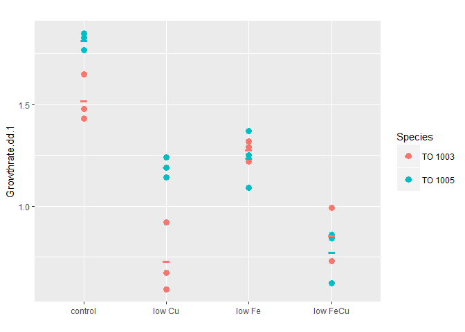 

To really understand what we are seeing, especially with the copper data, we need to remember the different metal concentrations that are used for the different strains and treatments:


```r
kable((read.delim("MetalConcentrationsInMedia.txt")), format = "markdown")
```


|Treatment | both.Strains...total.Fe..nmol.| TO03...total.Cu| TO05.total.Cu|
|:---------|------------------------------:|---------------:|-------------:|
|control   |                         1370.0|           10.20|         14.32|
|low Fe    |                           12.5|           10.20|         14.32|
|lowCu     |                         1370.0|            0.20|          6.08|
|low Fe Cu |                           12.5|            1.96|          6.08|

__Fe concentrations__:

If we look closely at the table above, we will see that for __both strains__, we subjected them to the __same high Fe__ concentration (__1370nmol__) and the __same low Fe__ concentration (__12.5nmol__) in the media.

__Cu concentrations - high__:

However, as per preliminary tests (_data not shown_), these two strains have different Cu requirements to sustain their respective optimal growth rates and to limit their growth rates by Cu. 
Hence, high Cu concentrations differ in the following way: __TO 1003__ requires 10.2 nmol total Cu in its growth medium under our chosen high Fe regime, whereas __TO1005__ requires more, namely __14.32 nmol total Cu__ in the control medium.

__Cu concentrations - low__:

Looking at limiting Cu concentrations, a similar scenario is seen. Where __TO 1003__ is very hard to limit with Cu, when sufficient Fe is present in the media (only background Cu is present in our study ~ __0.2 nmol Cu__), __TO 1005__ shows significant limitation at Cu levels of __6.08 nmol__. When subjected to iron / copper co-limitation, __TO 1005__ growthrate is even more limited, hinting at an interactive effect of iron and copper concentrations (which we will see further down statistically proven).
Under low Fe conditions, __TO 1003__ can not survive with only background copper concentration. Hence, we added more Cu (__1.96 nmol Cu__) under Fe-limiting conditions compared to low Cu concentrations under Fe-replete conditions (0.2 nmol). This again, shows an interdependence of Fe and Cu albeit, we don;t necessarily see it when we look at the graph, as it only states "low Cu" and "lowFeCu"without going into detail of the copper concentrations. in TO 1003, the growthrates for low Cu and low FeCu are similar so one could be misled into the interpretation that there is no real co-limitation. However, with the background information given here, it is clear that __there is also Fe-Cu-colimitation occuring in TO 1003__ (as has been shown in previous studies).

<a id="z_all"></a>

#### z_all - linear model checking for all interactions and main effects

[Back Up](#BackUP)


```r
z_all <- lm(data=mydata, Growthrate.dd.1~(Species*Fe.level*Cu.level)) #this will model the Growth rate dependend on the 
#three main effects (Species, Fe.level, Cu.level) and will include all possible interactions
summary(z_all)
```

```
## 
## Call:
## lm(formula = Growthrate.dd.1 ~ (Species * Fe.level * Cu.level), 
##     data = mydata)
## 
## Residuals:
##       Min        1Q    Median        3Q       Max 
## -0.153333 -0.056667  0.006667  0.054167  0.193333 
## 
## Coefficients:
##                                        Estimate Std. Error t value
## (Intercept)                             1.52000    0.06589  23.068
## SpeciesTO 1005                          0.29667    0.09318   3.184
## Fe.levellow                            -0.24333    0.09318  -2.611
## Cu.levellow                            -0.79333    0.09318  -8.514
## SpeciesTO 1005:Fe.levellow             -0.33667    0.13178  -2.555
## SpeciesTO 1005:Cu.levellow              0.16667    0.13178   1.265
## Fe.levellow:Cu.levellow                 0.37333    0.13178   2.833
## SpeciesTO 1005:Fe.levellow:Cu.levellow -0.21000    0.18637  -1.127
##                                        Pr(>|t|)    
## (Intercept)                            1.05e-13 ***
## SpeciesTO 1005                          0.00577 ** 
## Fe.levellow                             0.01890 *  
## Cu.levellow                            2.45e-07 ***
## SpeciesTO 1005:Fe.levellow              0.02120 *  
## SpeciesTO 1005:Cu.levellow              0.22409    
## Fe.levellow:Cu.levellow                 0.01200 *  
## SpeciesTO 1005:Fe.levellow:Cu.levellow  0.27644    
## ---
## Signif. codes:  0 '***' 0.001 '**' 0.01 '*' 0.05 '.' 0.1 ' ' 1
## 
## Residual standard error: 0.1141 on 16 degrees of freedom
## Multiple R-squared:  0.9356,	Adjusted R-squared:  0.9074 
## F-statistic: 33.19 on 7 and 16 DF,  p-value: 2.274e-08
```

To look at the actual differences, we need to look at the `anova` table:


```r
anova(z_all) #this will use the linear model and give us a table of the analysis of the variance in our dataset
```

```
## Analysis of Variance Table
## 
## Response: Growthrate.dd.1
##                           Df  Sum Sq Mean Sq  F value    Pr(>F)    
## Species                    1 0.15200 0.15200  11.6702  0.003537 ** 
## Fe.level                   1 0.46204 0.46204  35.4731 2.013e-05 ***
## Cu.level                   1 1.98950 1.98950 152.7450 1.341e-09 ***
## Species:Fe.level           1 0.29260 0.29260  22.4648  0.000222 ***
## Species:Cu.level           1 0.00570 0.00570   0.4379  0.517537    
## Fe.level:Cu.level          1 0.10800 0.10800   8.2921  0.010892 *  
## Species:Fe.level:Cu.level  1 0.01654 0.01654   1.2697  0.276444    
## Residuals                 16 0.20840 0.01302                       
## ---
## Signif. codes:  0 '***' 0.001 '**' 0.01 '*' 0.05 '.' 0.1 ' ' 1
```


Looking at the ANOVA table for the linear model that test for all main effects and interactions, we see that

* __Species__ does have a significant effect on growth rate (F (1,16) = 11.67, p.val < 0.01)
* __Fe. level__ has an effect on growthrate (F (1,16) = 35.47, p.val < 0.0001)
* __Cu level__ has an effect on growthrate (F (1,16) = 152.75, p.val < 0.00001)
* there is an __interaction__ between __Species and Fe LEVEL__ (F(1,16) = 22.47, p.val = 0.0002)
    + i.e. depending on the Species the growthrate is different under similar Fe conditions
* there is NOT INTERACTION between Species and CU LEVEL
    + i.e. this is somewhat what I had aimed for as this means that both Species have a similar growthrate reduction under the same Cu.level -> this way I can see how their proteomic and physiological response is similar or different!
* there is an __interaction__ between __Fe LEVEL and Cu LEVEL__ (F(1,16) = 8.29, p.val = 0.01) 

__NOTE:__ the anova table only tells me that there are differences e.g. between the Species. IT DOES NOT TELL ME depending on what variables etc... for that we need to do pairwise comparisons.


<a id="z"></a>

### z - linear model not checking for interaction between Cu and species 

[Back Up](#BackUP)

__FIRST THOUGH__: as we saw in the `anova` table that there is __no interaction between Cu.level and Species__, we can __take the interaction term OUT__ when we make the linear model. Let's see how this will change the model


```r
z <- lm(data=mydata, Growthrate.dd.1~(Species+Fe.level+Cu.level)^2-Species:Cu.level) #this will model the Growth rate dependend on
#three main effects (Species, Fe.level, Cu.level) and will include 
#possible interactions between Species:Fe.level, Fe.level:Cu.level 
#but NOT Species:Cu.level as we took that one out!

summary(z)
```

```
## 
## Call:
## lm(formula = Growthrate.dd.1 ~ (Species + Fe.level + Cu.level)^2 - 
##     Species:Cu.level, data = mydata)
## 
## Residuals:
##       Min        1Q    Median        3Q       Max 
## -0.178333 -0.072708  0.002083  0.060833  0.171667 
## 
## Coefficients:
##                            Estimate Std. Error t value Pr(>|t|)    
## (Intercept)                 1.47833    0.05660  26.120 9.20e-16 ***
## SpeciesTO 1005              0.38000    0.06535   5.814 1.65e-05 ***
## Fe.levellow                -0.19083    0.08004  -2.384  0.02833 *  
## Cu.levellow                -0.71000    0.06535 -10.864 2.46e-09 ***
## SpeciesTO 1005:Fe.levellow -0.44167    0.09242  -4.779  0.00015 ***
## Fe.levellow:Cu.levellow     0.26833    0.09242   2.903  0.00948 ** 
## ---
## Signif. codes:  0 '***' 0.001 '**' 0.01 '*' 0.05 '.' 0.1 ' ' 1
## 
## Residual standard error: 0.1132 on 18 degrees of freedom
## Multiple R-squared:  0.9287,	Adjusted R-squared:  0.9089 
## F-statistic: 46.89 on 5 and 18 DF,  p-value: 1.064e-09
```

```r
plot(z) ##these plots are diagnostic and will give indications if the assumptions are met
```

    

<a id="anova_z"></a>

#### Anova table of z model

[Back Up](#BackUP)

Again, we need to look at the ANOVA table:

```r
anova(z) #this will use the linear model and give us a table of the analysis of the variance in our dataset
```

```
## Analysis of Variance Table
## 
## Response: Growthrate.dd.1
##                   Df  Sum Sq Mean Sq F value    Pr(>F)    
## Species            1 0.15200 0.15200  11.863 0.0028934 ** 
## Fe.level           1 0.46204 0.46204  36.059 1.116e-05 ***
## Cu.level           1 1.98950 1.98950 155.267 2.745e-10 ***
## Species:Fe.level   1 0.29260 0.29260  22.836 0.0001502 ***
## Fe.level:Cu.level  1 0.10800 0.10800   8.429 0.0094782 ** 
## Residuals         18 0.23064 0.01281                      
## ---
## Signif. codes:  0 '***' 0.001 '**' 0.01 '*' 0.05 '.' 0.1 ' ' 1
```


Looking at the ANOVA table for the linear model that _does not_ test for interaction between Cu.level and Species, basically, we see the same significant factors and interactions as before, just with stronger significance (probably due to the higher degrees of freedom: 18 vs 16)


* __Species__ does have a significant effect on growth rate
* __Fe. level__ has an effect on growthrate
* __Cu level__ has an effect on growthrate now: (F (1,18) = 155.27, p.val <0.00001),  [*before:(F (1,16) = 152.75, p.val <0.00001)*]
* there is still an __interaction__ between __Species and Fe LEVEL__ now: (F(1,18) = 22.84, p.val = 0.000015), [*before: (F(1,16) = 22.47, p.val = 0.0002)*]
    + i.e. depending on the Species the growthrate is different under similar Fe conditions
* there is an __interaction__ between __Fe LEVEL and Cu LEVEL__ now: (F(1,18) = 8.43, p.val < 0.01), [*before: (F(1,16) = 8.29, p.val = 0.01)*] 

### What if we use the `phia` package to look into interactions or main effects?

<a id="phia_interaction"></a>

[Back Up](#BackUP)

This is basically from the tutorial / examples given in the `R` vignette by _Helios De Rosario Martinez_ ["Analysing interactions of fitted models"](https://cran.r-project.org/web/packages/phia/vignettes/phia.pdf)

[...] In factorial experiments like this one, the dependency between factor levels and the response variable is usually represented in a contingency table, where the rows and columns are related to the different levels of both treatments, and __each cell contains the adjusted mean of the response for the corresponding interaction of factors__. When there is an interaction effect, the cell means are taken as the most straightforward way of representing this effect. 

These values and their standard errors can be obtained from the model coeffients with the function `interactionMeans` in the package `phia`, using the fitted model as first (and in this case only) argument:


```r
(mydata.means <- interactionMeans(z))
```

```
##   Species Fe.level Cu.level adjusted mean std. error
## 1 TO 1003     high     high     1.4783333  0.0565982
## 2 TO 1005     high     high     1.8583333  0.0565982
## 3 TO 1003      low     high     1.2875000  0.0565982
## 4 TO 1005      low     high     1.2258333  0.0565982
## 5 TO 1003     high      low     0.7683333  0.0565982
## 6 TO 1005     high      low     1.1483333  0.0565982
## 7 TO 1003      low      low     0.8458333  0.0565982
## 8 TO 1005      low      low     0.7841667  0.0565982
```

```r
plot(mydata.means)
```

 

This plot shows us main effects (such as Cu.level) and first order interactions (such as Species and Fe.level). As per the "marginality principle" (see J. A. Nelder, \A reformulation of linear models," Journal of the Royal Statistical Society. Series A (General), vol. 140, no. 1, pp. 48{77, 1977.), those factors that are involved in interactions, should not be interpreted as single effects.

As we see in the upper right and lower left corner, Species and Cu really do not seem to have an interaction effect. They change in the same way (lines are parallel). However, when we look at upper middle and middle left cell, we see that growthrate changes in a different way depending on Species and Fe level. And to a much lesser extend for Fe.level and Cu.level as seen in middle right and lower middle cell.

#### Pairwise Comparisons

<a id="phia_pairwise"></a>

[Back Up](#BackUP)

In order to put actual numbers for the significant differences, I will proceed with pairwise comparisons by having a fixed factor and testing how it changes dependend on another factor


```r
testInteractions(z, fixed="Species", across="Fe.level")
```

```
## F Test: 
## P-value adjustment method: holm
##             Value Df Sum of Sq       F    Pr(>F)    
## TO 1003   0.05667  1   0.00963  0.7518    0.3973    
## TO 1005   0.49833  1   0.74501 58.1428 9.642e-07 ***
## Residuals         18   0.23064                      
## ---
## Signif. codes:  0 '***' 0.001 '**' 0.01 '*' 0.05 '.' 0.1 ' ' 1
```

This means that the two different Fe.levels I used (high and low) does not significantly change the growth rate in TO 1003 (F(1,18) = 0.75, p.val = 0.397) but it does change the growthrate significantly in TO 1005 (F(1,18) = 58.14, p-val < 0.00001))


```r
testInteractions(z, fixed="Fe.level", across="Species")
```

```
## F Test: 
## P-value adjustment method: holm
##              Value Df Sum of Sq       F    Pr(>F)    
## high      -0.38000  1   0.43320 33.8083 3.303e-05 ***
##  low       0.06167  1   0.01141  0.8903    0.3579    
## Residuals          18   0.23064                      
## ---
## Signif. codes:  0 '***' 0.001 '**' 0.01 '*' 0.05 '.' 0.1 ' ' 1
```

This means that the two Species have significantly different growthrates under high Fe conditions (F(1,18), p.val < 0.0001) but are not sig different under low Fe conditions


```r
testInteractions(z, fixed="Fe.level", across="Cu.level")
```

```
## F Test: 
## P-value adjustment method: holm
##             Value Df Sum of Sq       F    Pr(>F)    
## high      0.71000  1   1.51230 118.025 4.918e-09 ***
##  low      0.44167  1   0.58521  45.672 2.478e-06 ***
## Residuals         18   0.23064                      
## ---
## Signif. codes:  0 '***' 0.001 '**' 0.01 '*' 0.05 '.' 0.1 ' ' 1
```

This means that there is significant growthrate changes from high Cu to low Cu in both Species (F(1,18) = 118.03, p.val < 0.00001) and that the same is true under low Fe conditions, that the additional lowering of Cu.level changes growth ratessignificantly (F(1,18) = 45.67, p.val < 0.00001)


```r
testInteractions(z, fixed="Cu.level", across="Fe.level")
```

```
## F Test: 
## P-value adjustment method: holm
##             Value Df Sum of Sq       F    Pr(>F)    
## high      0.41167  1   0.50841 39.6778 1.229e-05 ***
##  low      0.14333  1   0.06163  4.8101   0.04167 *  
## Residuals         18   0.23064                      
## ---
## Signif. codes:  0 '***' 0.001 '**' 0.01 '*' 0.05 '.' 0.1 ' ' 1
```


<a id="MyMethod"></a>

### Overview of My Method to Analyze my Physiological Data

OK, after this first inital approach, I will settle for the following:

0) have a look at the graph of the actual data! :)
1) do a `linear model`, checking for all main and interacting effects
  + `lm(response ~ Species * Fe.level * Cu.level)`
2) do an `anova` on this `lm` object to see the F statistics and p-values
  + dependig on seen or not seen interactions, modify the `lm()` accordingly
3) then do pairwise comparisons using `phia` package to look into what is contributing how into the significant interactions seen in the `anova`

Note, that I am using "Strain" and "Species" interchangeably, even though the correct term is "Strain" in the current context

<a id="Growthrate.dd"><a>

#### Growthrate - doublings per day

First a look at the graph: 


```r
p <- ggplot (mydata , aes(Treatment, Growthrate.dd.1))
p + geom_point(aes(group=Merged, colour=Species), size = 3)+
  labs(title="Growthrate [dd-1]", x ="")+
  geom_point(data=mean.df , aes(Treatment, Growthrate.dd.1, size=2, colour=Species), shape = 45, size = 9)+
  guides(alpha = "none", size = "none", shape = "none")+
  expand_limits(y=0)
```

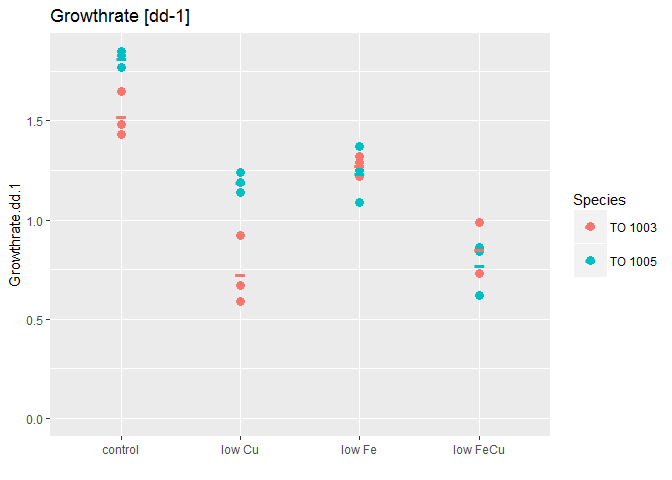 

Now we start with a linear model testing for all main effects and interactions possible:

```r
lm_all_Growthrate.dd <- lm(data = mydata, Growthrate.dd.1 ~ (Species * Fe.level * Cu.level))
summary(lm_all_Growthrate.dd) # we need to look at the actual anova to knwo where we need to look further
```

```
## 
## Call:
## lm(formula = Growthrate.dd.1 ~ (Species * Fe.level * Cu.level), 
##     data = mydata)
## 
## Residuals:
##       Min        1Q    Median        3Q       Max 
## -0.153333 -0.056667  0.006667  0.054167  0.193333 
## 
## Coefficients:
##                                        Estimate Std. Error t value
## (Intercept)                             1.52000    0.06589  23.068
## SpeciesTO 1005                          0.29667    0.09318   3.184
## Fe.levellow                            -0.24333    0.09318  -2.611
## Cu.levellow                            -0.79333    0.09318  -8.514
## SpeciesTO 1005:Fe.levellow             -0.33667    0.13178  -2.555
## SpeciesTO 1005:Cu.levellow              0.16667    0.13178   1.265
## Fe.levellow:Cu.levellow                 0.37333    0.13178   2.833
## SpeciesTO 1005:Fe.levellow:Cu.levellow -0.21000    0.18637  -1.127
##                                        Pr(>|t|)    
## (Intercept)                            1.05e-13 ***
## SpeciesTO 1005                          0.00577 ** 
## Fe.levellow                             0.01890 *  
## Cu.levellow                            2.45e-07 ***
## SpeciesTO 1005:Fe.levellow              0.02120 *  
## SpeciesTO 1005:Cu.levellow              0.22409    
## Fe.levellow:Cu.levellow                 0.01200 *  
## SpeciesTO 1005:Fe.levellow:Cu.levellow  0.27644    
## ---
## Signif. codes:  0 '***' 0.001 '**' 0.01 '*' 0.05 '.' 0.1 ' ' 1
## 
## Residual standard error: 0.1141 on 16 degrees of freedom
## Multiple R-squared:  0.9356,	Adjusted R-squared:  0.9074 
## F-statistic: 33.19 on 7 and 16 DF,  p-value: 2.274e-08
```

```r
anova(lm_all_Growthrate.dd) # #this will use the linear model and give us a table of the analysis of the variance in our dataset
```

```
## Analysis of Variance Table
## 
## Response: Growthrate.dd.1
##                           Df  Sum Sq Mean Sq  F value    Pr(>F)    
## Species                    1 0.15200 0.15200  11.6702  0.003537 ** 
## Fe.level                   1 0.46204 0.46204  35.4731 2.013e-05 ***
## Cu.level                   1 1.98950 1.98950 152.7450 1.341e-09 ***
## Species:Fe.level           1 0.29260 0.29260  22.4648  0.000222 ***
## Species:Cu.level           1 0.00570 0.00570   0.4379  0.517537    
## Fe.level:Cu.level          1 0.10800 0.10800   8.2921  0.010892 *  
## Species:Fe.level:Cu.level  1 0.01654 0.01654   1.2697  0.276444    
## Residuals                 16 0.20840 0.01302                       
## ---
## Signif. codes:  0 '***' 0.001 '**' 0.01 '*' 0.05 '.' 0.1 ' ' 1
```

```r
#and it shows us, we can take out the interaction between Species: Cu.level
```


Looking at the ANOVA table for the linear model that test for all main effects and interactions, we see that

* __Species__ does have a significant effect on growth rate (F (1,16) = 11.67, p.val < 0.01)
* __Fe. level__ has an effect on growthrate (F (1,16) = 35.47, p.val < 0.0001)
* __Cu level__ has an effect on growthrate (F (1,16) = 152.75, p.val < 0.00001)
* there is an __interaction__ between __Species and Fe LEVEL__ (F(1,16) = 22.47, p.val = 0.0002)
    + i.e. depending on the Species the growthrate is different under similar Fe conditions
* there is NOT INTERACTION between Species and CU LEVEL
    + i.e. this is somewhat what I had aimed for as this means that both Species have a similar growthrate reduction under the same Cu.level -> this way I can see how their proteomic and physiological response is similar or different!
* there is an __interaction__ between __Fe LEVEL and Cu LEVEL__ (F(1,16) = 8.29, p.val = 0.01) 

__NOTE:__ the anova table only tells me that there are differences e.g. between the Species. IT DOES NOT TELL ME depending on what variables etc... for that we need to do pairwise comparisons.


### linear model not checking for interaction between Cu and species 

[Back Up](#BackUP)

__FIRST THOUGH__: as we saw in the `anova` table that there is __no interaction between Cu.level and Species__, we can __take the interaction term OUT__ when we make the linear model. Let's see how this will change the model


```r
lm_Growthrate.dd <- lm(data=mydata, Growthrate.dd.1~(Species+Fe.level+Cu.level)^2-Species:Cu.level) #this will model the Growth rate dependend on
#three main effects (Species, Fe.level, Cu.level) and will include 
#possible interactions between Species:Fe.level, Fe.level:Cu.level 
#but NOT Species:Cu.level as we took that one out!

summary(lm_Growthrate.dd)
```

```
## 
## Call:
## lm(formula = Growthrate.dd.1 ~ (Species + Fe.level + Cu.level)^2 - 
##     Species:Cu.level, data = mydata)
## 
## Residuals:
##       Min        1Q    Median        3Q       Max 
## -0.178333 -0.072708  0.002083  0.060833  0.171667 
## 
## Coefficients:
##                            Estimate Std. Error t value Pr(>|t|)    
## (Intercept)                 1.47833    0.05660  26.120 9.20e-16 ***
## SpeciesTO 1005              0.38000    0.06535   5.814 1.65e-05 ***
## Fe.levellow                -0.19083    0.08004  -2.384  0.02833 *  
## Cu.levellow                -0.71000    0.06535 -10.864 2.46e-09 ***
## SpeciesTO 1005:Fe.levellow -0.44167    0.09242  -4.779  0.00015 ***
## Fe.levellow:Cu.levellow     0.26833    0.09242   2.903  0.00948 ** 
## ---
## Signif. codes:  0 '***' 0.001 '**' 0.01 '*' 0.05 '.' 0.1 ' ' 1
## 
## Residual standard error: 0.1132 on 18 degrees of freedom
## Multiple R-squared:  0.9287,	Adjusted R-squared:  0.9089 
## F-statistic: 46.89 on 5 and 18 DF,  p-value: 1.064e-09
```

```r
plot(lm_Growthrate.dd) ##these plots are diagnostic and will give indications if the assumptions are met
```

    


#### Anova table of reduced linear model

[Back Up](#BackUP)

Again, we need to look at the ANOVA table:

```r
anova(lm_Growthrate.dd) #this will use the linear model and give us a table of the analysis of the variance in our dataset
```

```
## Analysis of Variance Table
## 
## Response: Growthrate.dd.1
##                   Df  Sum Sq Mean Sq F value    Pr(>F)    
## Species            1 0.15200 0.15200  11.863 0.0028934 ** 
## Fe.level           1 0.46204 0.46204  36.059 1.116e-05 ***
## Cu.level           1 1.98950 1.98950 155.267 2.745e-10 ***
## Species:Fe.level   1 0.29260 0.29260  22.836 0.0001502 ***
## Fe.level:Cu.level  1 0.10800 0.10800   8.429 0.0094782 ** 
## Residuals         18 0.23064 0.01281                      
## ---
## Signif. codes:  0 '***' 0.001 '**' 0.01 '*' 0.05 '.' 0.1 ' ' 1
```


Looking at the ANOVA table for the linear model that _does not_ test for interaction between Cu.level and Species, basically, we see the same significant factors and interactions as before, just with stronger significance (probably due to the higher degrees of freedom: 18 vs 16)


* __Species__ does have a significant effect on growth rate
* __Fe. level__ has an effect on growthrate
* __Cu level__ has an effect on growthrate now: (F (1,18) = 155.27, p.val <0.00001),  [*before:(F (1,16) = 152.75, p.val <0.00001)*]
* there is still an __interaction__ between __Species and Fe LEVEL__ now: (F(1,18) = 22.84, p.val = 0.000015), [*before: (F(1,16) = 22.47, p.val = 0.0002)*]
    + i.e. depending on the Species the growthrate is different under similar Fe conditions
* there is an __interaction__ between __Fe LEVEL and Cu LEVEL__ now: (F(1,18) = 8.43, p.val < 0.01), [*before: (F(1,16) = 8.29, p.val = 0.01)*] 

### What if we use the `phia` package to look into interactions or main effects?

[Back Up](#BackUP)

This is basically from the tutorial / examples given in the `R` vignette by _Helios De Rosario Martinez_ ["Analysing interactions of fitted models"](https://cran.r-project.org/web/packages/phia/vignettes/phia.pdf)

[...] In factorial experiments like this one, the dependency between factor levels and the response variable is usually represented in a contingency table, where the rows and columns are related to the different levels of both treatments, and __each cell contains the adjusted mean of the response for the corresponding interaction of factors__. When there is an interaction effect, the cell means are taken as the most straightforward way of representing this effect. 

These values and their standard errors can be obtained from the model coeffients with the function `interactionMeans` in the package `phia`, using the fitted model as first (and in this case only) argument:


```r
(lm_Growthrate.dd.means <- interactionMeans(lm_Growthrate.dd))
```

```
##   Species Fe.level Cu.level adjusted mean std. error
## 1 TO 1003     high     high     1.4783333  0.0565982
## 2 TO 1005     high     high     1.8583333  0.0565982
## 3 TO 1003      low     high     1.2875000  0.0565982
## 4 TO 1005      low     high     1.2258333  0.0565982
## 5 TO 1003     high      low     0.7683333  0.0565982
## 6 TO 1005     high      low     1.1483333  0.0565982
## 7 TO 1003      low      low     0.8458333  0.0565982
## 8 TO 1005      low      low     0.7841667  0.0565982
```

```r
plot(lm_Growthrate.dd.means)
```

 

This plot shows us main effects (such as Cu.level) and first order interactions (such as Species and Fe.level). As per the "marginality principle" (see J. A. Nelder, \A reformulation of linear models," Journal of the Royal Statistical Society. Series A (General), vol. 140, no. 1, pp. 48{77, 1977.), those factors that are involved in interactions, should not be interpreted as single effects.

As we see in the upper right and lower left corner, Species and Cu really do not seem to have an interaction effect. They change in the same way (lines are parallel). However, when we look at upper middle and middle left cell, we see that growthrate changes in a different way depending on Species and Fe level. And to a much lesser extend for Fe.level and Cu.level as seen in middle right and lower middle cell.

#### Pairwise Comparisons

<a id="phia_pairwise"></a>

[Back Up](#BackUP)

In order to put actual numbers for the significant differences, I will proceed with pairwise comparisons by having a fixed factor and testing how it changes dependend on another factor


```r
testInteractions(lm_Growthrate.dd, fixed="Species", across="Fe.level")
```

```
## F Test: 
## P-value adjustment method: holm
##             Value Df Sum of Sq       F    Pr(>F)    
## TO 1003   0.05667  1   0.00963  0.7518    0.3973    
## TO 1005   0.49833  1   0.74501 58.1428 9.642e-07 ***
## Residuals         18   0.23064                      
## ---
## Signif. codes:  0 '***' 0.001 '**' 0.01 '*' 0.05 '.' 0.1 ' ' 1
```

This means that the two different Fe.levels I used (high and low) do not significantly change the growth rate in TO 1003 (F(1,18) = 0.75, p.val = 0.397) but it does change the growthrate significantly in TO 1005 (F(1,18) = 58.14, p-val < 0.00001)).

Note, that for this, the integrated growthrates for all high Fe treatments (control and low Cu) are compared to the integrated low Fe growthrates (low Fe and low FeCu) fo the respective Specie.


```r
testInteractions(lm_Growthrate.dd, fixed="Fe.level", across="Species")
```

```
## F Test: 
## P-value adjustment method: holm
##              Value Df Sum of Sq       F    Pr(>F)    
## high      -0.38000  1   0.43320 33.8083 3.303e-05 ***
##  low       0.06167  1   0.01141  0.8903    0.3579    
## Residuals          18   0.23064                      
## ---
## Signif. codes:  0 '***' 0.001 '**' 0.01 '*' 0.05 '.' 0.1 ' ' 1
```

This means that the two Species have significantly different growthrates under high Fe conditions (F(1,18), p.val < 0.0001) but are not sig different under low Fe conditions


```r
testInteractions(lm_Growthrate.dd, fixed="Fe.level", across="Cu.level")
```

```
## F Test: 
## P-value adjustment method: holm
##             Value Df Sum of Sq       F    Pr(>F)    
## high      0.71000  1   1.51230 118.025 4.918e-09 ***
##  low      0.44167  1   0.58521  45.672 2.478e-06 ***
## Residuals         18   0.23064                      
## ---
## Signif. codes:  0 '***' 0.001 '**' 0.01 '*' 0.05 '.' 0.1 ' ' 1
```

This means that there is significant growthrate changes from high Cu to low Cu in both Species (F(1,18) = 118.03, p.val < 0.00001) and that the same is true under low Fe conditions, that the additional lowering of Cu.level changes growth ratessignificantly (F(1,18) = 45.67, p.val < 0.00001)


```r
testInteractions(lm_Growthrate.dd, fixed="Cu.level", across="Fe.level")
```

```
## F Test: 
## P-value adjustment method: holm
##             Value Df Sum of Sq       F    Pr(>F)    
## high      0.41167  1   0.50841 39.6778 1.229e-05 ***
##  low      0.14333  1   0.06163  4.8101   0.04167 *  
## Residuals         18   0.23064                      
## ---
## Signif. codes:  0 '***' 0.001 '**' 0.01 '*' 0.05 '.' 0.1 ' ' 1
```
~~~~~~~~~~~~`


<a id="Growthrate.percent"></a>

#### Growthrate - percent of mu max

[Back Up](#BackUP)

First a look at the graph: 


```r
p <- ggplot (mydata , aes(Treatment, Growthrate.Percent..u.umax.))
p + geom_point(aes(group=Merged, colour=Species), size = 3)+
  labs(title="", x ="")+
  geom_point(data=mean.df , aes(Treatment, Growthrate.Percent, size=2, colour=Species), shape = 45, size = 9)+
  guides(alpha = "none", size = "none", shape = "none")
```

 

Now we start with a linear model testing for all main effects and interactions possible:


```r
lm_all_Growthrate.percent <- lm(data = mydata, Growthrate.Percent..u.umax. ~ (Species * Fe.level * Cu.level))
summary(lm_all_Growthrate.percent) # we need to look at the actual anova to knwo where we need to look further
```

```
## 
## Call:
## lm(formula = Growthrate.Percent..u.umax. ~ (Species * Fe.level * 
##     Cu.level), data = mydata)
## 
## Residuals:
##     Min      1Q  Median      3Q     Max 
## -8.9700 -3.5858  0.2983  3.1525 12.5100 
## 
## Coefficients:
##                                        Estimate Std. Error t value
## (Intercept)                            100.0467     4.0108  24.944
## SpeciesTO 1005                          -0.2233     5.6721  -0.039
## Fe.levellow                            -16.0033     5.6721  -2.821
## Cu.levellow                            -52.1867     5.6721  -9.201
## SpeciesTO 1005:Fe.levellow             -15.8633     8.0216  -1.978
## SpeciesTO 1005:Cu.levellow              17.8233     8.0216   2.222
## Fe.levellow:Cu.levellow                 24.3133     8.0216   3.031
## SpeciesTO 1005:Fe.levellow:Cu.levellow -15.4467    11.3442  -1.362
##                                        Pr(>|t|)    
## (Intercept)                            3.10e-14 ***
## SpeciesTO 1005                          0.96908    
## Fe.levellow                             0.01229 *  
## Cu.levellow                            8.64e-08 ***
## SpeciesTO 1005:Fe.levellow              0.06546 .  
## SpeciesTO 1005:Cu.levellow              0.04106 *  
## Fe.levellow:Cu.levellow                 0.00795 ** 
## SpeciesTO 1005:Fe.levellow:Cu.levellow  0.19218    
## ---
## Signif. codes:  0 '***' 0.001 '**' 0.01 '*' 0.05 '.' 0.1 ' ' 1
## 
## Residual standard error: 6.947 on 16 degrees of freedom
## Multiple R-squared:  0.9306,	Adjusted R-squared:  0.9003 
## F-statistic: 30.66 on 7 and 16 DF,  p-value: 4.067e-08
```

```r
anova(lm_all_Growthrate.percent) # this shows, we can take out the interaction between Species: Cu.level
```

```
## Analysis of Variance Table
## 
## Response: Growthrate.Percent..u.umax.
##                           Df Sum Sq Mean Sq  F value    Pr(>F)    
## Species                    1   57.8    57.8   1.1987 0.2897981    
## Fe.level                   1 1467.7  1467.7  30.4120 4.708e-05 ***
## Cu.level                   1 7341.6  7341.6 152.1289 1.381e-09 ***
## Species:Fe.level           1  834.5   834.5  17.2920 0.0007403 ***
## Species:Cu.level           1  153.0   153.0   3.1707 0.0939636 .  
## Fe.level:Cu.level          1  412.8   412.8   8.5547 0.0099160 ** 
## Species:Fe.level:Cu.level  1   89.5    89.5   1.8541 0.1921797    
## Residuals                 16  772.1    48.3                       
## ---
## Signif. codes:  0 '***' 0.001 '**' 0.01 '*' 0.05 '.' 0.1 ' ' 1
```


```r
lm_Growthrate.percent <- lm(data = mydata, Growthrate.Percent..u.umax. ~ (Species + Fe.level + Cu.level)^2 - Species:Cu.level)
summary(lm_Growthrate.percent) # we need to look at the actual anova to knwo where we need to look further
```

```
## 
## Call:
## lm(formula = Growthrate.Percent..u.umax. ~ (Species + Fe.level + 
##     Cu.level)^2 - Species:Cu.level, data = mydata)
## 
## Residuals:
##     Min      1Q  Median      3Q     Max 
## -13.426  -4.484   0.775   4.620  12.649 
## 
## Coefficients:
##                            Estimate Std. Error t value Pr(>|t|)    
## (Intercept)                  95.591      3.754  25.464 1.44e-15 ***
## SpeciesTO 1005                8.688      4.335   2.004  0.06031 .  
## Fe.levellow                 -12.142      5.309  -2.287  0.03452 *  
## Cu.levellow                 -43.275      4.335  -9.983 9.16e-09 ***
## SpeciesTO 1005:Fe.levellow  -23.587      6.130  -3.848  0.00118 ** 
## Fe.levellow:Cu.levellow      16.590      6.130   2.706  0.01446 *  
## ---
## Signif. codes:  0 '***' 0.001 '**' 0.01 '*' 0.05 '.' 0.1 ' ' 1
## 
## Residual standard error: 7.508 on 18 degrees of freedom
## Multiple R-squared:  0.9088,	Adjusted R-squared:  0.8835 
## F-statistic: 35.89 on 5 and 18 DF,  p-value: 9.441e-09
```

```r
plot.new()
plot(lm_Growthrate.percent)
```

    

```r
anova(lm_Growthrate.percent) # this shows, we can take out the interaction between Species: Cu.level
```

```
## Analysis of Variance Table
## 
## Response: Growthrate.Percent..u.umax.
##                   Df Sum Sq Mean Sq  F value    Pr(>F)    
## Species            1   57.8    57.8   1.0262  0.324474    
## Fe.level           1 1467.7  1467.7  26.0368 7.439e-05 ***
## Cu.level           1 7341.6  7341.6 130.2427 1.128e-09 ***
## Species:Fe.level   1  834.5   834.5  14.8043  0.001179 ** 
## Fe.level:Cu.level  1  412.8   412.8   7.3240  0.014457 *  
## Residuals         18 1014.6    56.4                       
## ---
## Signif. codes:  0 '***' 0.001 '**' 0.01 '*' 0.05 '.' 0.1 ' ' 1
```

### Anova Table - Growthrate.Percent

Looking at the ANOVA table for the linear model that _does not_ test for interaction between Cu.level and Species, for the data __Growthrate Percent of umax__, we see the following significant factors:


* __Species__ is __not__ a main effect on its own
* __Fe. level__ has an effect on growthrate
* __Cu level__ has an effect on growthrate now 
* there is still an __interaction__ between __Species and Fe level now: (F(1,18) = 14.80, p.val = 0.001)
    + i.e. depending on the Species the growthrate is different under similar Fe conditions
* there is an __interaction__ between __Fe level and Cu level: (F(1,18) = 7.32, p.val = 0.02)


### Using the `phia` package to look into significant effects in growthrate percent of mu max?

Again, any main effects that are included in interacting effects will be looked at through pairwise comparisons of the interacting factors


```r
(Growthrate.percent.means <- interactionMeans(lm_Growthrate.percent))
```

```
##   Species Fe.level Cu.level adjusted mean std. error
## 1 TO 1003     high     high      95.59083   3.753952
## 2 TO 1005     high     high     104.27917   3.753952
## 3 TO 1003      low     high      83.44917   3.753952
## 4 TO 1005      low     high      68.55083   3.753952
## 5 TO 1003     high      low      52.31583   3.753952
## 6 TO 1005     high      low      61.00417   3.753952
## 7 TO 1003      low      low      56.76417   3.753952
## 8 TO 1005      low      low      41.86583   3.753952
```

```r
plot(Growthrate.percent.means)
```

 

This plot shows us main effects (such as Cu.level) and first order interactions (such as Species and Fe.level). As per the "marginality principle" (see J. A. Nelder, \A reformulation of linear models," Journal of the Royal Statistical Society. Series A (General), vol. 140, no. 1, pp. 48{77, 1977.), those factors that are involved in interactions, should not be interpreted as single effects.

As we see in the upper right and lower left corner, Species and Cu really do not seem to have an interaction effect. They change in the same way (lines are parallel). However, when we look at upper middle and middle left cell, we see that growthrate changes in a different way depending on Species and Fe level. And to a much lesser extend for Fe.level and Cu.level as seen in middle right and lower middle cell.

#### Pairwise Comparisons

<a id="phia_pairwise"></a>

[Back Up](#BackUP)

In order to put actual numbers for the significant differences, I will proceed with pairwise comparisons by having a fixed factor and testing how it changes dependend on another factor


```r
testInteractions(lm_Growthrate.percent, fixed="Species", across="Fe.level")
```

```
## F Test: 
## P-value adjustment method: holm
##             Value Df Sum of Sq       F    Pr(>F)    
## TO 1003    3.8467  1     44.39  0.7875    0.3866    
## TO 1005   27.4333  1   2257.76 40.0535 1.158e-05 ***
## Residuals         18   1014.64                      
## ---
## Signif. codes:  0 '***' 0.001 '**' 0.01 '*' 0.05 '.' 0.1 ' ' 1
```

This means that the two different Fe.levels I used (high and low) does not significantly change the growth rate in TO 1003 (F(1,18) = 0.79, p.val = 0.39) but it does change the growthrate significantly in TO 1005 (F(1,18) = 40.05, p-val < 0.0001))


```r
testInteractions(lm_Growthrate.percent, fixed="Fe.level", across="Species")
```

```
## F Test: 
## P-value adjustment method: holm
##             Value Df Sum of Sq       F   Pr(>F)   
## high      -8.6883  1    226.46  4.0175 0.060312 . 
##  low      14.8983  1    665.88 11.8130 0.005881 **
## Residuals         18   1014.64                    
## ---
## Signif. codes:  0 '***' 0.001 '**' 0.01 '*' 0.05 '.' 0.1 ' ' 1
```

This means that the two Species have no significantly different growthrates under high Fe conditions (F(1,18) = 4.02, p.val = 0.06) which makes sense as they have both umax as 100 percent and are both similarly reduced by teh given Cu.levels that they have been subjected to. Under low iron their respective growthrates are significantly different (F =  11.81, p.val = 0.006)


```r
testInteractions(lm_Growthrate.percent, fixed="Fe.level", across="Cu.level")
```

```
## F Test: 
## P-value adjustment method: holm
##            Value Df Sum of Sq      F    Pr(>F)    
## high      43.275  1    5618.2 99.668 1.832e-08 ***
##  low      26.685  1    2136.3 37.898 8.198e-06 ***
## Residuals        18    1014.6                     
## ---
## Signif. codes:  0 '***' 0.001 '**' 0.01 '*' 0.05 '.' 0.1 ' ' 1
```

This means that there is significant growthrate changes from high Cu to low Cu in both Species (F(1,18) = 99.67, p.val < 0.00001) and that the same is true under low Fe conditions, that the additional lowering of Cu.level changes growth rates significantly (F(1,18) = 37.90, p.val < 0.00001)


```r
testInteractions(lm_Growthrate.percent, fixed="Cu.level", across="Fe.level")
```

```
## F Test: 
## P-value adjustment method: holm
##            Value Df Sum of Sq       F   Pr(>F)    
## high      23.935  1   1718.65 30.4895 6.09e-05 ***
##  low       7.345  1    161.85  2.8712   0.1074    
## Residuals        18   1014.64                     
## ---
## Signif. codes:  0 '***' 0.001 '**' 0.01 '*' 0.05 '.' 0.1 ' ' 1
```

This means that there is significant growth reduction under high Cu when Fe is limiting (F(1,18) = 30.49, p.val < 0.0001). However, under low Cu, the additional Fe limitation does not have a significant additional effect on growthrate. As discussed earlier, this makes sense when looking at the actual Cu concentrations used and is not in discrepancy to former studies that did find evidence of co limitation in both strains. 

~~~~~~~~~~~~~~~~~~~~~~~~~~~~~~~~~~~


<a id="FvFm"></a>

#### Fv/Fm

[Back Up](#BackUP)

First a look at the graph: 


```r
p <- ggplot (mydata , aes(Treatment, FvFm.old))
p + geom_point(aes(group=Merged, colour=Species), size = 3)+
  labs(title="", x ="")+
  geom_point(data=mean.df , aes(Treatment, FvFm.old, size=2, colour=Species), shape = 45, size = 9)+
  guides(alpha = "none", size = "none", shape = "none")+
  expand_limits(y=0)
```

```
## Warning: Removed 1 rows containing missing values (geom_point).
```

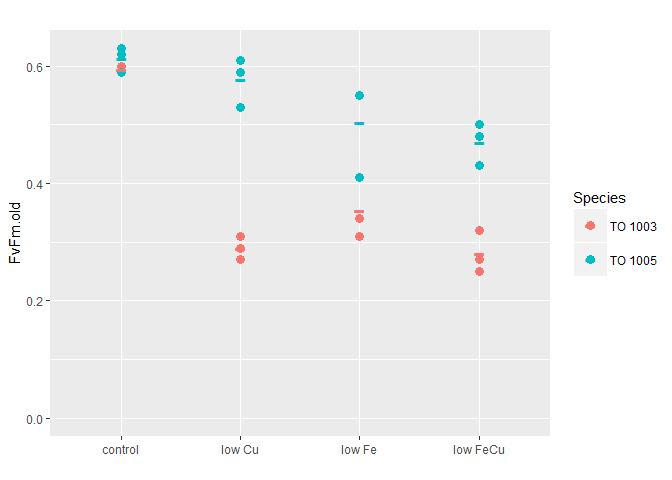 

Now we start with a linear model testing for all main effects and interactions possible:


```r
lm_all_FvFm <- lm(data = mydata, FvFm.old ~ (Species * Fe.level * Cu.level))
summary(lm_all_FvFm) # we need to look at the actual anova to knwo where we need to look further
```

```
## 
## Call:
## lm(formula = FvFm.old ~ (Species * Fe.level * Cu.level), data = mydata)
## 
## Residuals:
##      Min       1Q   Median       3Q      Max 
## -0.09333 -0.02167  0.00500  0.02500  0.05667 
## 
## Coefficients:
##                                        Estimate Std. Error t value
## (Intercept)                             0.59500    0.03094  19.231
## SpeciesTO 1005                          0.01833    0.03994   0.459
## Fe.levellow                            -0.24167    0.03994  -6.050
## Cu.levellow                            -0.30500    0.03994  -7.636
## SpeciesTO 1005:Fe.levellow              0.13167    0.05359   2.457
## SpeciesTO 1005:Cu.levellow              0.26833    0.05359   5.007
## Fe.levellow:Cu.levellow                 0.23167    0.05359   4.323
## SpeciesTO 1005:Fe.levellow:Cu.levellow -0.22833    0.07365  -3.100
##                                        Pr(>|t|)    
## (Intercept)                            5.56e-12 ***
## SpeciesTO 1005                         0.652817    
## Fe.levellow                            2.22e-05 ***
## Cu.levellow                            1.52e-06 ***
## SpeciesTO 1005:Fe.levellow             0.026671 *  
## SpeciesTO 1005:Cu.levellow             0.000156 ***
## Fe.levellow:Cu.levellow                0.000603 ***
## SpeciesTO 1005:Fe.levellow:Cu.levellow 0.007313 ** 
## ---
## Signif. codes:  0 '***' 0.001 '**' 0.01 '*' 0.05 '.' 0.1 ' ' 1
## 
## Residual standard error: 0.04375 on 15 degrees of freedom
##   (1 observation deleted due to missingness)
## Multiple R-squared:  0.9282,	Adjusted R-squared:  0.8946 
## F-statistic: 27.69 on 7 and 15 DF,  p-value: 1.748e-07
```

```r
anova(lm_all_FvFm) # this shows, we can take out the interaction between Species: Fe.level
```

```
## Analysis of Variance Table
## 
## Response: FvFm.old
##                           Df   Sum Sq  Mean Sq F value    Pr(>F)    
## Species                    1 0.187674 0.187674 98.0303 5.695e-08 ***
## Fe.level                   1 0.059754 0.059754 31.2120 5.192e-05 ***
## Cu.level                   1 0.059451 0.059451 31.0541 5.330e-05 ***
## Species:Fe.level           1 0.000011 0.000011  0.0059  0.939968    
## Species:Cu.level           1 0.028371 0.028371 14.8193  0.001575 ** 
## Fe.level:Cu.level          1 0.017387 0.017387  9.0820  0.008727 ** 
## Species:Fe.level:Cu.level  1 0.018401 0.018401  9.6117  0.007313 ** 
## Residuals                 15 0.028717 0.001914                      
## ---
## Signif. codes:  0 '***' 0.001 '**' 0.01 '*' 0.05 '.' 0.1 ' ' 1
```

This one shows that there is no species:Fe.level interaction. So we will take it out in our modified `lm()`:


```r
lm_FvFm <- lm(data = mydata, FvFm.old ~ (Species + Fe.level + Cu.level)^2 - Species:Fe.level)
summary(lm_FvFm) # we need to look at the actual anova to knwo where we need to look further
```

```
## 
## Call:
## lm(formula = FvFm.old ~ (Species + Fe.level + Cu.level)^2 - Species:Fe.level, 
##     data = mydata)
## 
## Residuals:
##       Min        1Q    Median        3Q       Max 
## -0.072593 -0.033380 -0.005833  0.038194  0.075926 
## 
## Coefficients:
##                            Estimate Std. Error t value Pr(>|t|)    
## (Intercept)                 0.55111    0.03045  18.100 1.52e-12 ***
## SpeciesTO 1005              0.09148    0.03210   2.850  0.01107 *  
## Fe.levellow                -0.16852    0.03210  -5.251 6.51e-05 ***
## Cu.levellow                -0.23694    0.04028  -5.883 1.81e-05 ***
## SpeciesTO 1005:Cu.levellow  0.14685    0.04424   3.319  0.00406 ** 
## Fe.levellow:Cu.levellow     0.11019    0.04424   2.491  0.02339 *  
## ---
## Signif. codes:  0 '***' 0.001 '**' 0.01 '*' 0.05 '.' 0.1 ' ' 1
## 
## Residual standard error: 0.05274 on 17 degrees of freedom
##   (1 observation deleted due to missingness)
## Multiple R-squared:  0.8817,	Adjusted R-squared:  0.8469 
## F-statistic: 25.35 on 5 and 17 DF,  p-value: 2.548e-07
```

```r
plot.new()
plot(lm_FvFm)
```

    

```r
anova(lm_FvFm) #
```

```
## Analysis of Variance Table
## 
## Response: FvFm.old
##                   Df   Sum Sq  Mean Sq F value    Pr(>F)    
## Species            1 0.187674 0.187674 67.4765 2.541e-07 ***
## Fe.level           1 0.059754 0.059754 21.4839 0.0002367 ***
## Cu.level           1 0.059451 0.059451 21.3753 0.0002427 ***
## Species:Cu.level   1 0.028352 0.028352 10.1936 0.0053302 ** 
## Fe.level:Cu.level  1 0.017253 0.017253  6.2031 0.0233936 *  
## Residuals         17 0.047282 0.002781                      
## ---
## Signif. codes:  0 '***' 0.001 '**' 0.01 '*' 0.05 '.' 0.1 ' ' 1
```

### Anova Table - FvFm

Looking at the ANOVA table for the linear model that _does not_ test for interaction between Fe.level and Species, for the data __Fv/Fm__, we see the following significant factors:


* __Species__ is  has an effect 
* __Fe. level__ has an effect 
* __Cu level__ has an effect  
* there is an __interaction__ between __Species and Cu level now: (F(1,17) = 21.37, p.val =  0.005)
* there is an __interaction__ between __Fe level and Cu level: (F(1,17) = 6.20, p.val = 0.02)


### Using the `phia` package to look into significant effects in Fv/Fm

Again, any main effects that are included in interacting effects will be looked at through pairwise comparisons of the interacting factors


```r
(FvFm.means <- interactionMeans(lm_FvFm))
```

```
##   Species Fe.level Cu.level adjusted mean std. error
## 1 TO 1003     high     high     0.5511111 0.03044842
## 2 TO 1005     high     high     0.6425926 0.02685298
## 3 TO 1003      low     high     0.3825926 0.02685298
## 4 TO 1005      low     high     0.4740741 0.02685298
## 5 TO 1003     high      low     0.3141667 0.02636910
## 6 TO 1005     high      low     0.5525000 0.02636910
## 7 TO 1003      low      low     0.2558333 0.02636910
## 8 TO 1005      low      low     0.4941667 0.02636910
```

```r
plot(FvFm.means)
```

 

This plot shows us main effects (such as species in respect to Fe.level) and first order interactions (such as Species and Cu.level). As per the "marginality principle" (see J. A. Nelder, \A reformulation of linear models," Journal of the Royal Statistical Society. Series A (General), vol. 140, no. 1, pp. 48{77, 1977.), those factors that are involved in interactions, should not be interpreted as single effects.

As we see in the upper right and lower left corner, Species and Cu  seem to have an interaction effect. Fv/Fm changes differently from high Cu to low Cu in the two species. When we look at upper middle and middle left cell, we see that Fv/Fm changes in the same way for both species in response to the same high/low Fe concentrations. This is particularly interesting as we used different Cu concentrations. This would suggest that the two strains have both started their physiological response to low iron in a similar way even though the growthrate changes do not reflect this! The interplay between Fe.level and Cu.level is seen in the middle right and lower middle cell.

#### Pairwise Comparisons

[Back Up](#BackUP)

In order to put actual numbers for the significant differences, I will proceed with pairwise comparisons by having a fixed factor and testing how it changes dependend on another factor


```r
testInteractions(lm_FvFm, fixed="Species", across="Cu.level")
```

```
## F Test: 
## P-value adjustment method: holm
##             Value Df Sum of Sq       F    Pr(>F)    
## TO 1003   0.18185  1  0.089289 32.1032 5.579e-05 ***
## TO 1005   0.03500  1  0.003675  1.3213    0.2663    
## Residuals         17  0.047282                      
## ---
## Signif. codes:  0 '***' 0.001 '**' 0.01 '*' 0.05 '.' 0.1 ' ' 1
```

This means that the two different Cu.levels I used (high and low) does significantly change Fv/Fm in TO 1003 (F(1,17) = 32.10, p.val < 0.0001) but it does not change Fv/Fm significantly in TO 1005 (F(1,17) = 1.32, p-val > 0.2))


```r
testInteractions(lm_FvFm, fixed="Cu.level", across="Species")
```

```
## F Test: 
## P-value adjustment method: holm
##               Value Df Sum of Sq       F    Pr(>F)    
## high      -0.091481  1  0.022596  8.1242   0.01107 *  
##  low      -0.238333  1  0.170408 61.2689 9.811e-07 ***
## Residuals           17  0.047282                      
## ---
## Signif. codes:  0 '***' 0.001 '**' 0.01 '*' 0.05 '.' 0.1 ' ' 1
```

This means that the two Species have slightly significantly different Fv/Fm under high Cu conditions (F(1,17) = 8.12, p.val = 0.01). Looking at the graph, they have almost the same Fv/Fm under control condition. However, under lowFe (which is the other high Cu condition), their Fv/Fm is sufficiently different to generate the p.val = 0.01. This could mean that TO 1003 has a more pronounced low iron response (again, even though this is not reflected at all in its growthrate decrease).

Under low Cu conditions, Fv/Fm is markedly different between the two strains (F = 61.27, p.val < 0.00001).


```r
testInteractions(lm_FvFm, fixed="Fe.level", across="Cu.level")
```

```
## F Test: 
## P-value adjustment method: holm
##              Value Df Sum of Sq       F    Pr(>F)    
## high      0.163519  1  0.072193 25.9566 0.0001798 ***
##  low      0.053333  1  0.008533  3.0681 0.0978623 .  
## Residuals          17  0.047282                      
## ---
## Signif. codes:  0 '***' 0.001 '**' 0.01 '*' 0.05 '.' 0.1 ' ' 1
```

This means that there is significant changes in Fv/Fm from high Cu to low Cu when integrated over both strains (F(1,17) = 25.96, p.val = 0.0002). This is likely mainly influenced by the very strong difference in TO 1003. 
WHen looking at low Fe and changing Cu from high to low, the difference in Fv/Fm is not significant anymore (F (1,17) = 3.07, pval = 0.1)


```r
testInteractions(lm_FvFm, fixed="Cu.level", across="Fe.level")
```

```
## F Test: 
## P-value adjustment method: holm
##              Value Df Sum of Sq       F    Pr(>F)    
## high      0.168519  1  0.076676 27.5682 0.0001302 ***
##  low      0.058333  1  0.010208  3.6703 0.0723635 .  
## Residuals          17  0.047282                      
## ---
## Signif. codes:  0 '***' 0.001 '**' 0.01 '*' 0.05 '.' 0.1 ' ' 1
```

This means that there is significant reduction in Fv/Fm across both species under high Cu when Fe is limiting (F(1,17) = 27.57, p.val = 0.0001). However, under low Cu, the additional Fe limitation does not have a significant additional effect on Fv/Fm.


<a id="Sigma"></a>

#### Sigma

[Back Up](#BackUP)

First a look at the graph: 


```r
p <- ggplot (mydata , aes(Treatment, Sig.old))
p + geom_point(aes(group=Merged, colour=Species), size = 3)+
  labs(title="", x ="")+
  geom_point(data=mean.df , aes(Treatment, Sig.old, size=2, colour=Species), shape = 45, size = 9)+
  guides(alpha = "none", size = "none", shape = "none")+
  expand_limits(y=0)
```

```
## Warning: Removed 4 rows containing missing values (geom_point).
```

 

Now we start with a linear model testing for all main effects and interactions possible:


```r
lm_all_Sigma <- lm(data = mydata, Sig.old ~ (Species * Fe.level * Cu.level))
summary(lm_all_Sigma) # we need to look at the actual anova to knwo where we need to look further
```

```
## 
## Call:
## lm(formula = Sig.old ~ (Species * Fe.level * Cu.level), data = mydata)
## 
## Residuals:
##    Min     1Q Median     3Q    Max 
## -42.00 -12.00  -2.75  12.75  53.33 
## 
## Coefficients:
##                                        Estimate Std. Error t value
## (Intercept)                             584.000     21.737  26.867
## SpeciesTO 1005                           -4.500     30.740  -0.146
## Fe.levellow                              22.000     28.062   0.784
## Cu.levellow                             180.000     28.062   6.414
## SpeciesTO 1005:Fe.levellow               93.500     41.623   2.246
## SpeciesTO 1005:Cu.levellow             -187.000     41.623  -4.493
## Fe.levellow:Cu.levellow                  10.667     37.649   0.283
## SpeciesTO 1005:Fe.levellow:Cu.levellow    7.333     56.124   0.131
##                                        Pr(>|t|)    
## (Intercept)                            4.34e-12 ***
## SpeciesTO 1005                         0.886046    
## Fe.levellow                            0.448252    
## Cu.levellow                            3.33e-05 ***
## SpeciesTO 1005:Fe.levellow             0.044286 *  
## SpeciesTO 1005:Cu.levellow             0.000736 ***
## Fe.levellow:Cu.levellow                0.781762    
## SpeciesTO 1005:Fe.levellow:Cu.levellow 0.898207    
## ---
## Signif. codes:  0 '***' 0.001 '**' 0.01 '*' 0.05 '.' 0.1 ' ' 1
## 
## Residual standard error: 30.74 on 12 degrees of freedom
##   (4 observations deleted due to missingness)
## Multiple R-squared:  0.926,	Adjusted R-squared:  0.8829 
## F-statistic: 21.46 on 7 and 12 DF,  p-value: 6.942e-06
```

```r
anova(lm_all_Sigma) # this shows, we can take out the interaction between Species: Cu.level
```

```
## Analysis of Variance Table
## 
## Response: Sig.old
##                           Df Sum Sq Mean Sq F value    Pr(>F)    
## Species                    1  13034   13034 13.7925 0.0029601 ** 
## Fe.level                   1  18741   18741 19.8327 0.0007882 ***
## Cu.level                   1  58198   58198 61.5865 4.575e-06 ***
## Species:Fe.level           1  11063   11063 11.7068 0.0050643 ** 
## Species:Cu.level           1  40645   40645 43.0115 2.696e-05 ***
## Fe.level:Cu.level          1    236     236  0.2502 0.6259709    
## Species:Fe.level:Cu.level  1     16      16  0.0171 0.8982068    
## Residuals                 12  11340     945                      
## ---
## Signif. codes:  0 '***' 0.001 '**' 0.01 '*' 0.05 '.' 0.1 ' ' 1
```

There seems to be no Fe.level : Cu.level interaction. So, let's take it out in this `lm()`:


```r
lm_Sigma <- lm(data = mydata, Sig.old ~ (Species + Fe.level + Cu.level)^2 - Fe.level:Cu.level)
summary(lm_Sigma) # we need to look at the actual anova to knwo where we need to look further
```

```
## 
## Call:
## lm(formula = Sig.old ~ (Species + Fe.level + Cu.level)^2 - Fe.level:Cu.level, 
##     data = mydata)
## 
## Residuals:
##     Min      1Q  Median      3Q     Max 
## -44.370 -10.773  -1.018  12.074  55.704 
## 
## Coefficients:
##                            Estimate Std. Error t value Pr(>|t|)    
## (Intercept)                 580.444     16.613  34.938 5.07e-15 ***
## SpeciesTO 1005               -5.854     24.023  -0.244  0.81103    
## Fe.levellow                  27.926     17.512   1.595  0.13311    
## Cu.levellow                 185.926     17.512  10.617 4.43e-08 ***
## SpeciesTO 1005:Fe.levellow   97.392     26.135   3.726  0.00226 ** 
## SpeciesTO 1005:Cu.levellow -183.108     26.135  -7.006 6.19e-06 ***
## ---
## Signif. codes:  0 '***' 0.001 '**' 0.01 '*' 0.05 '.' 0.1 ' ' 1
## 
## Residual standard error: 28.78 on 14 degrees of freedom
##   (4 observations deleted due to missingness)
## Multiple R-squared:  0.9244,	Adjusted R-squared:  0.8974 
## F-statistic: 34.22 on 5 and 14 DF,  p-value: 2.275e-07
```

```r
plot.new()
plot(lm_Sigma)
```

    

```r
anova(lm_Sigma) # this shows, we can take out the interaction between Species: Cu.level
```

```
## Analysis of Variance Table
## 
## Response: Sig.old
##                  Df Sum Sq Mean Sq F value    Pr(>F)    
## Species           1  13034   13034  15.741 0.0014028 ** 
## Fe.level          1  18741   18741  22.634 0.0003061 ***
## Cu.level          1  58198   58198  70.285 7.906e-07 ***
## Species:Fe.level  1  11063   11063  13.360 0.0025980 ** 
## Species:Cu.level  1  40645   40645  49.087 6.187e-06 ***
## Residuals        14  11592     828                      
## ---
## Signif. codes:  0 '***' 0.001 '**' 0.01 '*' 0.05 '.' 0.1 ' ' 1
```

### Anova Table - Sigma

Looking at the ANOVA table for the linear model that _does not_ test for interaction between Cu.level and Species, for the data __Growthrate Percent of umax__, we see the following significant factors:


* __Species__ is __not__ has an effect
* __Fe. level__ has an effect 
* __Cu level__ has an effect 
* there is  an __interaction__ between __Species and Fe level now: (F(1,14) = 13.36, p.val = 0.003)
* there is a strong __interaction__ between __Species and Cu level: (F(1,14) = 49.09, p.val < 0.00001)


### Using the `phia` package to look into significant effects regarding SIGMA

Again, any main effects that are included in interacting effects will be looked at through pairwise comparisons of the interacting factors


```r
(Sigma.means <- interactionMeans(lm_Sigma))
```

```
##   Species Fe.level Cu.level adjusted mean std. error
## 1 TO 1003     high     high      580.4444   16.61342
## 2 TO 1005     high     high      574.5909   17.35216
## 3 TO 1003      low     high      608.3704   14.65166
## 4 TO 1005      low     high      699.9091   17.35216
## 5 TO 1003     high      low      766.3704   14.65166
## 6 TO 1005     high      low      577.4091   17.35216
## 7 TO 1003      low      low      794.2963   14.65166
## 8 TO 1005      low      low      702.7273   15.02741
```

```r
plot(Sigma.means)
```

 

This plot shows us main effects (such as Cu.level in regards to Fe.level) and first order interactions (such as Species and Fe.level). As per the "marginality principle" (see J. A. Nelder, \A reformulation of linear models," Journal of the Royal Statistical Society. Series A (General), vol. 140, no. 1, pp. 48{77, 1977.), those factors that are involved in interactions, should not be interpreted as single effects.

As we see in the upper right and lower left corner, Species and Cu really do seem to have very different results for Sigma.  Whenhen we look at upper middle and middle left cell, we see that Sigma also changes in a different way depending on Species and Fe level.  Differing Fe.level and Cu.level seem to change sigma in a comparable fashion.

#### Pairwise Comparisons

[Back Up](#BackUP)

In order to put actual numbers for the significant differences, I will proceed with pairwise comparisons by having a fixed factor and testing how it changes dependend on another factor


```r
testInteractions(lm_Sigma, fixed="Species", across="Fe.level")
```

```
## F Test: 
## P-value adjustment method: holm
##              Value Df Sum of Sq      F    Pr(>F)    
## TO 1003    -27.926  1      2106  2.543    0.1331    
## TO 1005   -125.318  1     34550 41.726 2.997e-05 ***
## Residuals          14     11592                     
## ---
## Signif. codes:  0 '***' 0.001 '**' 0.01 '*' 0.05 '.' 0.1 ' ' 1
```

This means that the two different Fe.levels I used (high and low) does not significantly change Sigma in TO 1003 (F(1,14) = 2.54, p.val = 0.13) but it does change Sigma significantly in TO 1005 (F(1,14) = 41.73, p-val < 0.0001)


```r
testInteractions(lm_Sigma, fixed="Fe.level", across="Species")
```

```
## F Test: 
## P-value adjustment method: holm
##            Value Df Sum of Sq      F   Pr(>F)    
## high      97.407  1     20913 25.256 0.000371 ***
##  low       0.015  1         0  0.000 0.999323    
## Residuals        14     11592                    
## ---
## Signif. codes:  0 '***' 0.001 '**' 0.01 '*' 0.05 '.' 0.1 ' ' 1
```

This means that the two Species have significantly different Sigma when integrated over their respective high Fe conditions (F(1,14) = 25.26, p.val = 0.0004).
Under low iron their respective Sigmas are statistically almost the same (F (1,14) =  0, p.val = .999). Which makes sense when you look at the graph. Even though the trends are the same (i.e. under low Fe and lowFeCu, TO 1005 stays the same, whereas TO 1003 increases its Sigma). But because the unchanged Sigma of TO 1005 sits right int he middle of the low and high Sigma values of TO 1003, their integrated fixed low Fe values are the same.


```r
testInteractions(lm_Sigma, fixed="Species", across="Cu.level")
```

```
## F Test: 
## P-value adjustment method: holm
##              Value Df Sum of Sq        F    Pr(>F)    
## TO 1003   -185.926  1     93335 112.7208 8.856e-08 ***
## TO 1005     -2.818  1        17   0.0211    0.8866    
## Residuals          14     11592                       
## ---
## Signif. codes:  0 '***' 0.001 '**' 0.01 '*' 0.05 '.' 0.1 ' ' 1
```

Here, TO 1003 has a very strong Cu-effect (F(1,14) = 112.72, pval < 0.00001).
WHereas, Cu doesn;t seem to have any effect on Sigma for TO 1005 (F(1,14) = 0.02, pval = 0.88).


```r
testInteractions(lm_Sigma, fixed="Cu.level", across="Species")
```

```
## F Test: 
## P-value adjustment method: holm
##             Value Df Sum of Sq       F    Pr(>F)    
## high      -42.843  1      4046  4.8858   0.04423 *  
##  low      140.265  1     53000 64.0085 2.737e-06 ***
## Residuals         14     11592                      
## ---
## Signif. codes:  0 '***' 0.001 '**' 0.01 '*' 0.05 '.' 0.1 ' ' 1
```

Under high Cu treatments (i.e. as response to low Fe only), the two strains show somewhat significant differences (F(1,14) = 4.89, p.val = 0.04). This is due to starting witht he same Sigma in the control treatment. THen TO 1003 shows almost no response to low Fe but TO 1005 does show a significant response to Fe. Hence, the differnece between the two strains is significant. 

This difference between the strains is even more pronounced when looking at the low Cu treatments (F (1,14) = 64.01, p.val = 0.00001). Here, TO 1003 shows almost no reponse to an added FeCu co- limitation, whereas Sigma in TO 1005 does increase significantly from low Cu to low CuFe co-limitation 


###Summary SIGMA

There are strong significant differences between TO 1003 and TO 1005 how their SIGMA changes in response to Fe, Cu, or Fe-Cu co-limitation:

__Sigma__ in __TO 1003 does not respond to lowering Fe concentrations__ (neither low Fe alone compared to high Fe, nor low FeCu compared to low Cu)

Completely diametrically different to its sister strain!!!!

__Sigma__ in __TO 1005 does not respond to lowering Cu concentrations__ (neither low Cu alone compared to high Cu, nor low FeCu compared to low Fe)

<a id="PQ"></a>

#### PQ

[Back Up](#BackUP)

First a look at the graph: 


```r
p <- ggplot (mydata , aes(Treatment, PQ_Siz.old))
p + geom_point(aes(group=Merged, colour=Species), size = 3)+
  labs(title="PQ_Size", x ="")+
  geom_point(data=mean.df , aes(Treatment, PQ_Siz.old, size=2, colour=Species), shape = 45, size = 9)+
  guides(alpha = "none", size = "none", shape = "none")+
  expand_limits(y=0)
```

```
## Warning: Removed 4 rows containing missing values (geom_point).
```

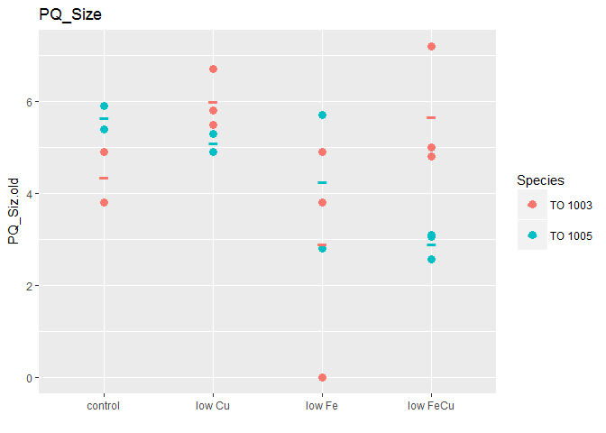 

```r
#I double checked the excel summary file I got from Nina for the "0" value in TO 1003 low Fe (B) treatment. All other values (Fv/Fm, Sigma, p, tau seem to be in the same league as the other two biological replicates... might have to double chekc with Nina, if she has some thoughts on what happened with PQ_size, here)
```

Now we start with a linear model testing for all main effects and interactions possible:


```r
lm_all_PQ <- lm(data = mydata, PQ_Siz.old ~ (Species * Fe.level * Cu.level))
summary(lm_all_PQ) # we need to look at the actual anova to knwo where we need to look further
```

```
## 
## Call:
## lm(formula = PQ_Siz.old ~ (Species * Fe.level * Cu.level), data = mydata)
## 
## Residuals:
##      Min       1Q   Median       3Q      Max 
## -2.90000 -0.51250 -0.02167  0.58750  2.00000 
## 
## Coefficients:
##                                        Estimate Std. Error t value
## (Intercept)                              4.3500     0.9734   4.469
## SpeciesTO 1005                           1.3000     1.3766   0.944
## Fe.levellow                             -1.4500     1.2566  -1.154
## Cu.levellow                              1.6500     1.2566   1.313
## SpeciesTO 1005:Fe.levellow               0.0500     1.8639   0.027
## SpeciesTO 1005:Cu.levellow              -2.2000     1.8639  -1.180
## Fe.levellow:Cu.levellow                  1.1167     1.6859   0.662
## SpeciesTO 1005:Fe.levellow:Cu.levellow  -1.9133     2.5132  -0.761
##                                        Pr(>|t|)    
## (Intercept)                            0.000767 ***
## SpeciesTO 1005                         0.363600    
## Fe.levellow                            0.271010    
## Cu.levellow                            0.213722    
## SpeciesTO 1005:Fe.levellow             0.979040    
## SpeciesTO 1005:Cu.levellow             0.260733    
## Fe.levellow:Cu.levellow                0.520269    
## SpeciesTO 1005:Fe.levellow:Cu.levellow 0.461177    
## ---
## Signif. codes:  0 '***' 0.001 '**' 0.01 '*' 0.05 '.' 0.1 ' ' 1
## 
## Residual standard error: 1.377 on 12 degrees of freedom
##   (4 observations deleted due to missingness)
## Multiple R-squared:  0.5658,	Adjusted R-squared:  0.3126 
## F-statistic: 2.234 on 7 and 12 DF,  p-value: 0.1058
```

```r
anova(lm_all_PQ) # this shows, we can take out the interaction between Species: Cu.level
```

```
## Analysis of Variance Table
## 
## Response: PQ_Siz.old
##                           Df  Sum Sq Mean Sq F value  Pr(>F)  
## Species                    1  1.0590  1.0590  0.5588 0.46912  
## Fe.level                   1 10.4081 10.4081  5.4926 0.03714 *
## Cu.level                   1  2.8406  2.8406  1.4991 0.24431  
## Species:Fe.level           1  1.3066  1.3066  0.6895 0.42254  
## Species:Cu.level           1 12.8431 12.8431  6.7777 0.02308 *
## Fe.level:Cu.level          1  0.0792  0.0792  0.0418 0.84140  
## Species:Fe.level:Cu.level  1  1.0983  1.0983  0.5796 0.46118  
## Residuals                 12 22.7389  1.8949                  
## ---
## Signif. codes:  0 '***' 0.001 '**' 0.01 '*' 0.05 '.' 0.1 ' ' 1
```

There seems to be no Fe.level : Cu.level interaction, and no Species:Cu.level interaction. So, first let's take  them out in this `lm()`:


```r
lm_PQ <- lm(data = mydata, PQ_Siz.old ~ (Species + Fe.level + Cu.level)^2 - Fe.level:Cu.level - Species:Fe.level)
summary(lm_PQ) # we need to look at the actual anova to knwo where we need to look further
```

```
## 
## Call:
## lm(formula = PQ_Siz.old ~ (Species + Fe.level + Cu.level)^2 - 
##     Fe.level:Cu.level - Species:Fe.level, data = mydata)
## 
## Residuals:
##     Min      1Q  Median      3Q     Max 
## -2.9677 -0.5048 -0.1850  0.6760  2.0071 
## 
## Coefficients:
##                            Estimate Std. Error t value Pr(>|t|)    
## (Intercept)                  4.2485     0.6770   6.275 1.49e-05 ***
## SpeciesTO 1005               1.3419     0.8704   1.542   0.1440    
## Fe.levellow                 -1.2808     0.5848  -2.190   0.0447 *  
## Cu.levellow                  2.2253     0.7861   2.831   0.0127 *  
## SpeciesTO 1005:Cu.levellow  -3.2652     1.1758  -2.777   0.0141 *  
## ---
## Signif. codes:  0 '***' 0.001 '**' 0.01 '*' 0.05 '.' 0.1 ' ' 1
## 
## Residual standard error: 1.295 on 15 degrees of freedom
##   (4 observations deleted due to missingness)
## Multiple R-squared:   0.52,	Adjusted R-squared:  0.392 
## F-statistic: 4.062 on 4 and 15 DF,  p-value: 0.01994
```

```r
plot.new()
plot(lm_PQ)
```

    

```r
anova(lm_PQ) # this shows, we can take out the interaction between Species: Cu.level
```

```
## Analysis of Variance Table
## 
## Response: PQ_Siz.old
##                  Df  Sum Sq Mean Sq F value Pr(>F)  
## Species           1  1.0590  1.0590  0.6318 0.4391  
## Fe.level          1 10.4081 10.4081  6.2099 0.0249 *
## Cu.level          1  2.8406  2.8406  1.6948 0.2126  
## Species:Cu.level  1 12.9255 12.9255  7.7119 0.0141 *
## Residuals        15 25.1406  1.6760                 
## ---
## Signif. codes:  0 '***' 0.001 '**' 0.01 '*' 0.05 '.' 0.1 ' ' 1
```

### Anova Table - PQ

Looking at the ANOVA table for the linear model that _does not_ test for interaction between Fe.level : Cu.level interaction or Species : Fe.level, for the data __PQ_Size__, we see the following significant factors:


* __Species__ alone has __not__ an effect
* __Fe. level__ alone has a significant effect (F(1,15), p.val = 0.025) 
* __Cu level__ alone has __not__ an effect
* there is  an __interaction__ between __Species and Cu level now: (F(1,15) = 7.71, p.val = 0.01)


### Using the `phia` package to look into significant effects regarding PQ

Again, any main effects that are included in interacting effects will be looked at through pairwise comparisons of the interacting factors


```r
(PQ.means <- interactionMeans(lm_PQ))
```

```
##   Species Fe.level Cu.level adjusted mean std. error
## 1 TO 1003     high     high      4.248490  0.6770124
## 2 TO 1005     high     high      5.590408  0.7102974
## 3 TO 1003      low     high      2.967673  0.6244486
## 4 TO 1005      low     high      4.309592  0.7102974
## 5 TO 1003     high      low      6.473741  0.6040301
## 6 TO 1005     high      low      4.550490  0.6770124
## 7 TO 1003      low      low      5.192925  0.6040301
## 8 TO 1005      low      low      3.269673  0.6244486
```

```r
plot(PQ.means)
```

 

This plot shows us the main effect (i.e. Fe.level) and first order interactions (such as Species and Cu.level). As per the "marginality principle" (see J. A. Nelder, \A reformulation of linear models," Journal of the Royal Statistical Society. Series A (General), vol. 140, no. 1, pp. 48{77, 1977.), those factors that are involved in interactions, should not be interpreted as single effects.

As we see in the upper right and lower left corner, Species and Cu really do seem to have very different results for PQ.  When we look at upper middle and middle left cell, we see that PQ  changes in a very similar way for both species in response to Fe.level adn that this response is to reduce the PQ.size. Differing Fe.level and Cu.level seem to change PQ in a comparable fashion (middle right and lower middle).

#### Pairwise Comparisons

[Back Up](#BackUP)

In order to put actual numbers for the significant differences, I will proceed with pairwise comparisons by having a fixed factor and testing how it changes dependend on another factor


```r
testInteractions(lm_PQ, fixed="Species", across="Cu.level")
```

```
## F Test: 
## P-value adjustment method: holm
##             Value Df Sum of Sq      F Pr(>F)  
## TO 1003   -2.2252  1   13.4300 8.0129 0.0253 *
## TO 1005    1.0399  1    2.3923 1.4274 0.2507  
## Residuals         15   25.1406                
## ---
## Signif. codes:  0 '***' 0.001 '**' 0.01 '*' 0.05 '.' 0.1 ' ' 1
```

This means that the two different Cu.levels I used (high and low) does significantly change PQ in TO 1003 (F(1,15) = 8.01, p.val = 0.025) but it does not change PQ significantly in TO 1005 (F(1,15) = 1.43, p-val = 0.25)


```r
testInteractions(lm_PQ, fixed="Cu.level", across="Species")
```

```
## F Test: 
## P-value adjustment method: holm
##             Value Df Sum of Sq      F  Pr(>F)  
## high      -1.3419  1    3.9836 2.3768 0.14398  
##  low       1.9232  1   10.0321 5.9856 0.05445 .
## Residuals         15   25.1406                 
## ---
## Signif. codes:  0 '***' 0.001 '**' 0.01 '*' 0.05 '.' 0.1 ' ' 1
```

This means that the two Species have not significantly different PQ when integrated over their respective high Cu conditions (F(1,15) = 2.38, p.val = 0.14).
Under low copper their respective PQs are somewhat different (F(1, 15) = 5.99, p.val = 0.055)


###Summary PQ

There is a statistically significant __Fe effect__: lowering iron leads to lower PQ.size

Then there is an interaction effect __Species : Cu.level__:

__PQ__ in __TO 1003 statistically increases in response to lowering Cu concentrations__ (neither low Fe alone compared to high Fe, nor low FeCu compared to low Cu)

Somewhat diametrically different to its sister strain:

__PQ__ in __TO 1005 tends to decrease (not stat.) in response to lowering Cu concentrations__ 


<a id="Chla"></a>

#### Chla per cell volume __HAVE TO HAVE ANOTHER LOOK AT THREE WAY INTERACTION TESTING!!!__

[Back Up](#BackUP)

First a look at the graph: 


```r
p <- ggplot (mydata , aes(Treatment, Chla.per.cell.vol.fg.fL))
p + geom_point(aes(group=Merged, colour=Species), size = 3)+
  labs(title="Chl a / Cell vol [fg/fL]", x ="")+
  geom_point(data=mean.df , aes(Treatment, Chla.per.cell.vol.fg.fL, size=2, colour=Species), shape = 45, size = 9)+
  guides(alpha = "none", size = "none", shape = "none")+
  expand_limits(y=0)
```

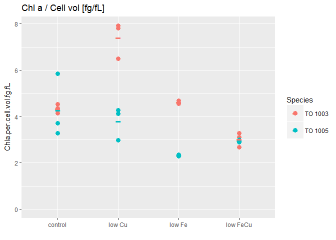 

```r
#I double checked the excel summary file I got from Nina for the "0" value in TO 1003 low Fe (B) treatment. All other values (Fv/Fm, Sigma, p, tau seem to be in the same league as the other two biological replicates... might have to double chekc with Nina, if she has some thoughts on what happened with Chla_size, here)
```


Now we start with a linear model testing for all main effects and interactions possible:


```r
lm_all_Chla <- lm(data = mydata, Chla.per.cell.vol.fg.fL ~ (Species * Fe.level * Cu.level))
summary(lm_all_Chla) # we need to look at the actual anova to knwo where we need to look further
```

```
## 
## Call:
## lm(formula = Chla.per.cell.vol.fg.fL ~ (Species * Fe.level * 
##     Cu.level), data = mydata)
## 
## Residuals:
##      Min       1Q   Median       3Q      Max 
## -1.00400 -0.09989  0.01767  0.19917  1.57300 
## 
## Coefficients:
##                                        Estimate Std. Error t value
## (Intercept)                             4.33667    0.36401  11.914
## SpeciesTO 1005                         -0.06067    0.51479  -0.118
## Fe.levellow                             0.27333    0.51479   0.531
## Cu.levellow                             3.06667    0.51479   5.957
## SpeciesTO 1005:Fe.levellow             -2.22900    0.72802  -3.062
## SpeciesTO 1005:Cu.levellow             -3.55267    0.72802  -4.880
## Fe.levellow:Cu.levellow                -4.65433    0.72802  -6.393
## SpeciesTO 1005:Fe.levellow:Cu.levellow  5.77092    1.02958   5.605
##                                        Pr(>|t|)    
## (Intercept)                            2.28e-09 ***
## SpeciesTO 1005                         0.907655    
## Fe.levellow                            0.602739    
## Cu.levellow                            2.01e-05 ***
## SpeciesTO 1005:Fe.levellow             0.007454 ** 
## SpeciesTO 1005:Cu.levellow             0.000167 ***
## Fe.levellow:Cu.levellow                8.90e-06 ***
## SpeciesTO 1005:Fe.levellow:Cu.levellow 3.95e-05 ***
## ---
## Signif. codes:  0 '***' 0.001 '**' 0.01 '*' 0.05 '.' 0.1 ' ' 1
## 
## Residual standard error: 0.6305 on 16 degrees of freedom
## Multiple R-squared:  0.8891,	Adjusted R-squared:  0.8406 
## F-statistic: 18.33 on 7 and 16 DF,  p-value: 1.564e-06
```

```r
anova(lm_all_Chla) # this shows, we can take out the interaction between Species: Cu.level
```

```
## Analysis of Variance Table
## 
## Response: Chla.per.cell.vol.fg.fL
##                           Df  Sum Sq Mean Sq F value    Pr(>F)    
## Species                    1 13.6583 13.6583 34.3595 2.409e-05 ***
## Fe.level                   1 17.8662 17.8662 44.9451 5.063e-06 ***
## Cu.level                   1  0.9885  0.9885  2.4867  0.134373    
## Species:Fe.level           1  0.6464  0.6464  1.6261  0.220445    
## Species:Cu.level           1  0.6677  0.6677  1.6798  0.213334    
## Fe.level:Cu.level          1  4.6934  4.6934 11.8068  0.003392 ** 
## Species:Fe.level:Cu.level  1 12.4888 12.4888 31.4174 3.948e-05 ***
## Residuals                 16  6.3602  0.3975                      
## ---
## Signif. codes:  0 '***' 0.001 '**' 0.01 '*' 0.05 '.' 0.1 ' ' 1
```

There seems to be no Species: Fe.level and no Species: Cu.level interaction. However, there seems to be a three way species:Fe.level:Cu,level interaction. So I will not take out anything for the following analysis.


```r
lm_Chla <- lm (data = mydata, Chla.per.cell.vol.fg.fL ~ (Species * Fe.level * Cu.level)) # Yes, this is the same as before. I leave it as is
summary(lm_Chla) # we need to look at the actual anova to knwo where we need to look further
```

```
## 
## Call:
## lm(formula = Chla.per.cell.vol.fg.fL ~ (Species * Fe.level * 
##     Cu.level), data = mydata)
## 
## Residuals:
##      Min       1Q   Median       3Q      Max 
## -1.00400 -0.09989  0.01767  0.19917  1.57300 
## 
## Coefficients:
##                                        Estimate Std. Error t value
## (Intercept)                             4.33667    0.36401  11.914
## SpeciesTO 1005                         -0.06067    0.51479  -0.118
## Fe.levellow                             0.27333    0.51479   0.531
## Cu.levellow                             3.06667    0.51479   5.957
## SpeciesTO 1005:Fe.levellow             -2.22900    0.72802  -3.062
## SpeciesTO 1005:Cu.levellow             -3.55267    0.72802  -4.880
## Fe.levellow:Cu.levellow                -4.65433    0.72802  -6.393
## SpeciesTO 1005:Fe.levellow:Cu.levellow  5.77092    1.02958   5.605
##                                        Pr(>|t|)    
## (Intercept)                            2.28e-09 ***
## SpeciesTO 1005                         0.907655    
## Fe.levellow                            0.602739    
## Cu.levellow                            2.01e-05 ***
## SpeciesTO 1005:Fe.levellow             0.007454 ** 
## SpeciesTO 1005:Cu.levellow             0.000167 ***
## Fe.levellow:Cu.levellow                8.90e-06 ***
## SpeciesTO 1005:Fe.levellow:Cu.levellow 3.95e-05 ***
## ---
## Signif. codes:  0 '***' 0.001 '**' 0.01 '*' 0.05 '.' 0.1 ' ' 1
## 
## Residual standard error: 0.6305 on 16 degrees of freedom
## Multiple R-squared:  0.8891,	Adjusted R-squared:  0.8406 
## F-statistic: 18.33 on 7 and 16 DF,  p-value: 1.564e-06
```

```r
plot.new()
plot(lm_Chla)
```

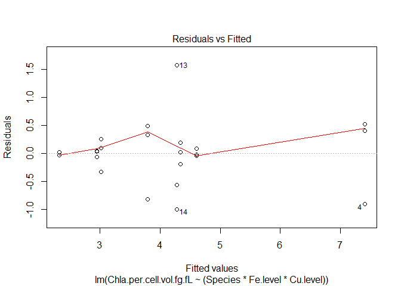 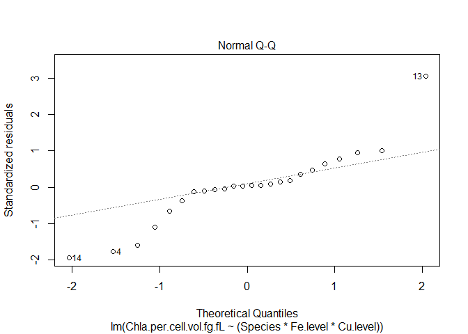 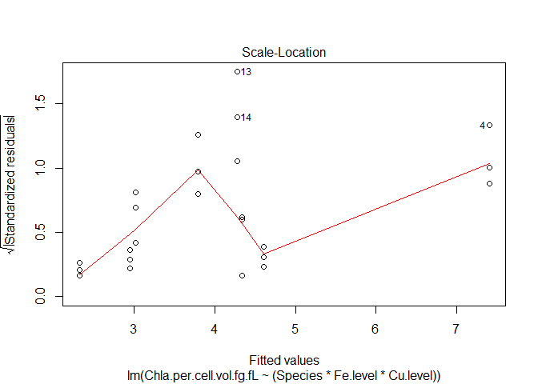 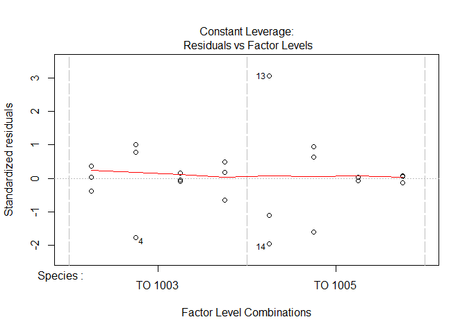 

```r
anova(lm_Chla)
```

```
## Analysis of Variance Table
## 
## Response: Chla.per.cell.vol.fg.fL
##                           Df  Sum Sq Mean Sq F value    Pr(>F)    
## Species                    1 13.6583 13.6583 34.3595 2.409e-05 ***
## Fe.level                   1 17.8662 17.8662 44.9451 5.063e-06 ***
## Cu.level                   1  0.9885  0.9885  2.4867  0.134373    
## Species:Fe.level           1  0.6464  0.6464  1.6261  0.220445    
## Species:Cu.level           1  0.6677  0.6677  1.6798  0.213334    
## Fe.level:Cu.level          1  4.6934  4.6934 11.8068  0.003392 ** 
## Species:Fe.level:Cu.level  1 12.4888 12.4888 31.4174 3.948e-05 ***
## Residuals                 16  6.3602  0.3975                      
## ---
## Signif. codes:  0 '***' 0.001 '**' 0.01 '*' 0.05 '.' 0.1 ' ' 1
```

### Anova Table - Chla

Looking at the ANOVA table for the linear model that _does not_ test for interaction between Fe.level : Cu.level interaction or Species : Fe.level, for the data __Chla_Size__, we see the following significant factors:


* __Species__ alone has a significant effect
* __Fe. level__ alone has a significant effect  
* __Cu level__ alone has __not__ an effect
* there is  an __interaction__ between __Cu level and Fe level__ 
* there is a __3-way interaction__ between __Species, Cu level and Fe level__ (F(1, 16) = 31.42, p-val < 0.0001)


### Using the `phia` package to look into significant effects regarding Chla

Again, any main effects that are included in interacting effects will be looked at through pairwise comparisons of the interacting factors


```r
(Chla.means <- interactionMeans(lm_Chla))
```

```
##   Species Fe.level Cu.level adjusted mean std. error
## 1 TO 1003     high     high      4.336667  0.3640113
## 2 TO 1005     high     high      4.276000  0.3640113
## 3 TO 1003      low     high      4.610000  0.3640113
## 4 TO 1005      low     high      2.320333  0.3640113
## 5 TO 1003     high      low      7.403333  0.3640113
## 6 TO 1005     high      low      3.790000  0.3640113
## 7 TO 1003      low      low      3.022333  0.3640113
## 8 TO 1005      low      low      2.950919  0.3640113
```

```r
plot(Chla.means)
```

 

This plot shows us the main effects (no single main effects here) and first order interactions (such as Species , Cu.level, Fe. level). As per the "marginality principle" (see J. A. Nelder, \A reformulation of linear models," Journal of the Royal Statistical Society. Series A (General), vol. 140, no. 1, pp. 48{77, 1977.), those factors that are involved in interactions, should not be interpreted as single effects.

Not sure how to look at three-way interactions in this plot. But you do see the Fe:Cu level interaction when looking at middle right and lower middle. Chla concentration per cell volume changes differently depending on Fe and Cu levels. 

#### Pairwise Comparisons

[Back Up](#BackUP)

In order to put actual numbers for the significant differences in the 3-way interaction between __Species, Cu level and Fe level__, I will proceed with pairwise comparisons by having __two fixed factors__ and testing how Chl a changes dependend on the remaining factor


First: Species against Fe + Cu level

```r
testInteractions(lm_Chla, fixed="Species", across=c("Cu.level", "Fe.level"))
```

```
## F Test: 
## P-value adjustment method: holm
##             Value Df Sum of Sq       F    Pr(>F)    
## TO 1003   -4.6543  1   16.2471 40.8719 1.781e-05 ***
## TO 1005    1.1166  1    0.9351  2.3523    0.1446    
## Residuals         16    6.3602                      
## ---
## Signif. codes:  0 '***' 0.001 '**' 0.01 '*' 0.05 '.' 0.1 ' ' 1
```

This means that there is an Fe:Cu interaction for TO 1003 but not for TO 1005 (F( 1, 16) = 40.87, p-val < 0.0001)

Now let's see how everything plays out in more detail by fixing SPecies and Cu level and change Fe. level:


```r
testInteractions(lm_Chla, fixed=c("Species", "Cu.level"), across="Fe.level")
```

```
## F Test: 
## P-value adjustment method: holm
##                  Value Df Sum of Sq       F    Pr(>F)    
## TO 1003 : high -0.2733  1    0.1121  0.2819  0.602739    
## TO 1005 : high  1.9557  1    5.7369 14.4321  0.004729 ** 
## TO 1003 :  low  4.3810  1   28.7897 72.4247 9.856e-07 ***
## TO 1005 :  low  0.8391  1    1.0561  2.6567  0.245276    
## Residuals              16    6.3602                      
## ---
## Signif. codes:  0 '***' 0.001 '**' 0.01 '*' 0.05 '.' 0.1 ' ' 1
```

Control to low Fe is only significant for TO 1005 (F(1, 16) = 14.43, p-val = 0.005) but not significant for TO 1003

However, when comparing low Cu to low FeCu treatment, Chl a is only significantly reduced in TO 1003 (F(1, 16) = 72.42, p-val < 0.00001) 


```r
testInteractions(lm_Chla, fixed=c("Species", "Fe.level"), across="Cu.level")
```

```
## F Test: 
## P-value adjustment method: holm
##                   Value Df Sum of Sq       F    Pr(>F)    
## TO 1003 : high -3.06667  1   14.1067 35.4873 8.035e-05 ***
## TO 1005 : high  0.48600  1    0.3543  0.8913   0.47665    
## TO 1003 :  low  1.58767  1    3.7810  9.5117   0.02134 *  
## TO 1005 :  low -0.63059  1    0.5965  1.5005   0.47665    
## Residuals               16    6.3602                      
## ---
## Signif. codes:  0 '***' 0.001 '**' 0.01 '*' 0.05 '.' 0.1 ' ' 1
```

Control to low Cu is only significant for TO 1003 (F(1, 16) = 35.49, p-val < 0.0001) but not significant for TO 1005

When comparing low Fe to low FeCu treatment, again, Chl a is only significantly reduced in TO 1003 (F(1, 16) = 9.51, p-val = 0.02) 


```r
testInteractions(lm_Chla, fixed=c("Cu.level", "Fe.level"), across="Species")
```

```
## F Test: 
## P-value adjustment method: holm
##              Value Df Sum of Sq       F    Pr(>F)    
## high : high 0.0607  1    0.0055  0.0139  1.000000    
##  low : high 3.6133  1   19.5843 49.2670 1.159e-05 ***
## high :  low 2.2897  1    7.8639 19.7827  0.001215 ** 
##  low :  low 0.0714  1    0.0076  0.0192  1.000000    
## Residuals          16    6.3602                      
## ---
## Signif. codes:  0 '***' 0.001 '**' 0.01 '*' 0.05 '.' 0.1 ' ' 1
```

Under the control treatment, both strains have the same Chl a concentration. 

Under low Cu, TO 1003 has significantly higher CHl a per Cell volume compared to TO 1005 (F(1, 16) = 49.27, p-val < 0.0001). In TO 1005 Chla stays the same compared to the control treatment.

Under low Fe, TO 1005 has significantly lower CHl a per Cell volume compared to TO 1003 (F(1, 16) = 19.78, p-val = 0.001). In TO 1003 Chla stays the same compared to the control treatment.

When co-limited (low FeCu), both strains have again the same Chl a concentration


###Summary Chla per Cell vol

Under the control treatment, both strains have the same Chl a concentration. 

Under low Cu, TO 1003 has significantly higher Chl a (+ 3.07 fg/fL) compared to the control treatment (F(1, 16) = 35.49, p-val < 0.0001), whereas Chl a concentration stays the same for TO 1005. Consequently, TO 1003 and TO 1005 have significantly different Chl a concentrations under low Cu treatment (TO 1003 has ~  + 3.61 fg/fL more Chla per cell vol compared to TO 1005) (F(1, 16) = 49.27, p-val < 0.0001). 
 
Under low Fe, the Chla per cell volume stays constant in TO 1003 compared to the control. Here, Chl a changes only in TO 1005. It decreases significantly (- 1.96 fg/fL)(F(1, 16) = 14.43, p-val = 0.005). Consequently, the difference between the two strains is also significant with F(1, 16) = 19.78 and p-val = 0.001.

When co-limited (low FeCu), both strains have again the same Chl a concentration

~~~~~~~~~~~~~~~~~~~~~~~~~~~~~~~~~~~~~~~~~~~~~~~~~~~~~~~~~~~~~~


<a id="Chla.cell"></a>

#### Chla per cell

[Back Up](#BackUP)

First a look at the graph: 


```r
p <- ggplot (mydata , aes(Treatment, Chla.per.cell.pg.cell))
p + geom_point(aes(group=Merged, colour=Species), size = 3)+
  labs(title="Chl a / Cell  [pg/cell]", x ="")+
  geom_point(data=mean.df , aes(Treatment, Chla.per.cell.pg.cell, size=2, colour=Species), shape = 45, size = 9)+
  guides(alpha = "none", size = "none", shape = "none")+
  expand_limits(y=0)
```

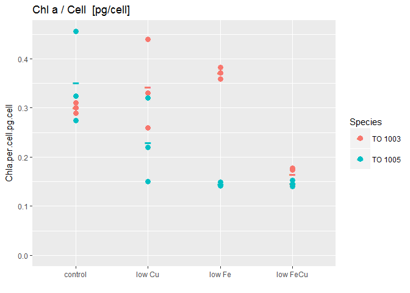 


Now we start with a linear model testing for all main effects and interactions possible:


```r
lm_all_Chla.cell <- lm(data = mydata, Chla.per.cell.pg.cell ~ (Species * Fe.level * Cu.level))
summary(lm_all_Chla.cell) # we need to look at the actual anova to knwo where we need to look further
```

```
## 
## Call:
## lm(formula = Chla.per.cell.pg.cell ~ (Species * Fe.level * Cu.level), 
##     data = mydata)
## 
## Residuals:
##       Min        1Q    Median        3Q       Max 
## -0.083333 -0.012333 -0.000872  0.009500  0.104333 
## 
## Coefficients:
##                                        Estimate Std. Error t value
## (Intercept)                             0.30000    0.03226   9.300
## SpeciesTO 1005                          0.05167    0.04562   1.133
## Fe.levellow                             0.07100    0.04562   1.556
## Cu.levellow                             0.04333    0.04562   0.950
## SpeciesTO 1005:Fe.levellow             -0.27767    0.06452  -4.304
## SpeciesTO 1005:Cu.levellow             -0.16500    0.06452  -2.557
## Fe.levellow:Cu.levellow                -0.24967    0.06452  -3.870
## SpeciesTO 1005:Fe.levellow:Cu.levellow  0.37258    0.09124   4.083
##                                        Pr(>|t|)    
## (Intercept)                            7.47e-08 ***
## SpeciesTO 1005                         0.274098    
## Fe.levellow                            0.139189    
## Cu.levellow                            0.356308    
## SpeciesTO 1005:Fe.levellow             0.000546 ***
## SpeciesTO 1005:Cu.levellow             0.021083 *  
## Fe.levellow:Cu.levellow                0.001358 ** 
## SpeciesTO 1005:Fe.levellow:Cu.levellow 0.000866 ***
## ---
## Signif. codes:  0 '***' 0.001 '**' 0.01 '*' 0.05 '.' 0.1 ' ' 1
## 
## Residual standard error: 0.05587 on 16 degrees of freedom
## Multiple R-squared:  0.7969,	Adjusted R-squared:  0.708 
## F-statistic: 8.968 on 7 and 16 DF,  p-value: 0.0001565
```

```r
anova(lm_all_Chla.cell) # this shows, we can take out the interaction between Species: Cu.level
```

```
## Analysis of Variance Table
## 
## Response: Chla.per.cell.pg.cell
##                           Df   Sum Sq  Mean Sq F value    Pr(>F)    
## Species                    1 0.035134 0.035134 11.2543 0.0040268 ** 
## Fe.level                   1 0.059428 0.059428 19.0364 0.0004829 ***
## Cu.level                   1 0.030123 0.030123  9.6492 0.0067894 ** 
## Species:Fe.level           1 0.012525 0.012525  4.0121 0.0624176 .  
## Species:Cu.level           1 0.000680 0.000680  0.2178 0.6470484    
## Fe.level:Cu.level          1 0.006025 0.006025  1.9300 0.1837884    
## Species:Fe.level:Cu.level  1 0.052055 0.052055 16.6745 0.0008661 ***
## Residuals                 16 0.049949 0.003122                      
## ---
## Signif. codes:  0 '***' 0.001 '**' 0.01 '*' 0.05 '.' 0.1 ' ' 1
```

There seems to be no Species: Fe.level and no Species: Cu.level interaction. However, there seems to be a three way species:Fe.level:Cu,level interaction. So I will not take out anything for the following analysis.


```r
lm_Chla.cell <- lm (data = mydata, Chla.per.cell.pg.cell ~ (Species * Fe.level * Cu.level)) # Yes, this is the same as before. I leave it as is
summary(lm_Chla.cell) # we need to look at the actual anova to knwo where we need to look further
```

```
## 
## Call:
## lm(formula = Chla.per.cell.pg.cell ~ (Species * Fe.level * Cu.level), 
##     data = mydata)
## 
## Residuals:
##       Min        1Q    Median        3Q       Max 
## -0.083333 -0.012333 -0.000872  0.009500  0.104333 
## 
## Coefficients:
##                                        Estimate Std. Error t value
## (Intercept)                             0.30000    0.03226   9.300
## SpeciesTO 1005                          0.05167    0.04562   1.133
## Fe.levellow                             0.07100    0.04562   1.556
## Cu.levellow                             0.04333    0.04562   0.950
## SpeciesTO 1005:Fe.levellow             -0.27767    0.06452  -4.304
## SpeciesTO 1005:Cu.levellow             -0.16500    0.06452  -2.557
## Fe.levellow:Cu.levellow                -0.24967    0.06452  -3.870
## SpeciesTO 1005:Fe.levellow:Cu.levellow  0.37258    0.09124   4.083
##                                        Pr(>|t|)    
## (Intercept)                            7.47e-08 ***
## SpeciesTO 1005                         0.274098    
## Fe.levellow                            0.139189    
## Cu.levellow                            0.356308    
## SpeciesTO 1005:Fe.levellow             0.000546 ***
## SpeciesTO 1005:Cu.levellow             0.021083 *  
## Fe.levellow:Cu.levellow                0.001358 ** 
## SpeciesTO 1005:Fe.levellow:Cu.levellow 0.000866 ***
## ---
## Signif. codes:  0 '***' 0.001 '**' 0.01 '*' 0.05 '.' 0.1 ' ' 1
## 
## Residual standard error: 0.05587 on 16 degrees of freedom
## Multiple R-squared:  0.7969,	Adjusted R-squared:  0.708 
## F-statistic: 8.968 on 7 and 16 DF,  p-value: 0.0001565
```

```r
plot.new()
plot(lm_Chla.cell)
```

    

```r
anova(lm_Chla.cell)
```

```
## Analysis of Variance Table
## 
## Response: Chla.per.cell.pg.cell
##                           Df   Sum Sq  Mean Sq F value    Pr(>F)    
## Species                    1 0.035134 0.035134 11.2543 0.0040268 ** 
## Fe.level                   1 0.059428 0.059428 19.0364 0.0004829 ***
## Cu.level                   1 0.030123 0.030123  9.6492 0.0067894 ** 
## Species:Fe.level           1 0.012525 0.012525  4.0121 0.0624176 .  
## Species:Cu.level           1 0.000680 0.000680  0.2178 0.6470484    
## Fe.level:Cu.level          1 0.006025 0.006025  1.9300 0.1837884    
## Species:Fe.level:Cu.level  1 0.052055 0.052055 16.6745 0.0008661 ***
## Residuals                 16 0.049949 0.003122                      
## ---
## Signif. codes:  0 '***' 0.001 '**' 0.01 '*' 0.05 '.' 0.1 ' ' 1
```

### Anova Table - Chla.cell

Looking at the ANOVA table for the linear model that _ we see the following significant factors:


* __Species__ alone has a significant effect
* __Fe. level__ alone has a significant effect  
* __Cu level__ alone has an effect
* there is  __almost__ an __interaction__ between __Species and Fe level__ 
* there is a __3-way interaction__ between __Species, Cu level and Fe level__ (F(1, 16) = 31.42, p-val < 0.0001)


### Using the `phia` package to look into significant effects regarding Chla.cell

Again, any main effects that are included in interacting effects will be looked at through pairwise comparisons of the interacting factors


```r
(Chla.cell.means <- interactionMeans(lm_Chla.cell))
```

```
##   Species Fe.level Cu.level adjusted mean std. error
## 1 TO 1003     high     high     0.3000000 0.03225851
## 2 TO 1005     high     high     0.3516667 0.03225851
## 3 TO 1003      low     high     0.3710000 0.03225851
## 4 TO 1005      low     high     0.1450000 0.03225851
## 5 TO 1003     high      low     0.3433333 0.03225851
## 6 TO 1005     high      low     0.2300000 0.03225851
## 7 TO 1003      low      low     0.1646667 0.03225851
## 8 TO 1005      low      low     0.1462433 0.03225851
```

```r
plot(Chla.cell.means)
```

 

This plot shows us the main effects (no single main effects here) and first order interactions (such as Species , Cu.level, Fe. level). As per the "marginality principle" (see J. A. Nelder, \A reformulation of linear models," Journal of the Royal Statistical Society. Series A (General), vol. 140, no. 1, pp. 48{77, 1977.), those factors that are involved in interactions, should not be interpreted as single effects.

Not sure how to look at three-way interactions in this plot. But you do see the Fe:Cu level interaction when looking at middle right and lower middle. Chla concentration per cell  changes differently depending on Fe and Cu levels. 

#### Pairwise Comparisons

[Back Up](#BackUP)

In order to put actual numbers for the significant differences in the 3-way interaction between __Species, Cu level and Fe level__, I will proceed with pairwise comparisons by having __two fixed factors__ and testing how Chl a changes dependend on the remaining factor


First: Species against Fe + Cu level

```r
testInteractions(lm_Chla.cell, fixed="Species", across=c("Cu.level", "Fe.level"))
```

```
## F Test: 
## P-value adjustment method: holm
##              Value Df Sum of Sq       F   Pr(>F)   
## TO 1003   -0.24967  1  0.046750 14.9752 0.002715 **
## TO 1005    0.12291  1  0.011330  3.6293 0.074905 . 
## Residuals          16  0.049949                    
## ---
## Signif. codes:  0 '***' 0.001 '**' 0.01 '*' 0.05 '.' 0.1 ' ' 1
```

This means that there is an Fe:Cu interaction for TO 1003 but only a hint of interaction for TO 1005 (F( 1, 16) = 14.97, p-val < 0.003 for TO 1003)

Now let's see how everything plays out in more detail by fixing Species and Cu level and change Fe. level:


```r
testInteractions(lm_Chla.cell, fixed=c("Species", "Cu.level"), across="Fe.level")
```

```
## F Test: 
## P-value adjustment method: holm
##                    Value Df Sum of Sq       F   Pr(>F)   
## TO 1003 : high -0.071000  1  0.007561  2.4221 0.170038   
## TO 1005 : high  0.206667  1  0.064067 20.5221 0.001366 **
## TO 1003 :  low  0.178667  1  0.047883 15.3380 0.003692 **
## TO 1005 :  low  0.083757  1  0.010523  3.3707 0.170038   
## Residuals                16  0.049949                    
## ---
## Signif. codes:  0 '***' 0.001 '**' 0.01 '*' 0.05 '.' 0.1 ' ' 1
```

Control to low Fe is again (as in Chl a per cell vol) only significant for TO 1005 (F(1, 16) = 20.52, p-val = 0.001) but not significant for TO 1003

However, when comparing low Cu to low FeCu treatment, Chl a (again) is only significantly reduced in TO 1003 (F(1, 16) = 15.34, p-val = 0.004) 


```r
testInteractions(lm_Chla.cell, fixed=c("Species", "Fe.level"), across="Cu.level")
```

```
## F Test: 
## P-value adjustment method: holm
##                    Value Df Sum of Sq       F   Pr(>F)   
## TO 1003 : high -0.043333  1  0.002817  0.9022 0.712616   
## TO 1005 : high  0.121667  1  0.022204  7.1125 0.050627 . 
## TO 1003 :  low  0.206333  1  0.063860 20.4560 0.001387 **
## TO 1005 :  low -0.001243  1  0.000002  0.0007 0.978595   
## Residuals                16  0.049949                    
## ---
## Signif. codes:  0 '***' 0.001 '**' 0.01 '*' 0.05 '.' 0.1 ' ' 1
```

Control to low Cu looks different compared to Chl a per cell volume. This time, TO 1003 is NOT significantly sifferent. Additionally, this time, TO 1005 has almost sig decreased (F(1, 16) = 7.11, p-val = 0.05) 

When comparing low Fe to low FeCu treatment, Chl a follows the trend set by Chl a per cell vol: it changes only significantly in TO 1003 (F(1, 16) = 20.45, p-val = 0.001) 


```r
testInteractions(lm_Chla.cell, fixed=c("Cu.level", "Fe.level"), across="Species")
```

```
## F Test: 
## P-value adjustment method: holm
##                 Value Df Sum of Sq       F    Pr(>F)    
## high : high -0.051667  1  0.004004  1.2826 0.5481951    
##  low : high  0.113333  1  0.019267  6.1716 0.0733048 .  
## high :  low  0.226000  1  0.076614 24.5413 0.0005745 ***
##  low :  low  0.018423  1  0.000509  0.1631 0.6916759    
## Residuals             16  0.049949                      
## ---
## Signif. codes:  0 '***' 0.001 '**' 0.01 '*' 0.05 '.' 0.1 ' ' 1
```

Under the control treatment, both strains have comparable Chl a per cell concentrations. 

Under low Cu, TO 1003 has slightly higher Chl a per Cell  compared to TO 1005 (F(1, 16) = 6.17, p-val = 0.07). 

Compabarble to Chla per cell volumne, under low Fe, TO 1003 has significantly higher CHl a per Cell  compared to TO 1005 (F(1, 16) = 24.54, p-val < 0.001). In TO 1003 Chla per cell increases slightly compared to its control treatment, whereas TO 1005 decreases significantly compared to its control treatment.

When co-limited (low FeCu), both strains have again comparable Chl a concentration per cell.


###Summary Chla per Cell


~~~~~~~~~~~~~~~~~~~~~~~~~~~~~~~~~~~~~~~~~~~~~~~~~~~~~~~~~~~~~~


<a id="cellsize"></a>

#### Cell Size

[Back Up](#BackUP)

First a look at the graph: 


```r
p <- ggplot (mydata , aes(Treatment, cell.size..um))
p + geom_point(aes(group=Merged, colour=Species), size = 3)+
  labs(title="Cell Size [um]", x ="")+
  geom_point(data=mean.df , aes(Treatment, cell.size..um, size=2, colour=Species), shape = 45, size = 9)+
  guides(alpha = "none", size = "none", shape = "none")+
  expand_limits(y=0)
```

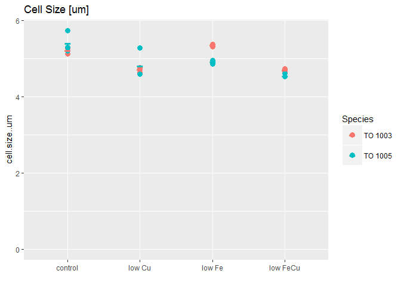 


Now we start with a linear model testing for all main effects and interactions possible:


```r
lm_all_cell.size <- lm(data = mydata, cell.size..um ~ (Species * Fe.level * Cu.level))
summary(lm_all_cell.size) # we need to look at the actual anova to know where we need to look further
```

```
## 
## Call:
## lm(formula = cell.size..um ~ (Species * Fe.level * Cu.level), 
##     data = mydata)
## 
## Residuals:
##      Min       1Q   Median       3Q      Max 
## -0.23000 -0.06083  0.01167  0.04167  0.46000 
## 
## Coefficients:
##                                        Estimate Std. Error t value
## (Intercept)                             5.22333    0.10383  50.307
## SpeciesTO 1005                          0.19333    0.14684   1.317
## Fe.levellow                             0.13333    0.14684   0.908
## Cu.levellow                            -0.50000    0.14684  -3.405
## SpeciesTO 1005:Fe.levellow             -0.62667    0.20766  -3.018
## SpeciesTO 1005:Cu.levellow             -0.09667    0.20766  -0.466
## Fe.levellow:Cu.levellow                -0.15667    0.20766  -0.754
## SpeciesTO 1005:Fe.levellow:Cu.levellow  0.38667    0.29367   1.317
##                                        Pr(>|t|)    
## (Intercept)                             < 2e-16 ***
## SpeciesTO 1005                          0.20650    
## Fe.levellow                             0.37733    
## Cu.levellow                             0.00362 ** 
## SpeciesTO 1005:Fe.levellow              0.00817 ** 
## SpeciesTO 1005:Cu.levellow              0.64784    
## Fe.levellow:Cu.levellow                 0.46154    
## SpeciesTO 1005:Fe.levellow:Cu.levellow  0.20650    
## ---
## Signif. codes:  0 '***' 0.001 '**' 0.01 '*' 0.05 '.' 0.1 ' ' 1
## 
## Residual standard error: 0.1798 on 16 degrees of freedom
## Multiple R-squared:  0.8114,	Adjusted R-squared:  0.7289 
## F-statistic: 9.836 on 7 and 16 DF,  p-value: 8.98e-05
```

```r
anova(lm_all_cell.size) 
```

```
## Analysis of Variance Table
## 
## Response: cell.size..um
##                           Df  Sum Sq Mean Sq F value    Pr(>F)    
## Species                    1 0.03082 0.03082  0.9529  0.343523    
## Fe.level                   1 0.15682 0.15682  4.8488  0.042681 *  
## Cu.level                   1 1.68540 1.68540 52.1126 2.048e-06 ***
## Species:Fe.level           1 0.28167 0.28167  8.7091  0.009389 ** 
## Species:Cu.level           1 0.01402 0.01402  0.4334  0.519689    
## Fe.level:Cu.level          1 0.00202 0.00202  0.0624  0.805989    
## Species:Fe.level:Cu.level  1 0.05607 0.05607  1.7336  0.206503    
## Residuals                 16 0.51746 0.03234                      
## ---
## Signif. codes:  0 '***' 0.001 '**' 0.01 '*' 0.05 '.' 0.1 ' ' 1
```

There seems to be no *Species : Cu.level* and no *Fe.level : Cu.level* interaction. Hence, we will take these interactions out in the next linear model:


```r
lm_cell.size <- lm (data = mydata, cell.size..um ~ (Species + Fe.level + Cu.level)^2 - Species:Cu.level - Fe.level:Cu.level)

summary(lm_cell.size) # we need to look at the actual anova to knwo where we need to look further
```

```
## 
## Call:
## lm(formula = cell.size..um ~ (Species + Fe.level + Cu.level)^2 - 
##     Species:Cu.level - Fe.level:Cu.level, data = mydata)
## 
## Residuals:
##      Min       1Q   Median       3Q      Max 
## -0.26333 -0.08958  0.00167  0.05517  0.42667 
## 
## Coefficients:
##                            Estimate Std. Error t value Pr(>|t|)    
## (Intercept)                 5.23833    0.08040  65.152  < 2e-16 ***
## SpeciesTO 1005              0.14500    0.10170   1.426  0.17017    
## Fe.levellow                 0.05500    0.10170   0.541  0.59493    
## Cu.levellow                -0.53000    0.07191  -7.370 5.54e-07 ***
## SpeciesTO 1005:Fe.levellow -0.43333    0.14383  -3.013  0.00715 ** 
## ---
## Signif. codes:  0 '***' 0.001 '**' 0.01 '*' 0.05 '.' 0.1 ' ' 1
## 
## Residual standard error: 0.1762 on 19 degrees of freedom
## Multiple R-squared:  0.7852,	Adjusted R-squared:  0.7399 
## F-statistic: 17.36 on 4 and 19 DF,  p-value: 3.822e-06
```

```r
plot.new()
plot(lm_cell.size)
```

    

```r
anova(lm_cell.size)
```

```
## Analysis of Variance Table
## 
## Response: cell.size..um
##                  Df  Sum Sq Mean Sq F value    Pr(>F)    
## Species           1 0.03082 0.03082  0.9931  0.331501    
## Fe.level          1 0.15682 0.15682  5.0538  0.036638 *  
## Cu.level          1 1.68540 1.68540 54.3157 5.544e-07 ***
## Species:Fe.level  1 0.28167 0.28167  9.0773  0.007155 ** 
## Residuals        19 0.58956 0.03103                      
## ---
## Signif. codes:  0 '***' 0.001 '**' 0.01 '*' 0.05 '.' 0.1 ' ' 1
```

### Anova Table - cell.size

Looking at the ANOVA table for the linear model that _does not_ test for interactions between Fe.level : Cu.level or Species : Fe.level, for the data __cell.Size__, we see the following significant factors:


* __Species__ alone has no significant effect
* __Fe. level__ alone has a significant effect  
* __Cu level__ alone has a significant effect (F (1, 19) = 54.32, p-val < 0.00001)
* there is  an __interaction__ between __Species and Fe level__ (F (1, 19) = 9.08, p-val = 0.007)


### Using the `phia` package to look into significant effects regarding cell.size

Again, any main effects ( here Cu. level) that are included in interacting effects will be looked at through pairwise comparisons of the interacting factors


```r
(cell.size.means <- interactionMeans(lm_cell.size))
```

```
##   Species Fe.level Cu.level adjusted mean std. error
## 1 TO 1003     high     high      5.238333 0.08040222
## 2 TO 1005     high     high      5.383333 0.08040222
## 3 TO 1003      low     high      5.293333 0.08040222
## 4 TO 1005      low     high      5.005000 0.08040222
## 5 TO 1003     high      low      4.708333 0.08040222
## 6 TO 1005     high      low      4.853333 0.08040222
## 7 TO 1003      low      low      4.763333 0.08040222
## 8 TO 1005      low      low      4.475000 0.08040222
```

```r
plot(cell.size.means)
```

 

This plot shows us the main effects (here Cu level) and first order interactions (here Species : Fe level). As per the "marginality principle" (see J. A. Nelder, "A reformulation of linear models," Journal of the Royal Statistical Society. Series A (General), vol. 140, no. 1, pp. 48{77, 1977.), those factors that are involved in interactions, should not be interpreted as single effects.


#### Pairwise Comparisons

[Back Up](#BackUP)

In order to put actual numbers for the significant differences, I will do pairwise comparisons


First: Species against Fe + Cu level

```r
testInteractions(lm_cell.size, fixed="Species", across="Fe.level")
```

```
## F Test: 
## P-value adjustment method: holm
##              Value Df Sum of Sq       F   Pr(>F)   
## TO 1003   -0.05500  1   0.00907  0.2925 0.594931   
## TO 1005    0.37833  1   0.42941 13.8386 0.002904 **
## Residuals          19   0.58956                    
## ---
## Signif. codes:  0 '***' 0.001 '**' 0.01 '*' 0.05 '.' 0.1 ' ' 1
```

This means that there is no statistical difference in the cell size in TO 1003 when comparing the integrated high Fe vs low Fe results.
Whereas, the cell size decreases in repsonse to low Fe in TO 1005 (F(1, 19) = 13.83, p-val = 0.003)


```r
testInteractions(lm_cell.size, fixed = "Fe.level", across="Species")
```

```
## F Test: 
## P-value adjustment method: holm
##              Value Df Sum of Sq      F  Pr(>F)  
## high      -0.14500  1   0.06307 2.0327 0.17017  
##  low       0.28833  1   0.24941 8.0377 0.02116 *
## Residuals          19   0.58956                 
## ---
## Signif. codes:  0 '***' 0.001 '**' 0.01 '*' 0.05 '.' 0.1 ' ' 1
```
This means that under high Fe conditions (control and low Cu), cell size stays the same in TO 1003 compared to TO 1005.

Under low Fe conditions there is significant differences in size between the two strains (F(1, 19) = 8.04, p-val = 0.02)


###Summary Cell Size

Low Cu decreases cell size significantly across the dataset (F(1,19) = 54.31, p-val = < 0.00001)

Under low Fe conditions, strains react differently. Cell size decreases significatnly in TO 1005 but not in TO 1003. Hence cell size is different under low Fe for the two strains (i.e. TO 1005 is smaller compared to TO 1003).

~~~~~~~~~~~~~~~~~~~~~~~~~~~~~~~~~~~~~~~~~~~~~~~~~~~~~~~~~~~~~~

<a id="cellvol"></a>

#### Cell Volume (fl/cell)

[Back Up](#BackUP)

First a look at the graph: 


```r
p <- ggplot (mydata , aes(Treatment, cell.volume.fl.cell))
p + geom_point(aes(group=Merged, colour=Species), size = 3)+
  labs(title="Cell volume [fl/cell]", x ="")+
  geom_point(data=mean.df , aes(Treatment, cell.volume.fl.cell, size=2, colour=Species), shape = 45, size = 9)+
  guides(alpha = "none", size = "none", shape = "none")+
  expand_limits(y=0)
```

 


Now we start with a linear model testing for all main effects and interactions possible:


```r
lm_all_cell.vol <- lm(data = mydata, cell.volume.fl.cell ~ (Species * Fe.level * Cu.level))
summary(lm_all_cell.vol) # we need to look at the actual anova to know where we need to look further
```

```
## 
## Call:
## lm(formula = cell.volume.fl.cell ~ (Species * Fe.level * Cu.level), 
##     data = mydata)
## 
## Residuals:
##     Min      1Q  Median      3Q     Max 
## -9.5433 -2.1125  0.3583  1.4750 17.5633 
## 
## Coefficients:
##                                        Estimate Std. Error t value
## (Intercept)                              74.680      4.274  17.471
## SpeciesTO 1005                            9.013      6.045   1.491
## Fe.levellow                               5.750      6.045   0.951
## Cu.levellow                             -19.520      6.045  -3.229
## SpeciesTO 1005:Fe.levellow              -26.993      8.549  -3.158
## SpeciesTO 1005:Cu.levellow               -4.637      8.549  -0.542
## Fe.levellow:Cu.levellow                  -6.517      8.549  -0.762
## SpeciesTO 1005:Fe.levellow:Cu.levellow   17.773     12.090   1.470
##                                        Pr(>|t|)    
## (Intercept)                            7.61e-12 ***
## SpeciesTO 1005                          0.15540    
## Fe.levellow                             0.35565    
## Cu.levellow                             0.00525 ** 
## SpeciesTO 1005:Fe.levellow              0.00610 ** 
## SpeciesTO 1005:Cu.levellow              0.59503    
## Fe.levellow:Cu.levellow                 0.45698    
## SpeciesTO 1005:Fe.levellow:Cu.levellow  0.16092    
## ---
## Signif. codes:  0 '***' 0.001 '**' 0.01 '*' 0.05 '.' 0.1 ' ' 1
## 
## Residual standard error: 7.403 on 16 degrees of freedom
## Multiple R-squared:  0.7995,	Adjusted R-squared:  0.7118 
## F-statistic: 9.114 on 7 and 16 DF,  p-value: 0.0001422
```

```r
anova(lm_all_cell.vol) 
```

```
## Analysis of Variance Table
## 
## Response: cell.volume.fl.cell
##                           Df  Sum Sq Mean Sq F value    Pr(>F)    
## Species                    1   33.37   33.37  0.6088  0.446623    
## Fe.level                   1  258.33  258.33  4.7131  0.045322 *  
## Cu.level                   1 2559.36 2559.36 46.6938 4.021e-06 ***
## Species:Fe.level           1  491.78  491.78  8.9721  0.008562 ** 
## Species:Cu.level           1   27.09   27.09  0.4943  0.492117    
## Fe.level:Cu.level          1    8.43    8.43  0.1537  0.700183    
## Species:Fe.level:Cu.level  1  118.46  118.46  2.1612  0.160924    
## Residuals                 16  876.99   54.81                      
## ---
## Signif. codes:  0 '***' 0.001 '**' 0.01 '*' 0.05 '.' 0.1 ' ' 1
```

There seems to be no *Species : Cu.level* and no *Fe.level : Cu.level* interaction. Hence, we will take these interactions out in the next linear model:


```r
lm_cell.vol <- lm (data = mydata, cell.volume.fl.cell ~ (Species + Fe.level + Cu.level)^2 - Species:Cu.level - Fe.level:Cu.level)

summary(lm_cell.vol) # we need to look at the actual anova to knwo where we need to look further
```

```
## 
## Call:
## lm(formula = cell.volume.fl.cell ~ (Species + Fe.level + Cu.level)^2 - 
##     Species:Cu.level - Fe.level:Cu.level, data = mydata)
## 
## Residuals:
##      Min       1Q   Median       3Q      Max 
## -10.5683  -4.1075  -0.1567   2.9317  17.0683 
## 
## Coefficients:
##                            Estimate Std. Error t value Pr(>|t|)    
## (Intercept)                  75.247      3.362  22.380 4.09e-15 ***
## SpeciesTO 1005                6.695      4.253   1.574  0.13194    
## Fe.levellow                   2.492      4.253   0.586  0.56485    
## Cu.levellow                 -20.653      3.007  -6.868 1.49e-06 ***
## SpeciesTO 1005:Fe.levellow  -18.107      6.014  -3.011  0.00719 ** 
## ---
## Signif. codes:  0 '***' 0.001 '**' 0.01 '*' 0.05 '.' 0.1 ' ' 1
## 
## Residual standard error: 7.366 on 19 degrees of freedom
## Multiple R-squared:  0.7643,	Adjusted R-squared:  0.7147 
## F-statistic:  15.4 on 4 and 19 DF,  p-value: 9.009e-06
```

```r
plot.new()
plot(lm_cell.vol)
```

    

```r
anova(lm_cell.vol)
```

```
## Analysis of Variance Table
## 
## Response: cell.volume.fl.cell
##                  Df  Sum Sq Mean Sq F value    Pr(>F)    
## Species           1   33.37   33.37  0.6150  0.442581    
## Fe.level          1  258.33  258.33  4.7609  0.041875 *  
## Cu.level          1 2559.36 2559.36 47.1674 1.494e-06 ***
## Species:Fe.level  1  491.78  491.78  9.0631  0.007192 ** 
## Residuals        19 1030.96   54.26                      
## ---
## Signif. codes:  0 '***' 0.001 '**' 0.01 '*' 0.05 '.' 0.1 ' ' 1
```

### Anova Table - cell.vol

Looking at the ANOVA table for the linear model that _does not_ test for interactions between Fe.level : Cu.level or Species : Cu.level, for the data __cell.vol__, we see the following significant factors:


* __Species__ alone has no significant effect
* __Fe. level__ alone has a significant effect  
* __Cu level__ alone has a significant effect (F (1, 19) = 47.17, p-val < 0.00001)
* there is  an __interaction__ between __Species and Fe level__ (F (1, 19) = 9.06, p-val = 0.007)


### Using the `phia` package to look into significant effects regarding cell.vol

Again, any main effects ( here Cu. level) that are included in interacting effects will be looked at through pairwise comparisons of the interacting factors


```r
(cell.vol.means <- interactionMeans(lm_cell.vol))
```

```
##   Species Fe.level Cu.level adjusted mean std. error
## 1 TO 1003     high     high      75.24667   3.362206
## 2 TO 1005     high     high      81.94167   3.362206
## 3 TO 1003      low     high      77.73833   3.362206
## 4 TO 1005      low     high      66.32667   3.362206
## 5 TO 1003     high      low      54.59333   3.362206
## 6 TO 1005     high      low      61.28833   3.362206
## 7 TO 1003      low      low      57.08500   3.362206
## 8 TO 1005      low      low      45.67333   3.362206
```

```r
plot(cell.vol.means)
```

 

This plot shows us the main effects (here Cu level) and first order interactions (here Species : Fe level). As per the "marginality principle" (see J. A. Nelder, "A reformulation of linear models," Journal of the Royal Statistical Society. Series A (General), vol. 140, no. 1, pp. 48{77, 1977.), those factors that are involved in interactions, should not be interpreted as single effects.

Integrated over high copper, cell volume is comparable for both species. The same is true for integrated low copper cell volume. However, comparing low copper to high copper treatments, there is significant difference in cell volume. Namely, cell volume decreases significantly in both species in a comparable manner. 

#### Pairwise Comparisons

[Back Up](#BackUP)

In order to put actual numbers for the significant differences, I will do pairwise comparisons


First: Species against Fe + Cu level

```r
testInteractions(lm_cell.vol, fixed="Species", across="Fe.level")
```

```
## F Test: 
## P-value adjustment method: holm
##             Value Df Sum of Sq       F   Pr(>F)   
## TO 1003   -2.4917  1     18.63  0.3433 0.564854   
## TO 1005   15.6150  1    731.48 13.4808 0.003243 **
## Residuals         19   1030.96                    
## ---
## Signif. codes:  0 '***' 0.001 '**' 0.01 '*' 0.05 '.' 0.1 ' ' 1
```

This means that there is no statistical difference in the cell vol in TO 1003 when comparing the integrated high Fe vs low Fe results 
Whereas, the cell size decreases in repsonse to low Fe in TO 1005 (F(1, 19) = 13.48, p-val = 0.003)


```r
testInteractions(lm_cell.vol, fixed = "Fe.level", across="Species")
```

```
## F Test: 
## P-value adjustment method: holm
##            Value Df Sum of Sq      F  Pr(>F)  
## high      -6.695  1    134.47 2.4782 0.13194  
##  low      11.412  1    390.68 7.1999 0.02942 *
## Residuals        19   1030.96                 
## ---
## Signif. codes:  0 '***' 0.001 '**' 0.01 '*' 0.05 '.' 0.1 ' ' 1
```
This means that under high Fe conditions (control and low Cu), cell size stays the same in TO 1003 compared to TO 1005.

Under low Fe conditions there is significant differences in size between the two strains (F(1, 19) = 8.04, p-val = 0.02)


###Summary Cell Size

Low Cu decreases cell size significantly across the dataset (F(1,19) = 47.17, p-val = < 0.00001)

Under low Fe conditions, strains react differently. Cell size decreases significatnly in TO 1005 but not in TO 1003. Hence cell size is different under low Fe for the two strains (i.e. TO 1005 is smaller compared to TO 1003).

~~~~~~~~~~~~~~~~~~~~~~~~~~~~~~~~


<a id="FeDFB.cell"></a>

#### FeDFB uptake per cell

[Back Up](#BackUP)

First a look at the graph: 


```r
p <- ggplot (mydata , aes(Treatment, FeDFB.zmol.cell.1.h.))
p + geom_point(aes(group=Merged, colour=Species), size = 3)+
  labs(title="Fe DFB uptake [zmol/cell * h]", x ="")+
  geom_point(data=mean.df , aes(Treatment, FeDFB.zmol.cell.1.h., size=2, colour=Species), shape = 45, size = 9)+
  guides(alpha = "none", size = "none", shape = "none")+
  expand_limits(y=0)
```

```
## Warning: Removed 2 rows containing missing values (geom_point).
```

 

Now we start with a linear model testing for all main effects and interactions possible:


```r
lm_all_FeDFB.cell <- lm(data = mydata, FeDFB.zmol.cell.1.h. ~ (Species * Fe.level * Cu.level))
summary(lm_all_FeDFB.cell) # we need to look at the actual anova to know where we need to look further
```

```
## 
## Call:
## lm(formula = FeDFB.zmol.cell.1.h. ~ (Species * Fe.level * Cu.level), 
##     data = mydata)
## 
## Residuals:
##     Min      1Q  Median      3Q     Max 
## -338.71  -66.96    6.42   37.42  338.71 
## 
## Coefficients:
##                                        Estimate Std. Error t value
## (Intercept)                               364.5      107.6   3.387
## SpeciesTO 1005                            237.0      152.2   1.557
## Fe.levellow                              -258.7      152.2  -1.700
## Cu.levellow                              -292.6      152.2  -1.923
## SpeciesTO 1005:Fe.levellow                736.8      228.3   3.228
## SpeciesTO 1005:Cu.levellow               -119.5      228.3  -0.524
## Fe.levellow:Cu.levellow                   925.4      215.2   4.300
## SpeciesTO 1005:Fe.levellow:Cu.levellow   -564.9      322.8  -1.750
##                                        Pr(>|t|)    
## (Intercept)                            0.004422 ** 
## SpeciesTO 1005                         0.141676    
## Fe.levellow                            0.111302    
## Cu.levellow                            0.075087 .  
## SpeciesTO 1005:Fe.levellow             0.006077 ** 
## SpeciesTO 1005:Cu.levellow             0.608743    
## Fe.levellow:Cu.levellow                0.000734 ***
## SpeciesTO 1005:Fe.levellow:Cu.levellow 0.102047    
## ---
## Signif. codes:  0 '***' 0.001 '**' 0.01 '*' 0.05 '.' 0.1 ' ' 1
## 
## Residual standard error: 186.4 on 14 degrees of freedom
##   (2 observations deleted due to missingness)
## Multiple R-squared:  0.8593,	Adjusted R-squared:  0.789 
## F-statistic: 12.22 on 7 and 14 DF,  p-value: 5.316e-05
```

```r
anova(lm_all_FeDFB.cell) 
```

```
## Analysis of Variance Table
## 
## Response: FeDFB.zmol.cell.1.h.
##                           Df Sum Sq Mean Sq F value    Pr(>F)    
## Species                    1 973576  973576 28.0229 0.0001135 ***
## Fe.level                   1 834369  834369 24.0161 0.0002340 ***
## Cu.level                   1    773     773  0.0222 0.8835713    
## Species:Fe.level           1 226626  226626  6.5231 0.0229373 *  
## Species:Cu.level           1 215436  215436  6.2010 0.0259540 *  
## Fe.level:Cu.level          1 613895  613895 17.6701 0.0008844 ***
## Species:Fe.level:Cu.level  1 106361  106361  3.0614 0.1020473    
## Residuals                 14 486389   34742                      
## ---
## Signif. codes:  0 '***' 0.001 '**' 0.01 '*' 0.05 '.' 0.1 ' ' 1
```

There seems to be *Species : Fe.level* and  *Species : Cu.level* and *Fe.level : Cu.level* interaction. Hence, we will leave all these interactions in:


```r
lm_FeDFB.cell <- lm (data = mydata, FeDFB.zmol.cell.1.h. ~ (Species * Fe.level * Cu.level))

summary(lm_FeDFB.cell) # we need to look at the actual anova to knwo where we need to look further
```

```
## 
## Call:
## lm(formula = FeDFB.zmol.cell.1.h. ~ (Species * Fe.level * Cu.level), 
##     data = mydata)
## 
## Residuals:
##     Min      1Q  Median      3Q     Max 
## -338.71  -66.96    6.42   37.42  338.71 
## 
## Coefficients:
##                                        Estimate Std. Error t value
## (Intercept)                               364.5      107.6   3.387
## SpeciesTO 1005                            237.0      152.2   1.557
## Fe.levellow                              -258.7      152.2  -1.700
## Cu.levellow                              -292.6      152.2  -1.923
## SpeciesTO 1005:Fe.levellow                736.8      228.3   3.228
## SpeciesTO 1005:Cu.levellow               -119.5      228.3  -0.524
## Fe.levellow:Cu.levellow                   925.4      215.2   4.300
## SpeciesTO 1005:Fe.levellow:Cu.levellow   -564.9      322.8  -1.750
##                                        Pr(>|t|)    
## (Intercept)                            0.004422 ** 
## SpeciesTO 1005                         0.141676    
## Fe.levellow                            0.111302    
## Cu.levellow                            0.075087 .  
## SpeciesTO 1005:Fe.levellow             0.006077 ** 
## SpeciesTO 1005:Cu.levellow             0.608743    
## Fe.levellow:Cu.levellow                0.000734 ***
## SpeciesTO 1005:Fe.levellow:Cu.levellow 0.102047    
## ---
## Signif. codes:  0 '***' 0.001 '**' 0.01 '*' 0.05 '.' 0.1 ' ' 1
## 
## Residual standard error: 186.4 on 14 degrees of freedom
##   (2 observations deleted due to missingness)
## Multiple R-squared:  0.8593,	Adjusted R-squared:  0.789 
## F-statistic: 12.22 on 7 and 14 DF,  p-value: 5.316e-05
```

```r
plot.new()
plot(lm_FeDFB.cell)
```

 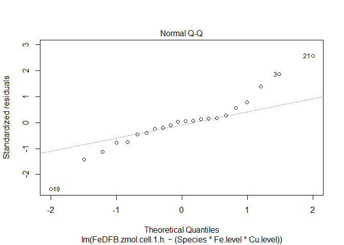  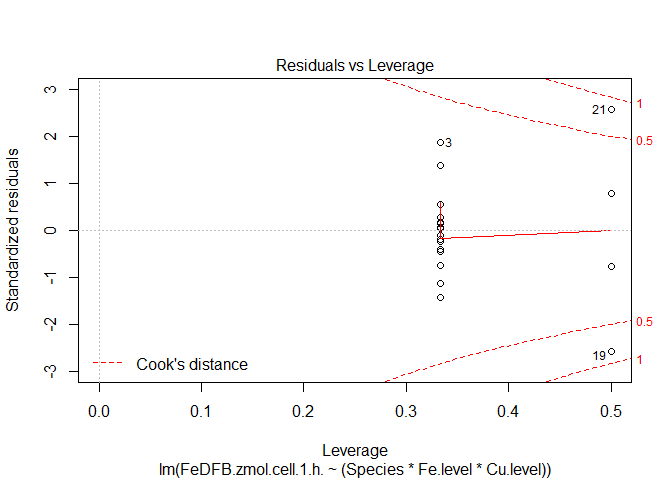 

```r
anova(lm_FeDFB.cell)
```

```
## Analysis of Variance Table
## 
## Response: FeDFB.zmol.cell.1.h.
##                           Df Sum Sq Mean Sq F value    Pr(>F)    
## Species                    1 973576  973576 28.0229 0.0001135 ***
## Fe.level                   1 834369  834369 24.0161 0.0002340 ***
## Cu.level                   1    773     773  0.0222 0.8835713    
## Species:Fe.level           1 226626  226626  6.5231 0.0229373 *  
## Species:Cu.level           1 215436  215436  6.2010 0.0259540 *  
## Fe.level:Cu.level          1 613895  613895 17.6701 0.0008844 ***
## Species:Fe.level:Cu.level  1 106361  106361  3.0614 0.1020473    
## Residuals                 14 486389   34742                      
## ---
## Signif. codes:  0 '***' 0.001 '**' 0.01 '*' 0.05 '.' 0.1 ' ' 1
```

### Anova Table - FeDFB.cell

Looking at the ANOVA table for the linear model that tests for all interactionsfor the data __FeDFB.cell__, we see the following significant factors:


* __Species__ alone has a significant effect
* __Fe. level__ alone has a significant effect  
* __Cu level__ alone has no significant effect 
* there is  an __interaction__ between __Species and Fe level__ (F (1, 14) = 6.52, p-val = 0.02)
* there is  an __interaction__ between __Species and Cu level__ (F (1, 14) = 6.20, p-val = 0.03)
* there is  an __interaction__ between __Fe level and Cu level__ (F (1, 14) = 17.67, p-val < 0.001)


### Using the `phia` package to look into significant effects regarding FeDFB.cell

Again, any main effects ( here Cu. level) that are included in interacting effects will be looked at through pairwise comparisons of the interacting factors


```r
(FeDFB.cell.means <- interactionMeans(lm_FeDFB.cell))
```

```
##   Species Fe.level Cu.level adjusted mean std. error
## 1 TO 1003     high     high      364.5300   107.6136
## 2 TO 1005     high     high      601.5567   107.6136
## 3 TO 1003      low     high      105.8667   107.6136
## 4 TO 1005      low     high     1079.7133   131.7993
## 5 TO 1003     high      low       71.9000   107.6136
## 6 TO 1005     high      low      189.3966   131.7993
## 7 TO 1003      low      low      738.6333   107.6136
## 8 TO 1005      low      low     1028.0767   107.6136
```

```r
plot(FeDFB.cell.means)
```

 

This plot shows us the main effects (here none) and first order interactions (e.g. Fe level : Cu level). As per the "marginality principle" (see J. A. Nelder, "A reformulation of linear models," Journal of the Royal Statistical Society. Series A (General), vol. 140, no. 1, pp. 48{77, 1977.), those factors that are involved in interactions, should not be interpreted as single effects.

Integrated over high copper, Fe DFB uptake per cell is significantly higher in TO1005 than To 1003. The same is true for integrated low copper FeDFB uptake per cell. However, comparing low copper to high copper treatments, in TO 1005, FeDFB uptake decreases where FeDFB uptake increases in TO 1003.

#### Pairwise Comparisons

[Back Up](#BackUP)

In order to put actual numbers for the significant differences, I will do pairwise comparisons


*First:  Fe and Cu level*

```r
testInteractions(lm_FeDFB.cell, fixed="Cu.level", across="Fe.level")
```

```
## F Test: 
## P-value adjustment method: holm
##             Value Df Sum of Sq       F  Pr(>F)    
## high      -109.75  1     32118  0.9245  0.3526    
##  low      -752.71  1   1510846 43.4875 2.4e-05 ***
## Residuals         14    486389                    
## ---
## Signif. codes:  0 '***' 0.001 '**' 0.01 '*' 0.05 '.' 0.1 ' ' 1
```

This means that there is no statistical difference in the FeDFB uptake per cell when we compare the control vs low Fe treatment (integrating over both strains). 

However,  there is significant higher FeDFB uptake per cell in lowFeCu treatment compared to low Cu. This is true in both strains. (F(1,14) = 43.48, p-val <0.000001).


```r
testInteractions(lm_FeDFB.cell, fixed = "Fe.level", across="Cu.level")
```

```
## F Test: 
## P-value adjustment method: holm
##             Value Df Sum of Sq      F  Pr(>F)  
## high       352.40  1    331153 9.5317 0.01606 *
##  low      -290.57  1    225141 6.4804 0.02331 *
## Residuals         14    486389                 
## ---
## Signif. codes:  0 '***' 0.001 '**' 0.01 '*' 0.05 '.' 0.1 ' ' 1
```

This means that there is slightly significant decrease in FeDFB uptake per cell from control to low Cu treatment in both strains (F(1,14) = 9.45, p-val = 0.02).  

When adding the Cu-co-limitation (i.e. comparing FeCu-colimitation) to Fe limitation, Fe DFB uptake is slightly significantly increased in both strains (F(1,14) = 6.48, p-val = 0.02) (Again, integrated for both strains)

*Second:  Species and Fe. level*

```r
testInteractions(lm_FeDFB.cell, fixed="Species", across="Fe.level")
```

```
## F Test: 
## P-value adjustment method: holm
##             Value Df Sum of Sq       F    Pr(>F)    
## TO 1003   -204.04  1    124891  3.5948 0.0787918 .  
## TO 1005   -658.42  1   1040435 29.9474 0.0001644 ***
## Residuals         14    486389                      
## ---
## Signif. codes:  0 '***' 0.001 '**' 0.01 '*' 0.05 '.' 0.1 ' ' 1
```

Comparing high Fe to low iron shows a statistical increase in Fe DFB uptake per cell in TO 1005 only (F(1,14) = 29.94, p=val < 0.001). Even though TO 1003 is trending to increase FeDFB uptake as well, this is not statistically significant (F (1,4) = 3.60, p-val = 0.08)


```r
testInteractions(lm_FeDFB.cell, fixed = "Fe.level", across="Species")
```

```
## F Test: 
## P-value adjustment method: holm
##             Value Df Sum of Sq       F    Pr(>F)    
## high      -177.26  1     83791  2.4118 0.1427320    
##  low      -631.64  1   1063934 30.6238 0.0001473 ***
## Residuals         14    486389                      
## ---
## Signif. codes:  0 '***' 0.001 '**' 0.01 '*' 0.05 '.' 0.1 ' ' 1
```

Under high Fe condition, both strains have similar Fe DFB uptake per cell. However, under low Fe condition, they have significantly different Fe DFB uptake. Namely, TO 1005 has increase FeDFB uptake both under low Fe and low FeCu condition (F (1,14) = 30.62, p-val < 0.001). 

*Third:  Species and Cu. level*

```r
testInteractions(lm_FeDFB.cell, fixed="Species", across="Cu.level")
```

```
## F Test: 
## P-value adjustment method: holm
##             Value Df Sum of Sq      F Pr(>F)
## TO 1003   -170.07  1     86770 2.4975 0.1489
## TO 1005    231.90  1    129064 3.7149 0.1489
## Residuals         14    486389
```

Comparing the combined high Cu (control and low Fe) to the combined low Cu treatments (low Cu and low FeCu), neither strain showsshows a significant difference in FeDFB uptake.


```r
testInteractions(lm_FeDFB.cell, fixed = "Cu.level", across="Species")
```

```
## F Test: 
## P-value adjustment method: holm
##             Value Df Sum of Sq       F    Pr(>F)    
## high      -605.44  1    977476 28.1352 0.0002226 ***
##  low      -203.47  1    110400  3.1777 0.0963396 .  
## Residuals         14    486389                      
## ---
## Signif. codes:  0 '***' 0.001 '**' 0.01 '*' 0.05 '.' 0.1 ' ' 1
```

Under high Cu conditions, the two strains have statistically very different FeDFB uptake rates (F(1,14) = 28.14, p-val = 0.0002).They are just somewhat differnet under low Cu treatments (F(1,14) = 3.18, p-val = 0.096)

###Summary Fe DFB uptake per Cell

__low Cu__ decreases FeDFB uptake per cell in both strains compared to the control treatment (F(1,14) = 9.45, p-val = 0.02.


However,  there is significant higher FeDFB uptake per cell in lowFeCu treatment compared to low Cu. This is true in both strains. (F(1,14) = 43.48, p-val <0.000001).

 

When adding the Cu-co-limitation (i.e. comparing FeCu-colimitation) to Fe limitation, Fe DFB uptake is slightly significantly increased in both strains (F(1,14) = 6.48, p-val = 0.02) (Again, integrated for both strains)

Comparing high Fe to low iron shows a statistical increase in Fe DFB uptake per cell in TO 1005 only (F(1,14) = 29.94, p=val < 0.001). Even though TO 1003 is trending to increase FeDFB uptake as well, this is not statistically significant (F (1,4) = 3.60, p-val = 0.08)

Under high Fe condition, both strains have similar Fe DFB uptake per cell. However, under low Fe condition, they have significantly different Fe DFB uptake. Namely, TO 1005 has increase FeDFB uptake both under low Fe and low FeCu condition (F (1,14) = 30.62, p-val < 0.001). 

Comparing the combined high Cu (control and low Fe) to the combined low Cu treatments (low Cu and low FeCu), neither strain showsshows a significant difference in FeDFB uptake.

Under high Cu conditions, the two strains have statistically very different FeDFB uptake rates (F(1,14) = 28.14, p-val = 0.0002).They are just somewhat differnet under low Cu treatments (F(1,14) = 3.18, p-val = 0.096)

~~~~~~~~~~~~~~~~~~~~~~~~~~~~~~~~
<a id="FeDFB.cellvol"></a>

#### FeDFB per Cell Surface Area

[Back Up](#BackUP)

First a look at the graph: 


```r
p <- ggplot (mydata , aes(Treatment, FeDFB.zmol.um.2.h.))
p + geom_point(aes(group=Merged, colour=Species), size = 3)+
  labs(title="Fe DFB uptake [zmol/um^2 * h]", x ="")+
  geom_point(data=mean.df , aes(Treatment, FeDFB.zmol.um.2.h., size=2, colour=Species), shape = 45, size = 9)+
  guides(alpha = "none", size = "none", shape = "none")+
  expand_limits(y=0)
```

```
## Warning: Removed 2 rows containing missing values (geom_point).
```

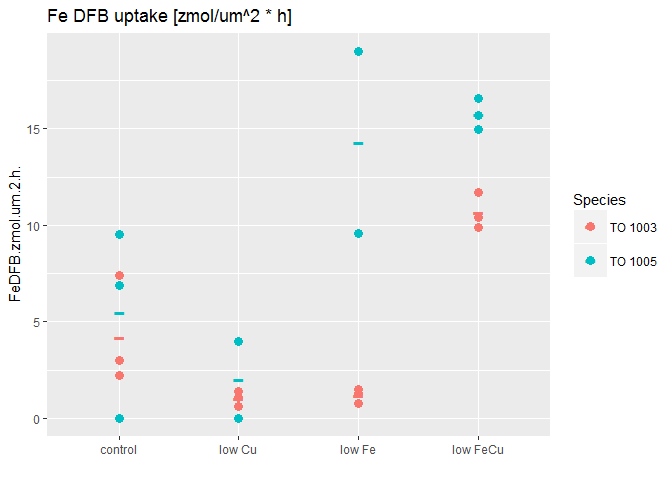 

OK, this looks really widely distributed!
Now we start with a linear model testing for all main effects and interactions possible:


```r
lm_all_FeDFB.cellvol <- lm(data = mydata, FeDFB.zmol.um.2.h. ~ (Species * Fe.level * Cu.level))
summary(lm_all_FeDFB.cellvol) # we need to look at the actual anova to know where we need to look further
```

```
## 
## Call:
## lm(formula = FeDFB.zmol.um.2.h. ~ (Species * Fe.level * Cu.level), 
##     data = mydata)
## 
## Residuals:
##     Min      1Q  Median      3Q     Max 
## -5.4567 -0.7692 -0.0017  0.9850  4.7118 
## 
## Coefficients:
##                                        Estimate Std. Error t value
## (Intercept)                              4.2000     1.6895   2.486
## SpeciesTO 1005                           1.2667     2.3892   0.530
## Fe.levellow                             -3.0000     2.3892  -1.256
## Cu.levellow                             -3.1667     2.3892  -1.325
## SpeciesTO 1005:Fe.levellow              11.8351     3.5839   3.302
## SpeciesTO 1005:Cu.levellow              -0.2885     3.5839  -0.080
## Fe.levellow:Cu.levellow                 12.6333     3.3789   3.739
## SpeciesTO 1005:Fe.levellow:Cu.levellow  -7.7200     5.0684  -1.523
##                                        Pr(>|t|)   
## (Intercept)                             0.02616 * 
## SpeciesTO 1005                          0.60431   
## Fe.levellow                             0.22980   
## Cu.levellow                             0.20627   
## SpeciesTO 1005:Fe.levellow              0.00524 **
## SpeciesTO 1005:Cu.levellow              0.93699   
## Fe.levellow:Cu.levellow                 0.00220 **
## SpeciesTO 1005:Fe.levellow:Cu.levellow  0.14998   
## ---
## Signif. codes:  0 '***' 0.001 '**' 0.01 '*' 0.05 '.' 0.1 ' ' 1
## 
## Residual standard error: 2.926 on 14 degrees of freedom
##   (2 observations deleted due to missingness)
## Multiple R-squared:  0.847,	Adjusted R-squared:  0.7704 
## F-statistic: 11.07 on 7 and 14 DF,  p-value: 9.297e-05
```

```r
anova(lm_all_FeDFB.cellvol) 
```

```
## Analysis of Variance Table
## 
## Response: FeDFB.zmol.um.2.h.
##                           Df  Sum Sq Mean Sq F value    Pr(>F)    
## Species                    1 156.453 156.453 18.2714 0.0007707 ***
## Fe.level                   1 258.146 258.146 30.1476 7.955e-05 ***
## Cu.level                   1  15.431  15.431  1.8021 0.2008259    
## Species:Fe.level           1  76.225  76.225  8.9019 0.0098668 ** 
## Species:Cu.level           1  22.946  22.946  2.6798 0.1239029    
## Fe.level:Cu.level          1 114.320 114.320 13.3508 0.0026048 ** 
## Species:Fe.level:Cu.level  1  19.866  19.866  2.3200 0.1499813    
## Residuals                 14 119.878   8.563                      
## ---
## Signif. codes:  0 '***' 0.001 '**' 0.01 '*' 0.05 '.' 0.1 ' ' 1
```

There seems to be no *Species : Cu.level* interaction. Hence, we will take this interaction out in the next linear model:


```r
lm_FeDFB.cellvol <- lm (data = mydata, FeDFB.zmol.um.2.h. ~ (Species + Fe.level + Cu.level)^2 - Species:Cu.level)

summary(lm_FeDFB.cellvol) # we need to look at the actual anova to knwo where we need to look further
```

```
## 
## Call:
## lm(formula = FeDFB.zmol.um.2.h. ~ (Species + Fe.level + Cu.level)^2 - 
##     Species:Cu.level, data = mydata)
## 
## Residuals:
##     Min      1Q  Median      3Q     Max 
## -5.3926 -1.9941 -0.6544  1.5016  7.3813 
## 
## Coefficients:
##                            Estimate Std. Error t value Pr(>|t|)   
## (Intercept)                   4.264      1.624   2.626  0.01833 * 
## SpeciesTO 1005                1.138      1.941   0.587  0.56563   
## Fe.levellow                  -1.284      2.296  -0.559  0.58364   
## Cu.levellow                  -3.295      1.941  -1.698  0.10890   
## SpeciesTO 1005:Fe.levellow    7.514      2.744   2.738  0.01459 * 
## Fe.levellow:Cu.levellow       9.202      2.744   3.353  0.00404 **
## ---
## Signif. codes:  0 '***' 0.001 '**' 0.01 '*' 0.05 '.' 0.1 ' ' 1
## 
## Residual standard error: 3.189 on 16 degrees of freedom
##   (2 observations deleted due to missingness)
## Multiple R-squared:  0.7923,	Adjusted R-squared:  0.7274 
## F-statistic: 12.21 on 5 and 16 DF,  p-value: 5.394e-05
```

```r
plot.new()
plot(lm_FeDFB.cellvol)
```

    

```r
anova(lm_FeDFB.cellvol)
```

```
## Analysis of Variance Table
## 
## Response: FeDFB.zmol.um.2.h.
##                   Df  Sum Sq Mean Sq F value    Pr(>F)    
## Species            1 156.453 156.453 15.3866 0.0012146 ** 
## Fe.level           1 258.146 258.146 25.3876 0.0001211 ***
## Cu.level           1  15.431  15.431  1.5175 0.2357891    
## Species:Fe.level   1  76.225  76.225  7.4964 0.0145905 *  
## Fe.level:Cu.level  1 114.320 114.320 11.2429 0.0040413 ** 
## Residuals         16 162.691  10.168                      
## ---
## Signif. codes:  0 '***' 0.001 '**' 0.01 '*' 0.05 '.' 0.1 ' ' 1
```

### Anova Table - FeDFB.cell Surface

Looking at the ANOVA table for the linear model that _does not_ test for interactions between Species : Cu.level for the data __FeDFB.cell surface__, we see the following significant factors:


* __Species__ alone has a significant effect 
* __Fe. level__ alone has a significant effect  
* __Cu level__ alone has no significant effect 
* there is  an __interaction__ between __Fe level and Cu level__ (F (1, 16) = 11.24, p-val = 0.004)
* there is  an __interaction__ between __Species and Fe level__ (F (1, 16) = 7.50, p-val = 0.014)


### Using the `phia` package to look into significant effects regarding FeDFB.cellvol

Again, any main effects ( here Cu. level) that are included in interacting effects will be looked at through pairwise comparisons of the interacting factors


```r
(FeDFB.cellvol.means <- interactionMeans(lm_FeDFB.cellvol))
```

```
##   Species Fe.level Cu.level adjusted mean std. error
## 1 TO 1003     high     high     4.2641052   1.623635
## 2 TO 1005     high     high     5.4025615   1.623635
## 3 TO 1003      low     high     2.9796533   1.623635
## 4 TO 1005      low     high    11.6322932   1.841029
## 5 TO 1003     high      low     0.9692282   1.623635
## 6 TO 1005     high      low     2.1076845   1.841029
## 7 TO 1003      low      low     8.8870134   1.623635
## 8 TO 1005      low      low    17.5396533   1.623635
```

```r
plot(FeDFB.cellvol.means)
```

 

This plot shows us the main effects (here Species in relation to Cu level) and first order interactions (here Fe level : Cu level, and species: Fe level). As per the "marginality principle" (see J. A. Nelder, "A reformulation of linear models," Journal of the Royal Statistical Society. Series A (General), vol. 140, no. 1, pp. 48{77, 1977.), those factors that are involved in interactions, should not be interpreted as single effects.


#### Pairwise Comparisons

[Back Up](#BackUP)

In order to put actual numbers for the significant differences, I will do pairwise comparisons


```r
testInteractions(lm_FeDFB.cellvol, fixed="Cu.level", across="Fe.level")
```

```
## F Test: 
## P-value adjustment method: holm
##              Value Df Sum of Sq       F    Pr(>F)    
## high       -2.4726  1     16.51  1.6235    0.2208    
##  low      -11.6749  1    368.02 36.1931 3.594e-05 ***
## Residuals          16    162.69                      
## ---
## Signif. codes:  0 '***' 0.001 '**' 0.01 '*' 0.05 '.' 0.1 ' ' 1
```

### From here I need to proceed!!!!!
This means that there is no statistical difference in the FeDFB uptake per cell surface when we compare the control vs low Fe treatment (integrating over both strains). 

However,  there is significant higher FeDFB uptake per cell in lowFeCu treatment compared to low Cu. This is true in both strains. (F(1,16) = 36.19, p-val <0.0001).


```r
testInteractions(lm_FeDFB.cellvol, fixed = "Fe.level", across="Cu.level")
```

```
## F Test: 
## P-value adjustment method: holm
##             Value Df Sum of Sq      F  Pr(>F)  
## high       3.2949  1    29.312 2.8827 0.10890  
##  low      -5.9074  1    94.222 9.2663 0.01547 *
## Residuals         16   162.691                 
## ---
## Signif. codes:  0 '***' 0.001 '**' 0.01 '*' 0.05 '.' 0.1 ' ' 1
```

This means that there is no significant change in FeDFB uptake per cell from control to low Cu treatment (integrated over both strains) (F(1,16) = 2.88, p-val = 0.11). 

However, when we compare low Fe to low FeCu treatment, there is a significant decrease in FeDFB uptake per cell surface integrated over both strains (F(1,16) = 9.27, p-val = 0.02). When we look at the graph, we see that this is mainly due to the large effect of lowFeCu in strain TO 1003!

*Second: Species and Fe.level*


```r
testInteractions(lm_FeDFB.cellvol, fixed="Species", across="Fe.level")
```

```
## F Test: 
## P-value adjustment method: holm
##              Value Df Sum of Sq       F    Pr(>F)    
## TO 1003    -3.3167  1    33.001  3.2455 0.0904930 .  
## TO 1005   -10.8309  1   287.936 28.3174 0.0001377 ***
## Residuals          16   162.691                      
## ---
## Signif. codes:  0 '***' 0.001 '**' 0.01 '*' 0.05 '.' 0.1 ' ' 1
```

TO 1003 has no statistical difference between the integrated high Fe vs integrated low Fe treatments. This is mainly due to the same FeDFB per cell surface rate in low Cu and low Fe. 

In TO 1005, integrated high Fe vs low Fe shows that ther is significantly higher FeDFB uptake per cell surface in lowFe treatments (F(1,16) = 28.32, p-val = 0.0001).


```r
testInteractions(lm_FeDFB.cellvol, fixed = "Fe.level", across="Species")
```

```
## F Test: 
## P-value adjustment method: holm
##             Value Df Sum of Sq       F    Pr(>F)    
## high      -1.1385  1     3.499  0.3442 0.5656266    
##  low      -8.6526  1   202.144 19.8801 0.0007919 ***
## Residuals         16   162.691                      
## ---
## Signif. codes:  0 '***' 0.001 '**' 0.01 '*' 0.05 '.' 0.1 ' ' 1
```

This means that there is no significant difference between the two strains under high Fe in FeDFB uptake per cell surface (F(1,16, .344, p-val = 0.57). 

Under low Fe conditions there is a striking difference between TO 1005 and To 1003 (F(1,16) = 19.88, p-val < 0.001). When we look at the graph, we see that TO 1005 has almost the same high feDFB uptake per cell surface under low Fe as it has under low FeCu. TO 1003 has lower FeDFB uptake under low Fe than under its control treatment. But even under lowFeCu, it has still lower FeDFB uptake than TO 1005.

###Summary Fe DFB uptake per Cell


~~~~~~~~~~~~~~~~~~~~~~~~~~~~~~~~
<a id="14C.alpha.cell"></a>

#### 14C Uptake per Cell - alpha

[Back Up](#BackUP)

First a look at the graph: 


```r
p <- ggplot (mydata , aes(Treatment, X14C.per.Cell.Vol.alpha))
p + geom_point(aes(group=Merged, colour=Species), size = 3, alpha=0.5)+
  labs(title="14C uptake per cell vol - alpha", x ="")+
  geom_point(data=mean.df , aes(Treatment, X14C.per.Cell.Vol.alpha, size=2, colour=Species), shape = 45, size = 9)+
  guides(alpha = "none", size = "none", shape = "none")+
  expand_limits(y=0)
```

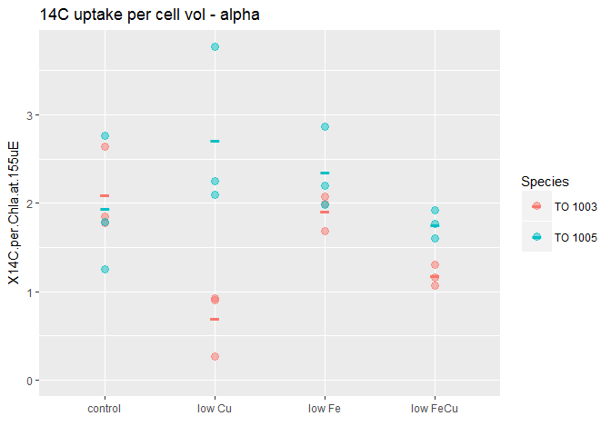 

I double checked the raw data: Yes, some points look almost the same, but they are not!

Now we start with a linear model testing for all main effects and interactions possible:


```r
lm_all_14C.alpha.cell <- lm(data = mydata, X14C.per.Cell.Vol.alpha ~ (Species * Fe.level * Cu.level))
summary(lm_all_14C.alpha.cell) # we need to look at the actual anova to know where we need to look further
```

```
## 
## Call:
## lm(formula = X14C.per.Cell.Vol.alpha ~ (Species * Fe.level * 
##     Cu.level), data = mydata)
## 
## Residuals:
##       Min        1Q    Median        3Q       Max 
## -0.056667 -0.011667 -0.001667  0.006667  0.083333 
## 
## Coefficients:
##                                         Estimate Std. Error t value
## (Intercept)                             0.076667   0.019685   3.895
## SpeciesTO 1005                         -0.030000   0.027839  -1.078
## Fe.levellow                            -0.006667   0.027839  -0.239
## Cu.levellow                            -0.060000   0.027839  -2.155
## SpeciesTO 1005:Fe.levellow             -0.010000   0.039370  -0.254
## SpeciesTO 1005:Cu.levellow              0.130000   0.039370   3.302
## Fe.levellow:Cu.levellow                 0.003333   0.039370   0.085
## SpeciesTO 1005:Fe.levellow:Cu.levellow -0.080000   0.055678  -1.437
##                                        Pr(>|t|)   
## (Intercept)                             0.00129 **
## SpeciesTO 1005                          0.29718   
## Fe.levellow                             0.81378   
## Cu.levellow                             0.04672 * 
## SpeciesTO 1005:Fe.levellow              0.80273   
## SpeciesTO 1005:Cu.levellow              0.00450 **
## Fe.levellow:Cu.levellow                 0.93358   
## SpeciesTO 1005:Fe.levellow:Cu.levellow  0.17003   
## ---
## Signif. codes:  0 '***' 0.001 '**' 0.01 '*' 0.05 '.' 0.1 ' ' 1
## 
## Residual standard error: 0.0341 on 16 degrees of freedom
## Multiple R-squared:  0.5955,	Adjusted R-squared:  0.4185 
## F-statistic: 3.365 on 7 and 16 DF,  p-value: 0.02105
```

```r
anova(lm_all_14C.alpha.cell) 
```

```
## Analysis of Variance Table
## 
## Response: X14C.per.Cell.Vol.alpha
##                           Df    Sum Sq   Mean Sq F value   Pr(>F)   
## Species                    1 0.0006000 0.0006000  0.5161 0.482858   
## Fe.level                   1 0.0054000 0.0054000  4.6452 0.046716 * 
## Cu.level                   1 0.0010667 0.0010667  0.9176 0.352367   
## Species:Fe.level           1 0.0037500 0.0037500  3.2258 0.091392 . 
## Species:Cu.level           1 0.0121500 0.0121500 10.4516 0.005205 **
## Fe.level:Cu.level          1 0.0020167 0.0020167  1.7348 0.206356   
## Species:Fe.level:Cu.level  1 0.0024000 0.0024000  2.0645 0.170030   
## Residuals                 16 0.0186000 0.0011625                    
## ---
## Signif. codes:  0 '***' 0.001 '**' 0.01 '*' 0.05 '.' 0.1 ' ' 1
```

There seems to be no *Fe.level : Cu.level* interaction. Hence, we will take this interaction out in the next linear model:
(Note: I leave it in)

```r
lm_14C.alpha.cell <- lm (data = mydata, X14C.per.Cell.Vol.alpha ~ (Species * Fe.level * Cu.level))

summary(lm_14C.alpha.cell) # we need to look at the actual anova to knwo where we need to look further
```

```
## 
## Call:
## lm(formula = X14C.per.Cell.Vol.alpha ~ (Species * Fe.level * 
##     Cu.level), data = mydata)
## 
## Residuals:
##       Min        1Q    Median        3Q       Max 
## -0.056667 -0.011667 -0.001667  0.006667  0.083333 
## 
## Coefficients:
##                                         Estimate Std. Error t value
## (Intercept)                             0.076667   0.019685   3.895
## SpeciesTO 1005                         -0.030000   0.027839  -1.078
## Fe.levellow                            -0.006667   0.027839  -0.239
## Cu.levellow                            -0.060000   0.027839  -2.155
## SpeciesTO 1005:Fe.levellow             -0.010000   0.039370  -0.254
## SpeciesTO 1005:Cu.levellow              0.130000   0.039370   3.302
## Fe.levellow:Cu.levellow                 0.003333   0.039370   0.085
## SpeciesTO 1005:Fe.levellow:Cu.levellow -0.080000   0.055678  -1.437
##                                        Pr(>|t|)   
## (Intercept)                             0.00129 **
## SpeciesTO 1005                          0.29718   
## Fe.levellow                             0.81378   
## Cu.levellow                             0.04672 * 
## SpeciesTO 1005:Fe.levellow              0.80273   
## SpeciesTO 1005:Cu.levellow              0.00450 **
## Fe.levellow:Cu.levellow                 0.93358   
## SpeciesTO 1005:Fe.levellow:Cu.levellow  0.17003   
## ---
## Signif. codes:  0 '***' 0.001 '**' 0.01 '*' 0.05 '.' 0.1 ' ' 1
## 
## Residual standard error: 0.0341 on 16 degrees of freedom
## Multiple R-squared:  0.5955,	Adjusted R-squared:  0.4185 
## F-statistic: 3.365 on 7 and 16 DF,  p-value: 0.02105
```

```r
plot.new()
plot(lm_14C.alpha.cell)
```

   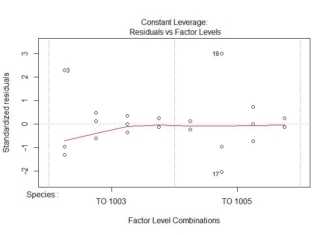 

```r
anova(lm_14C.alpha.cell)
```

```
## Analysis of Variance Table
## 
## Response: X14C.per.Cell.Vol.alpha
##                           Df    Sum Sq   Mean Sq F value   Pr(>F)   
## Species                    1 0.0006000 0.0006000  0.5161 0.482858   
## Fe.level                   1 0.0054000 0.0054000  4.6452 0.046716 * 
## Cu.level                   1 0.0010667 0.0010667  0.9176 0.352367   
## Species:Fe.level           1 0.0037500 0.0037500  3.2258 0.091392 . 
## Species:Cu.level           1 0.0121500 0.0121500 10.4516 0.005205 **
## Fe.level:Cu.level          1 0.0020167 0.0020167  1.7348 0.206356   
## Species:Fe.level:Cu.level  1 0.0024000 0.0024000  2.0645 0.170030   
## Residuals                 16 0.0186000 0.0011625                    
## ---
## Signif. codes:  0 '***' 0.001 '**' 0.01 '*' 0.05 '.' 0.1 ' ' 1
```

### Anova Table - 14C Uptake per Cell - alpha

Looking at the ANOVA table for the linear model that tests for all interactions for the data __14C.alpha.cell__, we see the following significant factors:


* __Species__ alone has no significant effect 
* __Fe. level__ alone has a slightly significant effect  (F (1, 16) = 4.65, p-val = 0.047)
* __Cu level__ alone has no significant effect 
* there is  an __trend towards an interaction__ between __Species and Fe level__ (F (1, 16) = 3.23, p-val = 0.09)
* there is  an __interaction__ between __Species and Cu level__ (F (1, 16) = 7.50, p-val = 0.014)


### Using the `phia` package to look into significant effects regarding 14C.alpha.cell

Again, any main effects ( here Cu. level) that are included in interacting effects will be looked at through pairwise comparisons of the interacting factors


```r
(C14.alpha.cell.means <- interactionMeans(lm_14C.alpha.cell))
```

```
##   Species Fe.level Cu.level adjusted mean std. error
## 1 TO 1003     high     high    0.07666667 0.01968502
## 2 TO 1005     high     high    0.04666667 0.01968502
## 3 TO 1003      low     high    0.07000000 0.01968502
## 4 TO 1005      low     high    0.03000000 0.01968502
## 5 TO 1003     high      low    0.01666667 0.01968502
## 6 TO 1005     high      low    0.11666667 0.01968502
## 7 TO 1003      low      low    0.01333333 0.01968502
## 8 TO 1005      low      low    0.02333333 0.01968502
```

```r
plot(C14.alpha.cell.means)
```

 

This plot shows us the main effects (here Fe level) and first order interactions (here Species : Cu level). As per the "marginality principle" (see J. A. Nelder, "A reformulation of linear models," Journal of the Royal Statistical Society. Series A (General), vol. 140, no. 1, pp. 48{77, 1977.), those factors that are involved in interactions, should not be interpreted as single effects.


#### Pairwise Comparisons

[Back Up](#BackUP)

In order to put actual numbers for the significant differences, I will do pairwise comparisons

*First: Species and Cu. level*

```r
testInteractions(lm_14C.alpha.cell, fixed="Species", across="Cu.level")
```

```
## F Test: 
## P-value adjustment method: holm
##               Value Df Sum of Sq      F  Pr(>F)  
## TO 1003    0.058333  1 0.0102083 8.7814 0.01831 *
## TO 1005   -0.031667  1 0.0030083 2.5878 0.12724  
## Residuals           16 0.0186000                 
## ---
## Signif. codes:  0 '***' 0.001 '**' 0.01 '*' 0.05 '.' 0.1 ' ' 1
```

_alpha_ in the PE curve of 14C uptake per cell vol _decreases_ significantly in _TO 1003_ in response to _low Cu_  (F(1,16) = 8.78, p-val = 0.02). The same can not be said for TO 1005. This is probably mainly due to the increase in alpha in repsonse to low Cu and the decrease in alpha in responde to lowFeCu treatment in this strain.


```r
testInteractions(lm_14C.alpha.cell, fixed = "Cu.level", across="Species")
```

```
## F Test: 
## P-value adjustment method: holm
##            Value Df Sum of Sq      F  Pr(>F)  
## high       0.035  1  0.003675 3.1613 0.09441 .
##  low      -0.055  1  0.009075 7.8065 0.02600 *
## Residuals        16  0.018600                 
## ---
## Signif. codes:  0 '***' 0.001 '**' 0.01 '*' 0.05 '.' 0.1 ' ' 1
```

Integrated over the high Cu treatment, the two species have somehwat similat alpha values (F(1,16) = 3.16, p-val = 0.09). 

HOwever, integrating over the low Cu treatments, the two species do have significantly different responses in their alpha value (F(1,16) = 7.81, p-val = 0.03). When we look at the graph, we see that this is mainly due to the large difference int he low Cu treatment between the strains.

*Second: Species and Fe.level*


```r
testInteractions(lm_14C.alpha.cell, fixed="Species", across="Fe.level")
```

```
## F Test: 
## P-value adjustment method: holm
##           Value Df Sum of Sq      F Pr(>F)  
## TO 1003   0.005  1  0.000075 0.0645 0.8027  
## TO 1005   0.055  1  0.009075 7.8065 0.0260 *
## Residuals       16  0.018600                
## ---
## Signif. codes:  0 '***' 0.001 '**' 0.01 '*' 0.05 '.' 0.1 ' ' 1
```

Here it is the other way around: _TO 1003_ has no significant differences in its alpha response (of the PE curve 14c uptake per cell vol) when integrating its high Fe vs low Fe treatments (F(1,16) = 0.07), p-val = 0.80). 

_TO 1005_ on the other hand does show a decrease in its initial slope alpha of its PE curve (F(1,16) = 7.81, p-val = 0.03)


```r
testInteractions(lm_14C.alpha.cell, fixed = "Fe.level", across="Species")
```

```
## F Test: 
## P-value adjustment method: holm
##            Value Df Sum of Sq      F Pr(>F)
## high      -0.035  1  0.003675 3.1613 0.1888
##  low       0.015  1  0.000675 0.5806 0.4571
## Residuals        16  0.018600
```

When we compare either the integrated high Fe or the integrated low Fe values of alpha of the two strains, no significant difference betweent he two strains can be seen.

###Summary 14C per cell vol - alpha


<a id="14C.alpha.chla"></a>

#### 14C Uptake per Chl a - alpha

<a id="14C.alpha.cell"></a>

#### 14C Uptake per Chl a - alpha

<a id="14C.ek.chla"></a>

#### 14C Uptake per Chl a - ek

<a id="AOX"></a>

#### AOX - Alternative Oxidase

<a id="O2.Chla"></a>

#### Gross Productivity per Chla (mol O2 * mol Chl a^-1 * h^-1)

<a id="O2.Cell"></a>

#### Gross Productivity per Cell (mol O2 * cell ^-1 * h^-1)

<a id="O2.Cell.vol"></a>

#### Gross Productivity per Cell Volume (mol O2 * cell vol ^-1 * h^-1)


<a id="NotUsed"></a>

# Not Used

[Back Up](#BackUP)

### Tukey - HSD Method (as per * [Tutorial on posthoc-tests](http://rtutorialseries.blogspot.ca/2011/03/r-tutorial-series-anova-pairwise.html))

<a id="Tukey01"></a

[Back Up](#BackUP)

The Tukey Honest Significant Difference (HSD) method controls for the Type I error rate across multiple comparisons and is generally considered an acceptable technique. This method can be executed using the `TukeyHSD(x)` function, where `x` is a linear model object created using the `aov(formula, data)` function. Note that in this application, the aov(formula, data) function is identical to the lm(formula, data) that we are already familiar with from linear regression.


```r
TukeyHSD(aov(z)) #aov() has a different notation than anova() but gives same results as anova()
```

```
##   Tukey multiple comparisons of means
##     95% family-wise confidence level
## 
## Fit: aov(formula = z)
## 
## $Species
##                      diff        lwr      upr     p adj
## TO 1005-TO 1003 0.1591667 0.06207836 0.256255 0.0028934
## 
## $Fe.level
##             diff        lwr        upr    p adj
## low-high -0.2775 -0.3745883 -0.1804117 1.12e-05
## 
## $Cu.level
##                diff        lwr       upr p adj
## low-high -0.5758333 -0.6729216 -0.478745     0
## 
## $`Species:Fe.level`
##                                  diff        lwr         upr     p adj
## TO 1005:high-TO 1003:high  0.38000000  0.1952907  0.56470929 0.0000897
## TO 1003:low-TO 1003:high  -0.05666667 -0.2413760  0.12804262 0.8215675
## TO 1005:low-TO 1003:high  -0.11833333 -0.3030426  0.06637595 0.3006960
## TO 1003:low-TO 1005:high  -0.43666667 -0.6213760 -0.25195738 0.0000159
## TO 1005:low-TO 1005:high  -0.49833333 -0.6830426 -0.31362405 0.0000027
## TO 1005:low-TO 1003:low   -0.06166667 -0.2463760  0.12304262 0.7821240
## 
## $`Fe.level:Cu.level`
##                          diff        lwr         upr     p adj
## low:high-high:high -0.4116667 -0.5963760 -0.22695738 0.0000337
## high:low-high:high -0.7100000 -0.8947093 -0.52529071 0.0000000
## low:low-high:high  -0.8533333 -1.0380426 -0.66862405 0.0000000
## high:low-low:high  -0.2983333 -0.4830426 -0.11362405 0.0012533
## low:low-low:high   -0.4416667 -0.6263760 -0.25695738 0.0000137
## low:low-high:low   -0.1433333 -0.3280426  0.04137595 0.1628934
```

```r
plot.new()
plot(TukeyHSD(aov(z)))
```

     
### What if I look at Fe levels just for TO 1003 and then just with the data for TO 1005?

<a id="lm_TO03"></a>

[Back Up](#BackUP)

For this, I will first subset my original data into TO 1003 and TO 1005, respectively. THen I will make and linear model using `lm()` followed by `anova()` on that lm object

#### Let's start with TO 1003


```r
TO03_mydata <- mydata %>% 
  filter(Species == "TO 1003")

lm_TO03 <- lm(data=mydata, Growthrate.dd.1~(Fe.level*Cu.level))
plot(lm_TO03) ##these plots are diagnostic and will give indications if the assumptions are met
```

    

```r
anova(lm_TO03)
```

```
## Analysis of Variance Table
## 
## Response: Growthrate.dd.1
##                   Df  Sum Sq Mean Sq F value    Pr(>F)    
## Fe.level           1 0.46204 0.46204 13.6849  0.001419 ** 
## Cu.level           1 1.98950 1.98950 58.9264 2.193e-07 ***
## Fe.level:Cu.level  1 0.10800 0.10800  3.1989  0.088846 .  
## Residuals         20 0.67525 0.03376                      
## ---
## Signif. codes:  0 '***' 0.001 '**' 0.01 '*' 0.05 '.' 0.1 ' ' 1
```

The anova table suggests that for __TO 1003__ there is a significant effect is seen for:

* Fe. level (F(1,20) = 13.68, p.val = 0.0014)
* Cu. level (F(1,20) = 58.93, p.val < 0.00001)

and that there is __NO__ interacting effect for Fe:Cu.level for TO 1003


```r
#Using `phia`
(lm_TO03.means <- interactionMeans(lm_TO03))
```

```
##   Fe.level Cu.level adjusted mean std. error
## 1     high     high     1.6683333 0.07501389
## 2      low     high     1.2566667 0.07501389
## 3     high      low     0.9583333 0.07501389
## 4      low      low     0.8150000 0.07501389
```

```r
plot(lm_TO03.means)
```

 

Even though the `anova()` did not suggest an interaction... looking at the plots, it almost seems like there could be interactions


```r
#testInteractions(lm_TO03.means, fixed="Cu.level", across="Fe.level")
```
OK, I guess this doesn;t work. Maybe it checks if there is an interaction measured?!

But twhat does the pairwise comparison say?


~~~~~
__AND NOW ...__ we need to use `lsmeans()` to do pairwise comparisons an pinpoint which exact comparisons are the significant ones....


```r
lsmeans(z_all, pairwise, ~ Fe.level | Cu.level : Species)
```


Doesn;t work, I get an error message "The model is not linear mixed effects model


```r
z <- lm(data=mydata, Growthrate.dd.1~(Species+Fe.level+Cu.level)^2-Species:Cu.level) #this will model the Growth rate dependend on
#three main effects (Species, Fe.level, Cu.level) and will include 
#possible interactions between Species:Fe.level, Fe.level:Cu.level 
#but NOT Species:Cu.level as we took that one out!

summary(z)
```

```
## 
## Call:
## lm(formula = Growthrate.dd.1 ~ (Species + Fe.level + Cu.level)^2 - 
##     Species:Cu.level, data = mydata)
## 
## Residuals:
##       Min        1Q    Median        3Q       Max 
## -0.178333 -0.072708  0.002083  0.060833  0.171667 
## 
## Coefficients:
##                            Estimate Std. Error t value Pr(>|t|)    
## (Intercept)                 1.47833    0.05660  26.120 9.20e-16 ***
## SpeciesTO 1005              0.38000    0.06535   5.814 1.65e-05 ***
## Fe.levellow                -0.19083    0.08004  -2.384  0.02833 *  
## Cu.levellow                -0.71000    0.06535 -10.864 2.46e-09 ***
## SpeciesTO 1005:Fe.levellow -0.44167    0.09242  -4.779  0.00015 ***
## Fe.levellow:Cu.levellow     0.26833    0.09242   2.903  0.00948 ** 
## ---
## Signif. codes:  0 '***' 0.001 '**' 0.01 '*' 0.05 '.' 0.1 ' ' 1
## 
## Residual standard error: 0.1132 on 18 degrees of freedom
## Multiple R-squared:  0.9287,	Adjusted R-squared:  0.9089 
## F-statistic: 46.89 on 5 and 18 DF,  p-value: 1.064e-09
```


The following is from [Dolph Schluter's help pages](https://www.zoology.ubc.ca/~schluter/R/fit-model/)

###Fit multiple factors

When two or more categorical factors are fitted, the possibility of an interaction might also be evaluated. Remember that the order in which you enter the variables in the formula affects the ANOVA results, if the design is unbalanced. By default, R fits the variables sequentially ("type I sum of squares"), while at the same time respecting hierarchy. Each variable or interaction is tested by adding it to a model that includes only previous terms in the sequence, but not variables entered later. Hierarchy means that the main effects are fitted before the interactions, which are fitted last. No interaction term is tested without its main effects included in the model.

In the case of two factors, A and B, the linear model is as follows.

```r
z <- lm(y ~ A + B, data = mydata) # no interaction term is present, or
z <- lm(y ~ A * B, data = mydata) # interaction term is included
summary(z)                        # coefficients table
confint(z, level = 0.95)          # confidence intervals for parameters
anova(z)                          # A is tested before B; interaction tested last
```

It is possible to carry out marginal fitting of terms instead ("type III sum of squares"). In this case, order of appearance of terms in the model doesn't matter, and neither does hierarchy. Each model term is tested as if it were entered last into the model. To accomplish this we need to refit the model and override R's default contrasts. Then we use the `drop1` command in place of `anova` to get the ANOVA table.


```r
z <- lm(y ~ A * B, contrasts = c("contr.sum", "contr.poly"), 
    data = mydata)
drop1(z, .~., test = "F")
```

Or, we can use the `Anova` command (NOTE the capital "A" in beginning of `Anova()`) in the `car` package to give us the ANOVA table based on marginal fitting of terms ("type III sum of squares"). We again need to refit the model using different contrasts from R's default.


```r
z <- lm(y ~ A * B, contrasts = c("contr.sum", "contr.poly"), 
    data = mydata)
library(car)
Anova(z, type = 3)
```

Use the visreg package to visualize model fit. Try several options to see which method is most effective. If only one factor is plotted, R plots the fit to the data for each group or level, while conditioning on the value of the other variable (adjusted to the most common category for other factor). **This makes sense only when an interaction term is not fitted**. If both factors are plotted, the fit is shown for every combination of groups (levels). In the latter case, you can choose to overlay the fits or plot in separate panels.


```r
library(visreg)
visreg(z, xvar = "B", whitespace = 0.4, 
    points.par = list(cex = 1.1, col = "red"))
visreg(z, xvar = "A", by = "B", whitespace = 0.4, 
    points.par = list(cex = 1.1, col = "red"))
visreg(z, xvar = "A", by = "B", whitespace = 0.5, overlay = TRUE, 
    band = FALSE, points.par = list(cex = 1.1))
```

```r
summary(cars)
```

```
##      speed           dist       
##  Min.   : 4.0   Min.   :  2.00  
##  1st Qu.:12.0   1st Qu.: 26.00  
##  Median :15.0   Median : 36.00  
##  Mean   :15.4   Mean   : 42.98  
##  3rd Qu.:19.0   3rd Qu.: 56.00  
##  Max.   :25.0   Max.   :120.00
```


### Resources

* [Tutorial on linear regression](http://rtutorialseries.blogspot.ca/2009/11/r-tutorial-series-simple-linear.html)
* [Tutorial on multiple linear regression](http://rtutorialseries.blogspot.ca/2009/12/r-tutorial-series-multiple-linear.html)
* [Tutorial on posthoc-tests](http://rtutorialseries.blogspot.ca/2011/03/r-tutorial-series-anova-pairwise.html)

