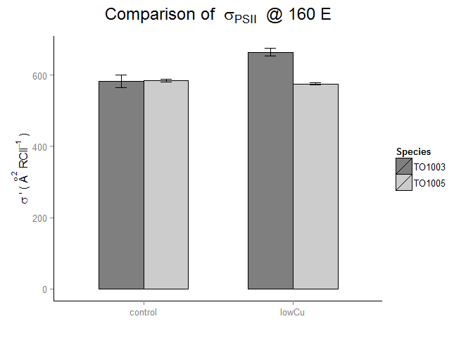

# Stats_Physiology_FRRF
Anna A. Hippmann  
July, 2017  


##Libraries used

```r
suppressPackageStartupMessages(library(lsmeans))
suppressPackageStartupMessages(library(phia))
suppressPackageStartupMessages(library(visreg))
```

```
## Warning: package 'visreg' was built under R version 3.2.3
```

```r
suppressPackageStartupMessages(library(dplyr))
library(tidyr)
library(ggplot2)
library(knitr)
```

## Functions used

```r
# Multiple plot function
#
# ggplot objects can be passed in ..., or to plotlist (as a list of ggplot objects)
# - cols:   Number of columns in layout
# - layout: A matrix specifying the layout. If present, 'cols' is ignored.
#
# If the layout is something like matrix(c(1,2,3,3), nrow=2, byrow=TRUE),
# then plot 1 will go in the upper left, 2 will go in the upper right, and
# 3 will go all the way across the bottom.
#
multiplot <- function(..., plotlist=NULL, file, cols=1, layout=NULL) {
  require(grid)

  # Make a list from the ... arguments and plotlist
  plots <- c(list(...), plotlist)

  numPlots = length(plots)

  # If layout is NULL, then use 'cols' to determine layout
  if (is.null(layout)) {
    # Make the panel
    # ncol: Number of columns of plots
    # nrow: Number of rows needed, calculated from # of cols
    layout <- matrix(seq(1, cols * ceiling(numPlots/cols)),
                    ncol = cols, nrow = ceiling(numPlots/cols))
  }

 if (numPlots==1) {
    print(plots[[1]])

  } else {
    # Set up the page
    grid.newpage()
    pushViewport(viewport(layout = grid.layout(nrow(layout), ncol(layout))))

    # Make each plot, in the correct location
    for (i in 1:numPlots) {
      # Get the i,j matrix positions of the regions that contain this subplot
      matchidx <- as.data.frame(which(layout == i, arr.ind = TRUE))

      print(plots[[i]], vp = viewport(layout.pos.row = matchidx$row,
                                      layout.pos.col = matchidx$col))
    }
  }
}
```


### Overview


* Overview of [My Method](#MyMethod) to Analyze my Physiological Data
  + [Sigma'](#Sigma')
  + [ETR @ 155](#ETR_155)
  + [ETR @ 160](#ETR_160)
  + [](#)
  + [](#)
  + [](#)
  + [](#)
  + [](#)
  + [](#)
  + [](#)
  + [](#)
  + [14C uptake - alpha (per cell)](#14C.alpha.cell)
  + [14C uptake - alpha (per Chl a)](#14C.alpha.chla)
  + [14C uptake - ek (per Chl a)](#14C.ek.chla)
  + [14C uptake - at 155 uEinstein (per Chla)](#14C.@155.chla)
  + [AOX - Alternative Oxidase (percent)](#AOX)
  + [Gross Production per Chl a (mol O2 / mol Chla * h)](#O2.Chla)
  + [Gross Production per cell (mol O2 / cell * h)](#O2.Cell)
  + [Gross Production per cell vol (mol O2 / cell vol * h)](#O2.Cell.vol)
  


As per my experimental set up, I should have **3 fixed effects**:

1) Species _(as I choose these 2 strains on purpose to test for differences between them)_

2) Fe-level

3) Cu-level

Nina did all the long curves for all my cultures BUT not for any of my TO 1003 low Fe cultures! on the one hand side: FOrtunatley I have data for my control and lowCu for both species. Ont he other hand unfortunately, I cannot (statistically) test for all three fixed effects, as Fe.level is not complete for both species high and low Fe

Hence, for the statistical analysis, I have to use only my control and lowCu treatemtns for both my cultures.

For this I will need to use 

1) the **function `lm()` = linear model**. 
2) then use `anova()` on the `lm object`
3) then use `lsmeans()` on the `lm object` _(to do all the different pairwise comparisons to my heart's desire)_

Let's start by loading in my data and having a look at it:


```r
#I used the original "ALL_PhysiologicalData_2015_04.txt" and added columns "Treatment" and "Merged" to it, then saved the ensuing file under "ALL_PhysiologicalData_2015_04_withMerged_Variable.txt", so I can use it for all my plots

mydata <- read.delim("Input_Data/FRRF/Compiled_ALL_Raw_R_2016_07_FRRF.txt", sep="\t", header=T)
mydata <- mydata %>% 
  unite(Trtmt_comb, Species, Treatment, sep = " ", remove = FALSE) %>% 
  mutate (Treatment_number = c(1,1,1,2,2,2,3,3,3,4,4,4, 1,1,1,2,2,2,3,3,3,4,4,4))

mydata_stat <- mydata %>% 
  filter(Treatment_number < 3) #this will leave me with only control and lowCu data

str(mydata)
```

```
## 'data.frame':	24 obs. of  42 variables:
##  $ Trtmt_comb                : chr  "TO1003 control" "TO1003 control" "TO1003 control" "TO1003 lowCu" ...
##  $ Species                   : Factor w/ 2 levels "TO1003","TO1005": 1 1 1 1 1 1 1 1 1 1 ...
##  $ Treatment                 : Factor w/ 4 levels "control","lowCu",..: 1 1 1 2 2 2 3 3 3 4 ...
##  $ Replicate                 : Factor w/ 4 levels "A","B","C","D": 1 2 3 1 2 3 1 2 3 1 ...
##  $ Fe.level                  : Factor w/ 2 levels "high","low": 1 1 1 1 1 1 2 2 2 2 ...
##  $ Cu.level                  : Factor w/ 2 levels "high","low": 1 1 1 2 2 2 1 1 1 2 ...
##  $ E                         : int  160 160 160 160 160 160 NA NA NA 160 ...
##  $ sig.                      : num  610 548 591 685 659 ...
##  $ F.m                       : num  338 467 801 121 383 ...
##  $ F.                        : num  193 288 407 101 317 ...
##  $ F.q                       : num  144.3 179.2 394.3 19.8 65.8 ...
##  $ sig                       : num  590 578 603 786 763 ...
##  $ Fm                        : num  317 472 794 123 385 ...
##  $ F0                        : num  131.2 186.9 290.4 89.4 273.3 ...
##  $ Fv.Fm                     : num  0.587 0.604 0.634 0.274 0.291 ...
##  $ F0.F.m                    : num  0.389 0.4 0.363 0.739 0.715 ...
##  $ F.0                       : num  134.5 186.1 291.3 88.2 271.9 ...
##  $ F.v                       : num  203.1 281 509.6 32.7 110.6 ...
##  $ F.q.F.v                   : num  0.71 0.638 0.774 0.607 0.594 ...
##  $ F.v.F.m                   : num  0.602 0.602 0.636 0.27 0.289 ...
##  $ F.q.F.m                   : num  0.427 0.384 0.492 0.164 0.172 ...
##  $ ETR                       : num  417 337 441 401 377 ...
##  $ ETR_mod                   : num  417 337 441 401 377 ...
##  $ ETR_noLL                  : num  417 337 441 401 377 ...
##  $ NPQ.nsv.                  : num  0.662 0.662 0.572 2.697 2.457 ...
##  $ NPQ                       : num  -0.06363 0.01028 -0.00874 0.01825 0.00753 ...
##  $ ETR.alpha.JP              : num  3.47 3.31 3.7 4.25 3.91 ...
##  $ ETR.ek.JP                 : num  156 116 150 107 113 ...
##  $ ETR.pmax.JP               : num  542 384 555 456 442 ...
##  $ ETR.150.JP                : num  403 330 423 404 384 ...
##  $ ETR_155_calc              : num  411 334 430 408 389 ...
##  $ ETR_160_calc              : num  418 338 437 412 393 ...
##  $ ETR_160_measure           : num  417 337 441 401 377 ...
##  $ Diff_ETR_160              : num  0.785 1.378 -3.369 11.571 15.364 ...
##  $ percent                   : num  0.00188 0.00408 -0.00767 0.02847 0.03989 ...
##  $ Diff_ETR_160.155          : num  7.2 3.86 7.2 4.07 4.28 ...
##  $ X14C.per.Chla.alpha       : num  0.01852 0.01336 0.01351 0.00216 0.00733 ...
##  $ X14C.per.Chla.ek          : num  297 216 242 177 170 ...
##  $ X14C.per.Chla.Pmax        : num  5.5 2.892 3.276 0.383 1.247 ...
##  $ X14C.per.Chla.at.155uE    : num  2.64 1.78 1.85 0.27 0.9 ...
##  $ ETR_div_14C.per.Chla_at155: num  156 188 233 1513 432 ...
##  $ Treatment_number          : num  1 1 1 2 2 2 3 3 3 4 ...
```


### Example how to make mean / std error table.... in long format..  

```r
mydata.mean.stderr <- mydata %>%  
  group_by(Trtmt_comb) %>% 
    summarize(mean.sig. = mean(sig., na.rm = T),
            mean.F.q.F.v  = mean( F.q.F.v, na.rm = T), #= (Fm' - F') / (Fm' - Fo'), aka fraction of functional RCII open = Qa oxidized => photochemical quenching of variable fluorescence
            mean.F.v.F.m  = mean(F.v.F.m , na.rm = T), # = (Fm' - Fo') / Fm', aka maximum quantum yield @ certain light level ; can be used to quntify extend to which photochemistry in PSII is limited by NPQ
            mean.F.q.F.m  = mean(F.q.F.m, na.rm = T ), #= (Fm' - F') / Fm', aka, = fPSII'  => overall quantum efficiency of photochemical of photochemical energy conversion on PSII at a given light intensity
            mean.ETR.160  = mean(ETR, na.rm = T ), #ETR measured at 160 u Einstin
            mean.NPQ.nsv.  = mean(NPQ.nsv., na.rm = T ), #mean NPQ as per normalized Stein Vollmer equation
            mean.ETR.alpha.JP  = mean(ETR.alpha.JP, na.rm = T ),
            mean.ETR.ek.JP  = mean(ETR.ek.JP, na.rm = T ),
            mean.ETR.pmax.JP  = mean(ETR.pmax.JP, na.rm = T ),
            mean.ETR_155_calc = mean(ETR_155_calc, na.rm = T),
            mean.ETR_div_14C.per.Chla_at155 = mean(ETR_div_14C.per.Chla_at155, na.rm = T), #aka conversion factor
            sd.err.sig. = sd(sig., na.rm = T)/sqrt(n()),
            sd.err.F.q.F.v = sd(F.q.F.v, na.rm = T)/sqrt(n()),
            sd.err.F.v.F.m = sd(F.v.F.m, na.rm = T)/sqrt(n()),
            sd.err.F.q.F.m = sd(F.q.F.m, na.rm = T)/sqrt(n()),
            sd.err.ETR.160 = sd(ETR, na.rm = T)/sqrt(n()),
            sd.err.NPQ.nsv. = sd(NPQ.nsv., na.rm = T)/sqrt(n()),
            sd.err.ETR.alpha.JP = sd(ETR.alpha.JP, na.rm = T)/sqrt(n()),
            sd.err.ETR.ek.JP = sd(ETR.ek.JP, na.rm = T)/sqrt(n()),
            sd.err.ETR.pmax.JP = sd(ETR.pmax.JP, na.rm = T)/sqrt(n()),
            sd.err.ETR_155_calc = sd(ETR_155_calc, na.rm = T)/sqrt(n()),
            sd.err.ETR_div_14C.per.Chla_at155 = sd(ETR_div_14C.per.Chla_at155, na.rm = T)/sqrt(n()))

mydata.mean.stderr <- mydata.mean.stderr %>% 
  separate(Trtmt_comb, c("Species", "Treatment"), remove = F)


mydata.mean.stderr$Trtmt_comb <- as.factor(mydata.mean.stderr$Trtmt_comb)
mydata.mean.stderr$Species <- as.factor(mydata.mean.stderr$Species)
mydata.mean.stderr$Treatment <- as.factor(mydata.mean.stderr$Treatment)

str(mydata.mean.stderr)
```

```
## Classes 'tbl_df', 'tbl' and 'data.frame':	8 obs. of  25 variables:
##  $ Trtmt_comb                       : Factor w/ 8 levels "TO1003 control",..: 1 2 3 4 5 6 7 8
##  $ Species                          : Factor w/ 2 levels "TO1003","TO1005": 1 1 1 1 2 2 2 2
##  $ Treatment                        : Factor w/ 4 levels "control","lowCu",..: 1 2 3 4 1 2 3 4
##  $ mean.sig.                        : num  583 664 NaN 550 585 ...
##  $ mean.F.q.F.v                     : num  0.707 0.584 NaN 0.814 0.694 ...
##  $ mean.F.v.F.m                     : num  0.613 0.292 NaN 0.204 0.602 ...
##  $ mean.F.q.F.m                     : num  0.434 0.17 NaN 0.166 0.418 ...
##  $ mean.ETR.160                     : num  398 374 NaN 431 391 ...
##  $ mean.NPQ.nsv.                    : num  0.632 2.439 NaN 3.93 0.66 ...
##  $ mean.ETR.alpha.JP                : num  3.49 4.04 NaN 3.72 3.29 ...
##  $ mean.ETR.ek.JP                   : num  141 105 NaN 157 153 ...
##  $ mean.ETR.pmax.JP                 : num  494 426 NaN 585 502 ...
##  $ mean.ETR_155_calc                : num  392 382 NaN 441 385 ...
##  $ mean.ETR_div_14C.per.Chla_at155  : num  192 776 0 378 118 ...
##  $ sd.err.sig.                      : num  18.3 10.95 NaN 9.1 3.23 ...
##  $ sd.err.F.q.F.v                   : num  0.03934 0.01758 NaN 0.00775 0.01683 ...
##  $ sd.err.F.v.F.m                   : num  0.01156 0.01324 NaN 0.01133 0.00379 ...
##  $ sd.err.F.q.F.m                   : num  0.0316 0.0029 NaN 0.01 0.0128 ...
##  $ sd.err.ETR.160                   : num  31.51 16.77 NaN 8.44 7.34 ...
##  $ sd.err.NPQ.nsv.                  : num  0.0302 0.15428 NaN 0.26772 0.00816 ...
##  $ sd.err.ETR.alpha.JP              : num  0.1133 0.1069 NaN 0.0279 0.0114 ...
##  $ sd.err.ETR.ek.JP                 : num  12.48 5.07 NaN 10.3 7.65 ...
##  $ sd.err.ETR.pmax.JP               : num  55 23.8 NaN 38.1 23.5 ...
##  $ sd.err.ETR_155_calc              : num  29.31 16.99 NaN 13.69 7.55 ...
##  $ sd.err.ETR_div_14C.per.Chla_at155: num  22.2 369.1 0 32.2 61.9 ...
```

```r
#knitr::kable(mydata.mean.stderr, format= "markdown")
write.table(mydata.mean.stderr, file="Output_Data/FRRF/FRRF_physiology_Stats_TO03_TO05_mean_stderror.txt", sep="\t", row.names=F)
```


```r
# first I create my colour vectors


border_colour <- scale_colour_manual(values = c("black", "black"))

Species_colours <- structure(c('grey50', 'grey80'), Names =c("TO1003", "TO1005"))


#here is a cleanup code that gets rid of ggplots default background colours etc:
cleanup = theme (panel.grid.major = element_blank(),
                 panel.grid.minor = element_blank(),
                 panel.background = element_blank(),
                 axis.line = element_line(color = "black"))

#now my first graph:

p <- ggplot(mydata.mean.stderr, aes(x=Treatment, y=mean.sig., fill = Species)) + 
  labs(title="Comparison of sigma @ 160 E", y="sigma", x="Treatments")+
    theme(axis.text.x = element_text(angle=0))+
  theme(axis.title.y = element_text(angle=0))
    
p + geom_bar(color = "black", position=position_dodge(), stat="identity", width = .6) +
  scale_fill_manual(values = Species_colours) +
  geom_errorbar(aes(ymin = mean.sig. - sd.err.sig., ymax = mean.sig. + sd.err.sig.),
                  width = .15,                    # Width of the error bars
                  position = position_dodge(.6), #so the error bars are dodged to the side
                  colour = "black") +
  cleanup +
  theme(plot.title = element_text(size = rel(1.5), face = "bold", vjust = 2))
```

 

```r
#and one tryout with just Ctrl and lowCu


mydata.mean.stderr.lowCu <- mydata.mean.stderr %>% 
   mutate (Treatment_number = c(1:4, 1:4)) %>% 
  filter(Treatment_number < 3 )


p <- ggplot(mydata.mean.stderr.lowCu, aes(x=Treatment, y=mean.sig., fill = Species)) + 
  labs(title="Comparison of sigma @ 160 E", y="sigma", x="Treatments")+
    theme(axis.text.x = element_text(angle=0))+
  theme(axis.title.y = element_text(angle=0))
    
p + geom_bar(color = "black", position=position_dodge(), stat="identity", width = .6) +
  scale_fill_manual(values = Species_colours) +
  geom_errorbar(aes(ymin = mean.sig. - sd.err.sig., ymax = mean.sig. + sd.err.sig.),
                  width = .15,                    # Width of the error bars
                  position = position_dodge(.6), #so the error bars are dodged to the side
                  colour = "black") +
  cleanup +
  theme(plot.title = element_text(size = rel(1.5), face = "bold", vjust = 2))
```

 


```r
#possible modifications for future references...
  theme(panel.grid.major.x = element_blank(),
        panel.grid.major.y = element_line(colour = "grey50"),
        plot.title = element_text(size = rel(1.5), face = "bold", vjust = 1.5),
        axis.title = element_text(face = "bold"),
        legend.position = "top",
        legend.title = element_blank(),
        legend.key.size = unit(0.4, "cm"),
        legend.key = element_rect(fill = "black"))
```


```r
p <- ggplot (mydata , aes(Treatment, sig. ))
p + geom_point(aes(group=Trtmt_comb, colour=Species), size = 3)+
  labs(title="Sigma' @ 160", x ="")+
  geom_point(data=mydata.mean.stderr , aes(Treatment, mean.sig., size=2, colour=Species), shape = 45, size = 9)+
  guides(alpha = "none", size = "none", shape = "none")
```

```
## Warning: Removed 6 rows containing missing values (geom_point).
```

```
## Warning: Removed 1 rows containing missing values (geom_point).
```

 


<a id="Sigma'"></a>

#### z_all - linear model checking for main effects and interactions in Sigma

[Back Up](#BackUP)

I am testing now the __sigma' at 160 uEinstein__ data for control and lowCu for both strains


```r
z <- lm(data=mydata_stat, sig.~(Species*Cu.level)) #this will model the parameter dependend on the 
#two main effects (Species,  Cu.level) and will include  possible interactions
summary(z)
```

```
## 
## Call:
## lm(formula = sig. ~ (Species * Cu.level), data = mydata_stat)
## 
## Residuals:
##     Min      1Q  Median      3Q     Max 
## -34.960  -4.772   0.000   7.047  26.880 
## 
## Coefficients:
##                           Estimate Std. Error t value Pr(>|t|)    
## (Intercept)                 583.09      12.43  46.924 6.28e-09 ***
## SpeciesTO1005                 1.91      19.65   0.097  0.92572    
## Cu.levellow                  80.96      17.57   4.607  0.00367 ** 
## SpeciesTO1005:Cu.levellow   -90.35      27.79  -3.251  0.01743 *  
## ---
## Signif. codes:  0 '***' 0.001 '**' 0.01 '*' 0.05 '.' 0.1 ' ' 1
## 
## Residual standard error: 21.52 on 6 degrees of freedom
##   (2 observations deleted due to missingness)
## Multiple R-squared:  0.8383,	Adjusted R-squared:  0.7575 
## F-statistic: 10.37 on 3 and 6 DF,  p-value: 0.008666
```

To look at the actual differences, we need to look at the `anova` table:


```r
(anova <- anova(z)) #this will use the linear model and give us a table of the analysis of the variance in our dataset
```

```
## Analysis of Variance Table
## 
## Response: sig.
##                  Df Sum Sq Mean Sq F value  Pr(>F)  
## Species           1 4492.0  4492.0  9.6969 0.02074 *
## Cu.level          1 5021.5  5021.5 10.8399 0.01656 *
## Species:Cu.level  1 4897.4  4897.4 10.5720 0.01743 *
## Residuals         6 2779.4   463.2                  
## ---
## Signif. codes:  0 '***' 0.001 '**' 0.01 '*' 0.05 '.' 0.1 ' ' 1
```


Looking at the ANOVA table for the linear model that test for both main effects and interactions, we see that

* __Species__ does have a significant effect on sigma' (F (1,6) = 9.6969173, p.val = 0.0207432)
* __Cu. level__ has an effect on sigma' (F (1,6) = 10.8399101, p.val = 0.0165641)
* there is an __interaction__ between __Species and Cu LEVEL__ (F (1,6) = 10.5720324, p.val = 0.0174343)
    + i.e. depending on the Species sigma' is different under similar Fe conditions


__NOTE:__ the anova table only tells me that there are differences e.g. between the Species. IT DOES NOT TELL ME depending on what variables etc... for that we need to do pairwise comparisons.


```r
plot(z) ##these plots are diagnostic and will give indications if the assumptions are met
```

    


### What if we use the `phia` package to look into interactions or main effects?

<a id="phia_interaction"></a>

[Back Up](#BackUP)

This is basically from the tutorial / examples given in the `R` vignette by _Helios De Rosario Martinez_ ["Analysing interactions of fitted models"](https://cran.r-project.org/web/packages/phia/vignettes/phia.pdf)

[...] In factorial experiments like this one, the dependency between factor levels and the response variable is usually represented in a contingency table, where the rows and columns are related to the different levels of both treatments, and __each cell contains the adjusted mean of the response for the corresponding interaction of factors__. When there is an interaction effect, the cell means are taken as the most straightforward way of representing this effect. 

These values and their standard errors can be obtained from the model coeffients with the function `interactionMeans` in the package `phia`, using the fitted model as first (and in this case only) argument:


```r
(mydata.means <- interactionMeans(z))
```

```
##   Species Cu.level adjusted mean std. error
## 1  TO1003     high      583.0900   12.42632
## 2  TO1005     high      585.0000   15.21907
## 3  TO1003      low      664.0456   12.42632
## 4  TO1005      low      575.6100   15.21907
```

```r
plot(mydata.means)
```

 

This plot shows us main effects (such as species  = different, upper left corner; Cu.level = different, lower right corner) and first order interactions (such as Species and Cu.level). As per the "marginality principle" (see J. A. Nelder, \A reformulation of linear models," Journal of the Royal Statistical Society. Series A (General), vol. 140, no. 1, pp. 48{77, 1977.), those factors that are involved in interactions, should not be interpreted as single effects.

As we see in the upper right and lower left corner, Species and Cu really do  seem to have an interaction effect. They change in differnet way (lines are NOT parallel). When we look at lower left  cell, we see that sigma' is the same for both species under high Cu (=control), but is very different when we look at the red line, as sigma' is high unde rlow Cu for TO03 and stays the same low under low Cu for To05. The same is shown in the upper right corner

#### Pairwise Comparisons

<a id="phia_pairwise"></a>

[Back Up](#BackUP)

In order to put actual numbers for the significant differences, I will proceed with pairwise comparisons by having a fixed factor and testing how it changes dependend on another factor


```r
(testInteractions <- testInteractions(z, fixed="Species", across="Cu.level"))
```

```
## F Test: 
## P-value adjustment method: holm
##             Value Df Sum of Sq       F   Pr(>F)   
## TO1003    -80.956  1    9830.7 21.2216 0.007332 **
## TO1005      9.390  1      88.2  0.1903 0.677896   
## Residuals          6    2779.4                    
## ---
## Signif. codes:  0 '***' 0.001 '**' 0.01 '*' 0.05 '.' 0.1 ' ' 1
```


This means that the two different Cu.levels I used (high and low) do  significantly change sigma' at 160 uEinstein in TO 1003 (F(1,6) = 21.2216047, p.val = 0.0073323) but they do not change sigma' significantly in TO 1005 (F(1,6) = 0.1903377, p.val = 0.6778965))


```r
(testInteractions <- testInteractions(z, fixed="Cu.level", across="Species"))
```

```
## F Test: 
## P-value adjustment method: holm
##            Value Df Sum of Sq       F   Pr(>F)   
## high      -1.910  1       4.4  0.0095 0.925724   
##  low      88.436  1    9385.0 20.2595 0.008199 **
## Residuals         6    2779.4                    
## ---
## Signif. codes:  0 '***' 0.001 '**' 0.01 '*' 0.05 '.' 0.1 ' ' 1
```


This means that the two different strains have statistically the same sigma' at 160 uEinstein  (F(1,6) = 0.0094502, p.val = 0.9257238) but they do have significantly differnet sigma' under low Cu  (F(1,6) = 20.2594994, p.val = 0.0081986)).


__Note__: I am using "strain" and "species" interchangeably, even though the correct term would be "strain" in the current context


<a id="ETR_155"><a>

## ETR @ 155uEinstein - calculated from fitted curve

[Back Up](#BackUP)

Now I am doing it in a little slimmer version... not as much explanatory text

 


```
## 
## Call:
## lm(formula = ETR_155_calc ~ (Species * Cu.level), data = mydata_stat)
## 
## Residuals:
##     Min      1Q  Median      3Q     Max 
## -57.560  -8.140   5.534  16.707  38.367 
## 
## Coefficients:
##                           Estimate Std. Error t value Pr(>|t|)    
## (Intercept)                391.849     19.866  19.725  1.1e-06 ***
## SpeciesTO1005               -6.661     31.410  -0.212    0.839    
## Cu.levellow                 -9.546     28.094  -0.340    0.746    
## SpeciesTO1005:Cu.levellow  -10.617     44.421  -0.239    0.819    
## ---
## Signif. codes:  0 '***' 0.001 '**' 0.01 '*' 0.05 '.' 0.1 ' ' 1
## 
## Residual standard error: 34.41 on 6 degrees of freedom
##   (2 observations deleted due to missingness)
## Multiple R-squared:  0.111,	Adjusted R-squared:  -0.3335 
## F-statistic: 0.2498 on 3 and 6 DF,  p-value: 0.8589
```


```r
(anova <- anova(z)) #this will use the linear model and give us a table of the analysis of the variance in our dataset
```

```
## Analysis of Variance Table
## 
## Response: ETR_155_calc
##                  Df Sum Sq Mean Sq F value Pr(>F)
## Species           1  343.9  343.85  0.2904 0.6093
## Cu.level          1  475.6  475.63  0.4017 0.5496
## Species:Cu.level  1   67.6   67.64  0.0571 0.8190
## Residuals         6 7103.5 1183.92
```


Looking at the ANOVA table for the linear model that test for both main effects and interactions, we see that

* __Species__ does not have a significant effect on ETR @ 155uEinstein (F (1,6) = 0.2904342, p.val = 0.6093408)
* __Cu. level__ does not have a significant effect on ETR @ 155uEinstein (F (1,6) = 0.4017408, p.val = 0.5495759)
* there is no __interaction__ between __Species and Cu LEVEL__ (F (1,6) = 0.0571283, p.val = 0.8190486)


```r
plot(z) ##these plots are diagnostic and will give indications if the assumptions are met
```

    


### Using  `phia` package to look into interactions or main effects?


```r
(mydata.means <- interactionMeans(z))
```

```
##   Species Cu.level adjusted mean std. error
## 1  TO1003     high      391.8492   19.86554
## 2  TO1005     high      385.1882   24.33021
## 3  TO1003      low      382.3029   19.86554
## 4  TO1005      low      365.0247   24.33021
```

```r
plot(mydata.means)
```

 

Pretty much parrallel and error bars overlap almost completely! 

#### Pairwise Comparisons


```r
(testInteractions <- testInteractions(z, fixed="Species", across="Cu.level"))
```

```
## F Test: 
## P-value adjustment method: holm
##             Value Df Sum of Sq      F Pr(>F)
## TO1003     9.5463  1     136.7 0.1155      1
## TO1005    20.1635  1     406.6 0.3434      1
## Residuals          6    7103.5
```


This means that the two different Cu.levels I used (high and low) do NOT significantly change ETR at 155 uEinstein in TO 1003 (F(1,6) = 0.1154615, p.val = 1) and they do not change ETR at 155 uEinstein significantly in TO 1005 either (F(1,6) = 0.3434076, p.val = 1))


```r
(testInteractions <- testInteractions(z, fixed="Cu.level", across="Species"))
```

```
## F Test: 
## P-value adjustment method: holm
##            Value Df Sum of Sq      F Pr(>F)
## high       6.661  1      53.2 0.0450      1
##  low      17.278  1     358.2 0.3026      1
## Residuals         6    7103.5
```


This means that the two different strains have statistically the same ETR at 155 uEinstein  (F(1,6) = 0.0449713, p.val = 1) and they do have the same ETR at 155 uEinstein under low Cu as well (F(1,6) = 0.3025913, p.val = 1)).


<a id=""><a>

<a id=""><a>

<a id=""><a>

<a id=""><a>

<a id=""><a>

<a id=""><a>
