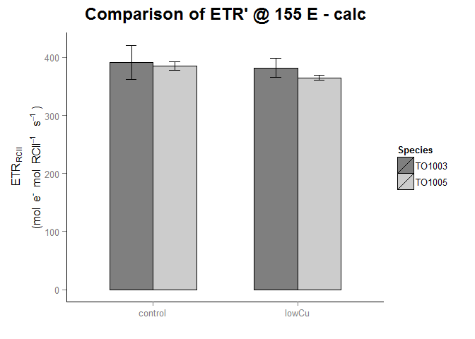
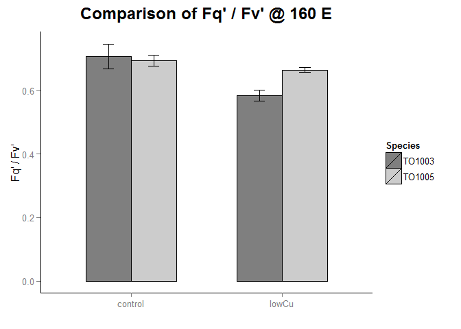
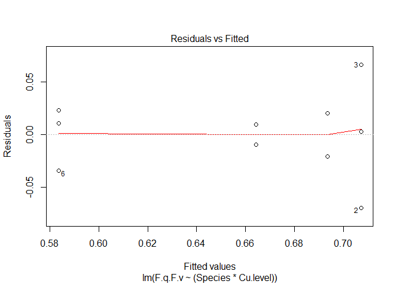
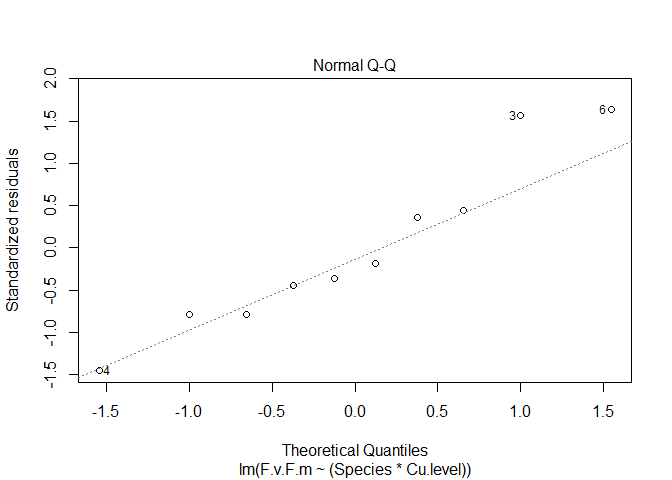
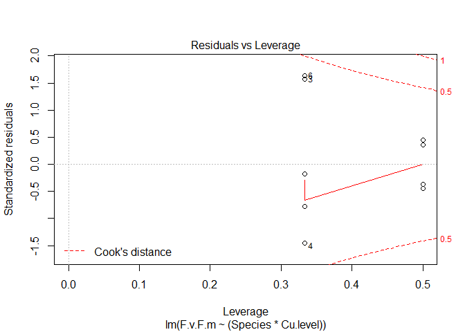
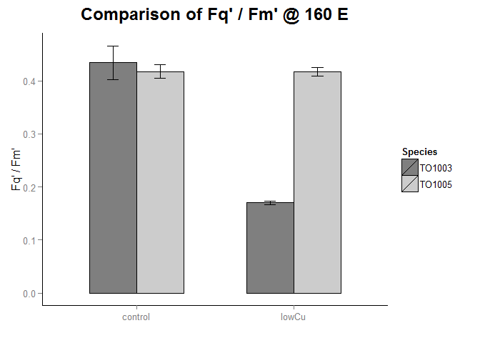
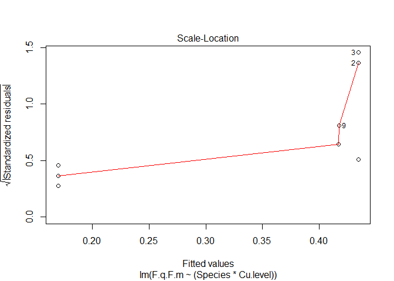
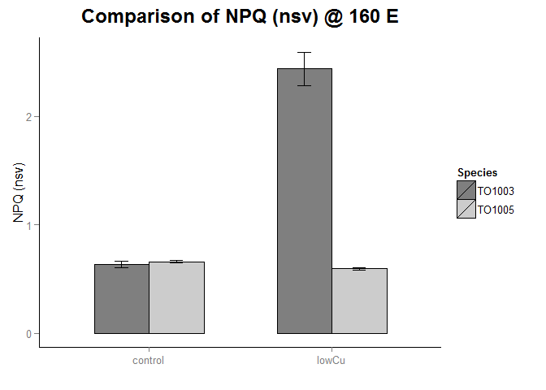

# Stats_Physiology_FRRF
Anna A. Hippmann  
July, 2017  


##Libraries used

```r
suppressPackageStartupMessages(library(lsmeans))
suppressPackageStartupMessages(library(phia))
suppressPackageStartupMessages(library(visreg))
```

```
## Warning: package 'visreg' was built under R version 3.2.5
```

```r
suppressPackageStartupMessages(library(dplyr))
library(tidyr)
library(ggplot2)
library(knitr)
```

## Functions used

```r
# Multiple plot function
#
# ggplot objects can be passed in ..., or to plotlist (as a list of ggplot objects)
# - cols:   Number of columns in layout
# - layout: A matrix specifying the layout. If present, 'cols' is ignored.
#
# If the layout is something like matrix(c(1,2,3,3), nrow=2, byrow=TRUE),
# then plot 1 will go in the upper left, 2 will go in the upper right, and
# 3 will go all the way across the bottom.
#
multiplot <- function(..., plotlist=NULL, file, cols=1, layout=NULL) {
  require(grid)

  # Make a list from the ... arguments and plotlist
  plots <- c(list(...), plotlist)

  numPlots = length(plots)

  # If layout is NULL, then use 'cols' to determine layout
  if (is.null(layout)) {
    # Make the panel
    # ncol: Number of columns of plots
    # nrow: Number of rows needed, calculated from # of cols
    layout <- matrix(seq(1, cols * ceiling(numPlots/cols)),
                    ncol = cols, nrow = ceiling(numPlots/cols))
  }

 if (numPlots==1) {
    print(plots[[1]])

  } else {
    # Set up the page
    grid.newpage()
    pushViewport(viewport(layout = grid.layout(nrow(layout), ncol(layout))))

    # Make each plot, in the correct location
    for (i in 1:numPlots) {
      # Get the i,j matrix positions of the regions that contain this subplot
      matchidx <- as.data.frame(which(layout == i, arr.ind = TRUE))

      print(plots[[i]], vp = viewport(layout.pos.row = matchidx$row,
                                      layout.pos.col = matchidx$col))
    }
  }
}
```


### Overview

<a id="BackUP"></a>


* Overview of [My Method](#MyMethod) to Analyze my Physiological Data
  + [Sigma'](#Sigma')
  + [ETR @ 155 calculated](#ETR_155)
  + [ETR @ 160 measured](#ETR_160_measure)
  + [ETR @ 160 calculated](#ETR_160_calc)
  + [Fq' / Fv' - Fraction of functional RC II open](#F.q.F.v)
  + [Fv' / Fm' - Maximum quantum yield at certain light level](#F.v.F.m)
  + [Fq' / Fm' - fPSII'  => overall quantum efficiency at certain light level](#F.q.F.m)
  + [NPQ (nsv)](#NPQ.nsv)
  + [e:C / PSII - Conversion factor ETR / 14C uptake per Chla](#Conversion)
  + [e:C / PSII - Conversion factor ETR / 14C uptake per Chla - 1 outlier taken out](#Conversion_corr)

  + [ETR PE curve - alpha](#ETR.alpha)
  + [ETR PE curve - ek](#ETR.ek)
  + [ETR PE curve - pmax](#ETR.pmax)

* [Making the big Statistical Summary Tables](#stat_sum_table)


As per my experimental set up, I should have **3 fixed effects**:

1) Species _(as I choose these 2 strains on purpose to test for differences between them)_

2) Fe-level

3) Cu-level

Nina did all the long curves for all my cultures BUT not for any of my TO 1003 low Fe cultures! on the one hand side: FOrtunatley I have data for my control and lowCu for both species. Ont he other hand unfortunately, I cannot (statistically) test for all three fixed effects, as Fe.level is not complete for both species high and low Fe

Hence, for the statistical analysis, I have to use only my control and lowCu treatemtns for both my cultures.

For this I will need to use 

1) the **function `lm()` = linear model**. 
2) then use `anova()` on the `lm object`
3) then use `lsmeans()` on the `lm object` _(to do all the different pairwise comparisons to my heart's desire)_

Let's start by loading in my data and having a look at it:


```r
#I used the original "ALL_PhysiologicalData_2015_04.txt" and added columns "Treatment" and "Merged" to it, then saved the ensuing file under "ALL_PhysiologicalData_2015_04_withMerged_Variable.txt", so I can use it for all my plots

mydata <- read.delim("Input_Data/FRRF/Compiled_ALL_Raw_R_2016_07_FRRF.txt", sep="\t", header=T)
mydata <- mydata %>% 
  unite(Trtmt_comb, Species, Treatment, sep = " ", remove = FALSE) %>% 
  mutate (Treatment_number = c(1,1,1,2,2,2,3,3,3,4,4,4, 1,1,1,2,2,2,3,3,3,4,4,4))

mydata_stat <- mydata %>% 
  filter(Treatment_number < 3) #this will leave me with only control and lowCu data

str(mydata)
```

```
## 'data.frame':	24 obs. of  43 variables:
##  $ Trtmt_comb                : chr  "TO1003 control" "TO1003 control" "TO1003 control" "TO1003 lowCu" ...
##  $ Species                   : Factor w/ 2 levels "TO1003","TO1005": 1 1 1 1 1 1 1 1 1 1 ...
##  $ Treatment                 : Factor w/ 4 levels "control","lowCu",..: 1 1 1 2 2 2 3 3 3 4 ...
##  $ Replicate                 : Factor w/ 4 levels "A","B","C","D": 1 2 3 1 2 3 1 2 3 1 ...
##  $ Fe.level                  : Factor w/ 2 levels "high","low": 1 1 1 1 1 1 2 2 2 2 ...
##  $ Cu.level                  : Factor w/ 2 levels "high","low": 1 1 1 2 2 2 1 1 1 2 ...
##  $ E                         : int  160 160 160 160 160 160 NA NA NA 160 ...
##  $ sig.                      : num  610 548 591 685 659 ...
##  $ F.m                       : num  338 467 801 121 383 ...
##  $ F.                        : num  193 288 407 101 317 ...
##  $ F.q                       : num  144.3 179.2 394.3 19.8 65.8 ...
##  $ sig                       : num  590 578 603 786 763 ...
##  $ Fm                        : num  317 472 794 123 385 ...
##  $ F0                        : num  131.2 186.9 290.4 89.4 273.3 ...
##  $ Fv.Fm                     : num  0.587 0.604 0.634 0.274 0.291 ...
##  $ F0.F.m                    : num  0.389 0.4 0.363 0.739 0.715 ...
##  $ F.0                       : num  134.5 186.1 291.3 88.2 271.9 ...
##  $ F.v                       : num  203.1 281 509.6 32.7 110.6 ...
##  $ F.q.F.v                   : num  0.71 0.638 0.774 0.607 0.594 ...
##  $ F.v.F.m                   : num  0.602 0.602 0.636 0.27 0.289 ...
##  $ F.q.F.m                   : num  0.427 0.384 0.492 0.164 0.172 ...
##  $ ETR                       : num  417 337 441 401 377 ...
##  $ ETR_mod                   : num  417 337 441 401 377 ...
##  $ ETR_noLL                  : num  417 337 441 401 377 ...
##  $ NPQ.nsv.                  : num  0.662 0.662 0.572 2.697 2.457 ...
##  $ NPQ                       : num  -0.06363 0.01028 -0.00874 0.01825 0.00753 ...
##  $ ETR.alpha.JP              : num  3.47 3.31 3.7 4.25 3.91 ...
##  $ ETR.ek.JP                 : num  156 116 150 107 113 ...
##  $ ETR.pmax.JP               : num  542 384 555 456 442 ...
##  $ ETR.150.JP                : num  403 330 423 404 384 ...
##  $ ETR_155_calc              : num  411 334 430 408 389 ...
##  $ ETR_160_calc              : num  418 338 437 412 393 ...
##  $ ETR_160_measure           : num  417 337 441 401 377 ...
##  $ Diff_ETR_160              : num  0.785 1.378 -3.369 11.571 15.364 ...
##  $ percent                   : num  0.00188 0.00408 -0.00767 0.02847 0.03989 ...
##  $ Diff_ETR_160.155          : num  7.2 3.86 7.2 4.07 4.28 ...
##  $ X14C.per.Chla.alpha       : num  0.01852 0.01336 0.01351 0.00216 0.00733 ...
##  $ X14C.per.Chla.ek          : num  297 216 242 177 170 ...
##  $ X14C.per.Chla.Pmax        : num  5.5 2.892 3.276 0.383 1.247 ...
##  $ X14C.per.Chla.at.155uE    : num  2.64 1.78 1.85 0.27 0.9 ...
##  $ ETR_div_14C.per.Chla_at155: num  156 188 233 1513 432 ...
##  $ Converse_corr             : num  156 188 233 NA 432 ...
##  $ Treatment_number          : num  1 1 1 2 2 2 3 3 3 4 ...
```


### Example how to make mean / std error table.... in long format..  

```r
mydata.mean.stderr <- mydata %>%  
  group_by(Trtmt_comb) %>% 
    summarize(mean.sig. = mean(sig., na.rm = T),
            mean.F.q.F.v  = mean( F.q.F.v, na.rm = T), #= (Fm' - F') / (Fm' - Fo'), aka fraction of functional RCII open = Qa oxidized => photochemical quenching of variable fluorescence
            mean.F.v.F.m  = mean(F.v.F.m , na.rm = T), # = (Fm' - Fo') / Fm', aka maximum quantum yield @ certain light level ; can be used to quntify extend to which photochemistry in PSII is limited by NPQ
            mean.F.q.F.m  = mean(F.q.F.m, na.rm = T ), #= (Fm' - F') / Fm', aka, = fPSII'  => overall quantum efficiency of photochemical of photochemical energy conversion on PSII at a given light intensity
            mean.ETR.160  = mean(ETR, na.rm = T ),#ETR measured at 160 u Einstin
            mean.ETR_160_measure = mean(ETR_160_measure, na.rm=T),
            mean.ETR_160_calc = mean(ETR_160_calc, na.rm=T),
            mean.NPQ.nsv.  = mean(NPQ.nsv., na.rm = T ), #mean NPQ as per normalized Stein Vollmer equation
            mean.ETR.alpha.JP  = mean(ETR.alpha.JP, na.rm = T ),
            mean.ETR.ek.JP  = mean(ETR.ek.JP, na.rm = T ),
            mean.ETR.pmax.JP  = mean(ETR.pmax.JP, na.rm = T ),
            mean.ETR_155_calc = mean(ETR_155_calc, na.rm = T),
            mean.ETR_div_14C.per.Chla_at155 = mean(ETR_div_14C.per.Chla_at155, na.rm = T), #aka conversion factor
            mean.Converse_corr = mean(Converse_corr, na.rm = T),
            sd.err.sig. = sd(sig., na.rm = T)/sqrt(n()),
            sd.err.F.q.F.v = sd(F.q.F.v, na.rm = T)/sqrt(n()),
            sd.err.F.v.F.m = sd(F.v.F.m, na.rm = T)/sqrt(n()),
            sd.err.F.q.F.m = sd(F.q.F.m, na.rm = T)/sqrt(n()),
            sd.err.ETR.160 = sd(ETR, na.rm = T)/sqrt(n()),
            sd.err.ETR_160_measure = sd(ETR_160_measure, na.rm = T)/sqrt(n()),
            sd.err.ETR_160_calc = sd(ETR_160_calc, na.rm = T)/sqrt(n()),
            sd.err.NPQ.nsv. = sd(NPQ.nsv., na.rm = T)/sqrt(n()),
            sd.err.ETR.alpha.JP = sd(ETR.alpha.JP, na.rm = T)/sqrt(n()),
            sd.err.ETR.ek.JP = sd(ETR.ek.JP, na.rm = T)/sqrt(n()),
            sd.err.ETR.pmax.JP = sd(ETR.pmax.JP, na.rm = T)/sqrt(n()),
            sd.err.ETR_155_calc = sd(ETR_155_calc, na.rm = T)/sqrt(n()),
            sd.err.ETR_div_14C.per.Chla_at155 = sd(ETR_div_14C.per.Chla_at155, na.rm = T)/sqrt(n()),
            sd.err.Converse_corr = sd(Converse_corr, na.rm = T)/sqrt(n()))

mydata.mean.stderr <- mydata.mean.stderr %>% 
  separate(Trtmt_comb, c("Species", "Treatment"), remove = F)


mydata.mean.stderr$Trtmt_comb <- as.factor(mydata.mean.stderr$Trtmt_comb)
mydata.mean.stderr$Species <- as.factor(mydata.mean.stderr$Species)
mydata.mean.stderr$Treatment <- as.factor(mydata.mean.stderr$Treatment)


mydata.mean.stderr.lowCu <- mydata.mean.stderr %>% 
   mutate (Treatment_number = c(1:4, 1:4)) %>% 
  filter(Treatment_number < 3 )

str(mydata.mean.stderr)
```

```
## Classes 'tbl_df', 'tbl' and 'data.frame':	8 obs. of  31 variables:
##  $ Trtmt_comb                       : Factor w/ 8 levels "TO1003 control",..: 1 2 3 4 5 6 7 8
##  $ Species                          : Factor w/ 2 levels "TO1003","TO1005": 1 1 1 1 2 2 2 2
##  $ Treatment                        : Factor w/ 4 levels "control","lowCu",..: 1 2 3 4 1 2 3 4
##  $ mean.sig.                        : num  583 664 NaN 550 585 ...
##  $ mean.F.q.F.v                     : num  0.707 0.584 NaN 0.814 0.694 ...
##  $ mean.F.v.F.m                     : num  0.613 0.292 NaN 0.204 0.602 ...
##  $ mean.F.q.F.m                     : num  0.434 0.17 NaN 0.166 0.418 ...
##  $ mean.ETR.160                     : num  398 374 NaN 431 391 ...
##  $ mean.ETR_160_measure             : num  398 374 NaN 431 391 ...
##  $ mean.ETR_160_calc                : num  398 386 NaN 448 392 ...
##  $ mean.NPQ.nsv.                    : num  0.632 2.439 NaN 3.93 0.66 ...
##  $ mean.ETR.alpha.JP                : num  3.49 4.04 NaN 3.72 3.29 ...
##  $ mean.ETR.ek.JP                   : num  141 105 NaN 157 153 ...
##  $ mean.ETR.pmax.JP                 : num  494 426 NaN 585 502 ...
##  $ mean.ETR_155_calc                : num  392 382 NaN 441 385 ...
##  $ mean.ETR_div_14C.per.Chla_at155  : num  192 776 0 378 118 ...
##  $ mean.Converse_corr               : num  192 407 0 378 118 ...
##  $ sd.err.sig.                      : num  18.3 10.95 NaN 9.1 3.23 ...
##  $ sd.err.F.q.F.v                   : num  0.03934 0.01758 NaN 0.00775 0.01683 ...
##  $ sd.err.F.v.F.m                   : num  0.01156 0.01324 NaN 0.01133 0.00379 ...
##  $ sd.err.F.q.F.m                   : num  0.0316 0.0029 NaN 0.01 0.0128 ...
##  $ sd.err.ETR.160                   : num  31.51 16.77 NaN 8.44 7.34 ...
##  $ sd.err.ETR_160_measure           : num  31.51 16.77 NaN 8.44 7.34 ...
##  $ sd.err.ETR_160_calc              : num  30.4 17.42 NaN 14.48 8.06 ...
##  $ sd.err.NPQ.nsv.                  : num  0.0302 0.15428 NaN 0.26772 0.00816 ...
##  $ sd.err.ETR.alpha.JP              : num  0.1133 0.1069 NaN 0.0279 0.0114 ...
##  $ sd.err.ETR.ek.JP                 : num  12.48 5.07 NaN 10.3 7.65 ...
##  $ sd.err.ETR.pmax.JP               : num  55 23.8 NaN 38.1 23.5 ...
##  $ sd.err.ETR_155_calc              : num  29.31 16.99 NaN 13.69 7.55 ...
##  $ sd.err.ETR_div_14C.per.Chla_at155: num  22.2 369.1 0 32.2 61.9 ...
##  $ sd.err.Converse_corr             : num  22.2 20.4 0 32.2 61.9 ...
```

```r
#knitr::kable(mydata.mean.stderr, format= "markdown")
write.table(mydata.mean.stderr, file="Output_Data/FRRF/FRRF_physiology_Stats_TO03_TO05_mean_stderror.txt", sep="\t", row.names=F)
```


```r
# first I create my colour vectors


border_colour <- scale_colour_manual(values = c("black", "black"))

Species_colours <- structure(c('grey50', 'grey80'), Names =c("TO1003", "TO1005"))


#here is a cleanup code that gets rid of ggplots default background colours etc:
cleanup = theme (panel.grid.major = element_blank(),
                 panel.grid.minor = element_blank(),
                 panel.background = element_blank(),
                 axis.line = element_line(color = "black"))

#now my first graph:

p <- ggplot(mydata.mean.stderr, aes(x=Treatment, y=mean.sig., fill = Species)) + 
  labs(title = bquote("Comparison of " ~ sigma[PSII]~" @ 160 E" ), y=bquote(sigma ~ "' (" ), x="")+
    theme(axis.text.x = element_text(angle=0))+
  theme (axis.title.y = element_text(angle=0))
    
p + geom_bar(color = "black", position=position_dodge(), stat="identity", width = .6) +
  scale_fill_manual(values = Species_colours) +
  geom_errorbar(aes(ymin = mean.sig. - sd.err.sig., ymax = mean.sig. + sd.err.sig.),
                  width = .15,                    # Width of the error bars
                  position = position_dodge(.6), #so the error bars are dodged to the side
                  colour = "black") +
  cleanup +
  theme (plot.title = element_text(size = rel(1.5), face = "bold", vjust = 2))
```

 

```r
bquote("ETR PE curve -" ~ P["max"])
```

```
## "ETR PE curve -" ~ P["max"]
```

```r
#and one tryout with just Ctrl and lowCu


mydata.mean.stderr.lowCu <- mydata.mean.stderr %>% 
   mutate (Treatment_number = c(1:4, 1:4)) %>% 
  filter(Treatment_number < 3 )


p <- ggplot(mydata.mean.stderr.lowCu, aes(x=Treatment, y=mean.sig., fill = Species)) + 
  labs(title = bquote("Comparison of " ~ sigma[PSII]~" @ 160 E" ), y=bquote(sigma ~ "' (" ~ ring(A)^2 ~ RCII^{-1} ~")"), x="") 
  #theme(axis.text.x = element_text(angle=0))+
  #theme (axis.title.y = element_text(angle=0))

    
p + geom_bar(color = "black", position=position_dodge(), stat="identity", width = .6) +
  scale_fill_manual(values = Species_colours) +
  geom_errorbar(aes(ymin = mean.sig. - sd.err.sig., ymax = mean.sig. + sd.err.sig.),
                  width = .15,                    # Width of the error bars
                  position = position_dodge(.6), #so the error bars are dodged to the side
                  colour = "black") +
  cleanup +
  theme(plot.title = element_text(size = rel(1.5), face = "bold", vjust = 2))
```

 


```r
p <- ggplot (mydata , aes(Treatment, sig. ))
p + geom_point(aes(group=Trtmt_comb, colour=Species), size = 3)+
  labs(title="Sigma' @ 160", x ="")+
  geom_point(data=mydata.mean.stderr , aes(Treatment, mean.sig., size=2, colour=Species), shape = 45, size = 9)+
  guides(alpha = "none", size = "none", shape = "none")
```

```
## Warning: Removed 6 rows containing missing values (geom_point).
```

```
## Warning: Removed 1 rows containing missing values (geom_point).
```

 


<a id="Sigma'"></a>

#### z_all - linear model checking for main effects and interactions in Sigma

[Back Up](#BackUP)

I am testing now the __sigma' at 160 uEinstein__ data for control and lowCu for both strains


```r
z <- lm(data=mydata_stat, sig.~(Species*Cu.level)) #this will model the parameter dependend on the 
#two main effects (Species,  Cu.level) and will include  possible interactions
summary(z)
```

```
## 
## Call:
## lm(formula = sig. ~ (Species * Cu.level), data = mydata_stat)
## 
## Residuals:
##     Min      1Q  Median      3Q     Max 
## -34.960  -4.772   0.000   7.047  26.880 
## 
## Coefficients:
##                           Estimate Std. Error t value Pr(>|t|)    
## (Intercept)                 583.09      12.43  46.924 6.28e-09 ***
## SpeciesTO1005                 1.91      19.65   0.097  0.92572    
## Cu.levellow                  80.96      17.57   4.607  0.00367 ** 
## SpeciesTO1005:Cu.levellow   -90.35      27.79  -3.251  0.01743 *  
## ---
## Signif. codes:  0 '***' 0.001 '**' 0.01 '*' 0.05 '.' 0.1 ' ' 1
## 
## Residual standard error: 21.52 on 6 degrees of freedom
##   (2 observations deleted due to missingness)
## Multiple R-squared:  0.8383,	Adjusted R-squared:  0.7575 
## F-statistic: 10.37 on 3 and 6 DF,  p-value: 0.008666
```

To look at the actual differences, we need to look at the `anova` table:


```r
(anova <- anova(z)) #this will use the linear model and give us a table of the analysis of the variance in our dataset
```

```
## Analysis of Variance Table
## 
## Response: sig.
##                  Df Sum Sq Mean Sq F value  Pr(>F)  
## Species           1 4492.0  4492.0  9.6969 0.02074 *
## Cu.level          1 5021.5  5021.5 10.8399 0.01656 *
## Species:Cu.level  1 4897.4  4897.4 10.5720 0.01743 *
## Residuals         6 2779.4   463.2                  
## ---
## Signif. codes:  0 '***' 0.001 '**' 0.01 '*' 0.05 '.' 0.1 ' ' 1
```


Looking at the ANOVA table for the linear model that test for both main effects and interactions, we see that

* __Species__ does have a significant effect on sigma' (F (1,6) = 9.6969173, p.val = 0.0207432)
* __Cu. level__ has an effect on sigma' (F (1,6) = 10.8399101, p.val = 0.0165641)
* there is an __interaction__ between __Species and Cu LEVEL__ (F (1,6) = 10.5720324, p.val = 0.0174343)
    + i.e. depending on the Species sigma' is different under similar Fe conditions


__NOTE:__ the anova table only tells me that there are differences e.g. between the Species. IT DOES NOT TELL ME depending on what variables etc... for that we need to do pairwise comparisons.


```r
plot(z) ##these plots are diagnostic and will give indications if the assumptions are met
```

    


### What if we use the `phia` package to look into interactions or main effects?

<a id="phia_interaction"></a>

[Back Up](#BackUP)

This is basically from the tutorial / examples given in the `R` vignette by _Helios De Rosario Martinez_ ["Analysing interactions of fitted models"](https://cran.r-project.org/web/packages/phia/vignettes/phia.pdf)

[...] In factorial experiments like this one, the dependency between factor levels and the response variable is usually represented in a contingency table, where the rows and columns are related to the different levels of both treatments, and __each cell contains the adjusted mean of the response for the corresponding interaction of factors__. When there is an interaction effect, the cell means are taken as the most straightforward way of representing this effect. 

These values and their standard errors can be obtained from the model coeffients with the function `interactionMeans` in the package `phia`, using the fitted model as first (and in this case only) argument:


```r
(mydata.means <- interactionMeans(z))
```

```
##   Species Cu.level adjusted mean std. error
## 1  TO1003     high      583.0900   12.42632
## 2  TO1005     high      585.0000   15.21907
## 3  TO1003      low      664.0456   12.42632
## 4  TO1005      low      575.6100   15.21907
```

```r
plot(mydata.means)
```

 

This plot shows us main effects (such as species  = different, upper left corner; Cu.level = different, lower right corner) and first order interactions (such as Species and Cu.level). As per the "marginality principle" (see J. A. Nelder, \A reformulation of linear models," Journal of the Royal Statistical Society. Series A (General), vol. 140, no. 1, pp. 48{77, 1977.), those factors that are involved in interactions, should not be interpreted as single effects.

As we see in the upper right and lower left corner, Species and Cu really do  seem to have an interaction effect. They change in differnet way (lines are NOT parallel). When we look at lower left  cell, we see that sigma' is the same for both species under high Cu (=control), but is very different when we look at the red line, as sigma' is high unde rlow Cu for TO03 and stays the same low under low Cu for To05. The same is shown in the upper right corner

#### Pairwise Comparisons

<a id="phia_pairwise"></a>

[Back Up](#BackUP)

In order to put actual numbers for the significant differences, I will proceed with pairwise comparisons by having a fixed factor and testing how it changes dependend on another factor


```r
(testInteractions <- testInteractions(z, fixed="Species", across="Cu.level"))
```

```
## F Test: 
## P-value adjustment method: holm
##             Value Df Sum of Sq       F   Pr(>F)   
## TO1003    -80.956  1    9830.7 21.2216 0.007332 **
## TO1005      9.390  1      88.2  0.1903 0.677896   
## Residuals          6    2779.4                    
## ---
## Signif. codes:  0 '***' 0.001 '**' 0.01 '*' 0.05 '.' 0.1 ' ' 1
```


This means that the two different Cu.levels I used (high and low) do  significantly change sigma' at 160 uEinstein in TO 1003 (F(1,6) = 21.2216047, p.val = 0.0073323) but they do not change sigma' significantly in TO 1005 (F(1,6) = 0.1903377, p.val = 0.6778965))


```r
(testInteractions <- testInteractions(z, fixed="Cu.level", across="Species"))
```

```
## F Test: 
## P-value adjustment method: holm
##            Value Df Sum of Sq       F   Pr(>F)   
## high      -1.910  1       4.4  0.0095 0.925724   
##  low      88.436  1    9385.0 20.2595 0.008199 **
## Residuals         6    2779.4                    
## ---
## Signif. codes:  0 '***' 0.001 '**' 0.01 '*' 0.05 '.' 0.1 ' ' 1
```


This means that the two different strains have statistically the same sigma' at 160 uEinstein  (F(1,6) = 0.0094502, p.val = 0.9257238) but they do have significantly differnet sigma' under low Cu  (F(1,6) = 20.2594994, p.val = 0.0081986)).


__Note__: I am using "strain" and "species" interchangeably, even though the correct term would be "strain" in the current context


<a id="ETR_155"><a>

## ETR' @ 155uEinstein - calculated from fitted curve

[Back Up](#BackUP)

Now I am doing it in a little slimmer version... not as much explanatory text

 


```
## 
## Call:
## lm(formula = ETR_155_calc ~ (Species * Cu.level), data = mydata_stat)
## 
## Residuals:
##     Min      1Q  Median      3Q     Max 
## -57.560  -8.140   5.534  16.707  38.367 
## 
## Coefficients:
##                           Estimate Std. Error t value Pr(>|t|)    
## (Intercept)                391.849     19.866  19.725  1.1e-06 ***
## SpeciesTO1005               -6.661     31.410  -0.212    0.839    
## Cu.levellow                 -9.546     28.094  -0.340    0.746    
## SpeciesTO1005:Cu.levellow  -10.617     44.421  -0.239    0.819    
## ---
## Signif. codes:  0 '***' 0.001 '**' 0.01 '*' 0.05 '.' 0.1 ' ' 1
## 
## Residual standard error: 34.41 on 6 degrees of freedom
##   (2 observations deleted due to missingness)
## Multiple R-squared:  0.111,	Adjusted R-squared:  -0.3335 
## F-statistic: 0.2498 on 3 and 6 DF,  p-value: 0.8589
```


```r
(anova <- anova(z)) #this will use the linear model and give us a table of the analysis of the variance in our dataset
```

```
## Analysis of Variance Table
## 
## Response: ETR_155_calc
##                  Df Sum Sq Mean Sq F value Pr(>F)
## Species           1  343.9  343.85  0.2904 0.6093
## Cu.level          1  475.6  475.63  0.4017 0.5496
## Species:Cu.level  1   67.6   67.64  0.0571 0.8190
## Residuals         6 7103.5 1183.92
```


Looking at the ANOVA table for the linear model that test for both main effects and interactions, we see that

* __Species__ does not have a significant effect on ETR' @ 155uEinstein (F (1,6) = 0.2904342, p.val = 0.6093408)
* __Cu. level__ does not have a significant effect on ETR' @ 155uEinstein (F (1,6) = 0.4017408, p.val = 0.5495759)
* there is no __interaction__ between __Species and Cu LEVEL__ (F (1,6) = 0.0571283, p.val = 0.8190486)


```r
plot(z) ##these plots are diagnostic and will give indications if the assumptions are met
```

    


### Using  `phia` package to look into interactions or main effects


```r
(mydata.means <- interactionMeans(z))
```

```
##   Species Cu.level adjusted mean std. error
## 1  TO1003     high      391.8492   19.86554
## 2  TO1005     high      385.1882   24.33021
## 3  TO1003      low      382.3029   19.86554
## 4  TO1005      low      365.0247   24.33021
```

```r
plot(mydata.means)
```

 

Pretty much parrallel and error bars overlap almost completely! 

#### Pairwise Comparisons


```r
(testInteractions <- testInteractions(z, fixed="Species", across="Cu.level"))
```

```
## F Test: 
## P-value adjustment method: holm
##             Value Df Sum of Sq      F Pr(>F)
## TO1003     9.5463  1     136.7 0.1155      1
## TO1005    20.1635  1     406.6 0.3434      1
## Residuals          6    7103.5
```


This means that the two different Cu.levels I used (high and low) do NOT significantly change ETR' at 155 uEinstein in TO 1003 (F(1,6) = 0.1154615, p.val = 1) and they do not change ETR' at 155 uEinstein significantly in TO 1005 either (F(1,6) = 0.3434076, p.val = 1))


```r
(testInteractions <- testInteractions(z, fixed="Cu.level", across="Species"))
```

```
## F Test: 
## P-value adjustment method: holm
##            Value Df Sum of Sq      F Pr(>F)
## high       6.661  1      53.2 0.0450      1
##  low      17.278  1     358.2 0.3026      1
## Residuals         6    7103.5
```


This means that the two different strains have statistically the same ETR' at 155 uEinstein  (F(1,6) = 0.0449713, p.val = 1) and they do have the same ETR' at 155 uEinstein under low Cu as well (F(1,6) = 0.3025913, p.val = 1)).


<a id=""><a>
<a id="ETR_160_measure"><a>

## ETR @ 160uEinstein - measured

[Back Up](#BackUP)

This is the ETR data that has been calculated from the direct measurements of the FRRF at 160 uEinstein

 


```
## 
## Call:
## lm(formula = ETR_160_measure ~ (Species * Cu.level), data = mydata_stat)
## 
## Residuals:
##     Min      1Q  Median      3Q     Max 
## -61.564  -8.570   5.561  16.585  42.447 
## 
## Coefficients:
##                           Estimate Std. Error t value Pr(>|t|)    
## (Intercept)                398.335     20.967  18.998 1.37e-06 ***
## SpeciesTO1005               -7.455     33.152  -0.225    0.830    
## Cu.levellow                -24.680     29.652  -0.832    0.437    
## SpeciesTO1005:Cu.levellow    2.250     46.884   0.048    0.963    
## ---
## Signif. codes:  0 '***' 0.001 '**' 0.01 '*' 0.05 '.' 0.1 ' ' 1
## 
## Residual standard error: 36.32 on 6 degrees of freedom
##   (2 observations deleted due to missingness)
## Multiple R-squared:  0.1605,	Adjusted R-squared:  -0.2592 
## F-statistic: 0.3824 on 3 and 6 DF,  p-value: 0.7697
```


```r
(anova <- anova(z)) #this will use the linear model and give us a table of the analysis of the variance in our dataset
```

```
## Analysis of Variance Table
## 
## Response: ETR_160_measure
##                  Df Sum Sq Mean Sq F value Pr(>F)
## Species           1   96.2   96.17  0.0729 0.7962
## Cu.level          1 1413.8 1413.75  1.0720 0.3404
## Species:Cu.level  1    3.0    3.04  0.0023 0.9633
## Residuals         6 7913.1 1318.85
```


Looking at the ANOVA table for the linear model that test for both main effects and interactions, we see that

* __Species__ does not have a significant effect on ETR' @ 160uEinstein (F (1,6) = 0.0729182, p.val = 0.7961819)
* __Cu. level__ does not have a significant effect on ETR' @ 160uEinstein (F (1,6) = 1.0719621, p.val = 0.3404168)
* there is no __interaction__ between __Species and Cu LEVEL__ (F (1,6) = 0.002304, p.val = 0.9632737)


```r
plot(z) ##these plots are diagnostic and will give indications if the assumptions are met
```

    


### Using  `phia` package to look into interactions or main effects


```r
(mydata.means <- interactionMeans(z))
```

```
##   Species Cu.level adjusted mean std. error
## 1  TO1003     high      398.3353   20.96700
## 2  TO1005     high      390.8800   25.67923
## 3  TO1003      low      373.6549   20.96700
## 4  TO1005      low      368.4500   25.67923
```

```r
plot(mydata.means)
```

 

Pretty much parrallel and error bars overlap almost completely! 

#### Pairwise Comparisons


```r
(testInteractions <- testInteractions(z, fixed="Species", across="Cu.level"))
```

```
## F Test: 
## P-value adjustment method: holm
##           Value Df Sum of Sq      F Pr(>F)
## TO1003    24.68  1     913.7 0.6928 0.8742
## TO1005    22.43  1     503.1 0.3815 0.8742
## Residuals        6    7913.1
```


This means that the two different Cu.levels I used (high and low) do NOT significantly change ETR' at 160 uEinstein in TO 1003 (F(1,6) = 0.6927924, p.val = 0.8741689) and they do not change ETR' at 160 uEinstein significantly in TO 1005 either (F(1,6) = 0.3814738, p.val = 0.8741689))


```r
(testInteractions <- testInteractions(z, fixed="Cu.level", across="Species"))
```

```
## F Test: 
## P-value adjustment method: holm
##            Value Df Sum of Sq      F Pr(>F)
## high      7.4553  1      66.7 0.0506      1
##  low      5.2049  1      32.5 0.0246      1
## Residuals         6    7913.1
```


This means that the two different strains have statistically the same ETR' at 160 uEinstein  (F(1,6) = 0.0505729, p.val = 1) and they do have the same ETR' at 160 uEinstein under low Cu as well (F(1,6) = 0.0246494, p.val = 1)).


END: ETR_160_measure


<a id="ETR_160_calc"><a>

## ETR @ 160uEinstein - measured

[Back Up](#BackUP)

This is the ETR data that has been calculated from the direct measurements of the FRRF at 160 uEinstein

 


```
## 
## Call:
## lm(formula = ETR_160_calc ~ (Species * Cu.level), data = mydata_stat)
## 
## Residuals:
##     Min      1Q  Median      3Q     Max 
## -59.784  -8.620   5.856  17.695  39.480 
## 
## Coefficients:
##                           Estimate Std. Error t value Pr(>|t|)    
## (Intercept)                397.933     20.560  19.354 1.23e-06 ***
## SpeciesTO1005               -6.189     32.509  -0.190    0.855    
## Cu.levellow                -11.935     29.077  -0.410    0.696    
## SpeciesTO1005:Cu.levellow  -10.047     45.974  -0.219    0.834    
## ---
## Signif. codes:  0 '***' 0.001 '**' 0.01 '*' 0.05 '.' 0.1 ' ' 1
## 
## Residual standard error: 35.61 on 6 degrees of freedom
##   (2 observations deleted due to missingness)
## Multiple R-squared:  0.116,	Adjusted R-squared:  -0.326 
## F-statistic: 0.2625 on 3 and 6 DF,  p-value: 0.8502
```


```r
(anova <- anova(z)) #this will use the linear model and give us a table of the analysis of the variance in our dataset
```

```
## Analysis of Variance Table
## 
## Response: ETR_160_calc
##                  Df Sum Sq Mean Sq F value Pr(>F)
## Species           1  301.7  301.70  0.2379 0.6430
## Cu.level          1  636.3  636.29  0.5017 0.5053
## Species:Cu.level  1   60.6   60.57  0.0478 0.8343
## Residuals         6 7609.1 1268.18
```


Looking at the ANOVA table for the linear model that test for both main effects and interactions, we see that

* __Species__ does not have a significant effect on ETR' @ 160uEinstein (F (1,6) = 0.2379028, p.val = 0.6430344)
* __Cu. level__ does not have a significant effect on ETR' @ 160uEinstein (F (1,6) = 0.5017306, p.val = 0.5053145)
* there is no __interaction__ between __Species and Cu LEVEL__ (F (1,6) = 0.0477576, p.val = 0.8342558)


```r
plot(z) ##these plots are diagnostic and will give indications if the assumptions are met
```

    


### Using  `phia` package to look into interactions or main effects


```r
(mydata.means <- interactionMeans(z))
```

```
##   Species Cu.level adjusted mean std. error
## 1  TO1003     high      397.9333   20.56035
## 2  TO1005     high      391.7448   25.18118
## 3  TO1003      low      385.9986   20.56035
## 4  TO1005      low      369.7631   25.18118
```

```r
plot(mydata.means)
```

 

Pretty much parrallel and error bars overlap almost completely! 

#### Pairwise Comparisons


```r
(testInteractions <- testInteractions(z, fixed="Species", across="Cu.level"))
```

```
## F Test: 
## P-value adjustment method: holm
##            Value Df Sum of Sq      F Pr(>F)
## TO1003    11.935  1     213.7 0.1685      1
## TO1005    21.982  1     483.2 0.3810      1
## Residuals         6    7609.1
```


This means that the two different Cu.levels I used (high and low) do NOT significantly change ETR' at 160 uEinstein in TO 1003 (F(1,6) = 0.1684741, p.val = 1) and they do not change ETR' at 160 uEinstein significantly in TO 1005 either (F(1,6) = 0.3810141, p.val = 1))


```r
(testInteractions <- testInteractions(z, fixed="Cu.level", across="Species"))
```

```
## F Test: 
## P-value adjustment method: holm
##             Value Df Sum of Sq      F Pr(>F)
## high       6.1886  1      46.0 0.0362      1
##  low      16.2356  1     316.3 0.2494      1
## Residuals          6    7609.1
```


This means that the two different strains have statistically the same ETR' at 160 uEinstein  (F(1,6) = 0.0362391, p.val = 1) and they do have the same ETR' at 160 uEinstein under low Cu as well (F(1,6) = 0.2494213, p.val = 1)).


<a id="F.q.F.v"><a>

## Fq' / Fv' - Fraction of functional RC II open

[Back Up](#BackUP)

Fq'/Fv' gives the fraction of functional RCII that are open at a specific actinitic irradiance ( = primary electron acceptor QA oxidized). This is at 160 uEinstein (so very close to the 155 uEinstein growth irradiance)

 


```
## 
## Call:
## lm(formula = F.q.F.v ~ (Species * Cu.level), data = mydata_stat)
## 
## Residuals:
##       Min        1Q    Median        3Q       Max 
## -0.069603 -0.017870  0.006334  0.018203  0.066575 
## 
## Coefficients:
##                           Estimate Std. Error t value Pr(>|t|)    
## (Intercept)                0.70727    0.02601  27.195 1.63e-07 ***
## SpeciesTO1005             -0.01364    0.04112  -0.332   0.7513    
## Cu.levellow               -0.12376    0.03678  -3.365   0.0151 *  
## SpeciesTO1005:Cu.levellow  0.09446    0.05815   1.624   0.1554    
## ---
## Signif. codes:  0 '***' 0.001 '**' 0.01 '*' 0.05 '.' 0.1 ' ' 1
## 
## Residual standard error: 0.04505 on 6 degrees of freedom
##   (2 observations deleted due to missingness)
## Multiple R-squared:  0.6855,	Adjusted R-squared:  0.5283 
## F-statistic:  4.36 on 3 and 6 DF,  p-value: 0.05942
```


```r
(anova <- anova(z)) #this will use the linear model and give us a table of the analysis of the variance in our dataset
```

```
## Analysis of Variance Table
## 
## Response: F.q.F.v
##                  Df    Sum Sq   Mean Sq F value  Pr(>F)  
## Species           1 0.0027070 0.0027070  1.3341 0.29200  
## Cu.level          1 0.0184804 0.0184804  9.1074 0.02346 *
## Species:Cu.level  1 0.0053533 0.0053533  2.6382 0.15545  
## Residuals         6 0.0121750 0.0020292                  
## ---
## Signif. codes:  0 '***' 0.001 '**' 0.01 '*' 0.05 '.' 0.1 ' ' 1
```


Looking at the ANOVA table for the linear model that test for both main effects and interactions, we see that

* __Species__ does not have a significant effect on Fq'/Fv' @ 160uEinstein, only a trend (F (1,6) = 1.33406, p.val = 0.2920015)
* __Cu. level__ does have a significant effect on Fq'/Fv' @ 160uEinstein (F (1,6) = 9.1073741, p.val = 0.0234622)
* there is no __interaction__ between __Species and Cu LEVEL__ (F (1,6) = 2.6381692, p.val = 0.1554495) (even though I would argue, that there is a trend as well)


```r
plot(z) ##these plots are diagnostic and will give indications if the assumptions are met
```

    


### Using  `phia` package to look into interactions or main effects


```r
(mydata.means <- interactionMeans(z))
```

```
##   Species Cu.level adjusted mean std. error
## 1  TO1003     high     0.7072651 0.02600750
## 2  TO1005     high     0.6936212 0.03185255
## 3  TO1003      low     0.5835045 0.02600750
## 4  TO1005      low     0.6643178 0.03185255
```

```r
plot(mydata.means)
```

 

Pretty much parrallel and error bars overlap almost completely! 

#### Pairwise Comparisons


```r
(testInteractions <- testInteractions(z, fixed="Species", across="Cu.level"))
```

```
## F Test: 
## P-value adjustment method: holm
##              Value Df Sum of Sq       F  Pr(>F)  
## TO1003    0.123761  1 0.0229750 11.3224 0.03028 *
## TO1005    0.029303  1 0.0008587  0.4232 0.53945  
## Residuals           6 0.0121750                  
## ---
## Signif. codes:  0 '***' 0.001 '**' 0.01 '*' 0.05 '.' 0.1 ' ' 1
```


This means that the two different Cu.levels I used (high and low) do  significantly change Fq'/Fv' at 160 uEinstein in TO 1003 (F(1,6) = 11.3223707, p.val = 0.0302762) but they do not change Fq'/Fv' at 160 uEinstein significantly in TO 1005  (F(1,6) = 0.4231725, p.val = 0.5394541)) 


```r
(testInteractions <- testInteractions(z, fixed="Cu.level", across="Species"))
```

```
## F Test: 
## P-value adjustment method: holm
##               Value Df Sum of Sq      F Pr(>F)
## high       0.013644  1 0.0002234 0.1101 0.7513
##  low      -0.080813  1 0.0078369 3.8621 0.1940
## Residuals            6 0.0121750
```


This means that the two different strains have statistically the same Fq'/Fv' at 160 uEinstein  (F(1,6) = 0.1100879, p.val = 0.7513275) and they do have the same Fq'/Fv' at 160 uEinstein under low Cu as well (F(1,6) = 3.8621413, p.val = 0.193978)).


END: __F.q.F.v__


<a id="F.v.F.m"><a>

## Fv' / Fm' - Maximum quantum yield at certain light level

[Back Up](#BackUP)

Fv'/Fm' gives the maximum qantum yield at 160 uEinstein (so very close to the 155 uEinstein growth irradiance). It can be used to quantify the extend to which photochemistry in RC II is limited by NPQ

 


```
## 
## Call:
## lm(formula = F.v.F.m ~ (Species * Cu.level), data = mydata_stat)
## 
## Residuals:
##       Min        1Q    Median        3Q       Max 
## -0.021462 -0.010084 -0.003669  0.005440  0.024155 
## 
## Coefficients:
##                           Estimate Std. Error t value Pr(>|t|)    
## (Intercept)                0.61312    0.01044  58.742 1.64e-09 ***
## SpeciesTO1005             -0.01119    0.01650  -0.678    0.523    
## Cu.levellow               -0.32118    0.01476 -21.759 6.15e-07 ***
## SpeciesTO1005:Cu.levellow  0.34691    0.02334  14.864 5.83e-06 ***
## ---
## Signif. codes:  0 '***' 0.001 '**' 0.01 '*' 0.05 '.' 0.1 ' ' 1
## 
## Residual standard error: 0.01808 on 6 degrees of freedom
##   (2 observations deleted due to missingness)
## Multiple R-squared:  0.9911,	Adjusted R-squared:  0.9867 
## F-statistic: 222.9 on 3 and 6 DF,  p-value: 1.533e-06
```


```r
(anova <- anova(z)) #this will use the linear model and give us a table of the analysis of the variance in our dataset
```

```
## Analysis of Variance Table
## 
## Response: F.v.F.m
##                  Df   Sum Sq  Mean Sq F value    Pr(>F)    
## Species           1 0.063188 0.063188  193.34 8.620e-06 ***
## Cu.level          1 0.083188 0.083188  254.53 3.850e-06 ***
## Species:Cu.level  1 0.072207 0.072207  220.94 5.834e-06 ***
## Residuals         6 0.001961 0.000327                      
## ---
## Signif. codes:  0 '***' 0.001 '**' 0.01 '*' 0.05 '.' 0.1 ' ' 1
```


Looking at the ANOVA table for the linear model that test for both main effects and interactions, we see that

* __Species__ does  have a significant effect on Fv'/Fm' @ 160uEinstein, only a trend (F (1,6) = 193.3398319, p.val = 8.619567\times 10^{-6})
* __Cu. level__ does have a significant effect on Fv'/Fm' @  160uEinstein (F (1,6) = 254.5343762, p.val = 3.8503073\times 10^{-6})
* there is  __interaction__ between __Species and Cu LEVEL__ (F (1,6) = 220.9360556, p.val = 5.8337371\times 10^{-6}) 


```r
plot(z) ##these plots are diagnostic and will give indications if the assumptions are met
```

    


### Using  `phia` package to look into interactions or main effects


```r
(mydata.means <- interactionMeans(z))
```

```
##   Species Cu.level adjusted mean std. error
## 1  TO1003     high     0.6131176 0.01043749
## 2  TO1005     high     0.6019237 0.01278326
## 3  TO1003      low     0.2919397 0.01043749
## 4  TO1005      low     0.6276537 0.01278326
```

```r
plot(mydata.means)
```

 

Pretty much parrallel and error bars overlap almost completely! 

#### Pairwise Comparisons


```r
(testInteractions <- testInteractions(z, fixed="Species", across="Cu.level"))
```

```
## F Test: 
## P-value adjustment method: holm
##              Value Df Sum of Sq        F    Pr(>F)    
## TO1003     0.32118  1  0.154733 473.4448 1.231e-06 ***
## TO1005    -0.02573  1  0.000662   2.0257    0.2045    
## Residuals           6  0.001961                       
## ---
## Signif. codes:  0 '***' 0.001 '**' 0.01 '*' 0.05 '.' 0.1 ' ' 1
```


This means that the two different Cu.levels I used (high and low) do  significantly change Fv'/Fm' @  160 uEinstein in TO 1003 (F(1,6) = 473.444759, p.val = 1.2307412\times 10^{-6}) but they do not change Fv'/Fm' @ 160 uEinstein significantly in TO 1005  (F(1,6) = 2.0256727, p.val = 0.204515)) 


```r
(testInteractions <- testInteractions(z, fixed="Cu.level", across="Species"))
```

```
## F Test: 
## P-value adjustment method: holm
##              Value Df Sum of Sq        F    Pr(>F)    
## high       0.01119  1  0.000150   0.4601    0.5229    
##  low      -0.33571  1  0.135245 413.8158 1.834e-06 ***
## Residuals           6  0.001961                       
## ---
## Signif. codes:  0 '***' 0.001 '**' 0.01 '*' 0.05 '.' 0.1 ' ' 1
```


This means that the two different strains have statistically the same Fv'/Fm' @ 160 uEinstein  (F(1,6) = 0.4600788, p.val = 0.5228716) but they do have statistically very different Fv'/Fm' @  160 uEinstein under low Cu  (F(1,6) = 413.8158087, p.val = 1.8344203\times 10^{-6})).


END: __F.v.F.m__

<a id=""><a>


<a id="F.q.F.m"><a>

## Fq' / Fm' - fPSII'  => overall quantum efficiency at certain light level

[Back Up](#BackUP)

Fq'/Fm' overall quantum efficiency of photochemical energy conversion on PSII at a given light intensity (here 160 uEinstein:  very close to the 155 uEinstein growth irradiance). 

 


```
## 
## Call:
## lm(formula = F.q.F.m ~ (Species * Cu.level), data = mydata_stat)
## 
## Residuals:
##       Min        1Q    Median        3Q       Max 
## -0.050822 -0.009159 -0.001837  0.008299  0.057935 
## 
## Coefficients:
##                           Estimate Std. Error t value Pr(>|t|)    
## (Intercept)                0.43441    0.01933  22.478 5.07e-07 ***
## SpeciesTO1005             -0.01680    0.03056  -0.550 0.602230    
## Cu.levellow               -0.26451    0.02733  -9.678 6.98e-05 ***
## SpeciesTO1005:Cu.levellow  0.26393    0.04321   6.107 0.000879 ***
## ---
## Signif. codes:  0 '***' 0.001 '**' 0.01 '*' 0.05 '.' 0.1 ' ' 1
## 
## Residual standard error: 0.03347 on 6 degrees of freedom
##   (2 observations deleted due to missingness)
## Multiple R-squared:  0.9532,	Adjusted R-squared:  0.9297 
## F-statistic: 40.69 on 3 and 6 DF,  p-value: 0.0002209
```


```r
(anova <- anova(z)) #this will use the linear model and give us a table of the analysis of the variance in our dataset
```

```
## Analysis of Variance Table
## 
## Response: F.q.F.m
##                  Df   Sum Sq  Mean Sq F value    Pr(>F)    
## Species           1 0.031828 0.031828  28.407 0.0017785 ** 
## Cu.level          1 0.063157 0.063157  56.367 0.0002889 ***
## Species:Cu.level  1 0.041794 0.041794  37.301 0.0008786 ***
## Residuals         6 0.006723 0.001120                      
## ---
## Signif. codes:  0 '***' 0.001 '**' 0.01 '*' 0.05 '.' 0.1 ' ' 1
```


Looking at the ANOVA table for the linear model that test for both main effects and interactions, we see that

* __Species__ alone does  not have a significant effect on Fq'/Fm' @ 160uEinstein, only a trend (F (1,6) = 28.4066446, p.val = 0.0017785)
* __Cu. level__ does have a significant effect on Fq'/Fm'' @  160uEinstein (F (1,6) = 56.3671352, p.val = 2.8891032\times 10^{-4})
* there is  __interaction__ between __Species and Cu LEVEL__ (F (1,6) = 37.3014085, p.val = 8.7855332\times 10^{-4}) 


```r
plot(z) ##these plots are diagnostic and will give indications if the assumptions are met
```

    


### Using  `phia` package to look into interactions or main effects


```r
(mydata.means <- interactionMeans(z))
```

```
##   Species Cu.level adjusted mean std. error
## 1  TO1003     high     0.4344064 0.01932571
## 2  TO1005     high     0.4176028 0.02366906
## 3  TO1003      low     0.1698936 0.01932571
## 4  TO1005      low     0.4170165 0.02366906
```

```r
plot(mydata.means)
```

 

Pretty much parrallel and error bars overlap almost completely! 

#### Pairwise Comparisons


```r
(testInteractions <- testInteractions(z, fixed="Species", across="Cu.level"))
```

```
## F Test: 
## P-value adjustment method: holm
##              Value Df Sum of Sq       F    Pr(>F)    
## TO1003    0.264513  1  0.104950 93.6682 0.0001395 ***
## TO1005    0.000586  1  0.000000  0.0003 0.9865952    
## Residuals           6  0.006723                      
## ---
## Signif. codes:  0 '***' 0.001 '**' 0.01 '*' 0.05 '.' 0.1 ' ' 1
```


This means that the two different Cu.levels I used (high and low) do  significantly change Fq'/Fm' @  160 uEinstein in TO 1003 (F(1,6) = 93.668237, p.val = 1.395468\times 10^{-4}) but they do not change Fq'/Fm' @ 160 uEinstein significantly in TO 1005  (F(1,6) = 3.0670459\times 10^{-4}, p.val = 0.9865952)) 


```r
(testInteractions <- testInteractions(z, fixed="Cu.level", across="Species"))
```

```
## F Test: 
## P-value adjustment method: holm
##               Value Df Sum of Sq       F    Pr(>F)    
## high       0.016804  1  0.000339  0.3024 0.6022302    
##  low      -0.247123  1  0.073284 65.4056 0.0003831 ***
## Residuals            6  0.006723                      
## ---
## Signif. codes:  0 '***' 0.001 '**' 0.01 '*' 0.05 '.' 0.1 ' ' 1
```


This means that the two different strains have statistically the same Fq'/Fm' @ 160 uEinstein  (F(1,6) = 0.3024082, p.val = 0.6022302) but they do have statistically very different Fq'/Fm' @  160 uEinstein under low Cu  (F(1,6) = 65.4056449, p.val = 3.8310653\times 10^{-4})).


END: __F.q.F.m__


<a id="NPQ.nsv"><a>

## NPQ (nsv) - non photochemical quenching (normalized Stern-Vollmer quenching coefficient )

[Back Up](#BackUP)

NPQ (nsv) is the non photochemical quenching coefficientat (normalized Stern-Vollmer) at a given light intensity (here 160 uEinstein:  very close to the 155 uEinstein growth irradiance). 

 


```
## 
## Call:
## lm(formula = NPQ.nsv. ~ (Species * Cu.level), data = mydata_stat)
## 
## Residuals:
##      Min       1Q   Median       3Q      Max 
## -0.27573 -0.01375  0.01250  0.02710  0.25782 
## 
## Coefficients:
##                           Estimate Std. Error t value Pr(>|t|)    
## (Intercept)                0.63215    0.09096   6.949  0.00044 ***
## SpeciesTO1005              0.02785    0.14383   0.194  0.85283    
## Cu.levellow                1.80720    0.12864  14.048 8.12e-06 ***
## SpeciesTO1005:Cu.levellow -1.87220    0.20340  -9.204 9.27e-05 ***
## ---
## Signif. codes:  0 '***' 0.001 '**' 0.01 '*' 0.05 '.' 0.1 ' ' 1
## 
## Residual standard error: 0.1576 on 6 degrees of freedom
##   (2 observations deleted due to missingness)
## Multiple R-squared:  0.9788,	Adjusted R-squared:  0.9682 
## F-statistic: 92.43 on 3 and 6 DF,  p-value: 2.062e-05
```


```r
(anova <- anova(z)) #this will use the linear model and give us a table of the analysis of the variance in our dataset
```

```
## Analysis of Variance Table
## 
## Response: NPQ.nsv.
##                  Df  Sum Sq Mean Sq F value    Pr(>F)    
## Species           1 1.97978 1.97978  79.755   0.00011 ***
## Cu.level          1 2.80009 2.80009 112.801 4.104e-05 ***
## Species:Cu.level  1 2.10307 2.10307  84.722 9.274e-05 ***
## Residuals         6 0.14894 0.02482                      
## ---
## Signif. codes:  0 '***' 0.001 '**' 0.01 '*' 0.05 '.' 0.1 ' ' 1
```


Looking at the ANOVA table for the linear model that test for both main effects and interactions, we see that

* __Species__ alone does have a significant effect on NPQ (nsv) @ 160uEinstein, only a trend (F (1,6) = 79.755123, p.val = 1.099667\times 10^{-4})
* __Cu. level__ does have a significant effect on NPQ (nsv) @  160uEinstein (F (1,6) = 112.8011311, p.val = 4.1043442\times 10^{-5})
* there is  __interaction__ between __Species and Cu LEVEL__ (F (1,6) = 84.7218265, p.val = 9.2735282\times 10^{-5}) 


```r
plot(z) ##these plots are diagnostic and will give indications if the assumptions are met
```

    


### Using  `phia` package to look into interactions or main effects


```r
(mydata.means <- interactionMeans(z))
```

```
##   Species Cu.level adjusted mean std. error
## 1  TO1003     high     0.6321469 0.09096377
## 2  TO1005     high     0.6600000 0.11140741
## 3  TO1003      low     2.4393420 0.09096377
## 4  TO1005      low     0.5950000 0.11140741
```

```r
plot(mydata.means)
```

 

Pretty much parrallel and error bars overlap almost completely! 

#### Pairwise Comparisons


```r
(testInteractions <- testInteractions(z, fixed="Species", across="Cu.level"))
```

```
## F Test: 
## P-value adjustment method: holm
##             Value Df Sum of Sq        F    Pr(>F)    
## TO1003    -1.8072  1    4.8989 197.3528 1.623e-05 ***
## TO1005     0.0650  1    0.0042   0.1702    0.6943    
## Residuals          6    0.1489                       
## ---
## Signif. codes:  0 '***' 0.001 '**' 0.01 '*' 0.05 '.' 0.1 ' ' 1
```


This means that the two different Cu.levels I used (high and low) do  significantly change NPQ (nsv) @  160 uEinstein in TO 1003 (F(1,6) = 197.3527541, p.val = 1.6234853\times 10^{-5}) but they do not change NPQ (nsv) @ 160 uEinstein significantly in TO 1005  (F(1,6) = 0.1702035, p.val = 0.6942671)) 


```r
(testInteractions <- testInteractions(z, fixed="Cu.level", across="Species"))
```

```
## F Test: 
## P-value adjustment method: holm
##              Value Df Sum of Sq        F    Pr(>F)    
## high      -0.02785  1    0.0009   0.0375    0.8528    
##  low       1.84434  1    4.0819 164.4394 2.763e-05 ***
## Residuals           6    0.1489                       
## ---
## Signif. codes:  0 '***' 0.001 '**' 0.01 '*' 0.05 '.' 0.1 ' ' 1
```


This means that the two different strains have statistically the same NPQ (nsv) @ 160 uEinstein  (F(1,6) = 0.0375034, p.val = 0.8528335) but they do have statistically very different NPQ (nsv) @  160 uEinstein under low Cu  (F(1,6) = 164.4394462, p.val = 2.7633864\times 10^{-5})).


END: __NPQ.nsv.__


<a id="Conversion"><a>

## e:C / PSII - Conversion factor ETR / 14C uptake per Chla

[Back Up](#BackUP)

e:C / PSII is the conversion factor when the rate of charge separation ETR at a given light level is divided by the 14C uptake normalized to Chla at a given light intensity (here 155 uEinstein:  the same uEinstein as the growth irradiance). The error bar for To03 low Cu is only so terrifyingly big, because of one outlier. I will run the analysis here with the outlier and then again below without this outlier.

 


```
## 
## Call:
## lm(formula = ETR_div_14C.per.Chla_at155 ~ (Species * Cu.level), 
##     data = mydata_stat)
## 
## Residuals:
##     Min      1Q  Median      3Q     Max 
## -393.85 -113.38   10.55   54.21  737.66 
## 
## Coefficients:
##                           Estimate Std. Error t value Pr(>|t|)  
## (Intercept)                 192.25     189.54   1.014   0.3401  
## SpeciesTO1005               -74.69     268.06  -0.279   0.7876  
## Cu.levellow                 583.44     268.06   2.177   0.0612 .
## SpeciesTO1005:Cu.levellow  -589.00     379.09  -1.554   0.1589  
## ---
## Signif. codes:  0 '***' 0.001 '**' 0.01 '*' 0.05 '.' 0.1 ' ' 1
## 
## Residual standard error: 328.3 on 8 degrees of freedom
## Multiple R-squared:  0.5161,	Adjusted R-squared:  0.3346 
## F-statistic: 2.844 on 3 and 8 DF,  p-value: 0.1054
```


```r
(anova <- anova(z)) #this will use the linear model and give us a table of the analysis of the variance in our dataset
```

```
## Analysis of Variance Table
## 
## Response: ETR_div_14C.per.Chla_at155
##                  Df Sum Sq Mean Sq F value  Pr(>F)  
## Species           1 408901  408901  3.7938 0.08729 .
## Cu.level          1 250450  250450  2.3237 0.16592  
## Species:Cu.level  1 260194  260194  2.4141 0.15885  
## Residuals         8 862242  107780                  
## ---
## Signif. codes:  0 '***' 0.001 '**' 0.01 '*' 0.05 '.' 0.1 ' ' 1
```


Looking at the ANOVA table for the linear model that test for both main effects and interactions, we see that

* __Species__  does not have a significant effect on the conversion factor @ 155uEinstein, only a trend (F (1,8) = 3.7938391, p.val = 0.0872913)
* __Cu. level__ does not have a significant effect on the conversion factor @  155uEinstein (F (1,8) = 2.3237057, p.val = 0.1659227)
* there is  no __interaction__ between __Species and Cu LEVEL__ (F (1,8) = 2.4141139, p.val = 0.1588515) 


```r
plot(z) ##these plots are diagnostic and will give indications if the assumptions are met
```

    


### Using  `phia` package to look into interactions or main effects


```r
(mydata.means <- interactionMeans(z))
```

```
##   Species Cu.level adjusted mean std. error
## 1  TO1003     high      192.2460   189.5435
## 2  TO1005     high      117.5591   189.5435
## 3  TO1003      low      775.6823   189.5435
## 4  TO1005      low      111.9919   189.5435
```

```r
plot(mydata.means)
```

 

Pretty much parrallel and error bars overlap almost completely! 

#### Pairwise Comparisons


```r
(testInteractions <- testInteractions(z, fixed="Species", across="Cu.level"))
```

```
## F Test: 
## P-value adjustment method: holm
##             Value Df Sum of Sq      F Pr(>F)
## TO1003    -583.44  1    510597 4.7374 0.1224
## TO1005       5.57  1        46 0.0004 0.9839
## Residuals          8    862242
```


This means that the two different Cu.levels I used (high and low) do  not change the conversion factor @  155uEinstein in TO 1003 (F(1,8) = 4.7373883, p.val = 0.1223805) and they do not change the conversion factor @  155uEinstein significantly in TO 1005 either (F(1,8) = 4.3133674\times 10^{-4}, p.val = 0.9839389)) 


```r
(testInteractions <- testInteractions(z, fixed="Cu.level", across="Species"))
```

```
## F Test: 
## P-value adjustment method: holm
##            Value Df Sum of Sq      F  Pr(>F)  
## high       74.69  1      8367 0.0776 0.78760  
##  low      663.69  1    660727 6.1303 0.07671 .
## Residuals         8    862242                 
## ---
## Signif. codes:  0 '***' 0.001 '**' 0.01 '*' 0.05 '.' 0.1 ' ' 1
```


This means that the two different strains have statistically the same conversion factor @  155uEinstein  (F(1,8) = 0.0776322, p.val = 0.7875987) and they do have statistically also the same conversion factor @  155uEinstein under low Cu  (F(1,8) = 6.1303208, p.val = 0.0767062)).


END: __ETR_div_14C.per.Chla_at155__


<a id="Conversion_corr"><a>

## e:C / PSII - Conversion factor ETR / 14C uptake per Chla - 1 outlier taken out

[Back Up](#BackUP)

e:C / PSII is the conversion factor when the rate of charge separation ETR at a given light level is divided by the 14C uptake normalized to Chla at a given light intensity (here 155 uEinstein:  the same uEinstein as the growth irradiance). I have taken out hte extreme outlier (TO03 lowCu A) I will run the analysis here without the outlier

 


```
## 
## Call:
## lm(formula = Converse_corr ~ (Species * Cu.level), data = mydata_stat)
## 
## Residuals:
##     Min      1Q  Median      3Q     Max 
## -117.56  -30.64   25.02   46.41   92.34 
## 
## Coefficients:
##                           Estimate Std. Error t value Pr(>|t|)   
## (Intercept)                 192.25      46.82   4.106  0.00454 **
## SpeciesTO1005               -74.69      66.22  -1.128  0.29652   
## Cu.levellow                 214.61      74.03   2.899  0.02302 * 
## SpeciesTO1005:Cu.levellow  -220.18      99.32  -2.217  0.06217 . 
## ---
## Signif. codes:  0 '***' 0.001 '**' 0.01 '*' 0.05 '.' 0.1 ' ' 1
## 
## Residual standard error: 81.1 on 7 degrees of freedom
##   (1 observation deleted due to missingness)
## Multiple R-squared:  0.7356,	Adjusted R-squared:  0.6222 
## F-statistic:  6.49 on 3 and 7 DF,  p-value: 0.01972
```


```r
(anova <- anova(z)) #this will use the linear model and give us a table of the analysis of the variance in our dataset
```

```
## Analysis of Variance Table
## 
## Response: Converse_corr
##                  Df Sum Sq Mean Sq F value  Pr(>F)  
## Species           1  72740   72740 11.0602 0.01267 *
## Cu.level          1  22996   22996  3.4966 0.10369  
## Species:Cu.level  1  32318   32318  4.9140 0.06217 .
## Residuals         7  46037    6577                  
## ---
## Signif. codes:  0 '***' 0.001 '**' 0.01 '*' 0.05 '.' 0.1 ' ' 1
```


Looking at the ANOVA table for the linear model that test for both main effects and interactions, we see that

* __Species__  does  have a significant effect on the corrected conversion factor @ 155uEinstein (F (1,7) = 11.0602043, p.val = 0.0126658)
* __Cu. level__ does not have a significant effect on the corrected conversion factor @  155uEinstein (F (1,7) = 3.496619, p.val = 0.1036893), only a slight trend
* there is  a  stronger trend in __interaction__ between __Species and Cu LEVEL__ (F (1,7) = 4.9139963, p.val = 0.0621744) 


```r
#plot(z) ##these plots are diagnostic and will give indications if the assumptions are met
```


### Using  `phia` package to look into interactions or main effects


```r
(mydata.means <- interactionMeans(z))
```

```
##   Species Cu.level adjusted mean std. error
## 1  TO1003     high      192.2460   46.82148
## 2  TO1005     high      117.5591   46.82148
## 3  TO1003      low      406.8543   57.34436
## 4  TO1005      low      111.9919   46.82148
```

```r
#plot(mydata.means)
```

Pretty much parrallel and error bars overlap almost completely! 

#### Pairwise Comparisons


```r
(testInteractions <- testInteractions(z, fixed="Species", across="Cu.level"))
```

```
## F Test: 
## P-value adjustment method: holm
##              Value Df Sum of Sq      F  Pr(>F)  
## TO1003    -214.608  1     55268 8.4035 0.04604 *
## TO1005       5.567  1        46 0.0071 0.93535  
## Residuals           7     46037                 
## ---
## Signif. codes:  0 '***' 0.001 '**' 0.01 '*' 0.05 '.' 0.1 ' ' 1
```


This means that the two different Cu.levels I used (high and low) do  change the corrected conversion factor @  155uEinstein in TO 1003 (F(1,7) = 8.4035465, p.val = 0.0460449) but they do not change the corrected conversion factor @  155uEinstein significantly in TO 1005  (F(1,7) = 0.0070688, p.val = 0.9353499)) 


```r
(testInteractions <- testInteractions(z, fixed="Cu.level", across="Species"))
```

```
## F Test: 
## P-value adjustment method: holm
##             Value Df Sum of Sq       F  Pr(>F)  
## high       74.687  1      8367  1.2722 0.29652  
##  low      294.862  1    104333 15.8638 0.01061 *
## Residuals          7     46037                  
## ---
## Signif. codes:  0 '***' 0.001 '**' 0.01 '*' 0.05 '.' 0.1 ' ' 1
```


This means that the two different strains have statistically the same corrected conversion factor @  155uEinstein  (F(1,7) = 1.2722417, p.val = 0.2965179) but they do have statistically  a different corrected conversion factor @  155uEinstein under low Cu  (F(1,7) = 15.8638462, p.val = 0.0106079)).


END: __ETR_div_14C.per.Chla_at155__


  
<a id="ETR.alpha"><a>

## ETR PE curve - alpha (per cell)

[Back Up](#BackUP)

This is the alpha value (linear slope of curve) of the PE curve derived from FRRF ETR vs E. It is the linear rate
change of ETR per increase of light (light utilisation efficiency)

 


```
## 
## Call:
## lm(formula = ETR.alpha.JP ~ (Species * Cu.level), data = mydata_stat)
## 
## Residuals:
##      Min       1Q   Median       3Q      Max 
## -0.18429 -0.07384 -0.01805  0.03726  0.21225 
## 
## Coefficients:
##                           Estimate Std. Error t value Pr(>|t|)    
## (Intercept)                3.49212    0.09132  38.242 2.13e-08 ***
## SpeciesTO1005             -0.19982    0.14438  -1.384  0.21566    
## Cu.levellow                0.54801    0.12914   4.244  0.00542 ** 
## SpeciesTO1005:Cu.levellow -0.37994    0.20419  -1.861  0.11211    
## ---
## Signif. codes:  0 '***' 0.001 '**' 0.01 '*' 0.05 '.' 0.1 ' ' 1
## 
## Residual standard error: 0.1582 on 6 degrees of freedom
##   (2 observations deleted due to missingness)
## Multiple R-squared:  0.8489,	Adjusted R-squared:  0.7734 
## F-statistic: 11.24 on 3 and 6 DF,  p-value: 0.007103
```


```r
(anova <- anova(z)) #this will use the linear model and give us a table of the analysis of the variance in our dataset
```

```
## Analysis of Variance Table
## 
## Response: ETR.alpha.JP
##                  Df  Sum Sq Mean Sq F value   Pr(>F)   
## Species           1 0.36465 0.36465 14.5765 0.008782 **
## Cu.level          1 0.39211 0.39211 15.6745 0.007459 **
## Species:Cu.level  1 0.08661 0.08661  3.4623 0.112111   
## Residuals         6 0.15010 0.02502                    
## ---
## Signif. codes:  0 '***' 0.001 '**' 0.01 '*' 0.05 '.' 0.1 ' ' 1
```


Looking at the ANOVA table for the linear model that test for both main effects and interactions, we see that

* __Species__ alone does have a significant effect on ETR PE curve - alpha (F (1,6) = 14.576531, p.val = 0.008782)
* __Cu. level__ does have a significant effect on ETR PE curve - alpha  (F (1,6) = 15.6745449, p.val = 0.0074594)
* there is  no __interaction__ between __Species and Cu LEVEL__ (F (1,6) = 3.4622998, p.val = 0.1121109) 


```r
plot(z) ##these plots are diagnostic and will give indications if the assumptions are met
```

    


### Using  `phia` package to look into interactions or main effects


```r
(mydata.means <- interactionMeans(z))
```

```
##   Species Cu.level adjusted mean std. error
## 1  TO1003     high      3.492122 0.09131616
## 2  TO1005     high      3.292303 0.11183900
## 3  TO1003      low      4.040135 0.09131616
## 4  TO1005      low      3.460376 0.11183900
```

```r
plot(mydata.means)
```

 


#### Pairwise Comparisons


```r
(testInteractions <- testInteractions(z, fixed="Species", across="Cu.level"))
```

```
## F Test: 
## P-value adjustment method: holm
##              Value Df Sum of Sq       F  Pr(>F)  
## TO1003    -0.54801  1   0.45048 18.0076 0.01084 *
## TO1005    -0.16807  1   0.02825  1.1292 0.32883  
## Residuals           6   0.15010                  
## ---
## Signif. codes:  0 '***' 0.001 '**' 0.01 '*' 0.05 '.' 0.1 ' ' 1
```


This means that the two different Cu.levels I used (high and low) do  significantly change ETR PE curve - alpha in TO 1003 (F(1,6) = 18.0076227, p.val = 0.0108372) but they do not change NPQ (nsv) @ 160 uEinstein significantly in TO 1005  (F(1,6) = 1.129222, p.val = 0.3288286)) 


```r
(testInteractions <- testInteractions(z, fixed="Cu.level", across="Species"))
```

```
## F Test: 
## P-value adjustment method: holm
##             Value Df Sum of Sq       F  Pr(>F)  
## high      0.19982  1   0.04791  1.9153 0.21566  
##  low      0.57976  1   0.40334 16.1235 0.01399 *
## Residuals          6   0.15010                  
## ---
## Signif. codes:  0 '***' 0.001 '**' 0.01 '*' 0.05 '.' 0.1 ' ' 1
```


This means that the two different strains have statistically the same ETR PE curve - __alpha__  (F(1,6) = 1.9153095, p.val = 0.2156557) but they do have statistically very different ETR PE curve - __alpha__ under low Cu  (F(1,6) = 16.1235213, p.val = 0.0139905)).


END: __ETR.alpha.JP__


  
<a id="ETR.ek"><a>

## ETR PE curve - ek - light saturation point

[Back Up](#BackUP)

This is the ek value of the PE curve derived from FRRF ETR vs E. This is the point at which light saturation starts to affect the photosynthetic apparatus. 

 


```
## 
## Call:
## lm(formula = ETR.ek.JP ~ (Species * Cu.level), data = mydata_stat)
## 
## Residuals:
##      Min       1Q   Median       3Q      Max 
## -24.7033  -7.0402   0.9807   8.8900  15.4052 
## 
## Coefficients:
##                           Estimate Std. Error t value Pr(>|t|)    
## (Intercept)                140.798      8.380  16.801 2.84e-06 ***
## SpeciesTO1005               11.753     13.251   0.887   0.4092    
## Cu.levellow                -35.454     11.852  -2.991   0.0243 *  
## SpeciesTO1005:Cu.levellow    7.507     18.739   0.401   0.7026    
## ---
## Signif. codes:  0 '***' 0.001 '**' 0.01 '*' 0.05 '.' 0.1 ' ' 1
## 
## Residual standard error: 14.52 on 6 degrees of freedom
##   (2 observations deleted due to missingness)
## Multiple R-squared:  0.7196,	Adjusted R-squared:  0.5793 
## F-statistic: 5.132 on 3 and 6 DF,  p-value: 0.04285
```


```r
(anova <- anova(z)) #this will use the linear model and give us a table of the analysis of the variance in our dataset
```

```
## Analysis of Variance Table
## 
## Response: ETR.ek.JP
##                  Df  Sum Sq Mean Sq F value  Pr(>F)  
## Species           1  577.08  577.08  2.7389 0.14901  
## Cu.level          1 2632.75 2632.75 12.4954 0.01229 *
## Species:Cu.level  1   33.82   33.82  0.1605 0.70258  
## Residuals         6 1264.18  210.70                  
## ---
## Signif. codes:  0 '***' 0.001 '**' 0.01 '*' 0.05 '.' 0.1 ' ' 1
```


Looking at the ANOVA table for the linear model that test for both main effects and interactions, we see that

* __Species__ alone does have a significant effect on ETR PE curve - ek (F (1,6) = 2.7389103, p.val = 0.1490131)
* __Cu. level__ does have a significant effect on ETR PE curve - ek  (F (1,6) = 12.4954464, p.val = 0.0122947)
* there is  no __interaction__ between __Species and Cu LEVEL__ (F (1,6) = 0.1604933, p.val = 0.7025781) 


```r
plot(z) ##these plots are diagnostic and will give indications if the assumptions are met
```

    


### Using  `phia` package to look into interactions or main effects


```r
(mydata.means <- interactionMeans(z))
```

```
##   Species Cu.level adjusted mean std. error
## 1  TO1003     high      140.7984   8.380466
## 2  TO1005     high      152.5513  10.263932
## 3  TO1003      low      105.3440   8.380466
## 4  TO1005      low      124.6041  10.263932
```

```r
plot(mydata.means)
```

 


#### Pairwise Comparisons


```r
(testInteractions <- testInteractions(z, fixed="Species", across="Cu.level"))
```

```
## F Test: 
## P-value adjustment method: holm
##            Value Df Sum of Sq     F  Pr(>F)  
## TO1003    35.454  1   1885.52 8.949 0.04855 *
## TO1005    27.947  1    781.04 3.707 0.10250  
## Residuals         6   1264.18                
## ---
## Signif. codes:  0 '***' 0.001 '**' 0.01 '*' 0.05 '.' 0.1 ' ' 1
```


This means that the two different Cu.levels I used (high and low) do  significantly change ETR PE curve - ek in TO 1003 (F(1,6) = 8.9489875, p.val = 0.0485472) but they do not change ETR PE curve - ek significantly in TO 1005  (F(1,6) = 3.7069523, p.val = 0.1025037)) 


```r
(testInteractions <- testInteractions(z, fixed="Cu.level", across="Species"))
```

```
## F Test: 
## P-value adjustment method: holm
##             Value Df Sum of Sq      F Pr(>F)
## high      -11.753  1    165.75 0.7867 0.4092
##  low      -19.260  1    445.14 2.1127 0.3926
## Residuals          6   1264.18
```


This means that the two different strains have statistically the same ETR PE curve - __ek__  (F(1,6) = 0.7866959, p.val = 0.4092424) but they do have statistically very different ETR PE curve - __ek__ under low Cu  (F(1,6) = 2.1127077, p.val = 0.3926079)).


END: __ETR.ek.JP__

  + [ETR PE curve - pmax (per Chl a)](#ETR.pmax)
  
  
<a id="ETR.pmax"><a>

## ETR PE curve - pmax - light saturated maximum rate of ETR

[Back Up](#BackUP)

This is the pmax value of the PE curve derived from FRRF ETR vs E. This is the light saturated maximum rate of ETR.

 


```
## 
## Call:
## lm(formula = ETR.pmax.JP ~ (Species * Cu.level), data = mydata_stat)
## 
## Residuals:
##     Min      1Q  Median      3Q     Max 
## -109.71  -22.98   11.04   30.03   61.41 
## 
## Coefficients:
##                           Estimate Std. Error t value Pr(>|t|)    
## (Intercept)                493.729     35.933  13.740 9.24e-06 ***
## SpeciesTO1005                8.385     56.815   0.148    0.888    
## Cu.levellow                -68.051     50.817  -1.339    0.229    
## SpeciesTO1005:Cu.levellow   -2.884     80.348  -0.036    0.973    
## ---
## Signif. codes:  0 '***' 0.001 '**' 0.01 '*' 0.05 '.' 0.1 ' ' 1
## 
## Residual standard error: 62.24 on 6 degrees of freedom
##   (2 observations deleted due to missingness)
## Multiple R-squared:  0.3423,	Adjusted R-squared:  0.0134 
## F-statistic: 1.041 on 3 and 6 DF,  p-value: 0.4398
```


```r
(anova <- anova(z)) #this will use the linear model and give us a table of the analysis of the variance in our dataset
```

```
## Analysis of Variance Table
## 
## Response: ETR.pmax.JP
##                  Df  Sum Sq Mean Sq F value Pr(>F)
## Species           1   115.7   115.7  0.0299 0.8685
## Cu.level          1 11973.2 11973.2  3.0911 0.1292
## Species:Cu.level  1     5.0     5.0  0.0013 0.9725
## Residuals         6 23240.9  3873.5
```


Looking at the ANOVA table for the linear model that test for both main effects and interactions, we see that

* __Species__ does not have a significant effect on ETR PE curve - Pmax (F (1,6) = 0.0298668, p.val = 0.8684753)
* __Cu. level__ does not have a significant effect on ETR PE curve - Pmax  (F (1,6) = 3.0910809, p.val = 0.1292261)
* there is  no __interaction__ between __Species and Cu LEVEL__ (F (1,6) = 0.0012881, p.val = 0.9725342) 


```r
plot(z) ##these plots are diagnostic and will give indications if the assumptions are met
```

    


### Using  `phia` package to look into interactions or main effects


```r
(mydata.means <- interactionMeans(z))
```

```
##   Species Cu.level adjusted mean std. error
## 1  TO1003     high      493.7290   35.93271
## 2  TO1005     high      502.1137   44.00840
## 3  TO1003      low      425.6778   35.93271
## 4  TO1005      low      431.1788   44.00840
```

```r
plot(mydata.means)
```

 

Yes, absolutely parralel! NO Effect

#### Pairwise Comparisons


```r
(testInteractions <- testInteractions(z, fixed="Species", across="Cu.level"))
```

```
## F Test: 
## P-value adjustment method: holm
##            Value Df Sum of Sq      F Pr(>F)
## TO1003    68.051  1    6946.5 1.7933  0.458
## TO1005    70.935  1    5031.8 1.2990  0.458
## Residuals         6   23240.9
```


This means that the two different Cu.levels I used (high and low) do not significantly change ETR PE curve - pmax in TO 1003 (F(1,6) = 1.7933386, p.val = 0.4580371) but they do not change ETR PE curve - pmax significantly in TO 1005 either (F(1,6) = 1.2990304, p.val = 0.4580371)) 


```r
(testInteractions <- testInteractions(z, fixed="Cu.level", across="Species"))
```

```
## F Test: 
## P-value adjustment method: holm
##             Value Df Sum of Sq      F Pr(>F)
## high      -8.3847  1      84.4 0.0218      1
##  low      -5.5010  1      36.3 0.0094      1
## Residuals          6   23240.9
```


Same here, this means that the two different strains have statistically the same ETR PE curve - __Pmax__  (F(1,6) = 0.02178, p.val = 1) but they do have statistically very different ETR PE curve - __Pmax__ under low Cu  (F(1,6) = 0.0093749, p.val = 1)).


<a id="stat_sum_table"></a>

### Making the big Statistical Summary Tables

####First for Sigma', then the rest

[Back Up](#BackUP)


```r
lm_sig. <- lm(data=mydata_stat, sig.~(Species*Cu.level))

#~~~~~~~~~~~~~~
anova_sig. <- anova(lm_sig.)
anova_sig. <- anova_sig. %>% 
  mutate(Analysis = "anova", Data = "sig.", Effects_Tested = rownames(anova_sig.))

anova_sig. <- data.frame(anova_sig.[, 6:8], anova_sig.[,1:5])

#~~~~~~~~~~~~~~
#phia Species vs Cu
phia_sig._Species_vs_Cu <- testInteractions(lm_sig., fixed="Species", across = "Cu.level")
phia_sig._Species_vs_Cu <- phia_sig._Species_vs_Cu %>% 
  mutate(Analysis = "phia_interaction", Data = "sig.",test_intrctn = "Species_vs_Cu", tested = rownames(phia_sig._Species_vs_Cu))

phia_sig._Species_vs_Cu <- data.frame(phia_sig._Species_vs_Cu[,6:9], phia_sig._Species_vs_Cu[, 1:5])

#~~~~~~~~~~~~~~
#phia Cu vs Species
phia_sig._Cu_vs_Species <- testInteractions(lm_sig., fixed="Cu.level", across = "Species")
phia_sig._Cu_vs_Species <- phia_sig._Cu_vs_Species %>%  
  mutate(Analysis = "phia_interaction", Data = "sig.",test_intrctn = "Cu_vs_Species", tested = rownames(phia_sig._Cu_vs_Species))

phia_sig._Cu_vs_Species <- data.frame(phia_sig._Cu_vs_Species[,6:9], phia_sig._Cu_vs_Species[, 1:5])


#~~~~~~~~~~~~~~~~~~~
#making the big Phia_sig. table

all_phia_sig. <- bind_rows(phia_sig._Species_vs_Cu, phia_sig._Cu_vs_Species )
```

### ETR_155_calc

```r
lm_ETR_155_calc <- lm(data=mydata_stat, ETR_155_calc~(Species*Cu.level))

#~~~~~~~~~~~~~~
anova_ETR_155_calc <- anova(lm_ETR_155_calc)
anova_ETR_155_calc <- anova_ETR_155_calc %>% 
  mutate(Analysis = "anova", Data = "ETR_155_calc", Effects_Tested = rownames(anova_ETR_155_calc))

anova_ETR_155_calc <- data.frame(anova_ETR_155_calc[, 6:8], anova_ETR_155_calc[,1:5])

#~~~~~~~~~~~~~~
#phia Species vs Cu
phia_ETR_155_calc_Species_vs_Cu <- testInteractions(lm_ETR_155_calc, fixed="Species", across = "Cu.level")
phia_ETR_155_calc_Species_vs_Cu <- phia_ETR_155_calc_Species_vs_Cu %>% 
  mutate(Analysis = "phia_interaction", Data = "ETR_155_calc",test_intrctn = "Species_vs_Cu", tested = rownames(phia_ETR_155_calc_Species_vs_Cu))

phia_ETR_155_calc_Species_vs_Cu <- data.frame(phia_ETR_155_calc_Species_vs_Cu[,6:9], phia_ETR_155_calc_Species_vs_Cu[, 1:5])

#~~~~~~~~~~~~~~
#phia Cu vs Species
phia_ETR_155_calc_Cu_vs_Species <- testInteractions(lm_ETR_155_calc, fixed="Cu.level", across = "Species")
phia_ETR_155_calc_Cu_vs_Species <- phia_ETR_155_calc_Cu_vs_Species %>%  
  mutate(Analysis = "phia_interaction", Data = "ETR_155_calc",test_intrctn = "Cu_vs_Species", tested = rownames(phia_ETR_155_calc_Cu_vs_Species))

phia_ETR_155_calc_Cu_vs_Species <- data.frame(phia_ETR_155_calc_Cu_vs_Species[,6:9], phia_ETR_155_calc_Cu_vs_Species[, 1:5])


#~~~~~~~~~~~~~~~~~~~
#making the big Phia_ETR_155_calc table

all_phia_ETR_155_calc <- bind_rows(phia_ETR_155_calc_Species_vs_Cu, phia_ETR_155_calc_Cu_vs_Species )
```

### ETR_160_calc

```r
lm_ETR_160_calc <- lm(data=mydata_stat, ETR_160_calc~(Species*Cu.level))

#~~~~~~~~~~~~~~
anova_ETR_160_calc <- anova(lm_ETR_160_calc)
anova_ETR_160_calc <- anova_ETR_160_calc %>% 
  mutate(Analysis = "anova", Data = "ETR_160_calc", Effects_Tested = rownames(anova_ETR_160_calc))

anova_ETR_160_calc <- data.frame(anova_ETR_160_calc[, 6:8], anova_ETR_160_calc[,1:5])

#~~~~~~~~~~~~~~
#phia Species vs Cu
phia_ETR_160_calc_Species_vs_Cu <- testInteractions(lm_ETR_160_calc, fixed="Species", across = "Cu.level")
phia_ETR_160_calc_Species_vs_Cu <- phia_ETR_160_calc_Species_vs_Cu %>% 
  mutate(Analysis = "phia_interaction", Data = "ETR_160_calc",test_intrctn = "Species_vs_Cu", tested = rownames(phia_ETR_160_calc_Species_vs_Cu))

phia_ETR_160_calc_Species_vs_Cu <- data.frame(phia_ETR_160_calc_Species_vs_Cu[,6:9], phia_ETR_160_calc_Species_vs_Cu[, 1:5])

#~~~~~~~~~~~~~~
#phia Cu vs Species
phia_ETR_160_calc_Cu_vs_Species <- testInteractions(lm_ETR_160_calc, fixed="Cu.level", across = "Species")
phia_ETR_160_calc_Cu_vs_Species <- phia_ETR_160_calc_Cu_vs_Species %>%  
  mutate(Analysis = "phia_interaction", Data = "ETR_160_calc",test_intrctn = "Cu_vs_Species", tested = rownames(phia_ETR_160_calc_Cu_vs_Species))

phia_ETR_160_calc_Cu_vs_Species <- data.frame(phia_ETR_160_calc_Cu_vs_Species[,6:9], phia_ETR_160_calc_Cu_vs_Species[, 1:5])


#~~~~~~~~~~~~~~~~~~~
#making the big Phia_ETR_160_calc table

all_phia_ETR_160_calc <- bind_rows(phia_ETR_160_calc_Species_vs_Cu, phia_ETR_160_calc_Cu_vs_Species )
```

### ETR_160_measure

```r
lm_ETR_160_measure <- lm(data=mydata_stat, ETR_160_measure~(Species*Cu.level))

#~~~~~~~~~~~~~~
anova_ETR_160_measure <- anova(lm_ETR_160_measure)
anova_ETR_160_measure <- anova_ETR_160_measure %>% 
  mutate(Analysis = "anova", Data = "ETR_160_measure", Effects_Tested = rownames(anova_ETR_160_measure))

anova_ETR_160_measure <- data.frame(anova_ETR_160_measure[, 6:8], anova_ETR_160_measure[,1:5])

#~~~~~~~~~~~~~~
#phia Species vs Cu
phia_ETR_160_measure_Species_vs_Cu <- testInteractions(lm_ETR_160_measure, fixed="Species", across = "Cu.level")
phia_ETR_160_measure_Species_vs_Cu <- phia_ETR_160_measure_Species_vs_Cu %>% 
  mutate(Analysis = "phia_interaction", Data = "ETR_160_measure",test_intrctn = "Species_vs_Cu", tested = rownames(phia_ETR_160_measure_Species_vs_Cu))

phia_ETR_160_measure_Species_vs_Cu <- data.frame(phia_ETR_160_measure_Species_vs_Cu[,6:9], phia_ETR_160_measure_Species_vs_Cu[, 1:5])

#~~~~~~~~~~~~~~
#phia Cu vs Species
phia_ETR_160_measure_Cu_vs_Species <- testInteractions(lm_ETR_160_measure, fixed="Cu.level", across = "Species")
phia_ETR_160_measure_Cu_vs_Species <- phia_ETR_160_measure_Cu_vs_Species %>%  
  mutate(Analysis = "phia_interaction", Data = "ETR_160_measure",test_intrctn = "Cu_vs_Species", tested = rownames(phia_ETR_160_measure_Cu_vs_Species))

phia_ETR_160_measure_Cu_vs_Species <- data.frame(phia_ETR_160_measure_Cu_vs_Species[,6:9], phia_ETR_160_measure_Cu_vs_Species[, 1:5])


#~~~~~~~~~~~~~~~~~~~
#making the big Phia_ETR_160_measure table

all_phia_ETR_160_measure <- bind_rows(phia_ETR_160_measure_Species_vs_Cu, phia_ETR_160_measure_Cu_vs_Species )
```


### F.q.F.v

```r
lm_F.q.F.v <- lm(data=mydata_stat, F.q.F.v~(Species*Cu.level))

#~~~~~~~~~~~~~~
anova_F.q.F.v <- anova(lm_F.q.F.v)
anova_F.q.F.v <- anova_F.q.F.v %>% 
  mutate(Analysis = "anova", Data = "F.q.F.v", Effects_Tested = rownames(anova_F.q.F.v))

anova_F.q.F.v <- data.frame(anova_F.q.F.v[, 6:8], anova_F.q.F.v[,1:5])

#~~~~~~~~~~~~~~
#phia Species vs Cu
phia_F.q.F.v_Species_vs_Cu <- testInteractions(lm_F.q.F.v, fixed="Species", across = "Cu.level")
phia_F.q.F.v_Species_vs_Cu <- phia_F.q.F.v_Species_vs_Cu %>% 
  mutate(Analysis = "phia_interaction", Data = "F.q.F.v",test_intrctn = "Species_vs_Cu", tested = rownames(phia_F.q.F.v_Species_vs_Cu))

phia_F.q.F.v_Species_vs_Cu <- data.frame(phia_F.q.F.v_Species_vs_Cu[,6:9], phia_F.q.F.v_Species_vs_Cu[, 1:5])

#~~~~~~~~~~~~~~
#phia Cu vs Species
phia_F.q.F.v_Cu_vs_Species <- testInteractions(lm_F.q.F.v, fixed="Cu.level", across = "Species")
phia_F.q.F.v_Cu_vs_Species <- phia_F.q.F.v_Cu_vs_Species %>%  
  mutate(Analysis = "phia_interaction", Data = "F.q.F.v",test_intrctn = "Cu_vs_Species", tested = rownames(phia_F.q.F.v_Cu_vs_Species))

phia_F.q.F.v_Cu_vs_Species <- data.frame(phia_F.q.F.v_Cu_vs_Species[,6:9], phia_F.q.F.v_Cu_vs_Species[, 1:5])


#~~~~~~~~~~~~~~~~~~~
#making the big Phia_F.q.F.v table

all_phia_F.q.F.v <- bind_rows(phia_F.q.F.v_Species_vs_Cu, phia_F.q.F.v_Cu_vs_Species )
```

### F.v.F.m

```r
lm_F.v.F.m <- lm(data=mydata_stat, F.v.F.m~(Species*Cu.level))

#~~~~~~~~~~~~~~
anova_F.v.F.m <- anova(lm_F.v.F.m)
anova_F.v.F.m <- anova_F.v.F.m %>% 
  mutate(Analysis = "anova", Data = "F.v.F.m", Effects_Tested = rownames(anova_F.v.F.m))

anova_F.v.F.m <- data.frame(anova_F.v.F.m[, 6:8], anova_F.v.F.m[,1:5])

#~~~~~~~~~~~~~~
#phia Species vs Cu
phia_F.v.F.m_Species_vs_Cu <- testInteractions(lm_F.v.F.m, fixed="Species", across = "Cu.level")
phia_F.v.F.m_Species_vs_Cu <- phia_F.v.F.m_Species_vs_Cu %>% 
  mutate(Analysis = "phia_interaction", Data = "F.v.F.m",test_intrctn = "Species_vs_Cu", tested = rownames(phia_F.v.F.m_Species_vs_Cu))

phia_F.v.F.m_Species_vs_Cu <- data.frame(phia_F.v.F.m_Species_vs_Cu[,6:9], phia_F.v.F.m_Species_vs_Cu[, 1:5])

#~~~~~~~~~~~~~~
#phia Cu vs Species
phia_F.v.F.m_Cu_vs_Species <- testInteractions(lm_F.v.F.m, fixed="Cu.level", across = "Species")
phia_F.v.F.m_Cu_vs_Species <- phia_F.v.F.m_Cu_vs_Species %>%  
  mutate(Analysis = "phia_interaction", Data = "F.v.F.m",test_intrctn = "Cu_vs_Species", tested = rownames(phia_F.v.F.m_Cu_vs_Species))

phia_F.v.F.m_Cu_vs_Species <- data.frame(phia_F.v.F.m_Cu_vs_Species[,6:9], phia_F.v.F.m_Cu_vs_Species[, 1:5])


#~~~~~~~~~~~~~~~~~~~
#making the big Phia_F.v.F.m table

all_phia_F.v.F.m <- bind_rows(phia_F.v.F.m_Species_vs_Cu, phia_F.v.F.m_Cu_vs_Species )
```

### F.q.F.m

```r
lm_F.q.F.m <- lm(data=mydata_stat, F.q.F.m~(Species*Cu.level))

#~~~~~~~~~~~~~~
anova_F.q.F.m <- anova(lm_F.q.F.m)
anova_F.q.F.m <- anova_F.q.F.m %>% 
  mutate(Analysis = "anova", Data = "F.q.F.m", Effects_Tested = rownames(anova_F.q.F.m))

anova_F.q.F.m <- data.frame(anova_F.q.F.m[, 6:8], anova_F.q.F.m[,1:5])

#~~~~~~~~~~~~~~
#phia Species vs Cu
phia_F.q.F.m_Species_vs_Cu <- testInteractions(lm_F.q.F.m, fixed="Species", across = "Cu.level")
phia_F.q.F.m_Species_vs_Cu <- phia_F.q.F.m_Species_vs_Cu %>% 
  mutate(Analysis = "phia_interaction", Data = "F.q.F.m",test_intrctn = "Species_vs_Cu", tested = rownames(phia_F.q.F.m_Species_vs_Cu))

phia_F.q.F.m_Species_vs_Cu <- data.frame(phia_F.q.F.m_Species_vs_Cu[,6:9], phia_F.q.F.m_Species_vs_Cu[, 1:5])

#~~~~~~~~~~~~~~
#phia Cu vs Species
phia_F.q.F.m_Cu_vs_Species <- testInteractions(lm_F.q.F.m, fixed="Cu.level", across = "Species")
phia_F.q.F.m_Cu_vs_Species <- phia_F.q.F.m_Cu_vs_Species %>%  
  mutate(Analysis = "phia_interaction", Data = "F.q.F.m",test_intrctn = "Cu_vs_Species", tested = rownames(phia_F.q.F.m_Cu_vs_Species))

phia_F.q.F.m_Cu_vs_Species <- data.frame(phia_F.q.F.m_Cu_vs_Species[,6:9], phia_F.q.F.m_Cu_vs_Species[, 1:5])


#~~~~~~~~~~~~~~~~~~~
#making the big Phia_F.q.F.m table

all_phia_F.q.F.m <- bind_rows(phia_F.q.F.m_Species_vs_Cu, phia_F.q.F.m_Cu_vs_Species )
```

### NPQ.nsv.

```r
lm_NPQ.nsv. <- lm(data=mydata_stat, NPQ.nsv.~(Species*Cu.level))

#~~~~~~~~~~~~~~
anova_NPQ.nsv. <- anova(lm_NPQ.nsv.)
anova_NPQ.nsv. <- anova_NPQ.nsv. %>% 
  mutate(Analysis = "anova", Data = "NPQ.nsv.", Effects_Tested = rownames(anova_NPQ.nsv.))

anova_NPQ.nsv. <- data.frame(anova_NPQ.nsv.[, 6:8], anova_NPQ.nsv.[,1:5])

#~~~~~~~~~~~~~~
#phia Species vs Cu
phia_NPQ.nsv._Species_vs_Cu <- testInteractions(lm_NPQ.nsv., fixed="Species", across = "Cu.level")
phia_NPQ.nsv._Species_vs_Cu <- phia_NPQ.nsv._Species_vs_Cu %>% 
  mutate(Analysis = "phia_interaction", Data = "NPQ.nsv.",test_intrctn = "Species_vs_Cu", tested = rownames(phia_NPQ.nsv._Species_vs_Cu))

phia_NPQ.nsv._Species_vs_Cu <- data.frame(phia_NPQ.nsv._Species_vs_Cu[,6:9], phia_NPQ.nsv._Species_vs_Cu[, 1:5])

#~~~~~~~~~~~~~~
#phia Cu vs Species
phia_NPQ.nsv._Cu_vs_Species <- testInteractions(lm_NPQ.nsv., fixed="Cu.level", across = "Species")
phia_NPQ.nsv._Cu_vs_Species <- phia_NPQ.nsv._Cu_vs_Species %>%  
  mutate(Analysis = "phia_interaction", Data = "NPQ.nsv.",test_intrctn = "Cu_vs_Species", tested = rownames(phia_NPQ.nsv._Cu_vs_Species))

phia_NPQ.nsv._Cu_vs_Species <- data.frame(phia_NPQ.nsv._Cu_vs_Species[,6:9], phia_NPQ.nsv._Cu_vs_Species[, 1:5])


#~~~~~~~~~~~~~~~~~~~
#making the big Phia_NPQ.nsv. table

all_phia_NPQ.nsv. <- bind_rows(phia_NPQ.nsv._Species_vs_Cu, phia_NPQ.nsv._Cu_vs_Species )
```

### ETR_div_14C.per.Chla_at155

```r
lm_ETR_div_14C.per.Chla_at155 <- lm(data=mydata_stat, ETR_div_14C.per.Chla_at155~(Species*Cu.level))

#~~~~~~~~~~~~~~
anova_ETR_div_14C.per.Chla_at155 <- anova(lm_ETR_div_14C.per.Chla_at155)
anova_ETR_div_14C.per.Chla_at155 <- anova_ETR_div_14C.per.Chla_at155 %>% 
  mutate(Analysis = "anova", Data = "ETR_div_14C.per.Chla_at155", Effects_Tested = rownames(anova_ETR_div_14C.per.Chla_at155))

anova_ETR_div_14C.per.Chla_at155 <- data.frame(anova_ETR_div_14C.per.Chla_at155[, 6:8], anova_ETR_div_14C.per.Chla_at155[,1:5])

#~~~~~~~~~~~~~~
#phia Species vs Cu
phia_ETR_div_14C.per.Chla_at155_Species_vs_Cu <- testInteractions(lm_ETR_div_14C.per.Chla_at155, fixed="Species", across = "Cu.level")
phia_ETR_div_14C.per.Chla_at155_Species_vs_Cu <- phia_ETR_div_14C.per.Chla_at155_Species_vs_Cu %>% 
  mutate(Analysis = "phia_interaction", Data = "ETR_div_14C.per.Chla_at155",test_intrctn = "Species_vs_Cu", tested = rownames(phia_ETR_div_14C.per.Chla_at155_Species_vs_Cu))

phia_ETR_div_14C.per.Chla_at155_Species_vs_Cu <- data.frame(phia_ETR_div_14C.per.Chla_at155_Species_vs_Cu[,6:9], phia_ETR_div_14C.per.Chla_at155_Species_vs_Cu[, 1:5])

#~~~~~~~~~~~~~~
#phia Cu vs Species
phia_ETR_div_14C.per.Chla_at155_Cu_vs_Species <- testInteractions(lm_ETR_div_14C.per.Chla_at155, fixed="Cu.level", across = "Species")
phia_ETR_div_14C.per.Chla_at155_Cu_vs_Species <- phia_ETR_div_14C.per.Chla_at155_Cu_vs_Species %>%  
  mutate(Analysis = "phia_interaction", Data = "ETR_div_14C.per.Chla_at155",test_intrctn = "Cu_vs_Species", tested = rownames(phia_ETR_div_14C.per.Chla_at155_Cu_vs_Species))

phia_ETR_div_14C.per.Chla_at155_Cu_vs_Species <- data.frame(phia_ETR_div_14C.per.Chla_at155_Cu_vs_Species[,6:9], phia_ETR_div_14C.per.Chla_at155_Cu_vs_Species[, 1:5])


#~~~~~~~~~~~~~~~~~~~
#making the big Phia_ETR_div_14C.per.Chla_at155 table

all_phia_ETR_div_14C.per.Chla_at155 <- bind_rows(phia_ETR_div_14C.per.Chla_at155_Species_vs_Cu, phia_ETR_div_14C.per.Chla_at155_Cu_vs_Species )
```

### Converse_corr

```r
lm_Converse_corr <- lm(data = mydata_stat, Converse_corr ~ (Species*Cu.level))

#~~~~~~~~~~~~~~
anova_Converse_corr <- anova(lm_Converse_corr)
anova_Converse_corr <- anova_Converse_corr %>% 
  mutate(Analysis = "anova", Data = "Converse_corr", Effects_Tested = rownames(anova_Converse_corr))

anova_Converse_corr <- data.frame(anova_Converse_corr[, 6:8], anova_Converse_corr[,1:5])

#~~~~~~~~~~~~~~
#phia Species vs Cu
phia_Converse_corr_Species_vs_Cu <- testInteractions(lm_Converse_corr, fixed="Species", across = "Cu.level")
phia_Converse_corr_Species_vs_Cu <- phia_Converse_corr_Species_vs_Cu %>% 
  mutate(Analysis = "phia_interaction", Data = "Converse_corr",test_intrctn = "Species_vs_Cu", tested = rownames(phia_Converse_corr_Species_vs_Cu))

phia_Converse_corr_Species_vs_Cu <- data.frame(phia_Converse_corr_Species_vs_Cu[,6:9], phia_Converse_corr_Species_vs_Cu[, 1:5])

#~~~~~~~~~~~~~~
#phia Cu vs Species
phia_Converse_corr_Cu_vs_Species <- testInteractions(lm_Converse_corr, fixed="Cu.level", across = "Species")
phia_Converse_corr_Cu_vs_Species <- phia_Converse_corr_Cu_vs_Species %>%  
  mutate(Analysis = "phia_interaction", Data = "Converse_corr",test_intrctn = "Cu_vs_Species", tested = rownames(phia_Converse_corr_Cu_vs_Species))

phia_Converse_corr_Cu_vs_Species <- data.frame(phia_Converse_corr_Cu_vs_Species[,6:9], phia_Converse_corr_Cu_vs_Species[, 1:5])


#~~~~~~~~~~~~~~~~~~~
#making the big Phia_Converse_corr table

all_phia_Converse_corr <- bind_rows(phia_Converse_corr_Species_vs_Cu, phia_Converse_corr_Cu_vs_Species )
```


## ETR.alpha.JP

```r
lm_ETR.alpha.JP <- lm(data=mydata_stat, ETR.alpha.JP~(Species*Cu.level))

#~~~~~~~~~~~~~~
anova_ETR.alpha.JP <- anova(lm_ETR.alpha.JP)
anova_ETR.alpha.JP <- anova_ETR.alpha.JP %>% 
  mutate(Analysis = "anova", Data = "ETR.alpha.JP", Effects_Tested = rownames(anova_ETR.alpha.JP))

anova_ETR.alpha.JP <- data.frame(anova_ETR.alpha.JP[, 6:8], anova_ETR.alpha.JP[,1:5])

#~~~~~~~~~~~~~~
#phia Species vs Cu
phia_ETR.alpha.JP_Species_vs_Cu <- testInteractions(lm_ETR.alpha.JP, fixed="Species", across = "Cu.level")
phia_ETR.alpha.JP_Species_vs_Cu <- phia_ETR.alpha.JP_Species_vs_Cu %>% 
  mutate(Analysis = "phia_interaction", Data = "ETR.alpha.JP",test_intrctn = "Species_vs_Cu", tested = rownames(phia_ETR.alpha.JP_Species_vs_Cu))

phia_ETR.alpha.JP_Species_vs_Cu <- data.frame(phia_ETR.alpha.JP_Species_vs_Cu[,6:9], phia_ETR.alpha.JP_Species_vs_Cu[, 1:5])

#~~~~~~~~~~~~~~
#phia Cu vs Species
phia_ETR.alpha.JP_Cu_vs_Species <- testInteractions(lm_ETR.alpha.JP, fixed="Cu.level", across = "Species")
phia_ETR.alpha.JP_Cu_vs_Species <- phia_ETR.alpha.JP_Cu_vs_Species %>%  
  mutate(Analysis = "phia_interaction", Data = "ETR.alpha.JP",test_intrctn = "Cu_vs_Species", tested = rownames(phia_ETR.alpha.JP_Cu_vs_Species))

phia_ETR.alpha.JP_Cu_vs_Species <- data.frame(phia_ETR.alpha.JP_Cu_vs_Species[,6:9], phia_ETR.alpha.JP_Cu_vs_Species[, 1:5])


#~~~~~~~~~~~~~~~~~~~
#making the big Phia_ETR.alpha.JP table

all_phia_ETR.alpha.JP <- bind_rows(phia_ETR.alpha.JP_Species_vs_Cu, phia_ETR.alpha.JP_Cu_vs_Species )
```


## ETR.pmax.JP

```r
lm_ETR.pmax.JP <- lm(data=mydata_stat, ETR.pmax.JP~(Species*Cu.level))

#~~~~~~~~~~~~~~
anova_ETR.pmax.JP <- anova(lm_ETR.pmax.JP)
anova_ETR.pmax.JP <- anova_ETR.pmax.JP %>% 
  mutate(Analysis = "anova", Data = "ETR.pmax.JP", Effects_Tested = rownames(anova_ETR.pmax.JP))

anova_ETR.pmax.JP <- data.frame(anova_ETR.pmax.JP[, 6:8], anova_ETR.pmax.JP[,1:5])

#~~~~~~~~~~~~~~
#phia Species vs Cu
phia_ETR.pmax.JP_Species_vs_Cu <- testInteractions(lm_ETR.pmax.JP, fixed="Species", across = "Cu.level")
phia_ETR.pmax.JP_Species_vs_Cu <- phia_ETR.pmax.JP_Species_vs_Cu %>% 
  mutate(Analysis = "phia_interaction", Data = "ETR.pmax.JP",test_intrctn = "Species_vs_Cu", tested = rownames(phia_ETR.pmax.JP_Species_vs_Cu))

phia_ETR.pmax.JP_Species_vs_Cu <- data.frame(phia_ETR.pmax.JP_Species_vs_Cu[,6:9], phia_ETR.pmax.JP_Species_vs_Cu[, 1:5])

#~~~~~~~~~~~~~~
#phia Cu vs Species
phia_ETR.pmax.JP_Cu_vs_Species <- testInteractions(lm_ETR.pmax.JP, fixed="Cu.level", across = "Species")
phia_ETR.pmax.JP_Cu_vs_Species <- phia_ETR.pmax.JP_Cu_vs_Species %>%  
  mutate(Analysis = "phia_interaction", Data = "ETR.pmax.JP",test_intrctn = "Cu_vs_Species", tested = rownames(phia_ETR.pmax.JP_Cu_vs_Species))

phia_ETR.pmax.JP_Cu_vs_Species <- data.frame(phia_ETR.pmax.JP_Cu_vs_Species[,6:9], phia_ETR.pmax.JP_Cu_vs_Species[, 1:5])


#~~~~~~~~~~~~~~~~~~~
#making the big Phia_ETR.pmax.JP table

all_phia_ETR.pmax.JP <- bind_rows(phia_ETR.pmax.JP_Species_vs_Cu, phia_ETR.pmax.JP_Cu_vs_Species )
```


## ETR.ek.JP

```r
lm_ETR.ek.JP <- lm(data=mydata_stat, ETR.ek.JP~(Species*Cu.level))

#~~~~~~~~~~~~~~
anova_ETR.ek.JP <- anova(lm_ETR.ek.JP)
anova_ETR.ek.JP <- anova_ETR.ek.JP %>% 
  mutate(Analysis = "anova", Data = "ETR.ek.JP", Effects_Tested = rownames(anova_ETR.ek.JP))

anova_ETR.ek.JP <- data.frame(anova_ETR.ek.JP[, 6:8], anova_ETR.ek.JP[,1:5])

#~~~~~~~~~~~~~~
#phia Species vs Cu
phia_ETR.ek.JP_Species_vs_Cu <- testInteractions(lm_ETR.ek.JP, fixed="Species", across = "Cu.level")
phia_ETR.ek.JP_Species_vs_Cu <- phia_ETR.ek.JP_Species_vs_Cu %>% 
  mutate(Analysis = "phia_interaction", Data = "ETR.ek.JP",test_intrctn = "Species_vs_Cu", tested = rownames(phia_ETR.ek.JP_Species_vs_Cu))

phia_ETR.ek.JP_Species_vs_Cu <- data.frame(phia_ETR.ek.JP_Species_vs_Cu[,6:9], phia_ETR.ek.JP_Species_vs_Cu[, 1:5])

#~~~~~~~~~~~~~~
#phia Cu vs Species
phia_ETR.ek.JP_Cu_vs_Species <- testInteractions(lm_ETR.ek.JP, fixed="Cu.level", across = "Species")
phia_ETR.ek.JP_Cu_vs_Species <- phia_ETR.ek.JP_Cu_vs_Species %>%  
  mutate(Analysis = "phia_interaction", Data = "ETR.ek.JP",test_intrctn = "Cu_vs_Species", tested = rownames(phia_ETR.ek.JP_Cu_vs_Species))

phia_ETR.ek.JP_Cu_vs_Species <- data.frame(phia_ETR.ek.JP_Cu_vs_Species[,6:9], phia_ETR.ek.JP_Cu_vs_Species[, 1:5])


#~~~~~~~~~~~~~~~~~~~
#making the big Phia_ETR.ek.JP table

all_phia_ETR.ek.JP <- bind_rows(phia_ETR.ek.JP_Species_vs_Cu, phia_ETR.ek.JP_Cu_vs_Species )
```

<a id="BigTables"></a>

## Big Tables with all stat info combined

[Back Up](#BackUP)


```r
all_phia <- bind_rows (all_phia_sig. , all_phia_ETR_155_calc , all_phia_ETR_160_calc , all_phia_ETR_160_measure , all_phia_F.q.F.v , all_phia_F.v.F.m , all_phia_F.q.F.m , all_phia_NPQ.nsv. , all_phia_ETR_div_14C.per.Chla_at155 , all_phia_Converse_corr , all_phia_ETR.alpha.JP , all_phia_ETR.pmax.JP , all_phia_ETR.ek.JP )

write.table(all_phia, "Output_Data/FRRF/All_Phia_Stats_Physiology_FRRF_lowCu.txt", row.names = FALSE, col.names = TRUE, sep="\t")

all_anova <- bind_rows(anova_sig. , anova_ETR_155_calc , anova_ETR_160_calc , anova_ETR_160_measure , anova_F.q.F.v , anova_F.v.F.m , anova_F.q.F.m , anova_NPQ.nsv. , anova_ETR_div_14C.per.Chla_at155 , anova_Converse_corr , anova_ETR.alpha.JP , anova_ETR.pmax.JP , anova_ETR.ek.JP )

write.table(all_anova, "Output_Data/FRRF/All_ANOVA_Stats_Physiology_FRRF_lowCu.txt", row.names = FALSE, col.names = TRUE, sep="\t")
```
