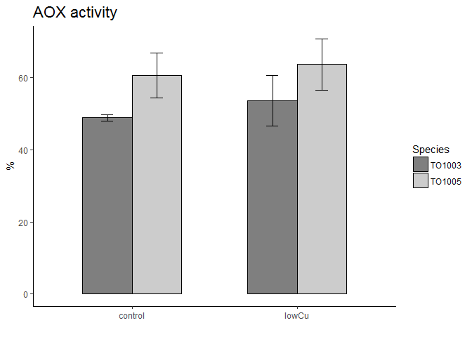
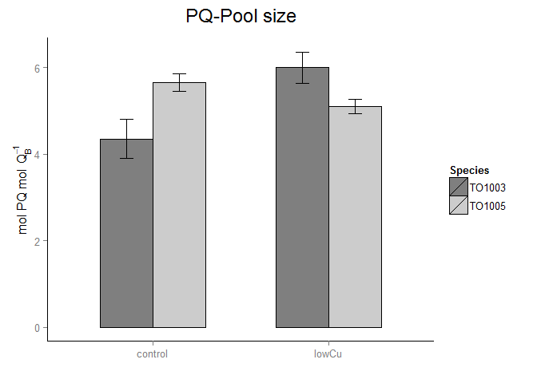

# 02_Physiology_plots
Anna A. Hippmann  
July 18, 2016  


##Libraries used

```r
suppressPackageStartupMessages(library(lsmeans))
suppressPackageStartupMessages(library(phia))
suppressPackageStartupMessages(library(visreg))
```

```
## Warning: package 'visreg' was built under R version 3.2.5
```

```r
suppressPackageStartupMessages(library(dplyr))
library(tidyr)
library(ggplot2)
library(knitr)
```

## Functions used

```r
# Multiple plot function
#
# ggplot objects can be passed in ..., or to plotlist (as a list of ggplot objects)
# - cols:   Number of columns in layout
# - layout: A matrix specifying the layout. If present, 'cols' is ignored.
#
# If the layout is something like matrix(c(1,2,3,3), nrow=2, byrow=TRUE),
# then plot 1 will go in the upper left, 2 will go in the upper right, and
# 3 will go all the way across the bottom.
#
multiplot <- function(..., plotlist=NULL, file, cols=1, layout=NULL) {
  require(grid)

  # Make a list from the ... arguments and plotlist
  plots <- c(list(...), plotlist)

  numplots = length(plots)

  # If layout is NULL, then use 'cols' to determine layout
  if (is.null(layout)) {
    # Make the panel
    # ncol: Number of columns of plots
    # nrow: Number of rows needed, calculated from # of cols
    layout <- matrix(seq(1, cols * ceiling(numplots/cols)),
                    ncol = cols, nrow = ceiling(numplots/cols))
  }

 if (numplots==1) {
    print(plots[[1]])

  } else {
    # Set up the page
    grid.newpage()
    pushViewport(viewport(layout = grid.layout(nrow(layout), ncol(layout))))

    # Make each plot, in the correct location
    for (i in 1:numplots) {
      # Get the i,j matrix positions of the regions that contain this subplot
      matchidx <- as.data.frame(which(layout == i, arr.ind = TRUE))

      print(plots[[i]], vp = viewport(layout.pos.row = matchidx$row,
                                      layout.pos.col = matchidx$col))
    }
  }
}
```


```r
#I used the original "ALL_PhysiologicalData_2015_04.txt" and added columns "Treatment" and "Merged" to it, then saved the ensuing file under "ALL_PhysiologicalData_2015_04_withMerged_Variable.txt", so I can use it for all my plots

mydata_FRRF <- read.delim("Input_Data/ALL_Phys_Barplots/Compiled_ALL_Raw_R_2016_07_FRRF.txt", sep="\t", header=T)
mydata.mean.stderr.FRRF <- read.delim("Input_Data/ALL_Phys_Barplots/FRRF_physiology_Stats_TO03_TO05_mean_stderror.txt", sep="\t", header=T)


mydata_Phys <- read.delim("Input_Data/ALL_Phys_Barplots/ALL_PhysiologicalData.txt", sep="\t", header=T)
mydata.mean.stderr.Phys <- read.delim("Input_Data/ALL_Phys_Barplots/ALL_Phys_both_TO03_TO05_mean_stderror.txt",  sep="\t", header=T)
mydata_Phys_lowCu <- mydata_Phys %>% 
  filter(Treatment_number < 3) #this will leave me with only control and lowCu data

mydata.mean.stderr <- bind_cols(mydata.mean.stderr.FRRF,mydata.mean.stderr.Phys[,4:61])

mydata.mean.stderr <- mydata.mean.stderr %>% 
  mutate (Treatment_number = c(1:4,1:4)) %>% # as I just want to make plots showing ctrl and lowCu
 filter(Treatment_number < 3)
```


```r
mydata_Phys.mean.stderr <- mydata_Phys %>%  #I double checked via calculating it by hand in excel, this works! 
  group_by(Trtmt_comb) %>% 
    summarize(mean.Growthrate.dd.1 = mean(Growthrate.dd.1, na.rm=T),
            mean.Growthrate.Percent..u.umax.  = mean( Growthrate.Percent..u.umax., na.rm=T),
            mean.Growthrate.specific.d.1  = mean(Growthrate.specific.d.1 ,na.rm=T),
            mean.X14C.per.Chla.alpha  = mean(X14C.per.Chla.alpha ,na.rm=T),
            mean.X14C.per.Chla.pmax  = mean(X14C.per.Chla.pmax ,na.rm=T),
            mean.X14C.per.Chla.ek  = mean(X14C.per.Chla.ek ,na.rm=T),
            mean.X14C.per.Chla.at.155uE  = mean(X14C.per.Chla.at.155uE ,na.rm=T),
            mean.cell.size..um  = mean(cell.size..um ,na.rm=T),
            mean.cell.volume.fl.cell  = mean(cell.volume.fl.cell ,na.rm=T),
            mean.cell.SA.um2  = mean(cell.SA.um2 ,na.rm=T),
            mean.cell.SA.Vol.ratio  = mean(cell.SA.Vol.ratio ,na.rm=T),
            mean.Chla.per.cell.pg.cell  = mean(Chla.per.cell.pg.cell ,na.rm=T),
            mean.Chla.per.cell.vol.fg.fL  = mean(Chla.per.cell.vol.fg.fL ,na.rm=T),
            mean.FeDFB.zmol.um.2.h.  = mean(FeDFB.zmol.um.2.h. ,na.rm=T),
            mean.FeDFB.zmol.cell.1.h.  = mean(FeDFB.zmol.cell.1.h. ,na.rm=T),
            mean.GrossPchla.mol.O2.mol.Chla..h.  = mean(GrossPchla.mol.O2.mol.Chla..h. ,na.rm=T),
            mean.GrossPcell..mol.O2.cell..h.   = mean(GrossPcell..mol.O2.cell..h.  ,na.rm=T),
            mean.FvFm.old  = mean(FvFm.old ,na.rm=T),
            mean.Sig.old  = mean(Sig.old ,na.rm=T),
            mean.p.old  = mean(p.old ,na.rm=T),
            mean.PQ_Siz.old  = mean(PQ_Siz.old ,na.rm=T),
            mean.AOXactivity  = mean(AOXactivity ,na.rm=T),
            mean.Cell.Density  = mean( Cell.Density,na.rm=T),
            mean.Fe.tot.nmol  = mean(Fe.tot.nmol ,na.rm=T),
            mean.Cu.tot.nmol  = mean( Cu.tot.nmol,na.rm=T),
            mean.mol.O2.mol.Chla.h.mod  = mean(mol.O2.mol.Chla.h.mod ,na.rm=T),
            mean.X14C.molC.per.mol.Chla.h  = mean(X14C.molC.per.mol.Chla.h ,na.rm=T),
            mean.PQ.Chla.all  = mean(PQ.Chla.all ,na.rm=T),
            mean.PQ.Chla.all.delete  = mean(PQ.Chla.all.delete ,na.rm=T),
            sd.err.Growthrate.dd.1 = sd( Growthrate.dd.1, na.rm=T)/sqrt(n()),
            sd.err.Growthrate.Percent..u.umax. = sd(Growthrate.Percent..u.umax. ,na.rm=T)/sqrt(n()),
            sd.err.Growthrate.specific.d.1 = sd(Growthrate.specific.d.1 ,na.rm=T)/sqrt(n()),
            sd.err.X14C.per.Chla.alpha = sd(X14C.per.Chla.alpha ,na.rm=T)/sqrt(n()),
            sd.err.X14C.per.Chla.pmax = sd(X14C.per.Chla.pmax ,na.rm=T)/sqrt(n()),
            sd.err.X14C.per.Chla.ek = sd(X14C.per.Chla.ek ,na.rm=T)/sqrt(n()),
            sd.err.X14C.per.Chla.at.155uE = sd(X14C.per.Chla.at.155uE ,na.rm=T)/sqrt(n()),
            sd.err.cell.size..um = sd(cell.size..um ,na.rm=T)/sqrt(n()),
            sd.err.cell.volume.fl.cell = sd(cell.volume.fl.cell ,na.rm=T)/sqrt(n()),
            sd.err.cell.SA.um2 = sd(cell.SA.um2 ,na.rm=T)/sqrt(n()),
            sd.err.cell.SA.Vol.ratio = sd(cell.SA.Vol.ratio ,na.rm=T)/sqrt(n()),
            sd.err.Chla.per.cell.pg.cell = sd(Chla.per.cell.pg.cell ,na.rm=T)/sqrt(n()),
            sd.err.Chla.per.cell.vol.fg.fL = sd(Chla.per.cell.vol.fg.fL ,na.rm=T)/sqrt(n()),
            sd.err.FeDFB.zmol.um.2.h. = sd(FeDFB.zmol.um.2.h. ,na.rm=T)/sqrt(n()),
            sd.err.FeDFB.zmol.cell.1.h. = sd(FeDFB.zmol.cell.1.h. ,na.rm=T)/sqrt(n()),
            sd.err.GrossPchla.mol.O2.mol.Chla..h. = sd(GrossPchla.mol.O2.mol.Chla..h. ,na.rm=T)/sqrt(n()),
            sd.err.GrossPcell..mol.O2.cell..h.  = sd(GrossPcell..mol.O2.cell..h.  ,na.rm=T)/sqrt(n()),
            sd.err.FvFm.old = sd(FvFm.old ,na.rm=T)/sqrt(n()),
            sd.err.Sig.old = sd( Sig.old,na.rm=T)/sqrt(n()),
            sd.err.p.old = sd(p.old ,na.rm=T)/sqrt(n()),
            sd.err.PQ_Siz.old = sd(PQ_Siz.old ,na.rm=T)/sqrt(n()),
            sd.err.AOXactivity = sd(AOXactivity ,na.rm=T)/sqrt(n()),
            sd.err.Cell.Density = sd( Cell.Density,na.rm=T)/sqrt(n()),
            sd.err.Fe.tot.nmol = sd(Fe.tot.nmol ,na.rm=T)/sqrt(n()),
            sd.err.Cu.tot.nmol. = sd(Cu.tot.nmol ,na.rm=T)/sqrt(n()),
            sd.err.mol.O2.mol.Chla.h.mod = sd(mol.O2.mol.Chla.h.mod ,na.rm=T)/sqrt(n()),
            sd.err.X14C.molC.per.mol.Chla.h = sd(X14C.molC.per.mol.Chla.h ,na.rm=T)/sqrt(n()),
            sd.err.PQ.Chla.all = sd(PQ.Chla.all ,na.rm=T)/sqrt(n()),
            sd.err.PQ.Chla.all.delete = sd(PQ.Chla.all.delete ,na.rm=T)/sqrt(n()))

        

mydata_Phys.mean.stderr <- mydata_Phys.mean.stderr %>% 
  separate(Trtmt_comb, c("Species", "Treatment"), remove = F)


mydata_Phys.mean.stderr$Trtmt_comb <- as.factor(mydata_Phys.mean.stderr$Trtmt_comb)
mydata_Phys.mean.stderr$Species <- as.factor(mydata_Phys.mean.stderr$Species)
mydata_Phys.mean.stderr$Treatment <- as.factor(mydata_Phys.mean.stderr$Treatment)

#str(mydata_Phys.mean.stderr)
#knitr::kable(ETR.Ep.mean.stderr, format= "markdown")
#write.table(mydata_Phys.mean.stderr, file="Input_Data/ALL_Phys_Barplots/ALL_Phys_both_TO03_TO05_mean_stderror.txt", sep="\t", col.names=T, row.names = F) 
```


#The plots

```r
# first I create my colour vectors


border_colour <- scale_colour_manual(values = c("black", "black"))

Species_colours <- structure(c('grey50', 'grey80'), Names =c("TO1003", "TO1005"))


#here is a cleanup code that gets rid of ggplots default background colours etc:
cleanup = theme (panel.grid.major = element_blank(),
                 panel.grid.minor = element_blank(),
                 panel.background = element_blank(),
                 axis.line = element_line(color = "black"))
```

# p1 - Growthrate.Percent..u.umax.

```r
p <- ggplot(mydata.mean.stderr, aes(x=Treatment, y = mean.Growthrate.Percent..u.umax., fill = Species)) + 
  labs(title = bquote("Growthrate %" ~ mu/mu[max] ), y=bquote("% " ~ mu / mu[max]), x= "")
    
p1 <- p + geom_bar(color = "black", position=position_dodge(), stat="identity", width = .6) +
  scale_fill_manual(values = Species_colours) +
  geom_errorbar(aes(ymin = mean.Growthrate.Percent..u.umax. - sd.err.Growthrate.Percent..u.umax., ymax = mean.Growthrate.Percent..u.umax. + sd.err.Growthrate.Percent..u.umax.),
                  width = .15,                    # Width of the error bars
                  position = position_dodge(.6), #so the error bars are dodged to the side
                  colour = "black") +
  cleanup +
  theme (plot.title = element_text(size = rel(1.5), face = "bold", vjust = 2))

p1
```

 


# p2 - cell.size..um

```r
p <- ggplot(mydata.mean.stderr, aes(x=Treatment, y=mean.cell.size..um, fill = Species)) + 
  labs(title = bquote("Cell" ~ diameter  ), y=bquote(mu ~"m"), x= "")
    
p2 <- p + geom_bar(color = "black", position=position_dodge(), stat="identity", width = .6) +
  scale_fill_manual(values = Species_colours) +
  geom_errorbar(aes(ymin = mean.cell.size..um - sd.err.cell.size..um, ymax = mean.cell.size..um + sd.err.cell.size..um),
                  width = .15,                    # Width of the error bars
                  position = position_dodge(.6), #so the error bars are dodged to the side
                  colour = "black") +
  cleanup +
  theme (plot.title = element_text(size = rel(1.5), face = "bold", vjust = 2))

p2
```

 


#OOOOOOOO


# p3 - cell.volume.fl.cell

```r
p <- ggplot(mydata.mean.stderr, aes(x=Treatment, y=mean.cell.volume.fl.cell, fill = Species)) + 
  labs(title = bquote("Cell" ~ volume ), y=bquote(~ mu ~"L " ~ cell^-1), x= "")
    
p3 <- p + geom_bar(color = "black", position=position_dodge(), stat="identity", width = .6) +
  scale_fill_manual(values = Species_colours) +
  geom_errorbar(aes(ymin = mean.cell.volume.fl.cell - sd.err.cell.volume.fl.cell, ymax = mean.cell.volume.fl.cell + sd.err.cell.volume.fl.cell),
                  width = .15,                    # Width of the error bars
                  position = position_dodge(.6), #so the error bars are dodged to the side
                  colour = "black") +
  cleanup +
  theme (plot.title = element_text(size = rel(1.5), face = "bold", vjust = 2))
p3
```

 


#OOOOOOOO


# p4 - GrossPchla.mol.O2.mol.Chla..h.

```r
p <- ggplot(mydata.mean.stderr, aes(x=Treatment, y=mean.GrossPchla.mol.O2.mol.Chla..h., fill = Species)) + 
  labs(title = bquote("Gross " ~ O[2]~"Production per Chl"~ italic(a) ), y=bquote("mol " ~O[2] ~ " Chl"~ italic(a)^{-1} ~ h^-1), x= "")
    
p4 <- p + geom_bar(color = "black", position=position_dodge(), stat="identity", width = .6) +
  scale_fill_manual(values = Species_colours) +
  geom_errorbar(aes(ymin = mean.GrossPchla.mol.O2.mol.Chla..h. - sd.err.GrossPchla.mol.O2.mol.Chla..h., ymax = mean.GrossPchla.mol.O2.mol.Chla..h. + sd.err.GrossPchla.mol.O2.mol.Chla..h.),
                  width = .15,                    # Width of the error bars
                  position = position_dodge(.6), #so the error bars are dodged to the side
                  colour = "black") +
  cleanup +
  theme (plot.title = element_text(size = rel(1.5), face = "bold", vjust = 2))

p4
```

 


#GrossPchla.mol.O2.mol.Chla..h.


# p5 - FeDFB.zmol.um.2.h.

```r
p <- ggplot(mydata.mean.stderr, aes(x=Treatment, y=mean.FeDFB.zmol.um.2.h., fill = Species)) + 
  labs(title = bquote("FeDFB" ~ uptake ), y=bquote("zmol " ~ mu ~ m^{-2}~h^{-1}), x= "")
    
p5 <- p + geom_bar(color = "black", position=position_dodge(), stat="identity", width = .6) +
  scale_fill_manual(values = Species_colours) +
  geom_errorbar(aes(ymin = mean.FeDFB.zmol.um.2.h. - sd.err.FeDFB.zmol.um.2.h., ymax = mean.FeDFB.zmol.um.2.h. + sd.err.FeDFB.zmol.um.2.h.),
                  width = .15,                    # Width of the error bars
                  position = position_dodge(.6), #so the error bars are dodged to the side
                  colour = "black") +
  cleanup +
  theme (plot.title = element_text(size = rel(1.5), face = "bold", vjust = 2))

p5
```

 


# p6 - Chla.per.cell.pg.cell 

```r
p <- ggplot(mydata.mean.stderr, aes(x=Treatment, y=mean.Chla.per.cell.pg.cell , fill = Species)) + 
  labs(title = bquote("Chl"~italic(a)~"per cell" ), y=bquote("pg " ~cell^{-1}), x= "")
    
p6 <- p + geom_bar(color = "black", position=position_dodge(), stat="identity", width = .6) +
  scale_fill_manual(values = Species_colours) +
  geom_errorbar(aes(ymin = mean.Chla.per.cell.pg.cell  - sd.err.Chla.per.cell.pg.cell , ymax = mean.Chla.per.cell.pg.cell  + sd.err.Chla.per.cell.pg.cell ),
                  width = .15,                    # Width of the error bars
                  position = position_dodge(.6), #so the error bars are dodged to the side
                  colour = "black") +
  cleanup +
  theme (plot.title = element_text(size = rel(1.5), face = "bold", vjust = 2))

p6
```

 


#Chla.per.cell.pg.cell 


# p7 - Chla.per.cell.vol.fg.fL

```r
p <- ggplot(mydata.mean.stderr, aes(x=Treatment, y=mean.Chla.per.cell.vol.fg.fL, fill = Species)) + 
  labs(title = bquote("Chl"~italic(a)~"per volume" ), y=bquote("fg " ~fL^{-1}), x= "")
    
p7 <- p + geom_bar(color = "black", position=position_dodge(), stat="identity", width = .6) +
  scale_fill_manual(values = Species_colours) +
  geom_errorbar(aes(ymin = mean.Chla.per.cell.vol.fg.fL - sd.err.Chla.per.cell.vol.fg.fL, ymax = mean.Chla.per.cell.vol.fg.fL + sd.err.Chla.per.cell.vol.fg.fL),
                  width = .15,                    # Width of the error bars
                  position = position_dodge(.6), #so the error bars are dodged to the side
                  colour = "black") +
  cleanup +
  theme (plot.title = element_text(size = rel(1.5), face = "bold", vjust = 2))

p7
```

 


#Chla.per.cell.vol.fg.fL


# p8 - AOXactivity

```r
p <- ggplot(mydata.mean.stderr, aes(x=Treatment, y=mean.AOXactivity, fill = Species)) + 
  labs(title = bquote("AOX" ~ activity ), y=bquote("%"), x= "")
    
p8 <- p+ geom_bar(color = "black", position=position_dodge(), stat="identity", width = .6) +
  scale_fill_manual(values = Species_colours) +
  geom_errorbar(aes(ymin = mean.AOXactivity - sd.err.AOXactivity, ymax = mean.AOXactivity + sd.err.AOXactivity),
                  width = .15,                    # Width of the error bars
                  position = position_dodge(.6), #so the error bars are dodged to the side
                  colour = "black") +
  cleanup +
  theme (plot.title = element_text(size = rel(1.5), face = "bold", vjust = 2))

p8
```

 


#AOXactivity


# p9 - FvFm.old

```r
p <- ggplot(mydata.mean.stderr, aes(x=Treatment, y=mean.FvFm.old, fill = Species)) + 
  labs(title = bquote("Fv/" ~ Fm ), y=bquote("A.U."), x= "")
    
p9 <- p+ geom_bar(color = "black", position=position_dodge(), stat="identity", width = .6) +
  scale_fill_manual(values = Species_colours) +
  geom_errorbar(aes(ymin = mean.FvFm.old - sd.err.FvFm.old, ymax = mean.FvFm.old + sd.err.FvFm.old),
                  width = .15,                    # Width of the error bars
                  position = position_dodge(.6), #so the error bars are dodged to the side
                  colour = "black") +
  cleanup +
  theme (plot.title = element_text(size = rel(1.5), face = "bold", vjust = 2))

p9
```

 


#FvFm.old


# p10 - Sig.old

```r
p <- ggplot(mydata.mean.stderr, aes(x=Treatment, y=mean.Sig.old, fill = Species)) + 
  labs(title = bquote(  sigma[PSII] ), y=bquote( ring(A)~" "~RCII^-1), x= "")
    
p10 <-  p + geom_bar(color = "black", position=position_dodge(), stat="identity", width = .6) +
  scale_fill_manual(values = Species_colours) +
  geom_errorbar(aes(ymin = mean.Sig.old - sd.err.Sig.old, ymax = mean.Sig.old + sd.err.Sig.old),
                  width = .15,                    # Width of the error bars
                  position = position_dodge(.6), #so the error bars are dodged to the side
                  colour = "black") +
  cleanup +
  theme (plot.title = element_text(size = rel(1.5), face = "bold", vjust = 2))

p10
```

 


#Sig.old


# p11 - PQ_Siz.old 

```r
p <- ggplot(mydata.mean.stderr, aes(x=Treatment, y=mean.PQ_Siz.old , fill = Species)) + 
  labs(title = bquote("PQ-Pool" ~ size ), y=bquote("mol PQ mol " ~Q[B]^{-1}), x= "")
    
p11 <- p + geom_bar(color = "black", position=position_dodge(), stat="identity", width = .6) +
  scale_fill_manual(values = Species_colours) +
  geom_errorbar(aes(ymin = mean.PQ_Siz.old  - sd.err.PQ_Siz.old , ymax = mean.PQ_Siz.old  + sd.err.PQ_Siz.old ),
                  width = .15,                    # Width of the error bars
                  position = position_dodge(.6), #so the error bars are dodged to the side
                  colour = "black") +
  cleanup +
  theme (plot.title = element_text(size = rel(1.5), face = "bold", vjust = 2))

p11
```

 


#PQ_Siz.old 


# p12 - Converse_corr

```r
p <- ggplot(mydata.mean.stderr, aes(x=Treatment, y=mean.Converse_corr, fill = Species)) + 
  labs(title = bquote(atop("Conversion factor" ~ Phi[e:C] ~"/" ~eta[PSII], "@ growth irradiance" )), y=bquote(atop(ETR[PSII] ~"/ C uptake  : " ~Phi[e:C] ~"/" ~eta[PSII], "mol "~e^{-1}~ "mol " ~ C^{-1} ~ " / mol Chl" ~ italic(a) ~ "mol "~ RCII^{-1})), x= "")
    
p12 <- p + geom_bar(color = "black", position=position_dodge(), stat="identity", width = .6) +
  scale_fill_manual(values = Species_colours) +
  geom_errorbar(aes(ymin = mean.Converse_corr - sd.err.Converse_corr, ymax = mean.Converse_corr + sd.err.Converse_corr),
                  width = .15,                    # Width of the error bars
                  position = position_dodge(.6), #so the error bars are dodged to the side
                  colour = "black") +
  cleanup +
  theme (plot.title = element_text(size = rel(1.5), face = "bold", vjust = 2))

p12
```

 


#Converse_corr

#Making the first multi plot


```r
multiplot(p1, p5, p9, p2, p6, p10,p3, p7, p11, p4, p8 , p12, cols=4)
```

```
## Loading required package: grid
```

 

```r
multiplot(p1, p2, p3, p4, cols=2)
```

 


```r
png('plots/ALL_Phys_Barplots/multiplot_01_new.png', width=1360, height = 960, units ="px", pointsize = 12)

multiplot(p1, p5, p9, p2, p6, p10,p3, p7, p11, p4, p8 , p12, cols=4)

dev.off()
```

```
## png 
##   2
```


# p25 - cell.SA.um2

```r
p <- ggplot(mydata.mean.stderr, aes(x=Treatment, y=mean.cell.SA.um2, fill = Species)) + 
  labs(title = bquote("Cell surface"~ area ), y=bquote( mu ~ m^{2} ~ cell^{-1} ), x= "")
    
p25 <- p + geom_bar(color = "black", position=position_dodge(), stat="identity", width = .6) +
  scale_fill_manual(values = Species_colours) +
  geom_errorbar(aes(ymin = mean.cell.SA.um2 - sd.err.cell.SA.um2, ymax = mean.cell.SA.um2 + sd.err.cell.SA.um2),
                  width = .15,                    # Width of the error bars
                  position = position_dodge(.6), #so the error bars are dodged to the side
                  colour = "black") +
  cleanup +
  theme (plot.title = element_text(size = rel(1.5), face = "bold", vjust = 2))

p25
```

 


# p26 - cell.SA.Vol.ratio

```r
p <- ggplot(mydata.mean.stderr, aes(x=Treatment, y=mean.cell.SA.Vol.ratio, fill = Species)) + 
  labs(title = bquote("Cell SA / vol"~ ratio ), y=bquote( mu ~ m^{2} ~ fL^{-1} ~cell^{-1}), x= "")
    
p26 <- p + geom_bar(color = "black", position=position_dodge(), stat="identity", width = .6) +
  scale_fill_manual(values = Species_colours) +
  geom_errorbar(aes(ymin = mean.cell.SA.Vol.ratio - sd.err.cell.SA.Vol.ratio, ymax = mean.cell.SA.Vol.ratio + sd.err.cell.SA.Vol.ratio),
                  width = .15,                    # Width of the error bars
                  position = position_dodge(.6), #so the error bars are dodged to the side
                  colour = "black") +
  cleanup +
  theme (plot.title = element_text(size = rel(1.5), face = "bold", vjust = 2))

p26
```

 


# p27 - mol.O2.mol.Chla.h.mod


# p28 - X14C.molC.per.mol.Chla.h


# p29 - PQ.Chla.all


# p30 - PQ.Chla.all.delete


# p1 - OOOOOOOO


#OOOOOOOO


# Making mean and std error table (including `na.rm=T`!)


```r
FRRF_160.mean.stderr <- mydata_Phys %>%  #I double checked via calculating it by hand in excel, this works! 
  group_by(Trtmt_comb) %>% 
    summarize(mean.sig = mean(sig.),
            mean.  = mean( , na.rm=T),
            mean.  = mean( ,na.rm=T),
            mean.  = mean( ,na.rm=T),
            mean.  = mean( ,na.rm=T),
            mean.  = mean( ,na.rm=T),
            mean.  = mean( ,na.rm=T),
            mean.  = mean( ,na.rm=T),
            mean.  = mean( ,na.rm=T),
            sd.err. = sd( ,na.rm=T)/sqrt(n()),
            sd.err. = sd( ,na.rm=T)/sqrt(n()),
            sd.err. = sd( ,na.rm=T)/sqrt(n()),
            sd.err. = sd( ,na.rm=T)/sqrt(n()),
            sd.err. = sd( ,na.rm=T)/sqrt(n()),
            sd.err. = sd( ,na.rm=T)/sqrt(n()),
            sd.err. = sd( ,na.rm=T)/sqrt(n()),
            sd.err. = sd( ,na.rm=T)/sqrt(n()),
            sd.err. = sd( ,na.rm=T)/sqrt(n()),
            sd.err. = sd( ,na.rm=T)/sqrt(n()),
            sd.err. = sd( ,na.rm=T)/sqrt(n()))

            sd.err.ps = sd(ps.Ep)/sqrt(n()),
            sd.err.ETR.150 = sd(ETR.150.Ep)/sqrt(n()),
            sd.err.ETR.700 = sd(ETR.700.Ep)/sqrt(n()),
            sd.err.ETR.800 = sd(ETR.800.Ep)/sqrt(n())) 

FRRF_160.mean.stderr <- FRRF_160.mean.stderr %>% 
  separate(Trtmt_comb, c("Species", "Treatment"), remove = F)


FRRF_160.mean.stderr$Trtmt_comb <- as.factor(FRRF_160.mean.stderr$Trtmt_comb)
FRRF_160.mean.stderr$Species <- as.factor(FRRF_160.mean.stderr$Species)
ETR.Ep.mean.stderr$Treatment <- as.factor(ETR.Ep.mean.stderr$Treatment)

str(FRRF_160.mean.stderr)
#knitr::kable(ETR.Ep.mean.stderr, format= "markdown")
write.table(FRRF_160.mean.stderr, file="Output_Data/FRRF/FRRF_160.mean.stderr_both_TO03_TO05_mean_stderror.txt
```


