# 02_Physiology_plots
Anna A. Hippmann  
July 18, 2016  


##Libraries used

```r
suppressPackageStartupMessages(library(lsmeans))
suppressPackageStartupMessages(library(phia))
suppressPackageStartupMessages(library(visreg))
suppressPackageStartupMessages(library(dplyr))
library(tidyr)
library(ggplot2)
library(knitr)
#library (gridExtra)
#library(cowplot)
```
Have a look at http://www.sthda.com/english/wiki/ggplot2-easy-way-to-mix-multiple-graphs-on-the-same-page-r-software-and-data-visualization on how to use gridExtra and Cowplot to make good multiplots for publication!

## Functions used

```r
# Multiple plot function
#
# ggplot objects can be passed in ..., or to plotlist (as a list of ggplot objects)
# - cols:   Number of columns in layout
# - layout: A matrix specifying the layout. If present, 'cols' is ignored.
#
# If the layout is something like matrix(c(1,2,3,3), nrow=2, byrow=TRUE),
# then plot 1 will go in the upper left, 2 will go in the upper right, and
# 3 will go all the way across the bottom.
#
multiplot <- function(..., plotlist=NULL, file, cols=1, layout=NULL) {
  require(grid)

  # Make a list from the ... arguments and plotlist
  plots <- c(list(...), plotlist)

  numplots = length(plots)

  # If layout is NULL, then use 'cols' to determine layout
  if (is.null(layout)) {
    # Make the panel
    # ncol: Number of columns of plots
    # nrow: Number of rows needed, calculated from # of cols
    layout <- matrix(seq(1, cols * ceiling(numplots/cols)),
                    ncol = cols, nrow = ceiling(numplots/cols))
  }

 if (numplots==1) {
    print(plots[[1]])

  } else {
    # Set up the page
    grid.newpage()
    pushViewport(viewport(layout = grid.layout(nrow(layout), ncol(layout))))

    # Make each plot, in the correct location
    for (i in 1:numplots) {
      # Get the i,j matrix positions of the regions that contain this subplot
      matchidx <- as.data.frame(which(layout == i, arr.ind = TRUE))

      print(plots[[i]], vp = viewport(layout.pos.row = matchidx$row,
                                      layout.pos.col = matchidx$col))
    }
  }
}
```


```r
#I used the original "ALL_PhysiologicalData_2015_04.txt" and added columns "Treatment" and "Merged" to it, then saved the ensuing file under "ALL_PhysiologicalData_2015_04_withMerged_Variable.txt", so I can use it for all my plots

mydata_FRRF <- read.delim("Input_Data/ALL_Phys_Barplots/Compiled_ALL_Raw_R_2016_07_FRRF.txt", sep="\t", header=T)
mydata.mean.stderr.FRRF <- read.delim("Input_Data/ALL_Phys_Barplots/FRRF_physiology_Stats_TO03_TO05_mean_stderror.txt", sep="\t", header=T)


mydata_Phys <- read.delim("Input_Data/ALL_Phys_Barplots/ALL_PhysiologicalData.txt", sep="\t", header=T)
mydata.mean.stderr.Phys <- read.delim("Input_Data/ALL_Phys_Barplots/ALL_Phys_both_TO03_TO05_mean_stderror.txt",  sep="\t", header=T)
mydata_Phys_lowCu <- mydata_Phys %>% 
  filter(Treatment_number < 3) #this will leave me with only control and lowCu data

mydata.mean.stderr <- bind_cols(mydata.mean.stderr.FRRF,mydata.mean.stderr.Phys[,4:81])

mydata.mean.stderr <- mydata.mean.stderr %>% 
  mutate (Treatment_number = c(1:4,1:4)) %>% # as I just want to make plots showing ctrl and lowCu
 filter(Treatment_number < 3)
```


```r
mydata_Phys.mean.stderr <- mydata_Phys %>%  #I double checked via calculating it by hand in excel, this works! 
  group_by(Trtmt_comb) %>% 
    summarize(mean.Growthrate.dd.1 = mean(Growthrate.dd.1, na.rm=T),
            mean.Growthrate.Percent..u.umax.  = mean( Growthrate.Percent..u.umax., na.rm=T),
            mean.Growthrate.specific.d.1  = mean(Growthrate.specific.d.1 ,na.rm=T),
            mean.X14C.per.Chla.alpha  = mean(X14C.per.Chla.alpha ,na.rm=T),
            mean.X14C.per.Chla.pmax  = mean(X14C.per.Chla.pmax ,na.rm=T),
            mean.X14C.per.Chla.ek  = mean(X14C.per.Chla.ek ,na.rm=T),
            mean.X14C.per.Chla.at.155uE  = mean(X14C.per.Chla.at.155uE ,na.rm=T),
            mean.cell.size..um  = mean(cell.size..um ,na.rm=T),
            mean.cell.volume.fl.cell  = mean(cell.volume.fl.cell ,na.rm=T),
            mean.cell.SA.um2  = mean(cell.SA.um2 ,na.rm=T),
            mean.cell.SA.Vol.ratio  = mean(cell.SA.Vol.ratio ,na.rm=T),
            mean.Chla.per.cell.pg.cell  = mean(Chla.per.cell.pg.cell ,na.rm=T),
            mean.Chla.per.cell.vol.fg.fL  = mean(Chla.per.cell.vol.fg.fL ,na.rm=T),
            mean.FeDFB.zmol.um.2.h.  = mean(FeDFB.zmol.um.2.h. ,na.rm=T),
            mean.FeDFB.zmol.cell.1.h.  = mean(FeDFB.zmol.cell.1.h. ,na.rm=T),
            mean.GrossPchla.mol.O2.mol.Chla..h.  = mean(GrossPchla.mol.O2.mol.Chla..h. ,na.rm=T),
            mean.GrossPcell..mol.O2.cell..h.   = mean(GrossPcell..mol.O2.cell..h.  ,na.rm=T),
            mean.Resp.mol.O2.mol.Chla.h  = mean(Resp.mol.O2.mol.Chla.h ,na.rm=T),
            mean.Resp.umol.O2.cell.h   = mean(Resp.umol.O2.cell.h  ,na.rm=T),
            mean.FvFm.old  = mean(FvFm.old ,na.rm=T),
            mean.Sig.old  = mean(Sig.old ,na.rm=T),
            mean.p.old  = mean(p.old ,na.rm=T),
            mean.PQ_Siz.old  = mean(PQ_Siz.old ,na.rm=T),
            mean.AOXactivity  = mean(AOXactivity ,na.rm=T),
            mean.Cell.Density  = mean( Cell.Density,na.rm=T),
            mean.Fe.tot.nmol  = mean(Fe.tot.nmol ,na.rm=T),
            mean.Cu.tot.nmol  = mean( Cu.tot.nmol,na.rm=T),
            mean.X14C.molC.per.mol.Chla.h  = mean(X14C.molC.per.mol.Chla.h ,na.rm=T),
            mean.PQ.Chla.all  = mean(PQ.Chla.all ,na.rm=T),
            mean.PQ.Chla.all.delete  = mean(PQ.Chla.all.delete ,na.rm=T),
            mean.Gross.mol.O2.mol.Chla.h.mod  = mean(Gross.mol.O2.mol.Chla.h.mod ,na.rm=T),
            mean.NET.mol.O2.mol.Chla.h  = mean(NET.mol.O2.mol.Chla.h ,na.rm=T),
            mean.NET.PQ.Chla  = mean(NET.PQ.Chla ,na.rm=T),
            mean.Resp.mol.O2.mol.Chla.h  = mean(Resp.mol.O2.mol.Chla.h ,na.rm=T),
            mean.X14C.fgC.per.cell.h.alpha  = mean(X14C.fgC.per.cell.h.alpha ,na.rm=T),
            mean.X14C.fgC.per.cell.h.pmax  = mean(X14C.fgC.per.cell.h.pmax ,na.rm=T),
            mean.X14C.fgC.per.cell.h.ek  = mean(X14C.fgC.per.cell.h.ek ,na.rm=T),
            mean.X14C.fgC.per.cell.h.at.155E  = mean(X14C.fgC.per.cell.h.at.155E ,na.rm=T),
            mean.pg.prot.cell  = mean(pg.prot.cell ,na.rm=T),
            mean.pg.prot.fl.cell  = mean(pg.prot.fl.cell ,na.rm=T),
            sd.err.Growthrate.dd.1 = sd( Growthrate.dd.1, na.rm=T)/sqrt(n()),
            sd.err.Growthrate.Percent..u.umax. = sd(Growthrate.Percent..u.umax. ,na.rm=T)/sqrt(n()),
            sd.err.Growthrate.specific.d.1 = sd(Growthrate.specific.d.1 ,na.rm=T)/sqrt(n()),
            sd.err.X14C.per.Chla.alpha = sd(X14C.per.Chla.alpha ,na.rm=T)/sqrt(n()),
            sd.err.X14C.per.Chla.pmax = sd(X14C.per.Chla.pmax ,na.rm=T)/sqrt(n()),
            sd.err.X14C.per.Chla.ek = sd(X14C.per.Chla.ek ,na.rm=T)/sqrt(n()),
            sd.err.X14C.per.Chla.at.155uE = sd(X14C.per.Chla.at.155uE ,na.rm=T)/sqrt(n()),
            sd.err.cell.size..um = sd(cell.size..um ,na.rm=T)/sqrt(n()),
            sd.err.cell.volume.fl.cell = sd(cell.volume.fl.cell ,na.rm=T)/sqrt(n()),
            sd.err.cell.SA.um2 = sd(cell.SA.um2 ,na.rm=T)/sqrt(n()),
            sd.err.cell.SA.Vol.ratio = sd(cell.SA.Vol.ratio ,na.rm=T)/sqrt(n()),
            sd.err.Chla.per.cell.pg.cell = sd(Chla.per.cell.pg.cell ,na.rm=T)/sqrt(n()),
            sd.err.Chla.per.cell.vol.fg.fL = sd(Chla.per.cell.vol.fg.fL ,na.rm=T)/sqrt(n()),
            sd.err.FeDFB.zmol.um.2.h. = sd(FeDFB.zmol.um.2.h. ,na.rm=T)/sqrt(n()),
            sd.err.FeDFB.zmol.cell.1.h. = sd(FeDFB.zmol.cell.1.h. ,na.rm=T)/sqrt(n()),
            sd.err.GrossPchla.mol.O2.mol.Chla..h. = sd(GrossPchla.mol.O2.mol.Chla..h. ,na.rm=T)/sqrt(n()),
            sd.err.GrossPcell..mol.O2.cell..h.  = sd(GrossPcell..mol.O2.cell..h.  ,na.rm=T)/sqrt(n()),
            sd.err.Resp.mol.O2.mol.Chla.h = sd( Resp.mol.O2.mol.Chla.h, na.rm=T)/sqrt(n()),
            sd.err.Resp.umol.O2.cell.h  = sd(Resp.umol.O2.cell.h  ,na.rm=T)/sqrt(n()),
            sd.err.FvFm.old = sd(FvFm.old ,na.rm=T)/sqrt(n()),
            sd.err.Sig.old = sd( Sig.old,na.rm=T)/sqrt(n()),
            sd.err.p.old = sd(p.old ,na.rm=T)/sqrt(n()),
            sd.err.PQ_Siz.old = sd(PQ_Siz.old ,na.rm=T)/sqrt(n()),
            sd.err.AOXactivity = sd(AOXactivity ,na.rm=T)/sqrt(n()),
            sd.err.Cell.Density = sd( Cell.Density,na.rm=T)/sqrt(n()),
            sd.err.Fe.tot.nmol = sd(Fe.tot.nmol ,na.rm=T)/sqrt(n()),
            sd.err.Cu.tot.nmol. = sd(Cu.tot.nmol ,na.rm=T)/sqrt(n()),
            sd.err.X14C.molC.per.mol.Chla.h = sd(X14C.molC.per.mol.Chla.h ,na.rm=T)/sqrt(n()),
            sd.err.PQ.Chla.all = sd(PQ.Chla.all ,na.rm=T)/sqrt(n()),
            sd.err.PQ.Chla.all.delete = sd(PQ.Chla.all.delete ,na.rm=T)/sqrt(n()),
            sd.err.Gross.mol.O2.mol.Chla.h.mod = sd(Gross.mol.O2.mol.Chla.h.mod ,na.rm=T)/sqrt(n()),
            sd.err.NET.mol.O2.mol.Chla.h = sd(NET.mol.O2.mol.Chla.h ,na.rm=T)/sqrt(n()),
            sd.err.NET.PQ.Chla = sd( NET.PQ.Chla,na.rm=T)/sqrt(n()),
            sd.err.Resp.mol.O2.mol.Chla.h = sd( Resp.mol.O2.mol.Chla.h,na.rm=T)/sqrt(n()),
             sd.err.X14C.fgC.per.cell.h.alpha = sd(X14C.fgC.per.cell.h.alpha ,na.rm=T)/sqrt(n()),
            sd.err.X14C.fgC.per.cell.h.pmax = sd(X14C.fgC.per.cell.h.pmax ,na.rm=T)/sqrt(n()),
            sd.err.X14C.fgC.per.cell.h.ek = sd(X14C.fgC.per.cell.h.ek ,na.rm=T)/sqrt(n()),
            sd.err.X14C.fgC.per.cell.h.at.155E = sd(X14C.fgC.per.cell.h.at.155E ,na.rm=T)/sqrt(n()),
            sd.err.pg.prot.cell = sd(pg.prot.cell ,na.rm=T)/sqrt(n()),
            sd.err.pg.prot.fl.cell = sd( pg.prot.fl.cell,na.rm=T)/sqrt(n()))

        

mydata_Phys.mean.stderr <- mydata_Phys.mean.stderr %>% 
  separate(Trtmt_comb, c("Species", "Treatment"), remove = F)


mydata_Phys.mean.stderr$Trtmt_comb <- as.factor(mydata_Phys.mean.stderr$Trtmt_comb)
mydata_Phys.mean.stderr$Species <- as.factor(mydata_Phys.mean.stderr$Species)
mydata_Phys.mean.stderr$Treatment <- as.factor(mydata_Phys.mean.stderr$Treatment)

#str(mydata_Phys.mean.stderr)
#knitr::kable(ETR.Ep.mean.stderr, format= "markdown")
#write.table(mydata_Phys.mean.stderr, file="Input_Data/ALL_Phys_Barplots/ALL_Phys_both_TO03_TO05_mean_stderror.txt", sep="\t", col.names=T, row.names = F) 
```


#The plots

```r
# first I create my colour vectors


border_colour <- scale_colour_manual(values = c("black", "black"))

Species_colours <- structure(c('grey50', 'grey80'), Names =c("TO1003", "TO1005"))


#here is a cleanup code that gets rid of ggplots default background colours etc:
cleanup = theme (panel.grid.major = element_blank(),
                 panel.grid.minor = element_blank(),
                 panel.background = element_blank(),
                 axis.line = element_line(color = "black"))
```

# p1 - Growthrate.Percent..u.umax.

```r
p <- ggplot(mydata.mean.stderr, aes(x=Treatment, y = mean.Growthrate.Percent..u.umax., fill = Species)) + 
  labs(title = bquote("Growthrate %" ~ mu/mu[max] ), y=bquote("% " ~ mu / mu[max]), x= "")
    
p1 <- p + geom_bar(color = "black", position=position_dodge(), stat="identity", width = .6) +
  scale_fill_manual(values = Species_colours) +
  geom_errorbar(aes(ymin = mean.Growthrate.Percent..u.umax. - sd.err.Growthrate.Percent..u.umax., ymax = mean.Growthrate.Percent..u.umax. + sd.err.Growthrate.Percent..u.umax.),
                  width = .15,                    # Width of the error bars
                  position = position_dodge(.6), #so the error bars are dodged to the side
                  colour = "black") +
  cleanup +
  theme (plot.title = element_text(size = rel(1.5), face = "bold", vjust = 2))

p1
```

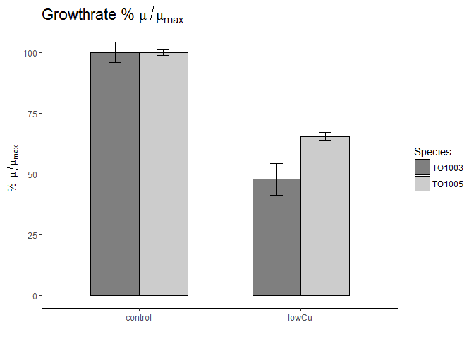<!-- -->


# p2 - cell.size..um

```r
p <- ggplot(mydata.mean.stderr, aes(x=Treatment, y=mean.cell.size..um, fill = Species)) + 
  labs(title = bquote("Cell" ~ diameter  ), y=bquote(mu ~"m"), x= "")
    
p2 <- p + geom_bar(color = "black", position=position_dodge(), stat="identity", width = .6) +
  scale_fill_manual(values = Species_colours) +
  geom_errorbar(aes(ymin = mean.cell.size..um - sd.err.cell.size..um, ymax = mean.cell.size..um + sd.err.cell.size..um),
                  width = .15,                    # Width of the error bars
                  position = position_dodge(.6), #so the error bars are dodged to the side
                  colour = "black") +
  cleanup +
  theme (plot.title = element_text(size = rel(1.5), face = "bold", vjust = 2))

p2
```

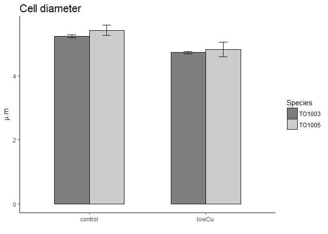<!-- -->


#OOOOOOOO


# p3 - cell.volume.fl.cell

```r
p <- ggplot(mydata.mean.stderr, aes(x=Treatment, y=mean.cell.volume.fl.cell, fill = Species)) + 
  labs(title = bquote("Cell" ~ volume ), y=bquote(~ mu ~"L " ~ cell^-1), x= "")
    
p3 <- p + geom_bar(color = "black", position=position_dodge(), stat="identity", width = .6) +
  scale_fill_manual(values = Species_colours) +
  geom_errorbar(aes(ymin = mean.cell.volume.fl.cell - sd.err.cell.volume.fl.cell, ymax = mean.cell.volume.fl.cell + sd.err.cell.volume.fl.cell),
                  width = .15,                    # Width of the error bars
                  position = position_dodge(.6), #so the error bars are dodged to the side
                  colour = "black") +
  cleanup +
  theme (plot.title = element_text(size = rel(1.5), face = "bold", vjust = 2))
p3
```

<!-- -->


# p4 - GrossPchla.mol.O2.mol.Chla..h.

```r
p <- ggplot(mydata.mean.stderr, aes(x=Treatment, y=mean.GrossPchla.mol.O2.mol.Chla..h., fill = Species)) + 
  labs(title = bquote("Gross " ~ O[2]~"Production per Chl"~ italic(a) ), y=bquote("mol " ~O[2] ~ " Chl"~ italic(a)^{-1} ~ h^-1), x= "")
    
p4 <- p + geom_bar(color = "black", position=position_dodge(), stat="identity", width = .6) +
  scale_fill_manual(values = Species_colours) +
  geom_errorbar(aes(ymin = mean.GrossPchla.mol.O2.mol.Chla..h. - sd.err.GrossPchla.mol.O2.mol.Chla..h., ymax = mean.GrossPchla.mol.O2.mol.Chla..h. + sd.err.GrossPchla.mol.O2.mol.Chla..h.),
                  width = .15,                    # Width of the error bars
                  position = position_dodge(.6), #so the error bars are dodged to the side
                  colour = "black") +
  cleanup +
  theme (plot.title = element_text(size = rel(1.5), face = "bold", vjust = 2))

p4
```

<!-- -->


# p5 - FeDFB.zmol.um.2.h.

```r
p <- ggplot(mydata.mean.stderr, aes(x=Treatment, y=mean.FeDFB.zmol.um.2.h., fill = Species)) + 
  labs(title = bquote("FeDFB" ~ uptake ), y=bquote("zmol " ~ mu ~ m^{-2}~h^{-1}), x= "")
    
p5 <- p + geom_bar(color = "black", position=position_dodge(), stat="identity", width = .6) +
  scale_fill_manual(values = Species_colours) +
  geom_errorbar(aes(ymin = mean.FeDFB.zmol.um.2.h. - sd.err.FeDFB.zmol.um.2.h., ymax = mean.FeDFB.zmol.um.2.h. + sd.err.FeDFB.zmol.um.2.h.),
                  width = .15,                    # Width of the error bars
                  position = position_dodge(.6), #so the error bars are dodged to the side
                  colour = "black") +
  cleanup +
  theme (plot.title = element_text(size = rel(1.5), face = "bold", vjust = 2))

p5
```

<!-- -->


# p6 - Chla.per.cell.pg.cell 

```r
p <- ggplot(mydata.mean.stderr, aes(x=Treatment, y=mean.Chla.per.cell.pg.cell , fill = Species)) + 
  labs(title = bquote("Chl"~italic(a)~"per cell" ), y=bquote("pg " ~cell^{-1}), x= "")
    
p6 <- p + geom_bar(color = "black", position=position_dodge(), stat="identity", width = .6) +
  scale_fill_manual(values = Species_colours) +
  geom_errorbar(aes(ymin = mean.Chla.per.cell.pg.cell  - sd.err.Chla.per.cell.pg.cell , ymax = mean.Chla.per.cell.pg.cell  + sd.err.Chla.per.cell.pg.cell ),
                  width = .15,                    # Width of the error bars
                  position = position_dodge(.6), #so the error bars are dodged to the side
                  colour = "black") +
  cleanup +
  theme (plot.title = element_text(size = rel(1.5), face = "bold", vjust = 2))

p6
```

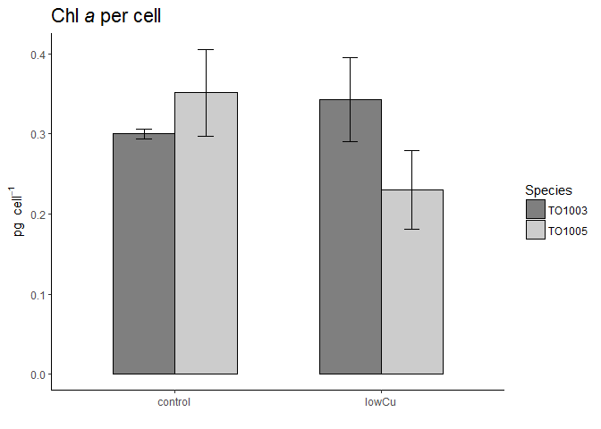<!-- -->


# p7 - Chla.per.cell.vol.fg.fL

```r
p <- ggplot(mydata.mean.stderr, aes(x=Treatment, y=mean.Chla.per.cell.vol.fg.fL, fill = Species)) + 
  labs(title = bquote("Chl"~italic(a)~"per volume" ), y=bquote("fg " ~fL^{-1}), x= "")
    
p7 <- p + geom_bar(color = "black", position=position_dodge(), stat="identity", width = .6) +
  scale_fill_manual(values = Species_colours) +
  geom_errorbar(aes(ymin = mean.Chla.per.cell.vol.fg.fL - sd.err.Chla.per.cell.vol.fg.fL, ymax = mean.Chla.per.cell.vol.fg.fL + sd.err.Chla.per.cell.vol.fg.fL),
                  width = .15,                    # Width of the error bars
                  position = position_dodge(.6), #so the error bars are dodged to the side
                  colour = "black") +
  cleanup +
  theme (plot.title = element_text(size = rel(1.5), face = "bold", vjust = 2))

p7
```

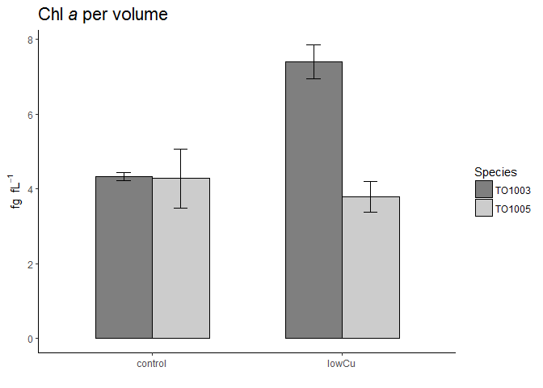<!-- -->


# p8 - AOXactivity

```r
p <- ggplot(mydata.mean.stderr, aes(x=Treatment, y=mean.AOXactivity, fill = Species)) + 
  labs(title = bquote("AOX" ~ activity ), y=bquote("%"), x= "")
    
p8 <- p+ geom_bar(color = "black", position=position_dodge(), stat="identity", width = .6) +
  scale_fill_manual(values = Species_colours) +
  geom_errorbar(aes(ymin = mean.AOXactivity - sd.err.AOXactivity, ymax = mean.AOXactivity + sd.err.AOXactivity),
                  width = .15,                    # Width of the error bars
                  position = position_dodge(.6), #so the error bars are dodged to the side
                  colour = "black") +
  cleanup +
  theme (plot.title = element_text(size = rel(1.5), face = "bold", vjust = 2))

p8
```

<!-- -->


# p9 - FvFm.old

```r
p <- ggplot(mydata.mean.stderr, aes(x=Treatment, y=mean.FvFm.old, fill = Species)) + 
  labs(title = bquote("Fv/" ~ Fm ), y=bquote("A.U."), x= "")
    
p9 <- p+ geom_bar(color = "black", position=position_dodge(), stat="identity", width = .6) +
  scale_fill_manual(values = Species_colours) +
  geom_errorbar(aes(ymin = mean.FvFm.old - sd.err.FvFm.old, ymax = mean.FvFm.old + sd.err.FvFm.old),
                  width = .15,                    # Width of the error bars
                  position = position_dodge(.6), #so the error bars are dodged to the side
                  colour = "black") +
  cleanup +
  theme (plot.title = element_text(size = rel(1.5), face = "bold", vjust = 2))

p9
```

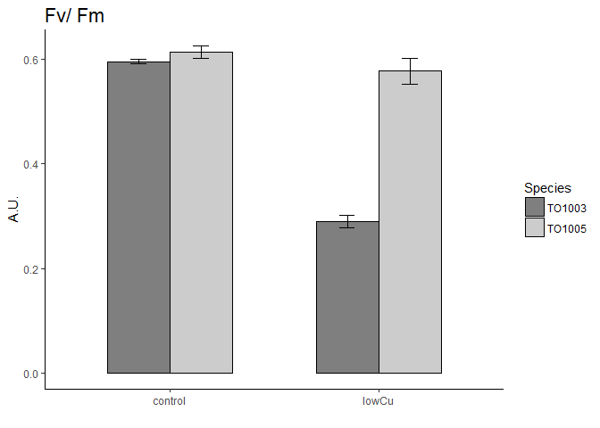<!-- -->


# p10 - Sig.old

```r
p <- ggplot(mydata.mean.stderr, aes(x=Treatment, y=mean.Sig.old, fill = Species)) + 
  labs(title = bquote(  sigma[PSII] ), y=bquote( ring(A)~" "~RCII^-1), x= "")
    
p10 <-  p + geom_bar(color = "black", position=position_dodge(), stat="identity", width = .6) +
  scale_fill_manual(values = Species_colours) +
  geom_errorbar(aes(ymin = mean.Sig.old - sd.err.Sig.old, ymax = mean.Sig.old + sd.err.Sig.old),
                  width = .15,                    # Width of the error bars
                  position = position_dodge(.6), #so the error bars are dodged to the side
                  colour = "black") +
  cleanup +
  theme (plot.title = element_text(size = rel(1.5), face = "bold", vjust = 2))

p10
```

<!-- -->


#Sig.old


# p11 - PQ_Siz.old 

```r
p <- ggplot(mydata.mean.stderr, aes(x=Treatment, y=mean.PQ_Siz.old , fill = Species)) + 
  labs(title = bquote("PQ-Pool" ~ size ), y=bquote("mol PQ mol " ~Q[B]^{-1}), x= "")
    
p11 <- p + geom_bar(color = "black", position=position_dodge(), stat="identity", width = .6) +
  scale_fill_manual(values = Species_colours) +
  geom_errorbar(aes(ymin = mean.PQ_Siz.old  - sd.err.PQ_Siz.old , ymax = mean.PQ_Siz.old  + sd.err.PQ_Siz.old ),
                  width = .15,                    # Width of the error bars
                  position = position_dodge(.6), #so the error bars are dodged to the side
                  colour = "black") +
  cleanup +
  theme (plot.title = element_text(size = rel(1.5), face = "bold", vjust = 2))

p11
```

<!-- -->


#PQ_Siz.old 


# p12 - Converse_corr

```r
p <- ggplot(mydata.mean.stderr, aes(x=Treatment, y=mean.Converse_corr, fill = Species)) + 
  labs(title = bquote(atop("Conversion factor" ~ Phi[e:C] ~"/" ~eta[PSII], "@ growth irradiance" )), y=bquote(atop(ETR[PSII] ~"/ C uptake  : " ~Phi[e:C] ~"/" ~eta[PSII], "mol "~e^{-1}~ "mol " ~ C^{-1} ~ " / mol Chl" ~ italic(a) ~ "mol "~ RCII^{-1})), x= "")
    
p12 <- p + geom_bar(color = "black", position=position_dodge(), stat="identity", width = .6) +
  scale_fill_manual(values = Species_colours) +
  geom_errorbar(aes(ymin = mean.Converse_corr - sd.err.Converse_corr, ymax = mean.Converse_corr + sd.err.Converse_corr),
                  width = .15,                    # Width of the error bars
                  position = position_dodge(.6), #so the error bars are dodged to the side
                  colour = "black") +
  cleanup +
  theme (plot.title = element_text(size = rel(1.5), face = "bold", vjust = 2))

p12
```

<!-- -->


# p13 - ETR.alpha.JP

```r
p <- ggplot(mydata.mean.stderr, aes(x=Treatment, y=mean.ETR.alpha.JP, fill = Species)) + 
  labs(title = bquote(ETR[PSII] ~ "PE curve - "~ alpha ), y=bquote("(mol "~e^-1 ~ "mol" ~RCII^-1 ~ s^-1 ~") / (" ~mu~ "mol quanta "~m^-2~ s^-1 ~")" ), x= "")
    
p13 <- p + geom_bar(color = "black", position=position_dodge(), stat="identity", width = .6) +
  scale_fill_manual(values = Species_colours) +
  geom_errorbar(aes(ymin = mean.ETR.alpha.JP - sd.err.ETR.alpha.JP, ymax = mean.ETR.alpha.JP + sd.err.ETR.alpha.JP),
                  width = .15,                    # Width of the error bars
                  position = position_dodge(.6), #so the error bars are dodged to the side
                  colour = "black") +
  cleanup +
  theme (plot.title = element_text(size = rel(1.5), face = "bold", vjust = 2))

p13
```

<!-- -->


# p14 - ETR.pmax.JP

```r
p <- ggplot(mydata.mean.stderr, aes(x=Treatment, y=mean.ETR.pmax.JP, fill = Species)) + 
  labs(title = bquote(ETR[PSII] ~ "PE curve - "~ P[max]), y=bquote("mol "~e^-1 ~ "mol" ~RCII^-1 ~ s^-1), x= "")
    
p14 <- p + geom_bar(color = "black", position=position_dodge(), stat="identity", width = .6) +
  scale_fill_manual(values = Species_colours) +
  geom_errorbar(aes(ymin = mean.ETR.pmax.JP - sd.err.ETR.pmax.JP, ymax = mean.ETR.pmax.JP + sd.err.ETR.pmax.JP),
                  width = .15,                    # Width of the error bars
                  position = position_dodge(.6), #so the error bars are dodged to the side
                  colour = "black") +
  cleanup +
  theme (plot.title = element_text(size = rel(1.5), face = "bold", vjust = 2))

p14
```

<!-- -->


# p15 - ETR.ek.JP

```r
p <- ggplot(mydata.mean.stderr, aes(x=Treatment, y=mean.ETR.ek.JP, fill = Species)) + 
  labs(title = bquote(ETR[PSII] ~ "PE curve - "~ E[k] ), y=bquote( ~mu~ "mol quanta "~m^-2~ s^-1 ), x= "")

p15 <- p + geom_bar(color = "black", position=position_dodge(), stat="identity", width = .6) +
  scale_fill_manual(values = Species_colours) +
  geom_errorbar(aes(ymin = mean.ETR.ek.JP - sd.err.ETR.ek.JP, ymax = mean.ETR.ek.JP + sd.err.ETR.ek.JP),
                  width = .15,                    # Width of the error bars
                  position = position_dodge(.6), #so the error bars are dodged to the side
                  colour = "black") +
  cleanup +
  theme (plot.title = element_text(size = rel(1.5), face = "bold", vjust = 2))

p15
```

<!-- -->


# p16 - ETR_155_calc

```r
p <- ggplot(mydata.mean.stderr, aes(x=Treatment, y=mean.ETR_155_calc, fill = Species)) + 
  labs(title = bquote(ETR[PSII]~ " @ growth irradiance" ),  y=bquote("(mol "~e^-1 ~ "mol" ~RCII^-1 ~ s^-1 ~") / (" ~mu~ "mol quanta "~m^-2~ s^-1 ~")" ), x= "")
    
p16 <- p + geom_bar(color = "black", position=position_dodge(), stat="identity", width = .6) +
  scale_fill_manual(values = Species_colours) +
  geom_errorbar(aes(ymin = mean.ETR_155_calc - sd.err.ETR_155_calc, ymax = mean.ETR_155_calc + sd.err.ETR_155_calc),
                  width = .15,                    # Width of the error bars
                  position = position_dodge(.6), #so the error bars are dodged to the side
                  colour = "black") +
  cleanup +
  theme (plot.title = element_text(size = rel(1.5), face = "bold", vjust = 2))

p16
```

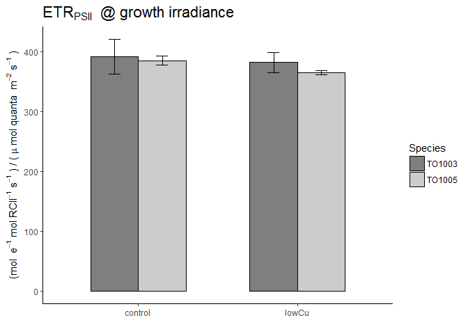<!-- -->


# p17 - F.q.F.v

```r
p <- ggplot(mydata.mean.stderr, aes(x=Treatment, y=mean.F.q.F.v, fill = Species)) + 
  labs(title = bquote("Fq'/Fv'" ~ "@" ~ "growth irradiance " ), y=bquote("A.U. " ), x= "")
    
p17 <- p + geom_bar(color = "black", position=position_dodge(), stat="identity", width = .6) +
  scale_fill_manual(values = Species_colours) +
  geom_errorbar(aes(ymin = mean.F.q.F.v - sd.err.F.q.F.v, ymax = mean.F.q.F.v + sd.err.F.q.F.v),
                  width = .15,                    # Width of the error bars
                  position = position_dodge(.6), #so the error bars are dodged to the side
                  colour = "black") +
  cleanup +
  theme (plot.title = element_text(size = rel(1.5), face = "bold", vjust = 2))

p17
```

<!-- -->


# p18 - F.q.F.m

```r
p <- ggplot(mydata.mean.stderr, aes(x=Treatment, y=mean.F.q.F.m, fill = Species)) + 
  labs(title = bquote("Fq'/Fm'" ~ "@" ~ "growth irradiance " ), y=bquote("A.U. " ), x= "")
    
p18 <- p + geom_bar(color = "black", position=position_dodge(), stat="identity", width = .6) +
  scale_fill_manual(values = Species_colours) +
  geom_errorbar(aes(ymin = mean.F.q.F.m - sd.err.F.q.F.m, ymax = mean.F.q.F.m + sd.err.F.q.F.m),
                  width = .15,                    # Width of the error bars
                  position = position_dodge(.6), #so the error bars are dodged to the side
                  colour = "black") +
  cleanup +
  theme (plot.title = element_text(size = rel(1.5), face = "bold", vjust = 2))

p18
```

<!-- -->


# p19 - NPQ.nsv.

```r
p <- ggplot(mydata.mean.stderr, aes(x=Treatment, y=mean.NPQ.nsv., fill = Species)) + 
  labs(title = bquote(NPQ[nsv]~ "@" ~ "growth irradiance " ), y=bquote("A.U. " ), x= "")
    
p19 <- p + geom_bar(color = "black", position=position_dodge(), stat="identity", width = .6) +
  scale_fill_manual(values = Species_colours) +
  geom_errorbar(aes(ymin = mean.NPQ.nsv. - sd.err.NPQ.nsv., ymax = mean.NPQ.nsv. + sd.err.NPQ.nsv.),
                  width = .15,                    # Width of the error bars
                  position = position_dodge(.6), #so the error bars are dodged to the side
                  colour = "black") +
  cleanup +
  theme (plot.title = element_text(size = rel(1.5), face = "bold", vjust = 2))

p19
```

<!-- -->


# p20 - X14C.per.Chla.alpha

```r
p <- ggplot(mydata.mean.stderr, aes(x=Treatment, y=mean.X14C.per.Chla.alpha, fill = Species)) + 
  labs(title = bquote("14C PE curve - "~ alpha ), y=bquote("(mg C mg Chl" ~italic(a)^-1~h-1 ~") / (" ~mu~ "mol quanta "~m^-2~ s^-1 ~")"), x= "")
    
p20 <- p + geom_bar(color = "black", position=position_dodge(), stat="identity", width = .6) +
  scale_fill_manual(values = Species_colours) +
  geom_errorbar(aes(ymin = mean.X14C.per.Chla.alpha - sd.err.X14C.per.Chla.alpha, ymax = mean.X14C.per.Chla.alpha + sd.err.X14C.per.Chla.alpha),
                  width = .15,                    # Width of the error bars
                  position = position_dodge(.6), #so the error bars are dodged to the side
                  colour = "black") +
  cleanup +
  theme (plot.title = element_text(size = rel(1.5), face = "bold", vjust = 2))

p20
```

<!-- -->


# p21 - X14C.per.Chla.pmax

```r
p <- ggplot(mydata.mean.stderr, aes(x=Treatment, y=mean.X14C.per.Chla.pmax, fill = Species)) + 
  labs(title = bquote("14C PE curve - "~ P[max] ), y=bquote("mg C mg Chl" ~italic(a)^-1~h-1 ), x= "")
    
p21 <- p + geom_bar(color = "black", position=position_dodge(), stat="identity", width = .6) +
  scale_fill_manual(values = Species_colours) +
  geom_errorbar(aes(ymin = mean.X14C.per.Chla.pmax - sd.err.X14C.per.Chla.pmax, ymax = mean.X14C.per.Chla.pmax + sd.err.X14C.per.Chla.pmax),
                  width = .15,                    # Width of the error bars
                  position = position_dodge(.6), #so the error bars are dodged to the side
                  colour = "black") +
  cleanup +
  theme (plot.title = element_text(size = rel(1.5), face = "bold", vjust = 2))

p21
```

<!-- -->


# p22 - X14C.per.Chla.ek

```r
p <- ggplot(mydata.mean.stderr, aes(x=Treatment, y=mean.X14C.per.Chla.ek, fill = Species)) + 
  labs(title = bquote("14C PE curve - "~ E[k] ), y=bquote( ~mu~ "mol quanta "~m^-2~ s^-1 ), x= "")
    
p22 <- p + geom_bar(color = "black", position=position_dodge(), stat="identity", width = .6) +
  scale_fill_manual(values = Species_colours) +
  geom_errorbar(aes(ymin = mean.X14C.per.Chla.ek - sd.err.X14C.per.Chla.ek, ymax = mean.X14C.per.Chla.ek + sd.err.X14C.per.Chla.ek),
                  width = .15,                    # Width of the error bars
                  position = position_dodge(.6), #so the error bars are dodged to the side
                  colour = "black") +
  cleanup +
  theme (plot.title = element_text(size = rel(1.5), face = "bold", vjust = 2))

p22
```

<!-- -->


# p23 - X14C.per.Chla.at.155uE

```r
p <- ggplot(mydata.mean.stderr, aes(x=Treatment, y=mean.X14C.per.Chla.at.155uE, fill = Species)) + 
  labs(title = bquote("14C uptake @ " ~"growth irradiance"), y=bquote("mg C mg Chl" ~italic(a)^-1~h-1 ), x= "")
    
p23 <- p + geom_bar(color = "black", position=position_dodge(), stat="identity", width = .6) +
  scale_fill_manual(values = Species_colours) +
  geom_errorbar(aes(ymin = mean.X14C.per.Chla.at.155uE - sd.err.X14C.per.Chla.at.155uE, ymax = mean.X14C.per.Chla.at.155uE + sd.err.X14C.per.Chla.at.155uE),
                  width = .15,                    # Width of the error bars
                  position = position_dodge(.6), #so the error bars are dodged to the side
                  colour = "black") +
  cleanup +
  theme (plot.title = element_text(size = rel(1.5), face = "bold", vjust = 2))

p23
```

<!-- -->


# p25 - cell.SA.um2

```r
p <- ggplot(mydata.mean.stderr, aes(x=Treatment, y=mean.cell.SA.um2, fill = Species)) + 
  labs(title = bquote("Cell surface"~ area ), y=bquote( mu ~ m^{2} ~ cell^{-1} ), x= "")
    
p25 <- p + geom_bar(color = "black", position=position_dodge(), stat="identity", width = .6) +
  scale_fill_manual(values = Species_colours) +
  geom_errorbar(aes(ymin = mean.cell.SA.um2 - sd.err.cell.SA.um2, ymax = mean.cell.SA.um2 + sd.err.cell.SA.um2),
                  width = .15,                    # Width of the error bars
                  position = position_dodge(.6), #so the error bars are dodged to the side
                  colour = "black") +
  cleanup +
  theme (plot.title = element_text(size = rel(1.5), face = "bold", vjust = 2))

p25
```

<!-- -->


# p26 - cell.SA.Vol.ratio

```r
p <- ggplot(mydata.mean.stderr, aes(x=Treatment, y=mean.cell.SA.Vol.ratio, fill = Species)) + 
  labs(title = bquote("Cell SA / vol"~ ratio ), y=bquote( mu ~ m^{2} ~ fL^{-1} ~cell^{-1}), x= "")
    
p26 <- p + geom_bar(color = "black", position=position_dodge(), stat="identity", width = .6) +
  scale_fill_manual(values = Species_colours) +
  geom_errorbar(aes(ymin = mean.cell.SA.Vol.ratio - sd.err.cell.SA.Vol.ratio, ymax = mean.cell.SA.Vol.ratio + sd.err.cell.SA.Vol.ratio),
                  width = .15,                    # Width of the error bars
                  position = position_dodge(.6), #so the error bars are dodged to the side
                  colour = "black") +
  cleanup +
  theme (plot.title = element_text(size = rel(1.5), face = "bold", vjust = 2))

p26
```

<!-- -->


# p27 - Gross.mol.O2.mol.Chla.h.mod

```r
p <- ggplot(mydata.mean.stderr, aes(x=Treatment, y=mean.Gross.mol.O2.mol.Chla.h.mod, fill = Species)) + 
  labs(title = bquote("Gross " ~ O[2] ~ "production per Chl" ~  italic(a)), y=bquote("mol " ~ O[2] ~ "mol Chl" ~ italic(a)^-1), x= "")
    
p27 <- p + geom_bar(color = "black", position=position_dodge(), stat="identity", width = .6) +
  scale_fill_manual(values = Species_colours) +
  geom_errorbar(aes(ymin = mean.Gross.mol.O2.mol.Chla.h.mod - sd.err.Gross.mol.O2.mol.Chla.h.mod, ymax = mean.Gross.mol.O2.mol.Chla.h.mod + sd.err.Gross.mol.O2.mol.Chla.h.mod),
                  width = .15,                    # Width of the error bars
                  position = position_dodge(.6), #so the error bars are dodged to the side
                  colour = "black") +
  cleanup +
  theme (plot.title = element_text(size = rel(1.5), face = "bold", vjust = 2))

p27
```

<!-- -->


# p27_1 - NET.mol.O2.mol.Chla.h.mod mean.NET.mol.O2.mol.Chla.h

```r
p <- ggplot(mydata.mean.stderr, aes(x=Treatment, y=mean.NET.mol.O2.mol.Chla.h, fill = Species)) + 
  labs(title = bquote("Net " ~ O[2] ~ "production per Chl" ~  italic(a)), y=bquote("mol " ~ O[2] ~ "mol Chl" ~ italic(a)^-1), x= "")
    
p27_1 <- p + geom_bar(color = "black", position=position_dodge(), stat="identity", width = .6) +
  scale_fill_manual(values = Species_colours) +
  geom_errorbar(aes(ymin = mean.NET.mol.O2.mol.Chla.h - sd.err.NET.mol.O2.mol.Chla.h, ymax = mean.NET.mol.O2.mol.Chla.h + sd.err.NET.mol.O2.mol.Chla.h),
                  width = .15,                    # Width of the error bars
                  position = position_dodge(.6), #so the error bars are dodged to the side
                  colour = "black") +
  cleanup +
  theme (plot.title = element_text(size = rel(1.5), face = "bold", vjust = 2))

p27_1
```

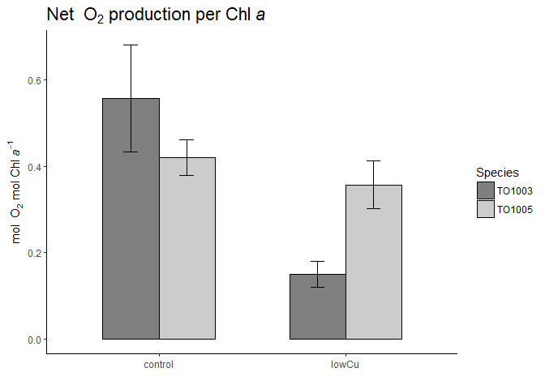<!-- -->


# p28 - X14C.molC.per.mol.Chla.h

```r
p <- ggplot(mydata.mean.stderr, aes(x=Treatment, y=mean.X14C.molC.per.mol.Chla.h, fill = Species)) + 
  labs(title = bquote("Carbon uptake per Chl" ~italic(a)), y=bquote("mol C mol Chl" ~ italic(a)^-1), x= "")
    
p28 <- p + geom_bar(color = "black", position=position_dodge(), stat="identity", width = .6) +
  scale_fill_manual(values = Species_colours) +
  geom_errorbar(aes(ymin = mean.X14C.molC.per.mol.Chla.h - sd.err.X14C.molC.per.mol.Chla.h, ymax = mean.X14C.molC.per.mol.Chla.h + sd.err.X14C.molC.per.mol.Chla.h),
                  width = .15,                    # Width of the error bars
                  position = position_dodge(.6), #so the error bars are dodged to the side
                  colour = "black") +
  cleanup +
  theme (plot.title = element_text(size = rel(1.5), face = "bold", vjust = 2))

p28
```

<!-- -->


# p29 - PQ.Chla.all

```r
p <- ggplot(mydata.mean.stderr, aes(x=Treatment, y=mean.PQ.Chla.all, fill = Species)) + 
  labs(title = bquote(atop("Photosynthetic quotient - PQ"," - all - don't use" )), y=bquote("mol " ~ O[2] ~ "mol " ~ C^-1), x= "")
    
p29 <- p + geom_bar(color = "black", position=position_dodge(), stat="identity", width = .6) +
  scale_fill_manual(values = Species_colours) +
  geom_errorbar(aes(ymin = mean.PQ.Chla.all - sd.err.PQ.Chla.all, ymax = mean.PQ.Chla.all + sd.err.PQ.Chla.all),
                  width = .15,                    # Width of the error bars
                  position = position_dodge(.6), #so the error bars are dodged to the side
                  colour = "black") +
  cleanup +
  theme (plot.title = element_text(size = rel(1.5), face = "bold", vjust = 2))

p29
```

<!-- -->


# p30 - PQ.Chla.all.delete

```r
p <- ggplot(mydata.mean.stderr, aes(x=Treatment, y=mean.PQ.Chla.all.delete, fill = Species)) + 
  labs(title = bquote(atop("Photosynthetic quotient", PQ[Gross.O2] )), y=bquote("mol " ~ O[2] ~ "mol" ~ C^-1), x= "")
    
p30 <- p + geom_bar(color = "black", position=position_dodge(), stat="identity", width = .6) +
  scale_fill_manual(values = Species_colours) +
  geom_errorbar(aes(ymin = mean.PQ.Chla.all.delete - sd.err.PQ.Chla.all.delete, ymax = mean.PQ.Chla.all.delete + sd.err.PQ.Chla.all.delete),
                  width = .15,                    # Width of the error bars
                  position = position_dodge(.6), #so the error bars are dodged to the side
                  colour = "black") +
  cleanup +
  theme (plot.title = element_text(size = rel(1.5), face = "bold", vjust = 2))

p30
```

<!-- -->


# p31 - NET.PQ.Chla

```r
p <- ggplot(mydata.mean.stderr, aes(x=Treatment, y=mean.NET.PQ.Chla, fill = Species)) + 
  labs(title = bquote(atop("Photosynthetic quotient", PQ )), y=bquote("mol " ~ O[2] ~ "mol" ~ C^-1), x= "")
    
p31 <- p + geom_bar(color = "black", position=position_dodge(), stat="identity", width = .6) +
  scale_fill_manual(values = Species_colours) +
  geom_errorbar(aes(ymin = mean.NET.PQ.Chla - sd.err.NET.PQ.Chla, ymax = mean.NET.PQ.Chla + sd.err.NET.PQ.Chla),
                  width = .15,                    # Width of the error bars
                  position = position_dodge(.6), #so the error bars are dodged to the side
                  colour = "black") +
  cleanup +
  theme (plot.title = element_text(size = rel(1.5), face = "bold", vjust = 2))

p31
```

<!-- -->


# p32 - Resp.mol.O2.mol.Chla.h

```r
p <- ggplot(mydata.mean.stderr, aes(x=Treatment, y=mean.Resp.mol.O2.mol.Chla.h, fill = Species)) + 
  labs(title = bquote(atop("Respiration ",O[2]~ "consumption per Chl" ~  italic(a))), y=bquote("mol " ~ O[2] ~ "mol Chl" ~ italic(a)^-1), x= "")
    
p32 <- p + geom_bar(color = "black", position=position_dodge(), stat="identity", width = .6) +
  scale_fill_manual(values = Species_colours) +
  geom_errorbar(aes(ymin = mean.Resp.mol.O2.mol.Chla.h - sd.err.Resp.mol.O2.mol.Chla.h, ymax = mean.Resp.mol.O2.mol.Chla.h + sd.err.Resp.mol.O2.mol.Chla.h),
                  width = .15,                    # Width of the error bars
                  position = position_dodge(.6), #so the error bars are dodged to the side
                  colour = "black") +
  cleanup +
  theme (plot.title = element_text(size = rel(1.5), face = "bold", vjust = 2))

p32
```

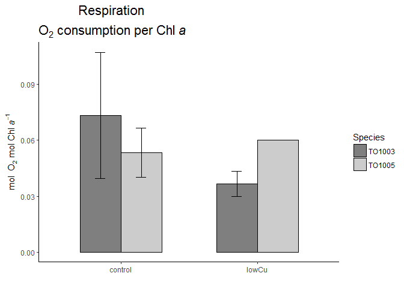<!-- -->


# p33 - X14C.fgC.per.cell.h.alpha

```r
p <- ggplot(mydata.mean.stderr, aes(x=Treatment, y=mean.X14C.fgC.per.cell.h.alpha, fill = Species)) + 
  labs(title = bquote("14C PE curve - "~ alpha ), y=bquote("(fg C " ~ cell^-1 ~ h^-1 ~ ")" / "(" ~mu~ "mol quanta "~m^-2~ s^-1 ~")"), x= "")
    
p33 <- p + geom_bar(color = "black", position=position_dodge(), stat="identity", width = .6) +
  scale_fill_manual(values = Species_colours) +
  geom_errorbar(aes(ymin = mean.X14C.fgC.per.cell.h.alpha - sd.err.X14C.fgC.per.cell.h.alpha, ymax = mean.X14C.fgC.per.cell.h.alpha + sd.err.X14C.fgC.per.cell.h.alpha),
                  width = .15,                    # Width of the error bars
                  position = position_dodge(.6), #so the error bars are dodged to the side
                  colour = "black") +
  cleanup +
  theme (plot.title = element_text(size = rel(1.5), face = "bold", vjust = 2))

p33
```

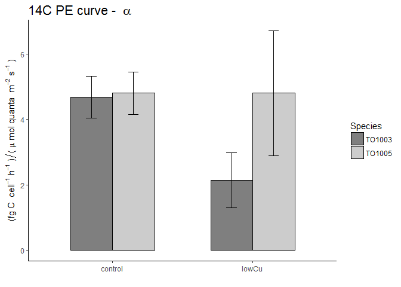<!-- -->


# p34 - X14C.fgC.per.cell.h.pmax

```r
p <- ggplot(mydata.mean.stderr, aes(x=Treatment, y=mean.X14C.fgC.per.cell.h.pmax, fill = Species)) + 
  labs(title = bquote("14C PE curve - "~ P[max] ), y=bquote("fg C " ~ cell^-1 ~ h^-1 ), x= "")
    
p34 <- p + geom_bar(color = "black", position=position_dodge(), stat="identity", width = .6) +
  scale_fill_manual(values = Species_colours) +
  geom_errorbar(aes(ymin = mean.X14C.fgC.per.cell.h.pmax - sd.err.X14C.fgC.per.cell.h.pmax, ymax = mean.X14C.fgC.per.cell.h.pmax + sd.err.X14C.fgC.per.cell.h.pmax),
                  width = .15,                    # Width of the error bars
                  position = position_dodge(.6), #so the error bars are dodged to the side
                  colour = "black") +
  cleanup +
  theme (plot.title = element_text(size = rel(1.5), face = "bold", vjust = 2))

p34
```

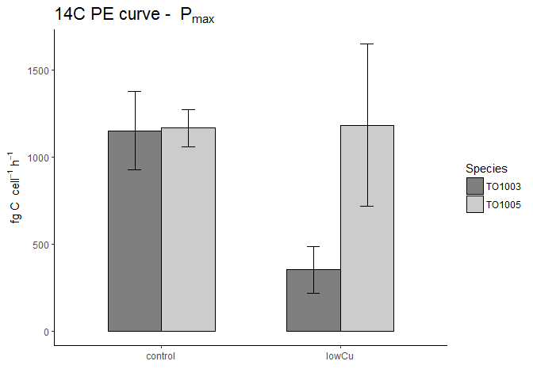<!-- -->


# p35 - X14C.fgC.per.cell.h.ek

```r
p <- ggplot(mydata.mean.stderr, aes(x=Treatment, y=mean.X14C.fgC.per.cell.h.ek, fill = Species)) + 
  labs(title = bquote("14C PE curve - "~ E[k] ), y=bquote( ~mu~ "mol quanta "~m^-2~ s^-1 ), x= "")
    
p35 <- p + geom_bar(color = "black", position=position_dodge(), stat="identity", width = .6) +
  scale_fill_manual(values = Species_colours) +
  geom_errorbar(aes(ymin = mean.X14C.fgC.per.cell.h.ek - sd.err.X14C.fgC.per.cell.h.ek, ymax = mean.X14C.fgC.per.cell.h.ek + sd.err.X14C.fgC.per.cell.h.ek),
                  width = .15,                    # Width of the error bars
                  position = position_dodge(.6), #so the error bars are dodged to the side
                  colour = "black") +
  cleanup +
  theme (plot.title = element_text(size = rel(1.5), face = "bold", vjust = 2))

p35
```

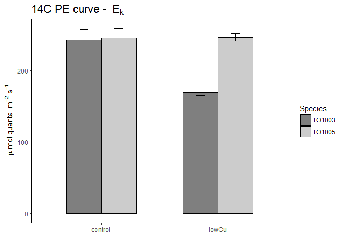<!-- -->


# p36 - X14C.fgC.per.cell.h.at.155E

```r
p <- ggplot(mydata.mean.stderr, aes(x=Treatment, y=mean.X14C.fgC.per.cell.h.at.155E, fill = Species)) + 
  labs(title = bquote("14C uptake @ " ~"growth irradiance"), y=bquote("fg C " ~cell^-1~h-1 ), x= "")
    
p36 <- p + geom_bar(color = "black", position=position_dodge(), stat="identity", width = .6) +
  scale_fill_manual(values = Species_colours) +
  geom_errorbar(aes(ymin = mean.X14C.fgC.per.cell.h.at.155E - sd.err.X14C.fgC.per.cell.h.at.155E, ymax = mean.X14C.fgC.per.cell.h.at.155E + sd.err.X14C.fgC.per.cell.h.at.155E),
                  width = .15,                    # Width of the error bars
                  position = position_dodge(.6), #so the error bars are dodged to the side
                  colour = "black") +
  cleanup +
  theme (plot.title = element_text(size = rel(1.5), face = "bold", vjust = 2))

p36
```

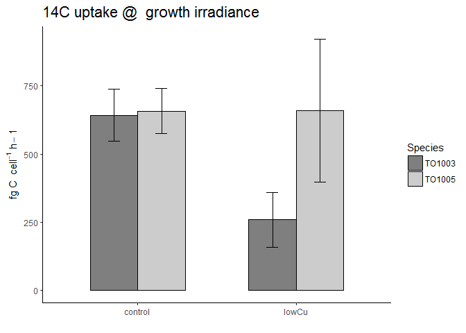<!-- -->


# p37 - ug.prot.cell

```r
p <- ggplot(mydata.mean.stderr, aes(x=Treatment, y = mean.pg.prot.cell, fill = Species)) + 
  labs(title = bquote("Protein content per cell"), y=bquote("pg*" ~ cell^-1), x= "")
    
p37 <- p + geom_bar(color = "black", position=position_dodge(), stat="identity", width = .6) +
  scale_fill_manual(values = Species_colours) +
  geom_errorbar(aes(ymin = mean.pg.prot.cell - sd.err.pg.prot.cell , ymax = mean.pg.prot.cell + sd.err.pg.prot.cell),
                  width = .15,                    # Width of the error bars
                  position = position_dodge(.6), #so the error bars are dodged to the side
                  colour = "black") +
  cleanup +
  theme (plot.title = element_text(size = rel(1.5), face = "bold", vjust = 2))

p37
```

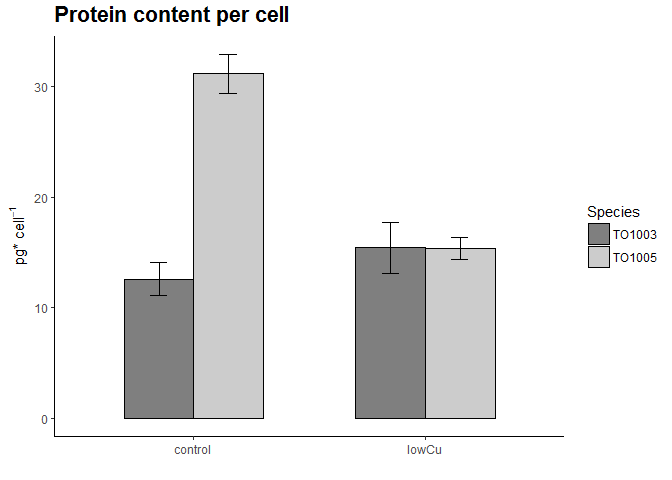<!-- -->


# p38 - pg.prot.fl.cell

```r
p <- ggplot(mydata.mean.stderr, aes(x=Treatment, y = mean.pg.prot.fl.cell, fill = Species)) + 
  labs(title = bquote("Protein content per cell volume"), y=bquote( "pg *" ~ fl^-1), x= "")
    
p38 <- p + geom_bar(color = "black", position=position_dodge(), stat="identity", width = .6) +
  scale_fill_manual(values = Species_colours) +
  geom_errorbar(aes(ymin = mean.pg.prot.fl.cell - sd.err.pg.prot.fl.cell , ymax = mean.pg.prot.fl.cell + sd.err.pg.prot.fl.cell),
                  width = .15,                    # Width of the error bars
                  position = position_dodge(.6), #so the error bars are dodged to the side
                  colour = "black") +
  cleanup +
  theme (plot.title = element_text(size = rel(1.5), face = "bold", vjust = 2))

p38
```

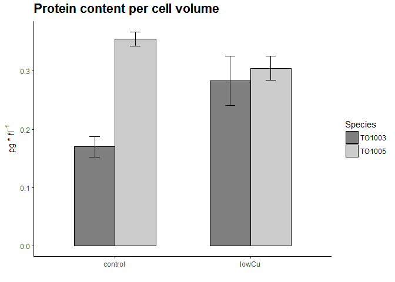<!-- -->
 
 


# p39 - Resp.mol.O2.mol.Chla.h

```r
p <- ggplot(mydata.mean.stderr, aes(x=Treatment, y=mean.Resp.mol.O2.mol.Chla.h, fill = Species)) + 
  labs(title = bquote("Respiration:" ~ O[2]~ "per Chl" ~ italic(a) ), y=bquote("mol " ~O[2] ~ " Chl"~ italic(a)^{-1} ~ h^-1), x= "")
    
p39 <- p + geom_bar(color = "black", position=position_dodge(), stat="identity", width = .6) +
  scale_fill_manual(values = Species_colours) +
  geom_errorbar(aes(ymin = mean.Resp.mol.O2.mol.Chla.h - sd.err.Resp.mol.O2.mol.Chla.h, ymax = mean.Resp.mol.O2.mol.Chla.h + sd.err.Resp.mol.O2.mol.Chla.h),
                  width = .15,                    # Width of the error bars
                  position = position_dodge(.6), #so the error bars are dodged to the side
                  colour = "black") +
  cleanup +
  theme (plot.title = element_text(size = rel(1.5), face = "bold", vjust = 2))

p39
```

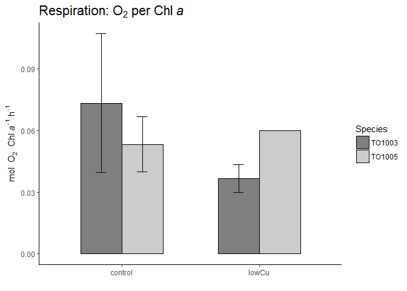<!-- -->


# p40 - Resp.umol.O2.cell.h

```r
p <- ggplot(mydata.mean.stderr, aes(x=Treatment, y=mean.Resp.umol.O2.cell.h, fill = Species)) + 
  labs(title = bquote("Respiration: umol" ~ O[2]~ "per cell"  ), y=bquote("umol " ~O[2] ~ " cell" ~ h^-1), x= "")
    
p40 <- p + geom_bar(color = "black", position=position_dodge(), stat="identity", width = .6) +
  scale_fill_manual(values = Species_colours) +
  geom_errorbar(aes(ymin = mean.Resp.umol.O2.cell.h - sd.err.Resp.umol.O2.cell.h, ymax = mean.Resp.umol.O2.cell.h + sd.err.Resp.umol.O2.cell.h),
                  width = .15,                    # Width of the error bars
                  position = position_dodge(.6), #so the error bars are dodged to the side
                  colour = "black") +
  cleanup +
  theme (plot.title = element_text(size = rel(1.5), face = "bold", vjust = 2))

p40
```

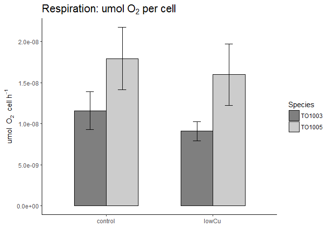<!-- -->


# p1 - OOOOOOOO

```r
p <- ggplot(mydata.mean.stderr, aes(x=Treatment, y=mean.OOOOOOOO, fill = Species)) + 
  labs(title = bquote("Growthrate %" ~ mu/mu[max] ), y=bquote("% " ~ mu / mu[max]), x= "")
    
p1b <- p + geom_bar(color = "black", position=position_dodge(), stat="identity", width = .6) +
  scale_fill_manual(values = Species_colours) +
  geom_errorbar(aes(ymin = mean.OOOOOOOO - sd.err.OOOOOOOO, ymax = mean.OOOOOOOO + sd.err.OOOOOOOO),
                  width = .15,                    # Width of the error bars
                  position = position_dodge(.6), #so the error bars are dodged to the side
                  colour = "black") +
  cleanup +
  theme (plot.title = element_text(size = rel(1.5), face = "bold", vjust = 2))

p1b
```


# Plot of growthrates dd-1 of tubes before big cultures to determine copper concentrations needed


```r
mydata.growth <- read.delim("Input_Data/ALL_Phys_Barplots/Growthrate_lowCu_tubes.txt")

mydata.growth.comb <- mydata.growth %>% 
  unite(Trtmt_comb, Strain, Treatment, sep= " ")
```


```r
mydata_growth.mean.stderr <- mydata.growth.comb %>%  #I double checked via calculating it by hand in excel, this works! 
  group_by(Trtmt_comb) %>% 
    summarize(mean.growthrate.dd = mean(growthrate.dd, na.rm=T),
                sd.err.growthrate.dd = sd( growthrate.dd, na.rm=T)/sqrt(n()),
              mean.growthrate.d = mean(growthrate.d, na.rm=T),
                sd.err.growthrate.d = sd( growthrate.d, na.rm=T)/sqrt(n()))
          
        

mydata_growth.mean.stderr <- mydata_growth.mean.stderr %>% 
  separate(Trtmt_comb, c("Species", "Treatment"), sep = " ", remove = F)


mydata_growth.mean.stderr$Trtmt_comb <- as.factor(mydata_growth.mean.stderr$Trtmt_comb)
mydata_growth.mean.stderr$Species <- as.factor(mydata_growth.mean.stderr$Species)
mydata_growth.mean.stderr$Treatment <- as.factor(mydata_growth.mean.stderr$Treatment)

mydata_growth.mean.stderr <- mydata_growth.mean.stderr %>% 
  mutate(Factor = Treatment)

mydata_growth.mean.stderr$Factor <- as.character(mydata_growth.mean.stderr$Factor)
mydata_growth.mean.stderr$Factor <- as.numeric(mydata_growth.mean.stderr$Factor)


knitr::kable(mydata_growth.mean.stderr, format= "markdown")
```


|Trtmt_comb |Species |Treatment | mean.growthrate.dd| sd.err.growthrate.dd| mean.growthrate.d| sd.err.growthrate.d| Factor|
|:----------|:-------|:---------|------------------:|--------------------:|-----------------:|-------------------:|------:|
|TO03 0.2   |TO03    |0.2       |          0.6909636|            0.0394708|         0.4789395|           0.0273591|   0.20|
|TO03 1.96  |TO03    |1.96      |                NaN|                  NaN|               NaN|                 NaN|   1.96|
|TO03 10.2  |TO03    |10.2      |          1.5614000|            0.0547560|         1.0822800|           0.0379540|  10.20|
|TO03 14.32 |TO03    |14.32     |          1.5874200|            0.0500432|         1.1003157|           0.0346873|  14.32|
|TO03 18.44 |TO03    |18.44     |          1.5105273|            0.0770310|         1.0470177|           0.0533938|  18.44|
|TO03 6.08  |TO03    |6.08      |                NaN|                  NaN|               NaN|                 NaN|   6.08|
|TO05 0.2   |TO05    |0.2       |                NaN|                  NaN|               NaN|                 NaN|   0.20|
|TO05 1.96  |TO05    |1.96      |                NaN|                  NaN|               NaN|                 NaN|   1.96|
|TO05 10.2  |TO05    |10.2      |          1.5592186|            0.0267513|         1.0807680|           0.0185426|  10.20|
|TO05 14.32 |TO05    |14.32     |          1.7805719|            0.0399470|         1.2341984|           0.0276892|  14.32|
|TO05 18.44 |TO05    |18.44     |          1.7185267|            0.0741560|         1.1911919|           0.0514010|  18.44|
|TO05 6.08  |TO05    |6.08      |          1.2251167|            0.0312064|         0.8491862|           0.0216307|   6.08|

```r
#write.table(mydata_Phys.mean.stderr, file="Input_Data/ALL_Phys_Barplots/ALL_Phys_both_TO03_TO05_mean_stderror.txt", sep="\t", col.names=T, row.names = F) 
```


# p50 - growthrates of tubes dd-1

```r
p <- ggplot(mydata_growth.mean.stderr, aes(x=reorder(Treatment, Factor), y=mean.growthrate.dd, fill = Species)) + 
  labs(title = bquote("Growthrate" ~  "comparison"), y=bquote("d" ~ d^-1), x= Cu[tot]~ "(nmol)")
    
p50 <- p + geom_bar(color = "black", position=position_dodge(), stat="identity", width = .6) +
  scale_fill_manual(values = Species_colours) +
  geom_errorbar(aes(ymin = mean.growthrate.dd - sd.err.growthrate.dd, ymax = mean.growthrate.dd + sd.err.growthrate.dd),
                  width = .15,                    # Width of the error bars
                  position = position_dodge(.6), #so the error bars are dodged to the side
                  colour = "black") +
  cleanup +
  theme (plot.title = element_text(size = rel(1.5), face = "bold", vjust = 2))

p50
```

```
## Warning: Removed 4 rows containing missing values (geom_bar).
```

```
## Warning: Removed 4 rows containing missing values (geom_errorbar).
```

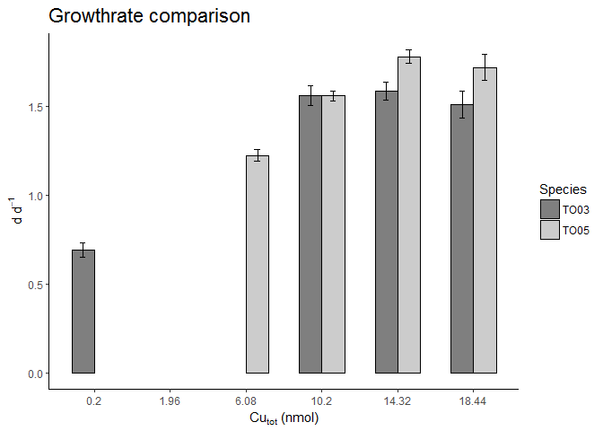<!-- -->


# p51 - specific growthrates of tubes d-1

```r
p <- ggplot(mydata_growth.mean.stderr, aes(x=reorder(Treatment, Factor), y=mean.growthrate.d, fill = Species)) + 
  labs(title = bquote("Growthrate" ~  "comparison"), y=bquote(d^-1), x= Cu[tot]~ "(nmol)")
    
p51 <- p + geom_bar(color = "black", position=position_dodge(), stat="identity", width = .6) +
  scale_fill_manual(values = Species_colours) +
  geom_errorbar(aes(ymin = mean.growthrate.d - sd.err.growthrate.d, ymax = mean.growthrate.d + sd.err.growthrate.d),
                  width = .15,                    # Width of the error bars
                  position = position_dodge(.6), #so the error bars are dodged to the side
                  colour = "black") +
  cleanup +
  theme (plot.title = element_text(size = rel(1.5), face = "bold", vjust = 2))

p51
```

```
## Warning: Removed 4 rows containing missing values (geom_bar).
```

```
## Warning: Removed 4 rows containing missing values (geom_errorbar).
```

<!-- -->


#OOOOOOOO


#Making the first multi plot


```r
multiplot(p1, p5, p9, p2, p6, p10,p3, p7, p11, p4, p8 , p12, cols=4)
```

```
## Loading required package: grid
```

<!-- -->

```r
multiplot(p1, p2, p3, p4, cols=2)
```

<!-- -->


```r
png('plots/ALL_Phys_Barplots/lowCumultiplot_01_a.png', width=1360, height = 960, units ="px", pointsize = 12)

multiplot(p1, p5, p9, p2, p6, p10,p3, p7, p11, p4, p8 , p12, cols=4)

dev.off()
```

```
## png 
##   2
```


```r
png('plots/ALL_Phys_Barplots/lowCumultiplot_Results01.png', width=1360, height = 960, units ="px", pointsize = 12)

multiplot(p1, p9, p19, p2, p10, p30,p6, p11, p31, p27, p27_1 , p32, cols=4)

dev.off()
```

```
## png 
##   2
```


```r
png('plots/ALL_Phys_Barplots/lowCumultiplot_Results01c.png', width=1360, height = 960, units ="px", pointsize = 12)

multiplot(p1, p9, p19, p2, p10, p30,p6, p11, p31, p27, p19 , p32, cols=4)

dev.off()
```

```
## png 
##   2
```


```r
png('plots/ALL_Phys_Barplots/lowCumultiplot_Results02.png', width=1360, height = 960, units ="px", pointsize = 12)

multiplot(p13  ,p20  ,p17  ,p14  ,p21  ,p18  ,p15  ,p22  ,p12  ,p16  ,p23  ,p5  , cols=4)
#(p  ,p  ,p  ,p  ,p  ,p  ,p  ,p  ,p  ,p  ,p  ,p  )
dev.off()
```

```
## png 
##   2
```


```r
png('plots/ALL_Phys_Barplots/lowCumultiplot_Results02b.png', width=1360, height = 960, units ="px", pointsize = 12)

multiplot(p13  ,p20  ,p17  ,p14  ,p21  ,p18  ,p15  ,p22  ,p12  ,p16  ,p23  ,p31  , cols=4)
#(p  ,p  ,p  ,p  ,p  ,p  ,p  ,p  ,p  ,p  ,p  ,p  )
dev.off()
```

```
## png 
##   2
```


```r
png('plots/ALL_Phys_Barplots/lowCumultiplot_X14C_normalization_Compare.png', width=1360, height = 960, units ="px", pointsize = 12)

multiplot(p20  ,p33  ,p21  ,p34  ,p22  ,p35  ,p23  ,p36  , cols=4)
#(p  ,p  ,p  ,p  ,p  ,p  ,p  ,p  ,p  ,p  ,p  ,p  )
dev.off()
```

```
## png 
##   2
```


```r
png('plots/ALL_Phys_Barplots/lowCumultiplot_forPaper_Physiology_01.png', width=960, height = 1360, units ="px", pointsize = 12)

multiplot(p1  ,p4  ,p9  ,p13  ,p20  ,p6  ,p23  ,p10  ,p14, p21  ,p16  ,p30  ,p19  ,p15  ,p22  ,  cols=3)
#(p  ,p  ,p  ,p  ,p  ,p  ,p  ,p  ,p  ,p  ,p  ,p  )
dev.off()
```

```
## png 
##   2
```


```r
png('plots/ALL_Phys_Barplots/lowCumultiplot_forPaper_Physiology_03.png', width=960, height = 1360, units ="px", pointsize = 12)

multiplot(p1  ,p4  ,p20  ,p13  ,p12  ,p2  ,p9  ,p21  ,p14, p19  ,p6  ,p10  ,p22  ,p15  ,p37  ,  cols=3)
#(p  ,p  ,p  ,p  ,p  ,p  ,p  ,p  ,p  ,p  ,p  ,p  )
dev.off()
```

```
## png 
##   2
```

```r
pdf('plots/ALL_Phys_Barplots/lowCumultiplot_forPaper_Physiology_03.pdf', width=8.5, height = 11, useDingbats=FALSE)

print(qplot(multiplot(p1  ,p4  ,p20  ,p13  ,p12  ,p2  ,p9  ,p21  ,p14, p19  ,p6  ,p10  ,p22  ,p15  ,p37  ,  cols=3)))
#(p  ,p  ,p  ,p  ,p  ,p  ,p  ,p  ,p  ,p  ,p  ,p  )
dev.off()
```

```
## png 
##   2
```

# Making mean and std error table (including `na.rm=T`!)


```r
FRRF_160.mean.stderr <- mydata_Phys %>%  #I double checked via calculating it by hand in excel, this works! 
  group_by(Trtmt_comb) %>% 
    summarize(mean.sig = mean(sig.),
            mean.  = mean( , na.rm=T),
            mean.  = mean( ,na.rm=T),
            mean.  = mean( ,na.rm=T),
            mean.  = mean( ,na.rm=T),
            mean.  = mean( ,na.rm=T),
            mean.  = mean( ,na.rm=T),
            mean.  = mean( ,na.rm=T),
            mean.  = mean( ,na.rm=T),
            sd.err. = sd( ,na.rm=T)/sqrt(n()),
            sd.err. = sd( ,na.rm=T)/sqrt(n()),
            sd.err. = sd( ,na.rm=T)/sqrt(n()),
            sd.err. = sd( ,na.rm=T)/sqrt(n()),
            sd.err. = sd( ,na.rm=T)/sqrt(n()),
            sd.err. = sd( ,na.rm=T)/sqrt(n()),
            sd.err. = sd( ,na.rm=T)/sqrt(n()),
            sd.err. = sd( ,na.rm=T)/sqrt(n()),
            sd.err. = sd( ,na.rm=T)/sqrt(n()),
            sd.err. = sd( ,na.rm=T)/sqrt(n()),
            sd.err. = sd( ,na.rm=T)/sqrt(n()))

            sd.err.ps = sd(ps.Ep)/sqrt(n()),
            sd.err.ETR.150 = sd(ETR.150.Ep)/sqrt(n()),
            sd.err.ETR.700 = sd(ETR.700.Ep)/sqrt(n()),
            sd.err.ETR.800 = sd(ETR.800.Ep)/sqrt(n())) 

FRRF_160.mean.stderr <- FRRF_160.mean.stderr %>% 
  separate(Trtmt_comb, c("Species", "Treatment"), remove = F)


FRRF_160.mean.stderr$Trtmt_comb <- as.factor(FRRF_160.mean.stderr$Trtmt_comb)
FRRF_160.mean.stderr$Species <- as.factor(FRRF_160.mean.stderr$Species)
ETR.Ep.mean.stderr$Treatment <- as.factor(ETR.Ep.mean.stderr$Treatment)

str(FRRF_160.mean.stderr)
#knitr::kable(ETR.Ep.mean.stderr, format= "markdown")
write.table(FRRF_160.mean.stderr, file="Output_Data/FRRF/FRRF_160.mean.stderr_both_TO03_TO05_mean_stderror.txt
```


